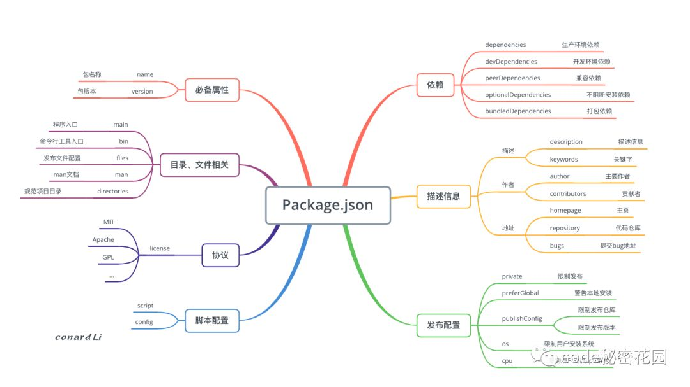

# 15

1.  快餐文分享:

    前端工程化 - 剖析npm的包管理机制（完整版）

    [https://mp.weixin.qq.com/s?\_\_biz=MzA3NTM0Njk1Nw==\&mid=2247485938\&idx=1\&sn=8598190147c8fa4cd17eeea0d8c09842](https://mp.weixin.qq.com/s?\_\_biz=MzA3NTM0Njk1Nw==\&mid=2247485938\&idx=1\&sn=8598190147c8fa4cd17eeea0d8c09842)

    摘要: 本文从三个角度：`package.json`、版本管理、依赖安装 结合具体实例对 `npm` 的包管理机制进行了详细分析。

    
2.  短信息分享:

    Pornhub is removing all videos on its site that weren't uploaded by official content partners or members of its model program, a fundamental shift in the way one of the largest porn sites in the world operates. This means a significant portion of its videos will disappear.

    P站因最近发生的儿童色情事件 及 多方压力, 开始彻底整改视频资源.

    链接:

    Pornhub Just Purged All Unverified Content From the Platform

    [https://www.vice.com/en/article/jgqjjy/pornhub-suspended-all-unverified-videos-content](https://www.vice.com/en/article/jgqjjy/pornhub-suspended-all-unverified-videos-content)
3. 招聘分享: \[上海] 米哈游内推 12 月更新～ [https://v2ex.com/t/731744](https://v2ex.com/t/731744)
4.  快餐文分享:

    Simple Dark-Light toggle with VanillaJs [https://dev.to/vaishnavme/simple-dark-light-toggle-with-vanillajs-2cbj](https://dev.to/vaishnavme/simple-dark-light-toggle-with-vanillajs-2cbj)

    Dark mode designs and functionality that enable to toggle between Dark and Light theme is trending UI/UX Design. So, here's the guide to create Simple dark-light toggle.

    借助 CSS variable 可以很轻松实现 主题切换效果, 但文章比较简单, 主题切换的难点 除了 颜色搭配, 还有 本地配置化加载.

    假如说设置了 dark theme, 持久化了本地, 下次加载是 肯定会经历从 白色到黑色的一个过程, 这是无法避免, 当然 解决方案也有, 比如加一个 全局 mask 在切换主题之前, 或者 分为两个站点..
5.  工具分享:

    [https://github.com/antfu/ni](https://github.com/antfu/ni) Use the right package manager

    
6.  快餐文分享:

    逃离大厂

    [https://www.huxiu.com/article/399901.html](https://www.huxiu.com/article/399901.html)

    摘要: 我马上就到30岁，我需要生活，需要家庭，但是在公司，生活和工作很难平衡，我只能离职。

    文字很素, 故事很真实, 可能是在贩卖焦虑, 但归根结底还是整个环境的问题.
7.  快餐文分享:

    2020，巨人们的短视频战争史

    [https://www.huxiu.com/article/399708.html](https://www.huxiu.com/article/399708.html)

    摘要: 因为这两家平台和创作者之间的博弈，国内的PUGC视频生态空前繁荣，养活了一大批原创视频创作者，让他们能借助视频获得相对体面的收入，甚至成为了一种新的职业业态，这在以前是从来没有过的。

    文章简单介绍了 国内巨头们的短视频布局, 为了争夺用户时间 在内容化上的行动.
