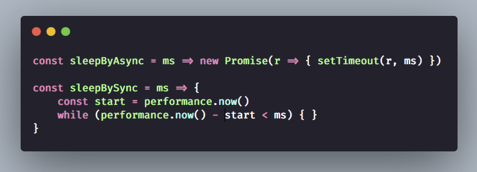

# 25-31

1.  快餐文分享:

    Ruby 3.0.0 Released

    [https://www.ruby-lang.org/en/news/2020/12/25/ruby-3-0-0-released/](https://www.ruby-lang.org/en/news/2020/12/25/ruby-3-0-0-released/)

    迭代了近5年的Ruby 3.0 发布了, 主要的提升聚集在三方面: 性能 并发 类型

    Matz(作者) 声明 Ruby3 比 Ruby2 快3倍.

    性能方面: 主要引入了 JIT 即时编译技术, 算得上几乎所有现代语言的编译器内置功能了

    并发方面: Ruby 的实现居然是 Erlang 的 Actor-model 方案, 这就有点意思了

    并且对于 block 操作, Ruby 还引入了 Fiber Scheduler 设计..

    哈哈, async await 的思想算是现代语言标配了

    其余信息可以查阅上面链接\~
2.  分享一个很有趣的视频

    中国地产第一疑案，武斗抢公章，合同不盖章，兄弟不认账，融创躺中枪

    [https://www.youtube.com/watch?v=es9zFXWc4OM\&ab\_channel=%E5%86%B2%E6%B5%AA%E6%99%AE%E6%8B%89%E6%96%AF](https://www.youtube.com/watch?v=es9zFXWc4OM\&ab\_channel=%E5%86%B2%E6%B5%AA%E6%99%AE%E6%8B%89%E6%96%AF)

    这作者 我也是一路关注过来的, 他的视频都很有质量(起码很用心),很符合我胃口.

    算是除了巫师后, 我最喜欢的一位博主了.

    这个视频内容也很有趣, 时长一小时, 可以吃饭的时候刷, 里面讲的故事是 融绿股权之争, 一场充满“人情味”中国式并购案。
3.  Question: 如何在浏览器环境 实现 sleep 函数, 可以给出 异步函数, 同步函数 两种实现方案吗?

    

    Question: 当我执行 同步 sleep 函数,比如 sleepBySync(9e9), 这个时候浏览器 tab 会怎样?

    A: 9e9有点大了。。

    B: hahah 随意啦 也可以 9\_000\_000\_000

    A: 页面啥交互的操作都无效吧

    B: 是的. tab 直接假死..

    A: 异步的这个使用场景是啥呀

    B: 最简单的就是 mock 网络请求过程..

    B: 那假设是在 react支持 concurrent 版本中, 一个事件 里面调用 sleepBySync(9e9), 那页面还会卡死吗

    其实 promise 最有趣的 resolve, reject 这两个函数了, 我一直把他们理解为 异步环境下的 "PV"原语

    可以 把resolve, reject 传到其他异步场景中, 再调用..

    就好比 手动 join 下其他线程, 或者 发出个信号 这样

    C: 好理解

    B: 我根据刚刚的讨论 以及我对 promise 的理解, 写了个限制网络请求数量的demo

    C: 我面字节就考的这个 没答出来

    B: 

    超过限制的request, 会将 resolve 传到了 全局, 等到 resolve 被消费 才会执行(await), 已经完成的 网络请求 会按照顺序消耗 resolve 信号.

    典型的 "PV"原语...

    D: 咦，这个我能听懂

    B: 现在 并发方案 业界, 学术界有挺多不同的模式了..

    就比如 上午我说 ruby3 引进的 actor-model, 还有 golang 的 csp, 以及函数式宗教信奉的通过编程范式 去天然引进并发..

    B: 以下来自我之前的一条微博:

    CSP 模型 和 Actor 模型, 具有相同的设计理念: 通过通信来实现共享内存，而不是用共享内存来实现通信。

    然而它们的侧重点不同，Actor 关心通信的实体（对 OOP 更加友好），CSP关心通信的工具。 如果要选其一的话，我更加欣赏 CSP模型。

    假设通信的数据，可以自我实现状态管理，这样一来就不会被通信双方所约束，消息传递的过程 就可以增加更多的抽象。 目前，业界的 CSP 代表 Golang 结合 Context 包已经实现了这一点。

    C: 但是像JS这样的单线程语言，感觉玩不出多少花样来

    B: 对啊.. 撑死就是借用下 异步 api, 去模拟下 fiber 了...

    谁叫 js 天生单线程呢..
4.  A: 我说我的网站怎么日活超5k了..

    原来是被人扫描了..

    

    hah 对方一看就是个 新手

    B: 这啥后台啊

    A: Google Analytics 我只接入了 Google tag manager

    如果接 国内的服务, 可以明确查看到 ip 信息的

    就比如百度站长 完全可以.. 但是国内服务 我很排斥..

    除了 我的微博点赞 使用的是 leancloud 国际版, 其他的服务就没有国内的了

    B: 我今天给你微博点赞了 看得到不？

    A: hah 当然

    B: 能看到点赞人的信息吗？

    A: 你觉得呢...

    

    B: 对的我还看了这个请求。。。没看懂

    A: 点赞信息 只是一个简单的kv store, 存储的地方是 leancloud

    k 就是每一条微博的 ID, v 就是微博点赞的数量 hh

    B: 了解了hhh

    A: 我是一直想开源的, 但我觉得 有这需求的人 好像都没几个..
5.  每日一句分享: 2006年，两名美国学生完成了一个名为"发送阳光"的项目。如果手机发现，你的朋友在天气不好的地方，而你在天气很好的地方，那么手机就会提示你，拍一张照片发送给朋友，让他们振作起来。

    后来，两人当中的 Mike Krieger 创建了 Instagram。
6.  快餐文分享:

    JavaScript: Conditional JavaScript, only download when it is appropriate to do so

    [https://umaar.com/dev-tips/242-considerate-javascript/](https://umaar.com/dev-tips/242-considerate-javascript/)

    如何根据终端的配置来进一步优化 UX 呢?这篇文章给出了一些例子.
7.  快餐文分享:

    The headers we don't want

    [https://www.fastly.com/blog/headers-we-dont-want](https://www.fastly.com/blog/headers-we-dont-want)

    本文不是 HTTP response header 的最佳实践, 而是介绍了 有哪些 field 实质上是没有必要的.
8.  好文分享:

    CSS Utility Classes and "Separation of Concerns"

    [https://adamwathan.me/css-utility-classes-and-separation-of-concerns/](https://adamwathan.me/css-utility-classes-and-separation-of-concerns/)

    摘要: Over the last several years, the way I write CSS has transitioned from a very "semantic" approach to something much more like what is often called "functional CSS."\
    这篇文章介绍了 HTML-CSS 编写的多种范式 以及 各种范式之间的差异与感触.本文的作者同时也是 TailWind CSS 的作者, 值得一读. 说实话 我几乎没有思考过 CSS HTML 之间的依赖, 一直按照文中的第一种 或者 BEM 规范去写, 原来它们之间一直没有做到 关注点分离, 一直存在依赖. 不过 现在 CSS IN JS, CSS Module 方案已经从编译方面打开了新出路
9.  (1).png>)
10. [你不好奇 Linux 是如何收发网络包的？](https://zhuanlan.zhihu.com/p/339698383?utm\_source=wechat\_session\&utm\_medium=social\&utm\_oi=1088870436204318720\&utm\_campaign=shareopn)

.png>)

[https://www.reddit.com/r/linux/comments/kkv8kq/my\_boyfriend\_is\_very\_into\_linux\_i\_know\_nothing/?utm\_medium=android\_app\&utm\_source=share](https://www.reddit.com/r/linux/comments/kkv8kq/my\_boyfriend\_is\_very\_into\_linux\_i\_know\_nothing/?utm\_medium=android\_app\&utm\_source=share)

VIM 学习资源分享: \
[https://github.com/wsdjeg/vim-galore-zh\_cn](https://github.com/wsdjeg/vim-galore-zh\_cn) \
[https://www.kancloud.cn/kancloud/learn-vimscript-the-hard-way/49321](https://www.kancloud.cn/kancloud/learn-vimscript-the-hard-way/49321) \
[https://vimjc.com/page/11/](https://vimjc.com/page/11/) \
[https://www.jianshu.com/p/42ef98846b11](https://www.jianshu.com/p/42ef98846b11)\
[https://vim.rtorr.com/lang/zh\_cn/](https://vim.rtorr.com/lang/zh\_cn/)\
[https://vimawesome.com/](https://vimawesome.com/)\
[https://coolshell.cn/articles/5426.html](https://coolshell.cn/articles/5426.html)\
[https://juejin.cn/post/6844903470953136142](https://juejin.cn/post/6844903470953136142)\
[https://juejin.cn/post/6844903444164116493](https://juejin.cn/post/6844903444164116493) \
[https://juejin.cn/post/6844903469564821511](https://juejin.cn/post/6844903469564821511)\
[https://tomotoes.com/blog/order-of-vim-cultivation-cheats/](https://tomotoes.com/blog/order-of-vim-cultivation-cheats/)\
[https://tomotoes.com/blog/grammar-of-vim-cultivation-cheats/](https://tomotoes.com/blog/grammar-of-vim-cultivation-cheats/)\
还有一本 《 Vim 实战技巧 》--- Drew Neil\
后面两个文章 是我写的, hah 不建议读, 废话太多

```
练习的话, 记得设置下 以下命令在 vimrc
 inoremap <down> <nop>
 nnoremap <down> <nop>
 inoremap <left> <nop>
 nnoremap <left> <nop>
 inoremap <right> <nop>
 nnoremap <right> <nop>
```

快餐文分享: \
Fetch API 教程 \
[http://www.ruanyifeng.com/blog/2020/12/fetch-tutorial.html](http://www.ruanyifeng.com/blog/2020/12/fetch-tutorial.html)

灭霸打响指的源码: DELETE FROM people where rand() < 0.5

快餐文分享:\
[RxJS——给你如丝一般顺滑的编程体验（篇幅较长，建议收藏）](https://juejin.cn/post/6910943445569765384)\
文章很长，大部分的篇幅都是在讲 rxjs 的一些概念与api，并没有结合实际场景，对rxjs感兴趣的同学可以了解下。\
\
好文分享: \
字节跳动“全力跳动”：底层商业逻辑和第二增长曲线分析 \
[https://www.36kr.com/p/1021582816920324](https://www.36kr.com/p/1021582816920324)\
摘要:天下武功，唯快不破。字节第一增长曲线的实践也是这一表达的最好证明。然而，物竞天择，适者生存，每个行业有其自身的行业发展规律和最适合的竞争策略。当字节引以为傲的算法、流量和快速商业化的“快模式”无法在有关行业形成降维打击时，遵循行业基本规律的打法可能是更合适的。\
文章写得很有深度，让我更看清了字节的发展上的一些问题，值得反复阅读。

A: 我在reddit看大部分程序员都觉得 pm码不会打几个 还事多\
B: 哈哈，思想不一样吧。他们可能只是把工作当做了工作。程序员除了技术，最重要的能力就是业务能力，产品能力了。\
B: 我的思想转变, 除了自己的工作外 离不开一系列文章, 其中最典型的, 对我启发最大的 就是 于江水前辈 写的 我在淘宝做前端的这三年 的三篇了.[https://zhuanlan.zhihu.com/p/55272391](https://zhuanlan.zhihu.com/p/55272391) \
其中有句话一直影响着我.\
业务能力应该是程序员除了技术之外，最具价值的能力，也是最必要的。 因为技术本身很难赚钱，业务落地才能赚钱。 当程序员具备了业务和产品能力，才可能选取业务和技术的折中点，又快又好的支撑业务，带来价值和效益。 懂产品和业务（甚至交互设计）的技术，更容易跟其他工种进行沟通，用通俗易懂的方式介绍技术实现和难度，可以提升在企业中的自身地位和价值。 此外，对于架构师，理解业务也是必备能力。\
A: 嗯...业务能力可能是每个合格打工人的一个必备条件吧 这个时代需要的是跨专业的人才\
B: 是的, 需要的是 通才..  其实 我认识很多同学有一个通病.. 就是给自己设边界..\


A: 现在的计算机 应用层 还是有不少潜力的.. 但是底层 沉淀下的基础设施, 很难改变了..\
就比如 http3, 现在一直没有推广开发..\
B: 等一波什么量子计算机出现\
A: 量子计算机 最大的痛点 除了学术上, 还有一点不可忽视, 普通人用不起那东西的.. 只能等 物理 化学届的新突破了.. 之前的计算机划时代的晶体管时代 也是 这样过来的...\
B: 不是出来个什么 “以氮化镓、碳化硅为代表的第三代半导体”

A: 现在 web 智能化 是一个新方向啊..  我听说 去年 双 11 淘宝的活动页 有 79% 都是机器生成的..\
B: 再过十几年AI是不是要侵占地球了hhh\
A: 现在各个公司都有相应的智能化的产品落地了\
那想多了 现在 ai 只是 ai, 只是数学拟合\
如果真正想成为 人工 智能, 那前提条件是 人类把自己研究明白透彻 还可以.. 就比如 人脑科学..\
之前看马斯克的脑机接口项目, 完全可以与 人体 API 相交互, 太酷了\
具体的原理是, 大脑中的芯片 解码 神经中的电信号, 然后 在通过 应用层协议 与 外部相交互.. 关键 就在于 识别电信号了..\
假如说真有 人体 API 就好了... 我会强制让自己跑个 10 公里的, hahah\
B: 人体api假如真出来 可能是全网最长了hh\
C: 怕不是到时候出来一堆伦理问题\
A: 我在想 如果用 linux POSIX API 的设计标准 来设计的话, 那一定很有趣.. 每一次 action 都是一个 进程的 fork , 每次 拉屎 都是 一次 GC..

.png>)

A: 无言以对..  国人的 github trending 一个开源的技术项目没有...\
B: 茅台抢购哈哈哈\
C: ...我对面的今儿早上说茅台抢购,说的原来是这玩意儿\
A: 这算不算技术作恶 违法是肯定的了\
我看了下 源码, 就是简单的爬虫... 连个 IP 池都没提供... 京东风控 怎么搞得... 这不分分钟封掉..\
现在 拼多多的 安全准则就是 宁可误杀 也不让薅羊毛 \
京东真是好兄弟啊\


.png>)

好文分享: \
将 React 作为 UI 运行时 \
[https://overreacted.io/zh-hans/react-as-a-ui-runtime/](https://overreacted.io/zh-hans/react-as-a-ui-runtime/)\
摘要: \
1\. React 程序通常会输出一棵会随时间变化的树。 它有可能是一棵 DOM 树 ，iOS 视图层 ，PDF 原语 ，又或是 JSON 对象 。然而，通常我们希望用它来展示 UI 。我们称它为“宿主树”，因为它往往是 React 之外宿主环境中的一部分 — 就像 DOM 或 iOS 。宿主树通常有它自己的命令式 API 。而 React 就是它上面的那一层。\
2\. 请记住 React 元素并不是永远存在的 。它们总是在重建和删除之间不断循环着。\
3\. 我喜欢将 React 元素比作电影中放映的每一帧。它们捕捉 UI 在特定的时间点应该是什么样子。它们永远不会再改变。\
4\. 令人讽刺地是，React 并没有使用“反应式”的系统来支持细粒度的更新。换句话说，任何在顶层的更新只会触发协调而不是局部更新那些受影响的组件。 这样的设计是有意而为之的。对于 web 应用来说交互时间是一个关键指标，而通过遍历整个模型去设置细粒度的监听器只会浪费宝贵的时间。此外，在很多应用中交互往往会导致或小（按钮悬停）或大（页面转换）的更新，因此细粒度的订阅只会浪费内存资源。\
\
我喜欢将 React 元素比作电影中放映的每一帧, 它们捕捉 UI 在特定的时间点应该是什么样子。\
这句话很有价值.. 这就是 React 的 render 原理体现.

快餐文分享: \
maybedoer: the Maybe Monoid for Go\
[https://christine.website/blog/maybedoer-2020-05-23](https://christine.website/blog/maybedoer-2020-05-23)\
函数式编程中 maybe monod 在 Go 中的实现.

补充下 我今天提的微内核的概念..\
在微内核设计背后的思想是，为了实现高可靠性，将操作系统划分成小的、良好定义的模块，只有其中一个模块——微内核——运行在内核态上，其余的模块，由于功能相对弱些，则作为普通用户进程运行。特别地，由于把每个设备驱动和文件系统分别作为普通用户进程，这些模块中的错误虽然会使这些模块崩溃，但是不会使得整个系统死机。\
这个微是真的没发展起来.\
微服务是发展起来了.. 但是我觉得 它只不过是对 多个资源的一种使用规范..\
\
每日一句分享:\
并发是有关结构的，它是一种将一个程序分解成小片段并且每个小片段都可以独立执行的程序设计方法; 并发程序的小片段之间一般存在通信联系并且通过通信相互协作； \
并行是有关执行的，它表示同时进行一些计算任务 。\
来自 Rob Pike\
\
快餐文分享: \
浅析 Redis 分布式锁解决方案 \
[https://www.infoq.cn/article/DVAAJ71F4fBQsxmGVdCE](https://www.infoq.cn/article/DVAAJ71F4fBQsxmGVdCE)\
在单机中 原子性是锁的保障, 在分布式中 锁的问题又上升了一个层级...

快餐文分享: \
Go语言的设计哲学之三：并发 \
[https://www.imooc.com/read/87/article/2340](https://www.imooc.com/read/87/article/2340)\
文中讲了传统语言的并发方案的缺点 如下, 以及 Goruntine 模型的简单介绍.\
摘要: \
并发单元间通信困难，易错：多个 thread 之间的通信虽然有多种机制可选，但用起来是相当复杂；并且一旦涉及到 shared memory，就会用到各种 lock，死锁便成为家常便饭 对于很多网络服务程序，由于不能大量创建 thread，就要在少量 thread 里做网络多路复用，即：使用 epoll/kqueue/IoCompletionPort 这套机制，即便有 libevent、libev 这样的第三方库帮忙，写起这样的程序也是很不易的，存在大量 callback，给程序员带来不小的心智负担。\
nodejs deno 在底层全是用的 epoll/kqueue/IoCompletionPort 这套机制 , 只不过在应用层 nodejs 使用的是 libuv, deno 使用的是 Tokio..

快餐文分享: \
5 Recommended Tools for Optimizing Performance in ReactJS \
[https://blog.bitsrc.io/5-recommended-tools-for-optimizing-performance-in-reactjs-29eb2a3ec46d](https://blog.bitsrc.io/5-recommended-tools-for-optimizing-performance-in-reactjs-29eb2a3ec46d)\
文章列举了检查 react performance 的一些工具: \
1\. React 提供的 Profiler 组件 \
2\. React Developer tools plugin \
3\. why-did-you-render \
4\. Chrome Devtools - Performance timeline

快餐文分享: \
来自新时代的 CSS \
[https://mp.weixin.qq.com/s/pPtzhXbAaXfoTV2q3u0Dww](https://mp.weixin.qq.com/s/pPtzhXbAaXfoTV2q3u0Dww)\
文中列举很多关于 CSS 现在发展的一些技术 特性. \
1\. css 命名规范, 遗憾的是 文章只提了 结构与样式分离的规范: BEM, 应该扯扯 构建函数单元的 css 命名规范 \
2\. 简单介绍预处理器: less sass stylus \
3\. 发展了很多年也没有声音的 CSS Houdini, 还不如说 css in js \
4\. postcss, postcss 之于 css 就好比 babel 之于 js \
5\. css module: 没说清楚.. \
6\. stylelint 规范工具 \
7\. postcss-preset-env 的规范: cssdb

.png>)

.png>)

\
多个CPU的原子操作通常通过总线锁或者是缓存锁实现，意思就是当某一个核读取一块内存或者是缓存的时候。CPU会拉低系统总线或者是缓存的电平，这样其他核就无法读取被锁定的区域，这样就实现了资源隔离，从而解决并发冲突问题。\
硬件层面上的原子操作机制。\
\
几年前，我为一所大学的 IT 部门工作。\
一天，我收到统计系主任的电话，他说他们的电子邮件最多只能发送500英里（800公里），比500英里更远的地方，就发送不过去。我差点一口咖啡喷出来。\
我试了一下他们的邮件服务器，居然是真的。我发到纽约（420英里）可以成功，发到普罗维登斯（580英里）就失败了。这怎么可能呢。\
这时，我发现他们的邮件服务器是 Sendmail 5，而不是当时已经广泛使用的 Sendmail 8。我问了一下管理员，确认最近进行过一次服务器升级，但是 Sendmail 版本被降级了。\
他们原来的配置文件是为 Sendmail 8 写的，有几项会被 Sendmail 5 重置为0，其中有一项是连接到远程服务器的超时，也就是远程服务器被设为零延迟，否则连接就会断掉。程序实际执行的时候，0超时是按3毫秒计算的。一旦3毫秒之内，没有收到远程服务器的答复，就认为邮件无法发送。\
我快速计算了一下，光速在3毫秒的前进距离，正好是500多英里。

快餐文分享: \
Introducing: The Async Cookie Store API \
[https://medium.com/nmc-techblog/introducing-the-async-cookie-store-api-89cbecf401f](https://medium.com/nmc-techblog/introducing-the-async-cookie-store-api-89cbecf401f)\
摘要: Are you sick and tired of weird ways to get cookies fromdocument.cookie ? Hate it that you don’t know whether the cookie you set was actually saved or not? Introducing: Cookie Store API, available on Chrome version 87!\
有生之年系列.
