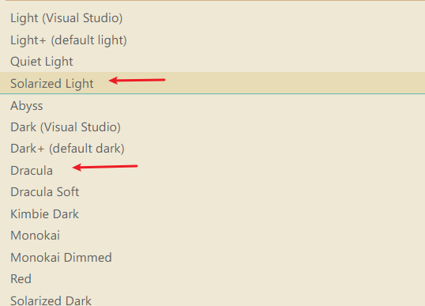

# 4

1.  每日一句分享:

    企业雇佣你，是为了让你帮它们完成某个可以增加收入、降低成本的项目，而不是为了让你追求个人的软件成就。
2.  网站分享:

    Toddler Password

    [https://www.toddlerpassword.com/](https://www.toddlerpassword.com/)

    摘要: Max is 1.5 years old and really enjoys hitting the keyboard randomly on his parents' laptop! He also loves placing his finger tips on the screen and pointing fiercely on things!

    Almost every day Max joins his father in the home office, typing randomly and wild on the keyboard. After a couple of weeks a big random accumulation of characters was created which is expanded every day. This is the basis for this toddler password generator.

    Let him generate a secure password for you in a way no password before has been generated!

    一个随机生成密码的网站, 生成的方式是 通过家里小孩胡乱摁键盘...

    这个创意太可爱了\~
3.  项目分享:

    hutool [https://github.com/looly/hutool](https://github.com/looly/hutool)

    摘要: Hutool是一个小而全的Java工具类库，通过静态方法封装，降低相关API的学习成本，提高工作效率，使Java拥有函数式语言般的优雅，让Java语言也可以“甜甜的”。

    之前看过此库的源码, 质量还行, 完全可以用作学习.
4.  .png>)

    图像分享: 新冠 ICU 里 病人与家属做临终告别时用的 iPad。

    为什么许多人对新冠病毒在全世界造成的大量死亡感到麻木，因为对于我们大多数人来说，这场疫情的最惨痛经历是目击不到的。
5.  快餐文分享:

    深入typescript类型系统(二): 泛型和类型元编程

    [https://zhuanlan.zhihu.com/p/96046788](https://zhuanlan.zhihu.com/p/96046788)

    摘要: 本文主要讨论Typescript的泛型设计和类型元编程能力。泛型和子类型几乎是正交的两个概念，当然两者也可以配合使用(Bounded Polymorphism)。

    文章 Demo 质量都挺高的，建议刷下。
6.  快餐文分享：

    Uncommon Use Cases For Pseudo Elements

    [https://ishadeed.com/article/unusual-use-cases-pseudo-elements/](https://ishadeed.com/article/unusual-use-cases-pseudo-elements/)

    摘要：Pseudo-elements are in use for a long time. However, there are some uses cases that I feel they are not entirely known across developers. I wrote down this article to shed light on them so they can be used more.

    作者用多个案例 介绍了 CSS 伪类的使用场景。
7.  快餐文分享：

    Windows Subsystem for Linux: The lost potential

    摘要：If you have followed Windows 10 at all during the last few years, you know that the **Windows Subsystem for Linux**, or **WSL** for short, is _the_ hot topic among developers. You can finally run your Linux tooling on Windows as a first class citizen, which means you no longer have to learn PowerShell or, god forbid, suffer through the ancient `CMD.EXE` console.

    Windows Linux 子系统（简称 WSL）使得 Windows 可以运行 Linux 程序，但是它有两个版本，并且同时都在开发，简单说，WSL 1 是内核子系统，WSL 2 是 Linux 虚拟机。

    我最近一直使用的是 WSL 2，虽然说 它比 WSL 1 更加稳定了，但是要想在 WSL2 里运行 Windows 的原生程序 还无法做到, 开发环境一直隔离。
8.  快餐文分享：

    中国南北差距已经到了最严峻时刻

    [https://www.huxiu.com/article/397502.html](https://www.huxiu.com/article/397502.html)

    摘要：除京沪以外，南方各城市GDP总量几乎都是相对应北方城市的2倍。考虑到中国城市的庞大体量，2倍已是一个很悬殊的差距。这或意味着，中国南北差距已经到了最严峻时刻。

    大多数北方城市在所有制上高度依赖国有企业，民间经济活力不足，计划经济残余尾大不掉。加之国家对环保要求从严，譬如曾长期跻身TOP 20城市之列的唐山，就是因钢铁去产能和环保限令，跌出了TOP 20。

    虎嗅今日热文。
9.  日常分享 TypeScript 代码片段：

    ```typescript
    type Split<S extends string, D extends string> =
        string extends S ? string[] :
        S extends '' ? [] :
        S extends `${infer T}${D}${infer U}` ? [T, ...Split<U, D>] :
        [S];

    type T40 = Split<'foo', '.'>;  // ['foo']
    type T41 = Split<'foo.bar.baz', '.'>;  // ['foo', 'bar', 'baz']
    type T42 = Split<'foo.bar', ''>;  // ['f', 'o', 'o', '.', 'b', 'a', 'r']
    type T43 = Split<any, '.'>;  // string[]
    ```
10. 

    最近 我真的是被 TS 迷住了...

    ```
    [-1, 0, 1, 2, 3, 4, 5, 6, 7, 8, 9, 10, 11, 12, 13, 14, 15, 16, 17, 18, 19, 20][Depth] , 做 递归下降

    Depth extends -1 ? "done" : "recur"  , hash做终止条件

    Arr extends ReadonlyArray<infer InnerArr> 做模式匹配..
    ```

    太酷了.. 打表去做递减, 真是第一次见到 这种用法...
11. A: 各位有什么 vscode 主题推荐一下？\[让我看看]

    B: 

    ​ 我只用这两个.. 一个白天主题 一个夜晚主题\~
12. 招聘分享: \[杭州] \[有赞] 招技术 ，面试流程快，无套路

    [https://v2ex.com/t/732196](https://v2ex.com/t/732196)

    
13.  (1).png>)
14. .png>)
15.  (1).jpg>)

    hah 笑死我了
16. 

    [https://www.reddit.com/r/ProgrammerHumor/](https://www.reddit.com/r/ProgrammerHumor/)

    reddit ProgrammerHumor 这频道 里面好玩得太多了..
17. 为什么编译器过度优化导致线程安全问题？ - invalid s的回答 - 知乎 [https://www.zhihu.com/question/388121842/answer/1195382979](https://www.zhihu.com/question/388121842/answer/1195382979)
18. 高级语言有中断这个概念吗? - invalid s的回答 - 知乎 [https://www.zhihu.com/question/341367635/answer/817583000](https://www.zhihu.com/question/341367635/answer/817583000)
19. 程序员基础掌握得好学新东西真的就快么？ - invalid s的回答 - 知乎 [https://www.zhihu.com/question/332732069/answer/737894772](https://www.zhihu.com/question/332732069/answer/737894772)
20. Redux数据流管理架构有什么致命缺陷,未来会如何改进? - 张立理的回答 - 知乎 [https://www.zhihu.com/question/277623017/answer/1517983092](https://www.zhihu.com/question/277623017/answer/1517983092)
