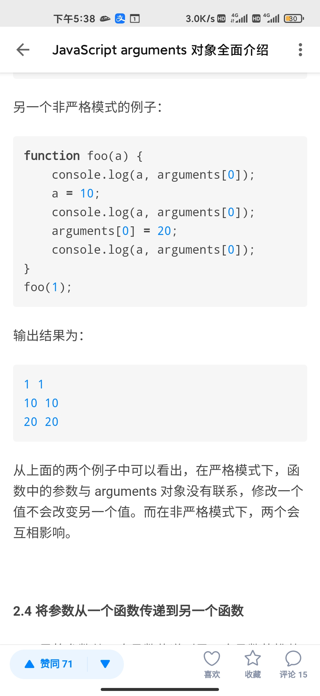

# 7

1. [https://www.instagram.com/p/CFeevK7g6ES/?igshid=1vfezo09h0sir](https://www.instagram.com/p/CFeevK7g6ES/?igshid=1vfezo09h0sir)

   

2. A: copywithin？

   B: [https://es6.ruanyifeng.com/\#docs/array\#%E6%95%B0%E7%BB%84%E5%AE%9E%E4%BE%8B%E7%9A%84-copyWithin](https://es6.ruanyifeng.com/#docs/array#%E6%95%B0%E7%BB%84%E5%AE%9E%E4%BE%8B%E7%9A%84-copyWithin)

   

   这个API 表示从未用过..

   C: 惊了

   B: 又是一个具有副作用的API...

   A: 好家伙

   B: 每次看到这种API 就头疼，pop,push,shift,unshift,splice,sort,copyWithin..

   我可能被函数式熏陶傻了

   C: 那用immutable.js继续嗨

   B: 哈哈，可以，全都是纯操作\[让我看看\]

3. 

   【Mannequin.js: An Articulated Mannequin Figure Library】[https://boytchev.github.io/mannequin.js/](https://boytchev.github.io/mannequin.js/)

   Mannequin.js: 关节式人体模型库。

4. 每日一句分享: API 是另一种形式的 User Interface。

   

5. 分享一本书，读了前两章 干货很多，后面的章节 有兴趣的同学可以实践下.

   [https://weread.qq.com/web/appreader/4a4323f0718ff6824a40316k9bf32f301f9bf31c7ff0a60?wtheme=white&wfrom=app&wvid=244154583&scene=bottomSheetShare](https://weread.qq.com/web/appreader/4a4323f0718ff6824a40316k9bf32f301f9bf31c7ff0a60?wtheme=white&wfrom=app&wvid=244154583&scene=bottomSheetShare)

6. 
7. 

   A: \[让我看看\]答案是 2

   B: 我和C都觉得是1, 我们答错了

   A: 这道题，确实有点问题

   B: 理解下来感觉像是 形参 被放到 arguments 对象，然后 a 指向 arguments\[0\]

   A: 我回去查查资料，我越想越想不明白。

   B: 我也是瞎猜的哈哈哈

   D: 形参不是会和arguments形成映射吗

   A: 可是形参是基本类型啊，不存在引用啊。

   B: 你要是查到资料也告诉我们

   A: 就好比 const arr = \[1\] const a = arr\[0\] arr\[0\] = 2 a === 1 =&gt; true

   B: 

   

   C: 哇 果然 但是并没有解释到底是如何互相影响的

   A: 嗯，我在查

   D: 严格模式参数不会与arguments形成映射，使用es6默认参数自动使用严格模式

   A: [https://stackoverflow.com/questions/54323086/changing-javascript-functions-parameter-value-using-arguments-array-not-working](https://stackoverflow.com/questions/54323086/changing-javascript-functions-parameter-value-using-arguments-array-not-working)

   D: 非严格模式下arguments虽然和参数是两个独立的，但是会形成映射，一个还另一个会跟着改, 对不对，A？

   A: 

   对，不过有点瑕疵。

   es6 默认参数 是一个语法特性。

   E: 我啪的一声就站起来了奥 马老师发生社么事了

   A: 你说的映射其实可以衍生出两个概念。

   第一个是 arguments 本身代表的是函数内置参数，它是一个对象，类数组。

   第二个是 不严格模式下，里面的每一个数组元素都定义了 getter setter，而这些实现都是 native code，这就是映射的底层。

   所以造成的现象是，在不严格模式时，每次读取arguments，都会代表最新\[修改后\]的参数。因为 setter 会同步修改函数栈里的参数。

   而严格模式，只有 getter ，也就是最初传递进来的参数。

   A: 我在找找具体的协议规范。

   A: 学 JS 这一点 一直让我不爽，想找 native code，只能去翻 V8 源码。

   A: 

   [http://es5.github.io/\#x10.6](http://es5.github.io/#x10.6)

   “映射”后面的规范标准。

   

   D: 哎呀，这大英文

   A: 跟我上面中总结的雷同，只不过我用了 getter,setter 抽象了 share 这个概念。

   A: 没事，如果真遇到 这种面试题，你说映射 以及在严格模式的差异 就行。

   A: 并且要加一句，自己的观点。

   D: 好滴，感谢A的分享

   A: 就比如，修改参数会模糊数据的流向。

   D: 模糊数据的流向是啥意思？

   A: 这个就可以说说了，有些新手没有这个意识。

   假如你解释清楚，面试就十拿九稳。

   大部分的情况下 模糊数据流的情况 就是副作用函数 和 引用类型了。

   说白了，就是 修改了一个引用数据，这就会模糊数据流。

   我觉得，面试的时候是说白话挺减分的。

   最好从更高的抽象去回答问题，让面试官 对你印象深刻。

   C: 面试能回答出这个 可能你就是ssp了

   A: 面试嘛，就是个博弈的过程，要懂得表现的机会，要懂得如何通过小动作装出来，最关键是该懂的必须懂。 面试大忌就是 直接回答问题。 一定要说清楚 问题的背景，其代表的意义，业界的探索，最后再说答案，然后加一两句个人观点。

   A: 总之就是通过表演把答案回答得更丰满，更立体。

   A: 呃，我是菜鸡，这只是我的方法，意义不大。

   C: 感觉还是看硬实力

8. [https://www.v2ex.com/t/732806](https://www.v2ex.com/t/732806)

   之前我实习的公司，待遇很棒，有需求的同学可以试试。

