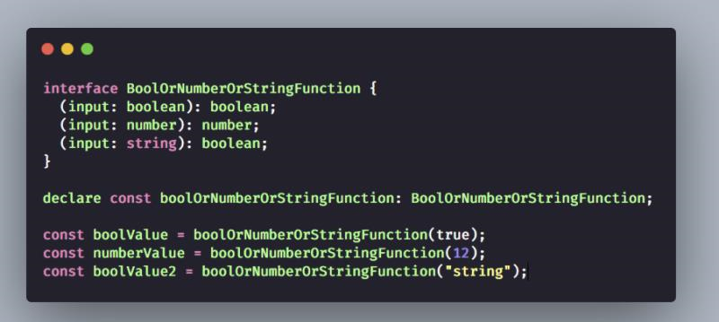
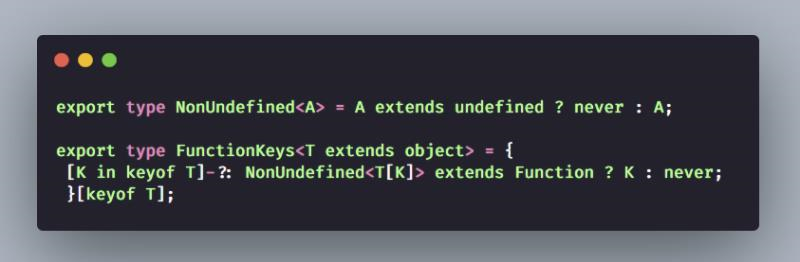
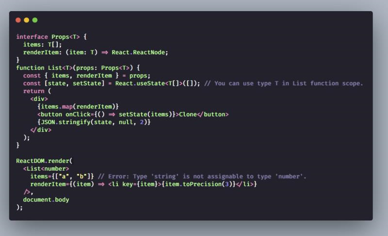
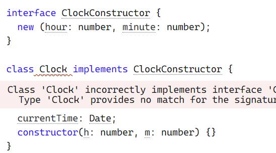
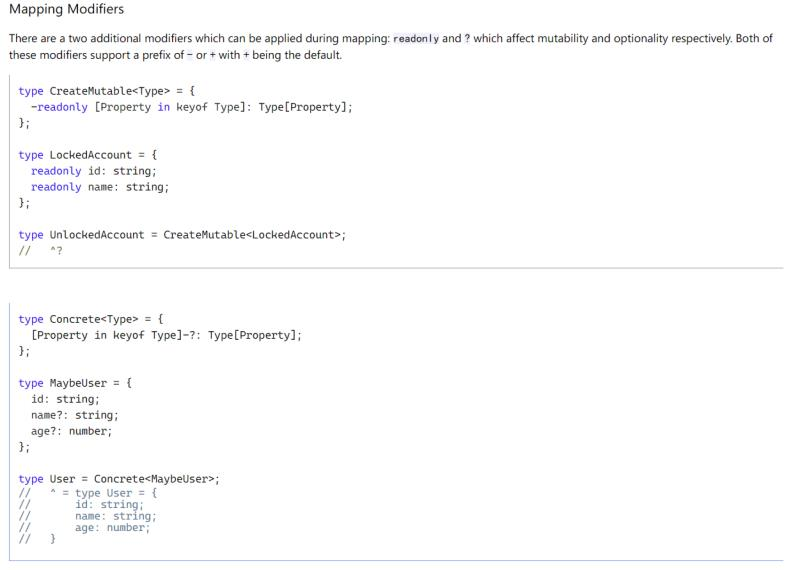
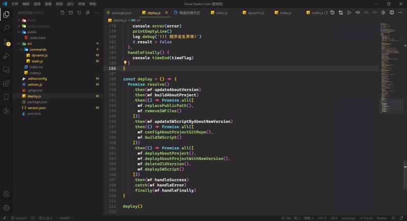

# 1-3


1. 我想组一个 元旦三天沉淀计划, 有同学想参加吗?

   初衷是 准确把握元旦三天时间.

   具体的形式是 列举自己三天内要完成的事情, 不是普通的列举, 每件事要有排期时间的. 然后每天约个时间, 一起 review 下当前进度..

   有意向可私聊.

   **三天后的进展:**

   1. 学习 TypeScript \[v\]
   2. 查看 ahook / usehook 的源码 \(0.5d\) \[v\]
   3. 阅读 30 seconds of code \(0.5d\) \[v\]
   4. 维护 tomotoes! \[v\]

           1. 微信端的header bgcolor

           2. 移动端问题打赏后的点xmodel

           3. 修改 博客与相册 版本年号

           4. 字体在移动端过大

           5. 关于项目增加书籍

   5. 完成 Type-Challenge / typescript-exercises \[v\]

   6. macOS 与 Windows 的工具对齐 \[v\]

       继续研究在 webStorm 下的快捷开发模式

   7. 完成 年度总结 \[x\]

   * 思考下 孤独与人性
   * 思考下 业务与前端发展
   * 思考下 朋友与爱情

   8. 思考的价值 \[x\]

   * 思考的价值软文/推广
   * 更新站点
   * 分享:
     * 产品与前端
     * 效率工具
     * 知识分享

   9. Github 年度报告 项目 \[x\]

   [https://mp.weixin.qq.com/s/lsUHCcTljz854ZrJVJpjFw](https://mp.weixin.qq.com/s/lsUHCcTljz854ZrJVJpjFw)

   [https://fant-gp.herokuapp.com/](https://fant-gp.herokuapp.com/)

   [https://github.com/tipsy/profile-summary-for-github](https://github.com/tipsy/profile-summary-for-github)

2. Facebook 黑客杯四冠王！8 岁起横扫国际大赛，拿奖拿到手软 [https://mp.weixin.qq.com/s/a9J8knbkc-6RfrFRzVcBJw](https://mp.weixin.qq.com/s/a9J8knbkc-6RfrFRzVcBJw)  Tourist 永远滴神
3. 分享个 TS snippet 助助兴

   

4. A: Java 中的 Object TypeScript 中的 any C++/C 中的 void \* Go 中的 interface{} Kotlin 中的 Any ...

   好多编程语言, 不管静态类型, 动态类型 都提供了 "Any" 类型..

   B: 这些更像是对应ts中的unknown吧 Java的object变量 o，你可以使用o.a访问a成员吗 好像不行吧

   A: 是的 但是 unknown 变量不能向下转型 any 是可以的

5. 函数重载的另一种方式.. 除此之外还有:

   func\(签名1\); func\(签名2\); ... func\(签名3\) {}

    

6. A: 写 Java 感觉重载这个概念很棒 B: 其实我感觉重载有时候没啥必要

   A: 面向对象的设计好像 离不开重载

   C: 重载是 是设计者的妥协.. 如果一个功能 有多次重载, 多种签名.. 那么这个功能设计的就是有问题..   
   PS: 在绝大数场景下

7. Answer to What is that one picture that describes the lowest point in your life? by Julia Puschnerat   
   [https://www.quora.com/What-is-that-one-picture-that-describes-the-lowest-point-in-your-life/answer/Julia-Puschnerat?ch=99&share=c9b74588&srid=iVbmg](https://www.quora.com/What-is-that-one-picture-that-describes-the-lowest-point-in-your-life/answer/Julia-Puschnerat?ch=99&share=c9b74588&srid=iVbmg)

   A: 一个真实且无奈的故事.

   B: 这妹子为什么要去德国啊 Information System专业exchange就是为了看孩子也太不值了

   A: 哈哈，的确挺怪的

8. 如何评价ACM-ICPC World Finals 2077? - 陈靖邦的回答 - 知乎 [https://www.zhihu.com/question/437191564/answer/1655313320](https://www.zhihu.com/question/437191564/answer/1655313320)
9. 在国内做独立开发者，没有公司实体寸步难行。
   1. 安卓 APP 商店上不了, 小米 华为 魅族 是允许个人的 ，opp vivo 不允许
   2. 经营性 APP 带后台需要域名备案，网安备案
   3. 支付还需要 ICP 证，其他网文、视频都需要单独办证
   4. 软著是强制的
   5. 提供服务不能接入支付宝、微信官方支付渠道（接第三方渠道收费高、还担心跑路）
   6. 唯一没支付障碍的是 iOS 渠道，支付用 IAP , 苹果商店要收 30% 手续费
10. \(type as any\) as targetType 可以将 任意 type 转换成 targetType..
11. TypeScript 官方提供了一种注解的元编程库.. TypeScript 在 编译成 JS 的这一层 可以增加好多抽象哇..

    [https://jkchao.github.io/typescript-book-chinese/tips/metadata.html](https://jkchao.github.io/typescript-book-chinese/tips/metadata.html)

12. 怎么过滤 Type Model/Object 中的不需要的 Key

    `type filter<T extends object> = { [K in keyof T]: condition ? ... : never }[keyof T]`

    关键在于 最后一行, 它其实隐含了两点:

    1. `[keyof T] keyof T => key1 | key2 | key3 ...`

    `[key1 | key2 | key3 ...]` 可以看成 `[Literal type]` 而 `[literal type]` 会执行 "遍历 每一个可成立的字面量"的...

       2. `{k1:nerver, k2: value}['k1'|'k2]` 此类型返回值是 value 也就是说 会自动过滤掉 `never`

    

    B: 可以当分配律来理解`A[x|y]=A[x]|A[y]`

    `T|never=T T&never=never`

    A: 这个受教了 是的, 就应该是理解的

13. 分享个视频: 下一代 Web 应用的超能力：机器学习   
    [https://www.youtube.com/watch?v=dDIk1Tmnj9A&ab\_channel=GoogleChromeDevelopers](https://www.youtube.com/watch?v=dDIk1Tmnj9A&ab_channel=GoogleChromeDevelopers)

    视频讲解了主流的AI概念, 以及 AI 为前端赋能 的应用场景..

14. 第一次见到泛型组件的用法.. 有趣..

    

     `<Component<Generic Type> attributes... />`

15. 快餐文分享: 10++ TypeScript Pro tips/patterns with \(or without\) React [https://medium.com/@martin\_hotell/10-typescript-pro-tips-patterns-with-or-without-react-5799488d6680](https://medium.com/@martin_hotell/10-typescript-pro-tips-patterns-with-or-without-react-5799488d6680)

    使用 TS 开发 React 项目时需要注意的一些点, 这篇文章是 2018 年写的, 在 medium 上有 8.9k 点赞.. 文章有很多 现在看来的 明显的错误...

    就比如 `Don’t use FunctionComponent<P>/FC<P> to define a function component`

    果然发展的快, 沉淀就成了个问题..

16. 我突然想到了一个点, coding 时有一个问题一直无法绕过.. 就是命名了..

    命名变量的时候, 用名词堆叠 再符合个命名规范就可以了

    但函数命名时, 在大部分场景下 其实是有一定规律的

    变量: 名词堆叠 函数: 动词+名词堆叠

    而这个动词 完全可以把它枚举出来, 这样大部分场景下, 都可以拿来就用..

    ```text
    addBalance
    getAccount
    filterActivityList
    patchEmail
    deleteUserById
    removeItem
    generateTagList
    fillTableHeader
    createFolder
    forEachFileList
    parseNodeTree
    updateUserInfo
    extractUserInfo
    showTable
    hideIframe
    useDebounce
    toBase64
    isSuccess
    canWrite
    requestModule
    loadScript
    fetchGalleryData
    setLanguage
    sendMessage
    querySelector
    findElement
    combineList
    importResource
    searchService
    renderComponent
    readFile
    onChange
    handleInput
    verifyFormData
    changeSettings
    cloneJSON
    appendSlice
    insertColumn
    saveConfig
    execCommand
    unloadPage
    destoryConnection
    openProgram
    ​
    单个动词, 一般都是 名词.动词 , 就比如 AST.parse()
    make
    do
    run
    walk
    enable
    disable
    parse
    build
    notify
    compare
    ​
    还有一些特定场景下的:
    downloadPage
    promisify
    expect
    box / pipe / then 链式调用
    ```

    A: 暂时想了这么多, 然后也借鉴了下之前的实践 与 通用 API

    B: 妙啊 我也是老起名困难了

    A: 我起名有个毛病.. 我经常 const filtererPageList = filterPageList\(\)

    每次coding 代码都好长..

    B: 没懂 这个命名是就多了个er吗

    A: 多了个过去式.. 已过滤的列表 = 过滤列表\(original list\)

    B: 我觉得长得太像了 容易看错

    A: 哈哈 没办法短.. pageList 被用了 只能 filtererPageList 了..

    我经常闹这种情况..

    B: 我喜欢前面加个new， newPageList

17. 分享一下最近我再看的两个 Hooks Library:   
    从源码中学习是最舒服的,效率也是最快的

    [https://github.com/alibaba/hooks](https://github.com/alibaba/hooks) \(5.1k\) 阿里出品, 有非常全面的 hook,

    [https://usehooks.com/](https://usehooks.com/) \(2.5k\) 一些经典的 hook 片段

18. 利用接口 实现 构造函数约束..

    

19. Question: 以下组件 存在什么问题?

    ```text
    const handleClick = () => {}
    <Button type="primary" onClick={() => handleClick()}> Click me </Button> 
    ```

    A: 每次渲染都会重复构造一遍这个回调函数

    B: 好家伙，我垃圾代码看多了，这种没放在 usecallback 的函数我已经习以为常了。。。

    C: 嗯 每次 render 时, onClick 都是一个新的函数, 而函数是引用类型, 所以 每次render 时 都会重新 render Button 组件...

20. TS 类本身内部居然也支持 定义限制条件...

    

21. hah 每次看到 + - 修饰符, 都觉得使用这两个符号 类型显得很清晰易懂

    

22. JS 在浏览器环境中 真正的并行执行..

    

    通过 Worker API 去实现

    分享一篇没建群之前看过的好文

    Web Worker 文献综述 [http://www.alloyteam.com/2020/07/14680/](http://www.alloyteam.com/2020/07/14680/)

    是腾讯 AlloyTeam 团队写的, 文章写的有深度, 该介绍的都介绍了.

23. 设计优秀的代码, 看起来就像诗一样的优美..

    

24. 2021年UI界面设计的9个趋势

    [https://www.inneed.club/articles/detail/l5xgd43gdw](https://www.inneed.club/articles/detail/l5xgd43gdw)

25. 分享一本刚刚整理的 React - Hooks 小册 - Dig deep into Hooks.

    里面包括了一些 推荐阅读的源码库, 以及一些经典的 Hooks 片段. 前端的同学有空可以读一下~ 对掌握 Hooks 会更有帮助的.

    [Dig deep into Hooks](https://thinking.tomotoes.com/tags/docs/dig-deep-into-hooks)

    这个小册没有包括 ahooks 中的一些例子, 因为 ahooks 每个 hook 之间存在耦合, 不容易整理成代码片段..

    其他参考链接中的 hooks , 对我产生价值的 都整理了..

26. 3行核心CSS代码的rate评分组件，秀到你怀疑人生

    [https://mp.weixin.qq.com/s/FE3IuNu66VxLDgHCHWIRVA](https://mp.weixin.qq.com/s/FE3IuNu66VxLDgHCHWIRVA)

27. 好文分享:

    Learn Advanced TypeScript Types   
    [https://medium.com/free-code-camp/typescript-curry-ramda-types-f747e99744ab](https://medium.com/free-code-camp/typescript-curry-ramda-types-f747e99744ab)

    摘要: Despite the popularity of currying and the rise of functional programming \(and of TypeScript\), it is still a hassle today to make use of curry and have proper type checks. Even famous libraries like Ramda do not provide generic types for their curry implementations \(but we will\). However, you need no functional programming background to follow this guide. The guide is about currying but it is only a topic of my choice to teach you advanced TypeScript techniques. You just need to have practised a bit with TypeScript’s primitive types. And by the end of this walk-through, you will be a real TS wizard.

    文章主要讲述了, 使用 TypeScript 为 Curry 函数建模的过程

    文章前面花大篇幅讲解了 curry, 与 TS 的基础概念.. 然后借助这个概念 创建了一个个类型工具, 再利用这些工具 达成最后 curry 模型.. 并且最后还增加了 placeholder 支持..

    整篇文章读了3遍.. 耗时半个多小时... 很久没这么耗费心智看一篇文章了...

    PS: 文章中存在一处错误 CurryV3 的递归名词 应该是 CurryV3

    这篇文章真的非常棒, 非常推荐阅读.

    [https://github.com/millsp/ts-toolbelt/blob/master/src/Function/Curry.ts](https://github.com/millsp/ts-toolbelt/blob/master/src/Function/Curry.ts)

    这是文章最终的产出

    哎, 虽然 TS 只提供了 type extends infer 很少的关键字, 但已经做到 类型系统上 图灵完备了...

28. 分享：[用 github-page 做短链服务](https://github.com/nelsontky/gh-pages-url-shortener)，包括[这篇](https://zhuanlan.zhihu.com/p/339832422)国人作者搬运的，利用 github 仓库做 db，github-page 的 `404.html` 来做查 db 和重定向，想法不错哈哈

    B: 这个想法可以的 404 拦截所有请求, 然后在提取请求中的参数, 通过参数 访问 github api 找到对应的长链接, 再重定向..

29. 换了套衣服

    

    主题: Monokai Pro 图标: Material Icon 字体: Cascadia Code

    我发现 还是 vscode 好看哇.. jet brains 的 ide 差距挺大的

    要是 vscode vim 插件再给力点就好了..

30. Ep 23. 个人知识管理体系系列 - 输入篇 [https://pythonhunter.org/episodes/ep23](https://pythonhunter.org/episodes/ep23)
31. 分享下 配置了一下午的 idemvimrc, 带注释的那种, 可以开箱即用~

    [ideavimrc](https://thinking.tomotoes.com/tags/docs/ideavimrc)

    hah 这个 action 配置方面偏前端了, 因为 前端不需要 实现接口, 跳转到类 等等行为

    不过除了 action 篇, 前面都是通用的

32. 最近大家有什么工作机会，可以在群里共享下.. 毕竟寒假了，实习岗应该也挺多了..

    [https://m.nowcoder.com/intern/center](https://m.nowcoder.com/intern/center)

    多关注些牛客，看些面经～

33. 分享个刚刚学到的小知识: `git push origin master:remoteBranch`  从本地 master 分支上 新建 远程分支, 并 push 到远程仓库.

