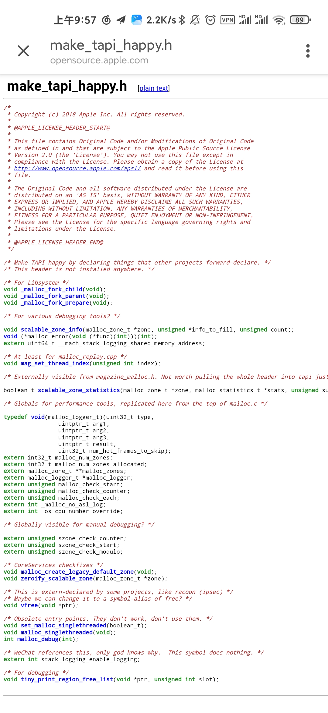
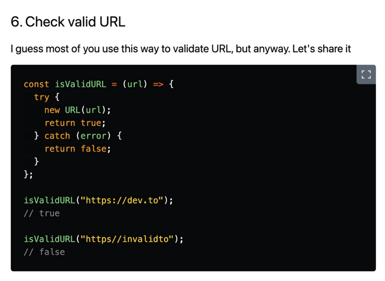
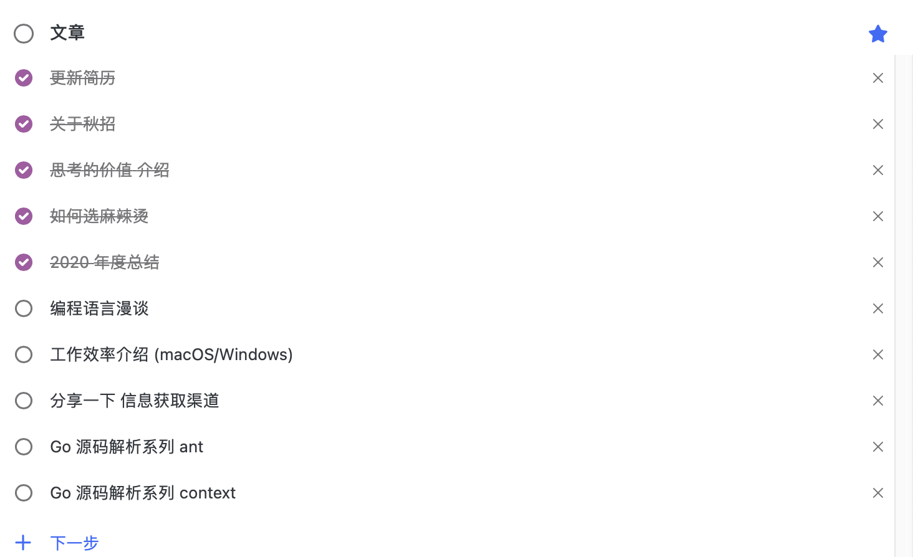
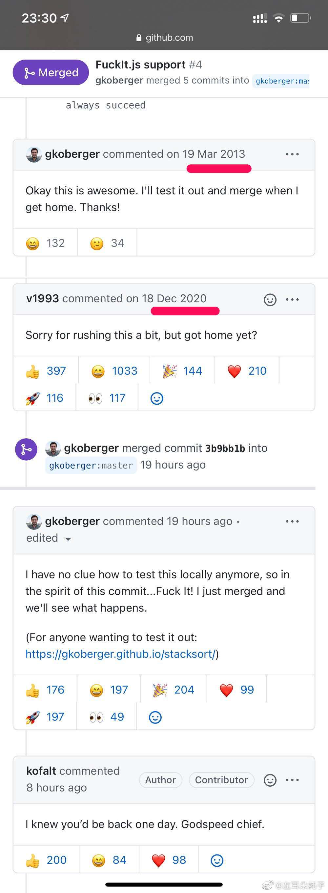
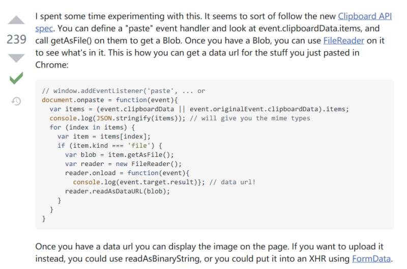

# 18-23

1. 每日一句分享: 万维网的基本单位是单个页面
2. 新一年20天内, 字节宣布放弃两个业务:
   1. 悟空问答
   2. 好好学习
3. 快餐文分享:   
   CSS Grid 网格布局教程   
   [http://www.ruanyifeng.com/blog/2019/03/grid-layout-tutorial.html](http://www.ruanyifeng.com/blog/2019/03/grid-layout-tutorial.html)

   摘要: Grid 布局与 Flex 布局有一定的相似性，都可以指定容器内部多个项目的位置。但是，它们也存在重大区别。 Flex 布局是轴线布局，只能指定"项目"针对轴线的位置，可以看作是一维布局。Grid 布局则是将容器划分成"行"和"列"，产生单元格，然后指定"项目所在"的单元格，可以看作是二维布局。Grid 布局远比 Flex 布局强大。

4. 我确认我的串讲主题了, 不讲 组件化了, 这东西 老生常谈 感觉没什么新东西. 我还是讲 编程语言, 刚刚确定了一些 子主题:

   1. 编程语言的三种阵营 \(学术派, 底层派, 应用派\)
   2. 编程语言 与 语义学
   3. 决定编程语言所在领域的关键因素
   4. 不同编程语言的不同 IO 模型
   5. 编程语言 与 DSL
   6. 编程语言常见范式: FP OOP 命令式
   7. 编程规范: 防御性编程, SOLID 五大原则, 抽象的颗粒度, API 的优雅设计, 对输入有所限制 对输出包容等
   8. 编程语言的类型系统
   9. 元编程
   10. 如何实现一门编程语言 \(利用现在后端的技术 llvm\), 以及之前我写过的 Brainfuck 解释器
   11. 编程语言的历史/重要人物/ 可引申出 学多门语言对编程思想的重要性
   12. 常见编程语言的编译步骤 \(AST, 中间字节码, 收集数据优化..\)
   13. 未来编程语言的设想
   14. 不同编程语言处理异常的不同做法
   15. 内存管理, 常见的 GC 机制
   16. 不同编程语言的工具链/生态
   17. 不同语言下的模式匹配,可用 TS 中的 refer 引出共鸣
   18. 揭秘设计模式 就是一个营销概念
   19. 编程与工程之间的关系, 可以说说 软件工程的知名营销概念
   20. 编程语言与操作系统之间的关系: 现代编程语言 不可避免的复杂性 离不开操作系统的最初设计

   嘿嘿, 主题就叫 漫谈编程语言.

5. 如何看待 QQ 扫描读取所有浏览器的历史记录？ - 360安全卫士的回答 - 知乎 [https://www.zhihu.com/question/439768601/answer/1683922148](https://www.zhihu.com/question/439768601/answer/1683922148)

   hah 第二次 3Q 大战~

6. 分享篇文章:

   MacOS Keyboard Settings and Shortcuts for Coding

   [https://utkuufuk.com/2021/01/17/macos-keyboard-shortcuts/](https://utkuufuk.com/2021/01/17/macos-keyboard-shortcuts/)

7. 
8. 计算机图形的两种分支: 矢量图形与光栅图形\(位图\)
9. A: 发现了个有趣的知识: 熵增定律—热力学第二定律 是唯一区分过去和未来的基本物理定律。其他物理定律在时间上都是可逆的。

   B: 巧了 吃饭的时候正在想熵增这个事

   C: 魔法少女小圆好像就是基于这个定律讲故事

   D: 神作 快去看

   A: 啊哦，这么高能的番剧嘛.. 我一直很好奇，信息熵增的事情。

   B: 怎么？ 也是表示混乱程度嘛

   A: 我不是很理解 熵的概念 在信息上的体现.. 我不是很了解 “熵”

   B: 简单的说 3个 bit 就有 2^3 种可能的组合 可以用一个值去量化这个可能性（混乱度）也就是熵

   香农这个人就搞了一系列定义 。。直观的看3 个 bit 的 熵 entropy=log2\(2^3\) = 3

   A: 也就是说 熵代表的是 信息越多 相互产生的信息就会越多。 熵代表的是这种过程的混乱度？ 而熵增代表的是 这种过程的趋势，并指出不可逆？

   C: 大学信息论学过信息熵

   A: 我感觉 熵指的是是热学中的概念，并且这种概念符合 信息产生..

   B: 可以去了解了解信息论～

   C: 是指的信息除去冗余后的信息量，有个公式 梦回大学课堂

   这些理论通信领域用的多些，计算机领域似乎用的少

   B: b站有个up推荐 YJango 可以看看 机器学习 深度学习 吧

   谁让我tm专业就是这方面的

   A: 感觉计算机越往深学，越离不开物理.. 今天中午一直在看电流的概念.. 我太菜了

   C: 电流。。。我只有在处理手机的功耗问题时，会去看电流数据

   A: 大魔法师无疑了

10. 分享篇文章:

    信息论入门教程 [http://www.ruanyifeng.com/blog/2019/08/information-theory.html](http://www.ruanyifeng.com/blog/2019/08/information-theory.html)

    A: 总结下: 信息熵 表示随机信息的期望, 果然最本质的语言 还是数学. 它在通信中提供的最重要思想是 编码机制 \(大概率信息分配短码\), 和霍夫曼编码是一种实现机制.

    我对信息熵的概念 不是很感兴趣.. 大家口中常说的熵 其实指的是 事情发展的混乱趋势..且不可逆的..

    信息熵 与 热学熵 之间的关联.. 就是它们看待的介质不同.. 它们的思想是相同的..

    大家口中常说的熵, 是 熵 在现实事件中的引申意义.. 并不是熵 如果有哪里错误.. 请告知我哈..

    B: 信息论里面的信息熵是香农借鉴的热学熵，去解决通信领域具体的信息传输问题。广义的熵，是个更抽象玄学的概念

    A: 赞同, 我对广义的熵 理解就是 混乱度的不可逆性..

11. 快餐文分享:   
    浅谈移动端开发技术   
    [https://mp.weixin.qq.com/s/TXBRUVoOBDxr8P9Iw5FpTQ](https://mp.weixin.qq.com/s/TXBRUVoOBDxr8P9Iw5FpTQ)

    文章花大篇幅讲了 hybrid 在移动端的一些原理

    在移动端 昂贵的不是 触发 render 的次数, 而是通信的次数.

    都说了 还是扩展下吧: web 的性能瓶颈 在于单线程模型, 这就是为什么 react 16 提出了 增量化 fiber 架构 移动端的 hybrid 的性能瓶颈 在于 线程通信, 不过 RN 从一开始就常用的 vdom, 可以将多次修改 增量化

12. 推荐本书: 未来世界的幸存者  阮一峰老师 几年前出的一本书。 里面的很多内容 现在看来也具有价值，建议阅读。
13. 快餐文分享:

    CSS Tips you won't see in most tutorials   
    [https://denic.hashnode.dev/css-tips-you-wont-see-in-most-tutorials](https://denic.hashnode.dev/css-tips-you-wont-see-in-most-tutorials)

14. 最近找到了 获取高质量信息 的一种解决方案。就是不再从大量文章中花时间去寻找，而是找书去看。

    这样收获的知识 系统性也很强。

15. B: A，我是前几天看到你的scrcpy-gui项目，对我帮助很大。你有没有尝试过修改scrcpy的源码进行定制化？

    A: 事实上，我一直没有 scrcpy 场景下的需求。

    C: 哈哈哈

    A: 这么说吧.. GUI 软件只有在开发的时候才会打开.. 目前这个项目，已经很久不维护了。

    定制化的需求，我记得 QTScrcpy 有做。 还有一个 WS-Scrcpy 可以把屏幕投放到 web

    B: 好的，我去看看

    我打算自己改写一下scrcpy server端，再调用几个Android framework里的方法，比如powerManager亮度调节色温调节之类的，还有些隐藏的接口可以反射调用

    A: 可以的，我记得 scrcpy 作者写过一些 scrcpy 原理的文章，可以多看看。

    如果是 Android 的话，想做到自动化，也可以借助其他软件，就比如 Tasker autojs 这样 还有 termux

    要是苹果的话，jsbox 还是勉强能用的

    我之前在 我的用户群，看到过一些基于scrcpy的作品，有一些黑产的软件 打开个终端 可以同时控制十多个手机，并且 支持很多人性化定制化的功能。

    这块是存在的市场的，因为目前 看起来挺混乱的。

16. 计算密集与IO密集最本质的差别 就是 计算密集主要在用户态花费时间，IO密集则是在内核态。
17. 分享篇文章:

    圣杯与银弹 · 没用的设计模式

    [https://mp.weixin.qq.com/s/3TbunRkouM7PtCQrC52brQ](https://mp.weixin.qq.com/s/3TbunRkouM7PtCQrC52brQ)

18. 分享篇文章: 「黑客帝国」和「楚门的世界」 [https://mp.weixin.qq.com/s/PVYTfc0KuOkWbf5dJDrVLQ](https://mp.weixin.qq.com/s/PVYTfc0KuOkWbf5dJDrVLQ)

    摘要: 算法真的没有价值观吗？不，算法有价值观。 算法的价值观是被某种「成功」所定义的。如果这种成功是最大化股东利益下的商业利润，是更多的用户时长，更好的增长，以及更高效的广告变现

    文中的困局挺好解决，提升自己 摆脱低级趣味就好了。

    相应的结果 是幸福感会降低。

19. 分享篇文章:   
    锻炼你的麦克斯韦妖   
    [https://mp.weixin.qq.com/s/ORwUC\_O9MGdSRjepUFW1xA](https://mp.weixin.qq.com/s/ORwUC_O9MGdSRjepUFW1xA)

    摘要: 每个人的大脑里都住着自己的麦克斯韦妖，经常锻炼它，它的行动就更敏捷，肢体也更强壮。一旦你的麦克斯韦妖足够敏捷，足够强壮，就有能力解决复杂得多的问题。对羸弱的麦克斯韦妖而言，把气体分子分为快慢两类可能就手忙脚乱、左支右绌了；而对强壮的麦克斯韦妖来说，按速度划分成几十个甚至几百个档次，把各档气体分子分到不同的区域，也丝毫不在话下。

20. 快餐文分享:   
    页面的加载优化方案   
    [https://blog.serenader.me/ye-mian-de-jia-zai-xing-neng-you-hua-fang-an](https://blog.serenader.me/ye-mian-de-jia-zai-xing-neng-you-hua-fang-an)

    涉及了一些常见的点，可以简单刷下。

21. 每日一句分享: 一个主任医师需要二十多年才能成长起来，而一名软件工程师在四十多岁已经很难找工作了，这就是大后期和大前期职业的差异吧
22. 垃圾代码编写规范: State-of-the-Art Shitcode Principles

    [https://github.com/trekhleb/state-of-the-art-shitcode](https://github.com/trekhleb/state-of-the-art-shitcode)

    建议全文背诵

23. 分享篇文章:

    被拆分的身份证

    [https://mp.weixin.qq.com/s/XohlUmqYEVXTyxjPsDm3pA](https://mp.weixin.qq.com/s/XohlUmqYEVXTyxjPsDm3pA)   
    一个网络包从节点A发到节点B，这个过程中 只有目标IP地址是不变的。

24. Linux 常见的文件类型:
    1. 普通文件
    2. 目录文件
    3. 块设备文件和字符设备文件-外设
    4. FIFO 管道
    5. Socket
    6. 符号链接
25. 程序员的信仰之争： Vim vs Emacs, Tab vs Space - 老莫的视频 - 知乎 [https://www.zhihu.com/zvideo/1293595906412236800](https://www.zhihu.com/zvideo/1293595906412236800)

    我绝对不会与 用空格键而不是Tab的人同床共枕。 hah 太搞了…

26. A: TIL, macOS 在 /etc/pam.d/sudo 里面增加一行 auth sufficient pam\_tid.so 可以给 sudo 加上 TouchID 验证 [https://t.co/spuN1IswF9](https://t.co/spuN1IswF9)

    B: wow 这个好

    C: wow 这下可以彻底忘记开机密码了呢

    A: hah 推荐一款我用了一年多的密码管理器 bitwarden

    目前除了一些银行卡密码，bitwarden 主密码，其他所有账号的密码 我都不需要记~

    并且 bitwarden 是开源产品，可以自己架服务

    C: 酷

    A: 但是不推荐自己架，应该服务器 存在安全问题

27. 快餐文分享:  
     🦸‍♂️ 11 JavaScript Tips and Tricks to Code Like A Superhero \(Vol.2\) [https://dev.to/orkhanjafarovr/11-javascript-tips-and-tricks-to-code-like-a-superhero-vol-2-mp6](https://dev.to/orkhanjafarovr/11-javascript-tips-and-tricks-to-code-like-a-superhero-vol-2-mp6)

    我喜欢这个片段

    

28. 快餐文分享:   
    Scoping CSS using Shadow DOM   
    [https://blog.bitsrc.io/scoping-css-using-shadow-dom-a548985b73af](https://blog.bitsrc.io/scoping-css-using-shadow-dom-a548985b73af)

    使用 Shadow DOM 去隔离 不同应用之间的样式

    应用场景 太适合 微前端了..

29. A: 我有一个小疑问, 你的信息源是如何获取的@C

    B: 啥时候分享一下

    C: 正在做了 因为实在太多了 我准备写篇文章 但是写文章需要大片空白时间..

    可能等到下个双月 我定个 okr 

    

    A: 哈哈哈哈 如何选麻辣烫

    B: 这啥 TODO 软件呀

    C: 微软 TODO 啊.. 看来工作效率介绍 文章是有意义的

30. A: 谷歌的验证是不是利用用户打标签 收集用户数据集 训练ai啊 什么玩意这是

    

    B: hah 很有可能

    A: 选斑马线我就没对过

    B: hah 你可能需要换个梯子

    A: 感觉不是梯子问题 感觉他是想让我多测几组 细思极恐

    B: 其实这个还好, 昨天分享的文章 就有提到一个观点, 只要你使用一些产品, 你就成为了产品本身.

    因为很多产品的埋点系统十分强大 全面..

    换句话讲, 一个用户成为了某一个算法神经网络中的一个神经元

    A: 赞同 就像广告系统 推送广告 其实也是为了提供服务

31. 分享个帖子, 太好玩了:   
    个人博客一般怎么增加用户粘性？ [https://v2ex.com/t/746884\#reply35](https://v2ex.com/t/746884#reply35)

    下面有个回答是: 得用 python 写，因为...python 号称胶水语言 /doge

32. 分享篇文章:

    JS Bridge 通信原理

    [https://mp.weixin.qq.com/s/cBsmunLXLBEtR14cFfy1LQ](https://mp.weixin.qq.com/s/cBsmunLXLBEtR14cFfy1LQ)

    可以着重看下概念与前端调用的方式

33. 
34. 分享篇文章:

    [https://medium.com/@jaf\_designer/why-product-thinking-is-the-next-big-thing-in-ux-design-ee7de959f3fe](https://medium.com/@jaf_designer/why-product-thinking-is-the-next-big-thing-in-ux-design-ee7de959f3fe)

    设计产品时，最应该关注的是 用户最基本的体验，而不是各种特性。这才是一个产品的成功之本。

35. A: 网页上执行粘贴操作，可以把剪切板上的图片显示出来。 Question： 你知道其中的过程吗？最常见的场景就是 github issue 区了

    B: 不走服务端就是 file =&gt; base64，走服务端应该是上传到服务器然后再回显

    A: 是的, 是存在这一过程的~

    我好奇的是 前端如何接受到 图片的数据, 换句话说 剪切板中的图片数据 在前端如何体现.

    C: url 吗

    A: 不是吧..

    C: 哦剪切板。。

    C: 我感觉剪切板是存的图片的路径吧 本地的 或者网页上的url

    粘贴所在的地方（app）做请求资源，渲染，拷贝等操作 我瞎猜的。。

    B: 我猜着是 判断copy事件拿到的值类型 文件类型并且是图片，可以直接转base64 不过图片太大的话base64也有性能问题

    A: 是的, 不过有个口误 应该是 paste 事件 另外, 也不一定需要 上传服务端.. \(当然 不限于场景 假如可以转 base64 的话, 直接显示 就好了~

    好吧.. 我刚刚 google 了下.. 我的好奇点, 其实就在于 event.clipboardData 这个对象中..

    

    看来这个问题 好像没什么意思.. 涉及到的原理, 浏览器 api 都提供了, 把魔法都封装好了..

36. A: 分享一个 我今天思考的点.. 这个点是今天团队技术分享时涉及的.. 关于 前端开发模式, 前端生态 为什么这么 suck..

    关键因素在于 , 至今为止 web 没有任何一个巨头 可以领头, 可以成为行业标准..

    不像 Android IOS 这些终端..

    这些终端应用的开发者 只要跟着爸爸走 就行了..

    B: 原生应用开发者应该也要考虑各种厂商机型的适配

    A: 没错.. android4 , ios9, ie, 微信内置浏览器, 是每一个终端开发者的恶梦 想想就开心

37. 大半夜的分享一道算法题吧

    题目分享: Mine Sweeper [https://www.codewars.com/kata/57ff9d3b8f7dda23130015fa](https://www.codewars.com/kata/57ff9d3b8f7dda23130015fa)

    简述: 给一个二维数组, 里面的特定元素代表的是 扫雷游戏中的一些格子, 就比如雷啊.. 或者 数字啊.. 然后你需要做到是 该盘扫雷能否通关.

    这道题 我去年死磕了两天, 最后通过了大部分的 case, 一直卡在一些奇怪的边缘 case, 结果不得不放弃了.. 我当时的解决方案: [https://github.com/Tomotoes/Kotlin-Note/blob/master/src/Solution.kt](https://github.com/Tomotoes/Kotlin-Note/blob/master/src/Solution.kt)

    有兴趣的同学, 可以做一下这道题 很爽的 \(不骗你

38. 分享读到的一个有趣观点，来自阮一峰老师。

    最近，我有一个猜想。

    我们知道，人眼有“视觉暂留”现象：影像消失后，人眼仍能保留影像100毫秒～400毫秒。这就是电影的原理，每秒播放24张图片，影像就动起来了。

    图片

    我就想问，那么有没有“听觉暂留”呢？我们听到的声音是连贯的，有没有可能其实也是一个个分离的片断？

    查了一下，还真有听觉暂留，叫做“哈斯效应”。如果两个声音相隔5毫秒～35毫秒之间，人耳会认为这是一个声音。

    相比“视觉暂留”的至少100毫秒，“听觉暂留”要短得多，最短只有5毫秒，足足相差了20倍。

    我猜想，这会不会跟信息的传输速度有关。视频的信息量比较大，音频的信息量比较小，如果人体神经系统的信号传播速度是恒定的，那么传输视频就会多耗时。为了把所有视频信息传输完，视觉就暂留久一点。

    一个有趣的经验是，4分钟的 MP3 文件（44.1kHz 抽样）体积大概是 4MB 左右，而4分钟的 1080P 视频（H.264编码）体积是 80MB 左右，相差也约是20倍。

39. 好文分享:

    前端架构发展史   
    [https://tomotoes.com/blog/history-of-front-end-architecture/](https://tomotoes.com/blog/history-of-front-end-architecture/)

    摘要: 在1990年，Tim Berners-Lee 在他的 NeXT 电脑上部署了第一套“主机-网站-浏览器”构成的Web系统，这标志着前端的开始。 在最初，前端是一片荒芜的，经过浏览器大战，W3C 标准化的过程 前端才慢慢成长了起来。

    这篇文章 读了很多遍, 主要讲了 前端改革 30 年，从一片荒芜到微前端兴起, 很有价值, 并且文笔很好, 推荐阅读.

    本文作者 是我一朋友, 狗头

40. [https://usehooks.com/useKonamiCode/](https://usehooks.com/useKonamiCode/)  分享一个有趣的 hooks, up up down down left right left right B A 的按键 彩蛋
41. 分享篇文章:

    微前端到底是什么？

    [https://zhuanlan.zhihu.com/p/96464401?utm\_source=wechat\_session&utm\_medium=social&utm\_oi=1088870436204318720&utm\_campaign=shareopn](https://zhuanlan.zhihu.com/p/96464401?utm_source=wechat_session&utm_medium=social&utm_oi=1088870436204318720&utm_campaign=shareopn)

42. 微服务架构（Microservices Architecture, MSA）的出现并非偶然，与这个时代的软件思想、技术工具的发展有着密切的联系。比如，将业务功能服务化，是SOA的延续；RESTful等架构的兴起，让我们可以考虑更多轻量化的通信机制；领域驱动设计指导我们如何分析并模型化复杂的业务；敏捷方法论帮助我们拥抱变化，快速反馈；持续集成和持续交付（CI/CD）促使我们构建更快、更可靠、更频繁的软件部署和交付能力；虚拟化和容器技术的发展，使我们简化了部署环境的创建和安装；DevOps文化的流行及全栈自治团队的出现，使得小团队更加全功能化。这些都是推动微服务架构诞生和发展的重要因素。

    摘抄自 分布式系统常用技术及案例分析 第二版

    A: 前段也有微服务了

    B: 是呀~ 应用复杂性不可避免，所以 系统级的模块化 也是趋势所向。

    如果一股趋势不加以控制，混乱度会越来越高。 “微”服务就是抑制熵增的很好例子~

43. 

    并发出轨可太秀了

44. 每日一句分享：   
    经济发展不一定会缓解贫困，反而有可能加剧贫困，物质进步不仅不能解脱贫困，实际上它产生贫困。虽然经济革命使生产力上升，但它不一定是在底部对社会结构起作用，把整个社会都抬高，反而好像一个巨大的楔子，在社会的中部穿过去。那些在分裂点以上的人们处境上升了，但是那些在分裂点以下的人们被压碎了。

    来自 亨利·乔治的《进步与贫困》

45. Unix 的发明是50年前，1969年。 这50年 人类社会的发展超乎想象。

    30年前，还没有网页，浏览器，搜索引擎。

    中国封建社会可得2000年之久，所以社会进步的根本动力是技术。

46. 不要害怕失败。   
    人生的最终结果是一个极大值函数（由所有尝试中最成功的一次决定），而不是一个平均值函数。 失败完全可以理解成积极进取的结果，只有生命力充沛的人，才可能会有一次又一次的失败。一味地恐惧失败，只会让自己畏首畏尾，丧失进取心。

    摘抄自 阮一峰老师的散文 -- 被拒绝，也是一种肯定

47. 刚刚读到 unix 联合创始人, c语言之父 丹尼斯·里奇 的故事，让我吃惊。  发明Unix和C语言，给丹尼斯·里奇带来巨大的荣誉，但他始终没有跳槽，一直在贝尔实验室工作，尽管后者多次分拆，到了最后已经名存实亡。2001年，接手贝尔实验室的朗讯公司，决定关闭大多数实验室，许多研究人员纷纷离开，包括Unix发明者之一的肯·汤普森都去了Google，但是丹尼斯·里奇哪里也没去，还是留了下来。2006年12月1日，贝尔实验室被整体卖给了法国阿尔卡特公司，第二年他就选择退休了。 退休以后，他过上了隐居生活，外界几乎忘了他的存在。2011年10月12日，共事20年的同事Rob Pike从加州到新泽西去拜访他，才发现他已经去世了。由于是独居，无法知道准确的死亡时间。
48. 最令你吃惊的事实是什么？   
    人生只有900个月。

    C: 900个月还少吗

    B: 900个月还少吗

49. 苹果公司的市值等于丹麦（世界第28大经济体）的净资产，用户数量等于中国人口。所以，如果把苹果公司看成一个国家，它将是一个超级大国，对世界人民的生活、政治和文化产生了深远的影响。
50. 分享篇文章:

    Worth Moving to Sweden as Engineers?   
    [https://hongchao.me/living-and-working-in-sweden-as-engineers/](https://hongchao.me/living-and-working-in-sweden-as-engineers/)

    一名国人开发者在瑞典的十年回首.

    文中涉及到的很多关于福利, 工作环境的问题 都很现实.

51. 分享篇文章:   
    FIZZBUZZ IN 10 LANGUAGES!   
    [https://iolivia.me/posts/fizzbuzz-in-10-languages/](https://iolivia.me/posts/fizzbuzz-in-10-languages/)

    FizzBuzz 是一个简单编程题, 从 1 到 100 的数列中, 遇到3的倍数输出Fizz, 遇到5的倍数输出Buzz, 遇到3与5的共同倍数输出FizzBuzz, 否则输出数字本身

    文中给出了 10种不同编程语言的实现.. 其中 rust 的模式匹配特性 与其他语言格格不入..

    如果是我的话, 我会这么写

    ```text
    const solution = () => Array.from({ length: 100 }, (_, i, a = !((i + 1) % 3), b = !((i + 1) % 5)) => a && b ? 'FuzzBuzz' : a ? 'Fuzz' : b ? 'Buzz' : (i + 1)).forEach(i => console.log(i))
    ```

