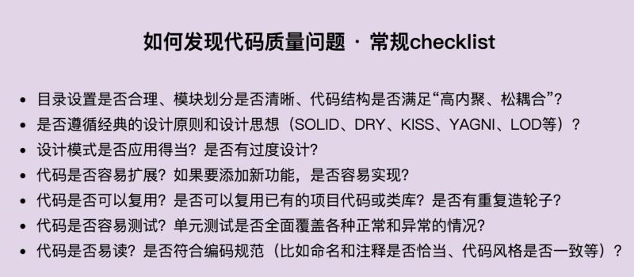
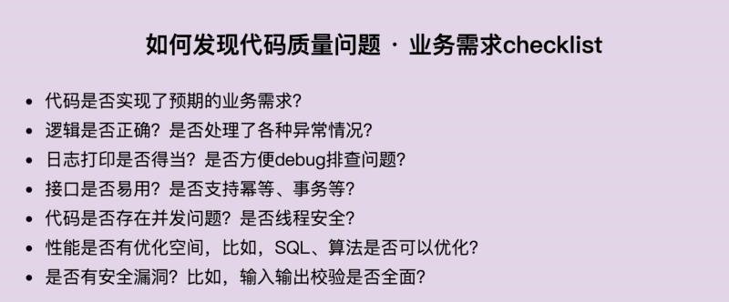
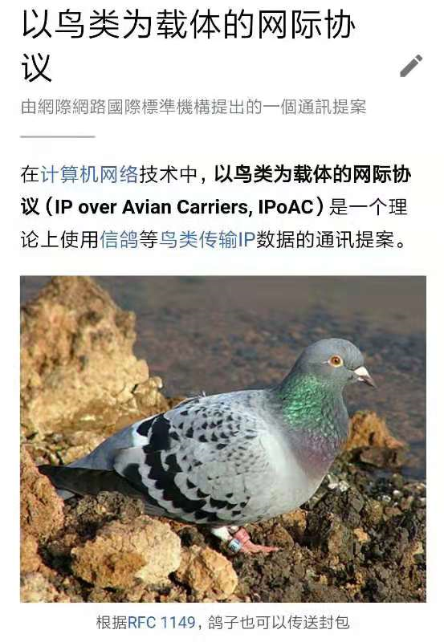
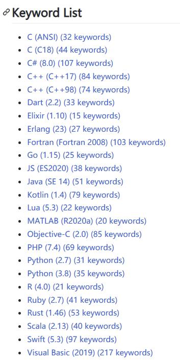

# 24-31

1.  内存对齐 | 原来字段顺序还能影响结构体占用的内存空间

    [https://mp.weixin.qq.com/s/l3T5p\_iw3S9nm635ezflGQ](https://mp.weixin.qq.com/s/l3T5p\_iw3S9nm635ezflGQ)
2.  半月聚合分享:

    2021.01.11 \~ 2021.01.17 思考的价值共产出 71 条信息 [https://thinking.tomotoes.com/archives/2021/1/11-15](https://thinking.tomotoes.com/archives/2021/1/11-15) [https://thinking.tomotoes.com/archives/2021/1/16-17](https://thinking.tomotoes.com/archives/2021/1/16-17)

    2021.01.18 \~ 2021.01.23 思考的价值 共产出 51 条信息 [https://thinking.tomotoes.com/archives/2021/1/18-23](https://thinking.tomotoes.com/archives/2021/1/18-23)

    感谢各位.

    以后每隔总结日, 将会发下近两期的产出信息, 纪录一下.
3.  【分享】：如何发现代码质量问题

    

    
4.  A: CSS 真是我的一生之敌 这东西太不讲逻辑了

    B: 我只会照着设计稿 设盒模型

    A: 哇，这么强的嘛... 我现在连居中都不会

    C: 哇，这么强的嘛... 面试八股文啊

    B: 面试背双飞翼布局，圣杯布局，进来发现用不上

    A: 我那个场景太复杂了，一会等我回家 画出来.. 哈哈哈， 真实

    

    我放弃了，太难画了..

    总之，我使用两层 flex(针对不同对齐）+ N个占位元素 + 绝对定位处理边界元素 + 全局最小宽度 overflow auto 支持滚动 处理不同分辨率 搞定了...

    之前的方案是使用 相对+绝对，结果因为这个方案，每次产品验收 都能找出bug.. 最后不得不改写..

    真怀念在 winform 上开发的日子.. 只要拖拖控件，想在哪就在哪..

    B: 移动端这点好，屏幕小，布局不复杂

    A: 是啊，移动端 rem 一把梭
5.  前方的路 - 阮一峰

    [https://book.douban.com/subject/30234758//](https://book.douban.com/subject/30234758/)

    推荐一本阮一峰老师写的书。

    书是有一个个散文组成的，每一篇散文都给我带来的一些不同的思考与声音，很有价值的一本书。
6. [https://nohello.net/](https://nohello.net/) \
   发现了个有趣的网站，传播的主题 和我们平时反感“在吗(却不说事）” 是一样的。
7.  电脑硬件基本常识

    [https://segmentfault.com/a/1190000039076172](https://segmentfault.com/a/1190000039076172)

    涉及到的点还挺多的，可以刷一下。
8.  TypeScript 中提升幸福感的 10 个高级技巧

    [https://juejin.cn/post/6919478002925453320](https://juejin.cn/post/6919478002925453320)

    快餐文分享，第一条 与 第四条 都是之前没有想过的用法。
9.  [https://vole.wtf/coder-serial-killer-quiz/](https://vole.wtf/coder-serial-killer-quiz/) \
    编程语言创始人 还是 连环杀手，你能选对几个？

    我刚刚玩了一把，不明所以.. 为什么要把 这两种不同的人物画像放在一起…
10. 之前我分享过一个观点： 每一个开发者应该深入掌握两种领域：一个是技术领域，另一个就是技术服务的产品领悟。

    刚刚了解到，原来在业界 早就有领域驱动设计(DDD)的概念了。

    架构设计到底是面向技术还是面向业务？诚然在很多技术人员眼中，架构设计几乎等同于技术架构设计，对架构师的理解也主要关注于对各种技术体系和框架的掌握程度。然而，很多团队并不缺少出色的技术人员，但是产品开发最终还是会以失败而告终。究其原因，在于技术人员往往只关注于技术架构，而对系统设计的其他方面，尤其是对业务的理解缺少足够的重视。 当然，针对不同性质的系统开发，架构设计的工作重点显然也会有所区别。在对“架构设计到底是面向技术还是面向业务”这个问题作出判断之前，我们首先需要明确两点。第一点是我们是不是在做业务？除了专门从事中间件或底层框架开发的少数场景之外，绝大多数的软件开发工作实际上都是围绕着现实中的业务问题而展开。如果面对的是业务导向的开发场景，那么我们就要考虑第二点，即面对复杂的业务逻辑架构师应该怎么办？采用主流的架构设计理念和先进的技术实现体系，对业务的充分理解，并且能够对业务与技术进行整合的能力同样是成为一名合格架构师的必要条件。

    摘抄自 系统架构设计 一书
11. 前端架构：从入门到微前端

    [https://book.douban.com/subject/33477112/](https://book.douban.com/subject/33477112/)

    准备今天把这本书啃完。 和终端打交道，都能有微服务的概念，可见现在应用的复杂性...
12. 我准备列个7天沉淀计划，学习点感兴趣的技术，或者做点产品什么的。

    上次元旦三天沉淀计划，产出还是不错的..

    计划形式是，列出 7天之内的 todo list，最好精确到天。 然后每天约定时间，一起对一下，及时调整todo，也复盘下进度。

    想参加的同学可以在群里说，或者私信我。
13. 分享篇文章: \
    张小龙把微信8.0做成了丑八怪 \
    [https://www.inneed.club/articles/detail/k3v0qw90xw](https://www.inneed.club/articles/detail/k3v0qw90xw)

    暴躁老哥从个人角度的吐槽, 说的很挺有道理的..
14. 
15. 分享篇文章:

    漫谈编程语言 [https://tomotoes.com/blog/talking-about-programming-language/](https://tomotoes.com/blog/talking-about-programming-language/)

    本文来自于 我在公司内部的一次分享。 主要简述了编程语言的阵营，语义的表达形式，不同的思维范式，以及常见规范和执行机制。 感兴趣的朋友可以读一下\~
16. 每日一句分享: 人与人的收入不一样，原因不是甲比乙更努力，而是很多外部因素综合起来的结果。 甲拥有的资本、技能和环境条件超过了乙，使得甲所在的层次高于乙。一个餐厅服务员，无论怎样努力，收入恐怕都不会超过基金经理，道理就在这里。 这告诉我们，如果你想真正地提高收入，努力仅仅是一部分的因素，更重要的是，你必须设法提升自己的资本、技能和环境的层次。 你需要的不是"水平方向的努力"，而是"垂直方向的努力"。
17. 构建个人知识体系

    [https://mp.weixin.qq.com/s/aUj1yHHgvDtseDkyHnrKSg](https://mp.weixin.qq.com/s/aUj1yHHgvDtseDkyHnrKSg)
18. [https://moon.fm/share/episode/3087/](https://moon.fm/share/episode/3087/)\
    🎙Ep 24. 个人知识管理体系系列 - 内化篇
19. 分享个项目: In-JavaScript-we-trust [https://github.com/yeungon/In-JavaScript-we-trust](https://github.com/yeungon/In-JavaScript-we-trust)

    In JS we trust - The best way to learn is by building/coding and teaching. I create the challenges to help my friends learn JavaScript and in return it helps me embrace the language in much deeper level. Feel free to clone, fork and pull.

    刷了两道就不想看了, js 奇怪的特性太多了
20. 分享两个几乎我每天都在用的 命令行工具:

    1. paulirish/git-open [https://github.com/paulirish/git-open](https://github.com/paulirish/git-open)

    > Type `git open` to open the GitHub page or website for a repository in your browser.

    2\. antfu/ni [https://github.com/antfu/ni](https://github.com/antfu/ni)

    > Use the right package manager, 根据你的目录智能 选择 npm 还是 yarn 作为pm工具

    当然用的最多的还是 zsh 的各种插件, 各种 alias, 各种命令行工具..\
    &#x20;这个可以参考下 我的 dotfiles repo [https://github.com/Tomotoes/dotfiles](https://github.com/Tomotoes/dotfiles)
21. 分享篇个人文章:

    前端架构发展史 [https://juejin.cn/post/6923779473053581320](https://juejin.cn/post/6923779473053581320)

    之前分享过一次, 不过那次写的比较糙, 这次重新润色了下, 并添加了微前端架构的使用场景..
22. 分享一个有趣的项目

    How to exit vim [https://github.com/hakluke/how-to-exit-vim](https://github.com/hakluke/how-to-exit-vim)

    hah :call libcallnr('kernel32.dll', 'ExitProcess', 0)
23. 分享个项目: \
    gpu.js [https://github.com/gpujs/gpu.js](https://github.com/gpujs/gpu.js)

    GPU.js is a JavaScript Acceleration library for GPGPU (General purpose computing on GPUs) in JavaScript for Web and Node. GPU.js automatically transpiles simple JavaScript functions into shader language and compiles them so they run on your GPU.

    底层是使用的 webgl 调 gpu

    智能硬件，gpu 并行计算，这些领域都有待挖掘..
24. 题目：假如给你一个新产品，你将从哪些方面来保障它的质量？

    参考答案： 可以从代码开发、测试保障、线上质量三个方面来保障。 在代码开发阶段，有单元测试、代码Review、静态代码扫描等； 测试保障阶段，有功能测试、性能测试、高可用测试、稳定性测试、兼容性测试等； 在线上质量方面，有灰度发布、紧急回滚、故障演练、线上监控和巡检等。
25. 

    
26. 编程语言的关键词个数: \
    [https://github.com/e3b0c442/keywords](https://github.com/e3b0c442/keywords)

    

    甜得齁人的C#位居第二 107 关键词 大道至简的 Golang 25 关键词
27. 分享一款应用： \
    responsively-app \
    [https://github.com/responsively-org/responsively-app](https://github.com/responsively-org/responsively-app)

    可以在多种不同尺寸的终端上 调试页面
28. 分享篇文章：

    You-Dont-Need-Loops [https://github.com/you-dont-need/You-Dont-Need-Loops](https://github.com/you-dont-need/You-Dont-Need-Loops)

    文章讲述使用 函数式范式来处理数据的例子， 非常建议阅读，会培养你的编程思维。

    文章外的讨论： 使用 for 循环 必然要引入 其他状态，且还会隐藏意图，这通常不是一种很好的实践。

    但函数式也是有明显的问题， 如果编译器没有自动尾调用优化， 很容易造成调用栈溢出的问题，

    我记得之前和一朋友讨论过一个场景， 就是数组求和。

    通常情况下，如果没有接触函数式编程的同学，很可能写出面条式的代码：

    ```
    let total = 0
    ​
    for(cont el of list){
      total += el
    }
    ```

    上面的代码， 就引入 total 这个完全没必要的状态， 所以的意图都藏在了 for 循环中。

    而建议的场景是 list.reduce((t,o)=>t+o)

    可以在拓展下， pointfree 编程原则。

    之前不知道各位还记得 聊 js 初始数组的时候，我提到过一次。

    在纯 FP 的语言中，是不存在赋值语句的，FP 是非常排斥 无关上下文状态的出现。

    如果想遵循 pointfree ，那最好有很多可以组合映射数据流的工具，也就是FP中的Functor。

    举个例子:

    ```
    const getLongestWordLength = R.pipe(
      R.split(' '),
      R.map(R.length),
      R.reduce(R.max, 0)
    );
    ```

    A: pointfree 的 point 是什么

    没必要的状态，就是上文中的 total
29. 分享篇文章：\
    &#x20;You-Dont-Need-Lodash-Underscore \
    [https://github.com/you-dont-need/You-Dont-Need-Lodash-Underscore](https://github.com/you-dont-need/You-Dont-Need-Lodash-Underscore)

    文章介绍了常见的 工具函数的JS实现，有兴趣的同学可以刷一下。
