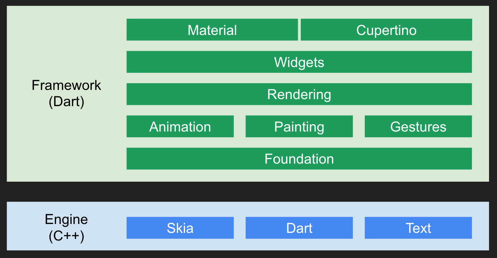
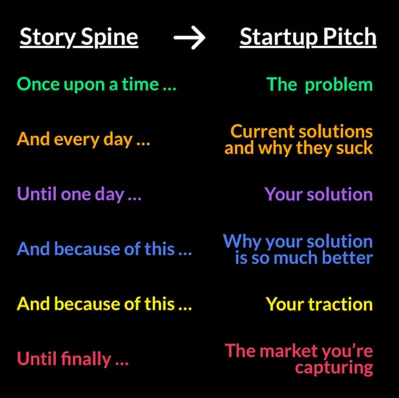
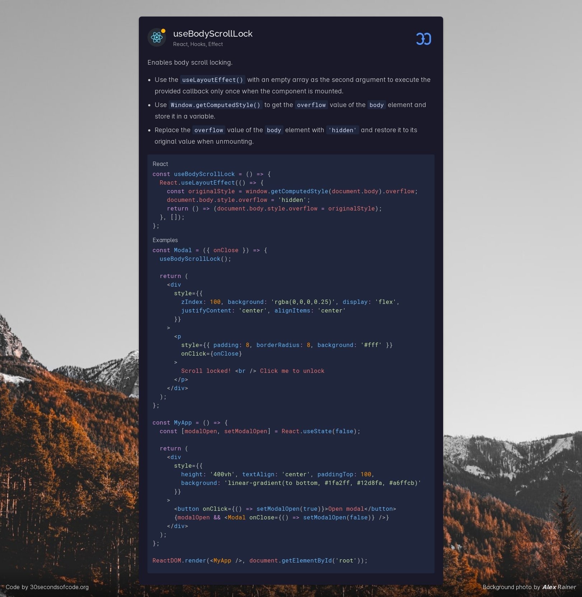
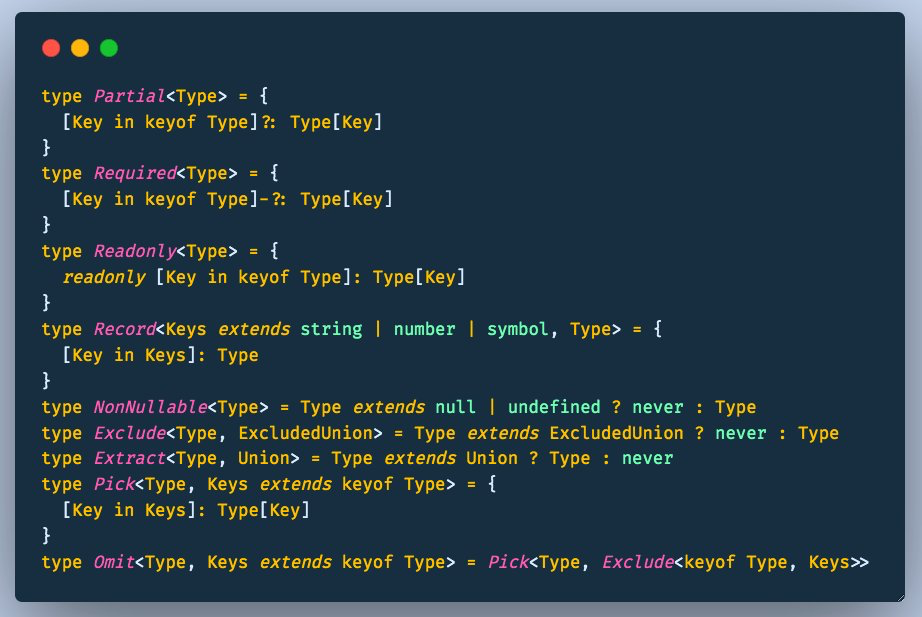

# 10

1.  每日一句分享：

    好的艺术家复制，伟大的艺术家窃取。
2.  快餐文分享：

    Generics in Go

    [https://golangweekly.com/link/114433/b69cdee624](https://golangweekly.com/link/114433/b69cdee624)

    文章介绍了泛型的基本概念，1在新版本 Golang 中的打开方式，如何借助内置约束、类型更好地使用等。

    从语法层面上看 增加了上下文的范围 且 借助泛型约束不丢失类型检查能力。

    从编译层面上看 磨平了 操作 不同布局的内存 的差异，让数据更通用。
3.  快餐文分享：

    20 Things I’ve Learned in my 20 Years as a Software Engineer

    [https://www.simplethread.com/20-things-ive-learned-in-my-20-years-as-a-software-engineer/](https://www.simplethread.com/20-things-ive-learned-in-my-20-years-as-a-software-engineer/)

    作者回顾多年工作经历，给出了 20 条团队建设，工作规划的建议，内容很直白 且 很多都是通用场景下的。
4.  快餐文分享：

    3 TypeScript Tricks I wish I knew when I learned TypeScript

    [https://www.cstrnt.dev/blog/three-typescript-tricks](https://www.cstrnt.dev/blog/three-typescript-tricks)

    文章如题，介绍了编程时使用 TS 内置泛型、unknown 的三个技巧。

    其中第一个技巧很受用，使用 Readonly 限制对入参的修改，使函数减少副作用，属于防御性编程一种很好的实践。

    编程时收益最明显的实践之一 就是 写纯函数了，不但可以明显减少 Bug，还因为其不依赖外部上下文，可以随处 Copy。
5.  快餐文分享：

    各流派React状态管理对比和原理实现

    [https://zhuanlan.zhihu.com/p/394106764](https://zhuanlan.zhihu.com/p/394106764)

    文章介绍了三种流派的状态管理库，并分别梳理了各自的核心原理，使用差异。
6.  快餐文分享：

    Safer Enums in Go

    [https://golangweekly.com/link/115001/b69cdee624](https://golangweekly.com/link/115001/b69cdee624)

    文章探索了 实现枚举的几种方式，从最简单的 iota 开始如何变得越来越完美，文末的例子虽然语义明显，但要增加更多模版代码，语义类型足够了。
7.  工具分享：

    Introducing Sapling: a VS Code Extension for Traversing React Component Hierarchy

    [https://javascript.plainenglish.io/introducing-sapling-a-vs-code-extension-for-traversing-your-react-component-hierarchy-3ac94d95887e](https://javascript.plainenglish.io/introducing-sapling-a-vs-code-extension-for-traversing-your-react-component-hierarchy-3ac94d95887e)

    文章推广了 一个 VSCode 扩展，在较大的项目中可通过自动构建 Props 依赖树的方式，帮你快速在文件中导航。 看起来是存在一定使用场景的，并足以见得编辑器扩展机制设计的合理性。

    优秀的插件机制是可以构建出生态，反哺本身的。
8.  每日一句分享：

    I think computer viruses should count as life. I think it says something about human nature that the only form of life we have created so far is purely destructive. We’ve created life in our own image.
9.  快餐文分享：

    说一说Web端侧AI

    [https://mp.weixin.qq.com/s/9PoFZVs7jiI992y6MWLqUQ#](https://mp.weixin.qq.com/s/9PoFZVs7jiI992y6MWLqUQ#)

    摘要： AI 正在不断拓展前端的技术边界， 算法的加持也为前端研发注入了全新的力量。 本文为大家介绍什么是端智能，端智能的应用场景以及 Web 端侧实现 AI 的基本原理概念。其中 Web 端的算力支撑比较有趣，GPU 有 WebGPU、WebGL，CPU 有 Webassembly，比较知名的 tensorflow 可以通过设置不同的后端来使用不同的硬件。

    虽然端 AI 目前没有优秀的产品 case，但随着终端发展逐渐多样性，用户交互逐渐趣味性，后续有可能会衍生中其使用场景。
10. 快餐文分享：

    Bringing instant page-loads to the browser through speculative prerendering

    [https://web.dev/speculative-prerendering/](https://web.dev/speculative-prerendering/)

    文章前半部分介绍了 现代 Web 标准的 prefetch prerender 机制，包括 prefetch 的行为， prerender 的实现（纤细化的 后台 render 进程）。 文中重点讲了社区中知名的两类 prefetch library，也代表了两种流派，一根据可视窗口简单粗暴加载，二根据点击频率数据加载，还有一种流派 根据用户行为比如 hover 某一链接。

    文末梳理了下实验性的一些预加载方案，包括 portal、Speculation rules。
11. 快餐文分享：

    Everything you need to know about Web Renderers in Flutter

    [https://wilsonwilson.dev/articles/flutter-web-renderers/](https://wilsonwilson.dev/articles/flutter-web-renderers/)

    文章介绍了 Flutter 的两种 Render 引擎：HTML、CanvasKit ，并分别介绍了各自的优缺点与使用场景。

    

    可以看出 HTML 中的内容 用 Canvas 完整复刻出来 还是很困难的，尤其是字体渲染的问题。并且 Flutter CanvasKit 使用的 Skia（2D图形库）应该很难支持高帧率的媒体资源。
12. 快餐文分享：

    Why I Hate Frameworks, Benji Smith.

    [https://www.fredrikholmqvist.com/pages/why-i-hate-frameworks.html](https://www.fredrikholmqvist.com/pages/why-i-hate-frameworks.html)

    今日 HN 热文，整篇文章以一种黑色幽默的对话口吻讲述了 主人公买锤子（暗指 Java 框架生态）时遇到的荒诞事情。

    很多时候，我们只需要一个简单的锤子，结果却采用了一个高级通用 可创建锤子工厂的工厂……
13. 快餐文分享：

    Building a static site generator in 100 lines of Rust

    [https://kerkour.com/blog/rust-static-site-generator/](https://kerkour.com/blog/rust-static-site-generator/)

    使用 一百行 Rust 代码创建一个简单的静态文档生成器。 文章主题与我之前翻译的一篇文章很像，NodeJS 只需要 40 行

    [https://tomotoes.com/blog/build-static-site-generator-nodejs/](https://tomotoes.com/blog/build-static-site-generator-nodejs/)
14. 快餐文分享：

    136 facts every web dev should know before they burn out and turn to landscape painting or nude modelling

    [https://www.baldurbjarnason.com/2021/100-things-every-web-developer-should-know/](https://www.baldurbjarnason.com/2021/100-things-every-web-developer-should-know/)

    一位具有25年资质的开发者 总结出来的各种建议，包括 用户体验，组织架构等等。
15. 

    讲好一个故事的基础框架。
16. 快餐文分享：

    How to schedule a task at a specific time in Go

    [https://golangweekly.com/link/115309/b69cdee624](https://golangweekly.com/link/115309/b69cdee624)

    内容如题，文中给出了一种 timer 定时 加 select 阻塞的方案。
17. React 官方最近正在重写文档：[https://beta.reactjs.org](https://beta.reactjs.org)，所有的 demo 用 hooks 重写，并增加了可视化图表与在线交互功能。
18. 好文分享：

    Optimizing resource loading with Priority Hints

    [https://web.dev/priority-hints/](https://web.dev/priority-hints/)

    文章较长，可分为三个方面。

    开头介绍了 浏览器 解析资源的优先级规则（有表格）。 然后主要梳理了，如何通过现有的能力去操控 资源优先级，优化关键路径渲染 提高 lcp，并着重强调了一些 现有能力无法覆盖的 case 。通过这些 case 引出了 importance hint 新特性。 最后讲了下新特性的 roadmap。 文章整体的脉络梳理的比较清楚，能有助我们思维发散。
19. 快餐文分享：

    Getting Started With Webpack

    [https://www.smashingmagazine.com/2021/06/getting-started-webpack/](https://www.smashingmagazine.com/2021/06/getting-started-webpack/)

    文章介绍了模块化概念在前端的体现，后面花多个章节介绍 Webpack 的基本概念，使用方式，优化配置等。
20. 快餐文分享：

    Web Performance Recipes With Puppeteer

    [https://addyosmani.com/blog/puppeteer-recipes/](https://addyosmani.com/blog/puppeteer-recipes/)

    文章介绍了如何利用无头浏览器做性能统计，客户端环境模拟等优化措施。 文章的最后一个 topic 是梳理代码中使用率报告，之前一直有个想法，想借助无头浏览器做 运行时 的 treeshaking，并非传统编译时的优化。 这个想法从理论是不可行的，因为 终端的逻辑分支、用户交互是不可被穷举的，但有些场景是可以考虑的，比如简单的海报活动。
21. 
22. 快餐文分享：

    “社科热”陷阱：年轻人热衷社科，是破圈的假象还是另类的鸡汤？

    [https://mp.weixin.qq.com/s/dC6Jm4uZkV5T-GOVYags8g](https://mp.weixin.qq.com/s/dC6Jm4uZkV5T-GOVYags8g)

    讲年轻人社科热现象的一篇文章。

    文中摘要：

    传统的鸡汤关注个体的能动性，相信努力就能成功，付出就有收获；社会科学则指出，个体在很多时候是受制于结构的，是身不由己的，人们由此为自己的困扰找到了社会层面的原因，继而把自己的境遇合理化。但，“然后呢？”

    当我们问出这一问题时，便会发现许多年轻人往往止步于此。
23. 分享一篇有关 Golang 调度器模型 GMP 原理的文章，个人认为写的很棒。

    [https://learnku.com/articles/41728](https://learnku.com/articles/41728)
24. 分享一个有趣项目：

    CookLang – Recipe Markup Language

    [https://cooklang.org](https://cooklang.org)

    看看极客是怎么整理菜谱的……
25. 好文分享：

    Building an effective Image Component

    [https://web.dev/image-component/](https://web.dev/image-component/)

    一篇介绍图片资源优化的综述文。 文章先介绍了图片在页面性能中的权重，未优化的图片对 LCP 造成影响。 然后抛出了图片优化时的一些难点，并借此引出文章的主角 NextJs Image 组件，一个开箱即用的解决方案。 随后重点讲其优化措施，以及面对开发者时 如何在开发体验与性能保障 中取衡。

    文章暴露的问题很明显，不管怎样 性能优化 都要侵入开发层，开发者都要承担其带来的心智成本，关于图片组件优化，理论上可以在编译时 通过 babel plugin 去替换。 理想场景是开发者不必关心媒体资源的优化。

    关于之前提到的 使用 babel 插件做图片格式优化（比如 png 换成 webp、avif 以减轻页面的资源体积），主要是为了将 img native element 换成 一个 集成多种优化方案的 Image 组件。

    但该方案需要侵入开发层，个人开发还好，但团队开发中 制定开发规范是很难推进的。

    如果让开发者无需承载任何心智成本，优化措施就需要集成在运行时。 我们优化的目标就是 Image DOM，而该对象代表的就是 HTMLImageElement。

    那么刚刚说的图片格式替换 的优化措施如下，借助 Proxy、Reflect 做到动态图片资源拦截。

    .png>)

    当然 这也需要静态资源 cdn 边缘计算能力，或者 图片资源打包时的下一代格式的处理。

    .png>)

    可以看到 收益非常明显。
26. 每日一句分享：

    张潮在《幽梦影》中说：“人莫乐于闲，非无所事事之谓也。闲则能读书，闲则能游名胜，闲则能交益友，闲则能饮酒，闲则能著书。天下之乐，孰大于是？”
27. 

    常见的工具类型。
28. 
29. 好文分享：

    Which Programming Languages Use the Least Electricity?

    [https://thenewstack.io/which-programming-languages-use-the-least-electricity/](https://thenewstack.io/which-programming-languages-use-the-least-electricity/)

    编程语言之间的能量消耗，运行时间，内存占用分析比较。 通过多种程序的 benchmarks 测试，研究者发现 运行时间与能量消耗并不成正相关，但有种趋势是 在大部分场景下 解释型语言的能量消耗，内存占用往往高于编译型语言。在语言范式方面，则是命令式更高，fp oop 都不敌。 导致这些结论的原因也很明了，毕竟慢的语言、范式都是更高一层的抽象，应了那句杨学：复杂度不会凭空消失，只会被转移。
30. Podcast 分享：

    聊聊音视频技术

    [https://podcasts.apple.com/us/podcast/ggtalk/id1440443653?i=1000455980416](https://podcasts.apple.com/us/podcast/ggtalk/id1440443653?i=1000455980416)

    两年前的一期播客，很多知识依旧受用，介绍了 音视频技术主要包括的内容，对音视频技术的思考和未来前景的分析。

\
