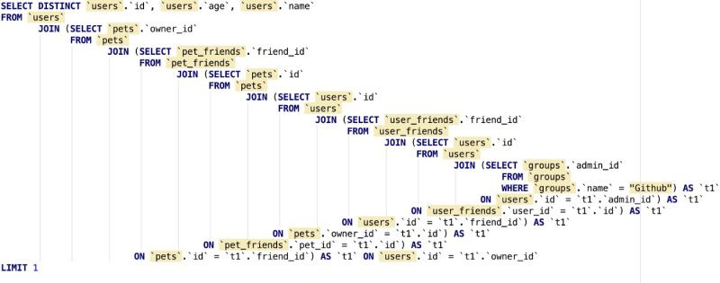
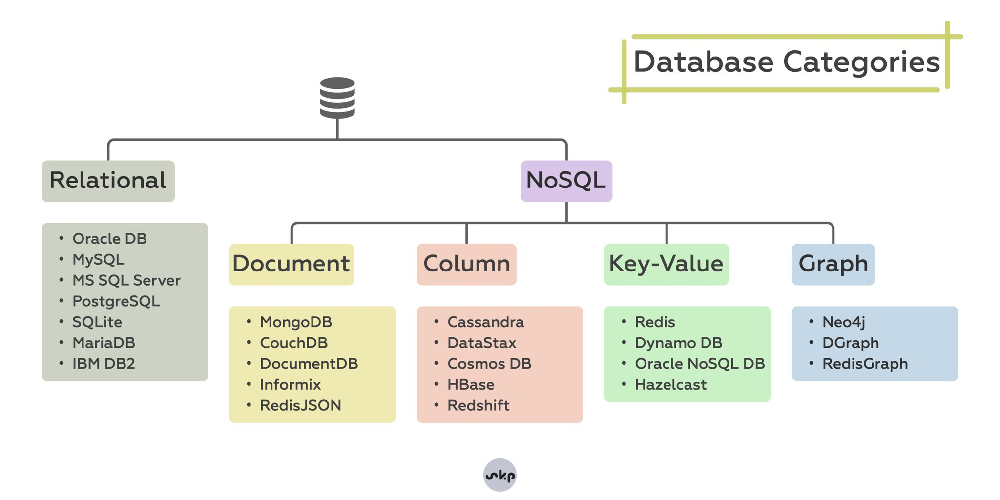
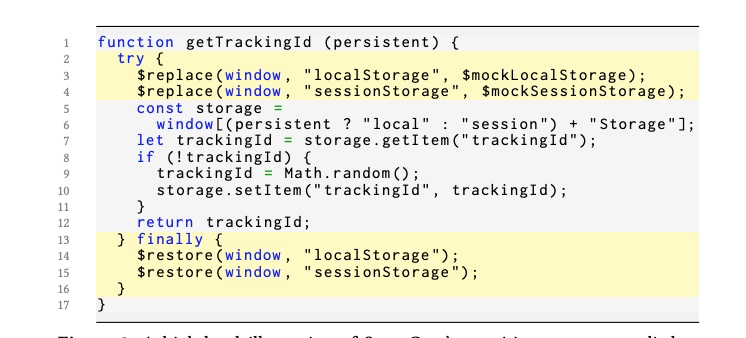

# 11

1.  每日一句分享：

    The metaverse is bullshit because it already exists, and it's called the internet.
2.  快餐文分享：

    我们一起学习CSS image-set()

    [https://www.zhangxinxu.com/wordpress/2019/11/css-image-set/](https://www.zhangxinxu.com/wordpress/2019/11/css-image-set/)

    来自张鑫旭老师的一篇文章，文中采用对话风格，读起来很有趣。 在图片资源优化中，如果只优化 img 元素是不够的，还需要处理另一个图片加载入口 css url 函数。在图片格式兼容中常见的一种方式是使用 picture 元素（不兼容低端机型）承载兜底图，而 css 代表的则是 image-set 属性。

    实践时，可以通过 postcss 插件 来处理。
3.  分享个有趣的项目：

    MangoDB - A truly Open Source MongoDB alternative

    [https://www.mangodb.io/](https://www.mangodb.io)

    因为 MongoDB 放弃了开源协议，所以社区的替代品出现了。 其技术原理非常有趣，它并不是完全自研的数据库，而是基于 PostgreSQL 做的上层SQL 命令 transform，把 orm 那一套封装到了 db。

    发现 orm 的演进方向有两种，一种是 DB 概念透传，比如 gorm，一种是无视 DB 概念，即你可以在传统 SQL 数据库上 做图数据库，文档数据库的事情，比如 Ent。

    由于复杂度守恒定律，后一种高度抽象的 Orm ，生成的 sql 会比较复杂，效率低。

    
4.  分享几篇美团技术博客 产出的性能优化文章：

    其中既有宏观上的综述类文章，比如系统性工程、前端专项的优化措施梳理（1，2）；也有微观上 针对具体场景的探索，比如 Webview、预渲染技术 探讨（3，4）。 这些文章都很值得一看，可以帮我们完善思维框架。

    1.  境外业务性能优化实践

        [https://tech.meituan.com/2018/01/19/overseas-business-performance-optimization-practice.html](https://tech.meituan.com/2018/01/19/overseas-business-performance-optimization-practice.html)
    2.  美团金融平台Web前端技术体系

        [https://tech.meituan.com/2018/03/16/front-end-web-architecture.html](https://tech.meituan.com/2018/03/16/front-end-web-architecture.html)
    3.  WebView性能、体验分析与优化

        [https://tech.meituan.com/2017/06/09/webviewperf.html](https://tech.meituan.com/2017/06/09/webviewperf.html)
    4.  构建时预渲染：网页首帧优化实践

        [https://tech.meituan.com/2018/11/15/first-contentful-paint-practice.html](https://tech.meituan.com/2018/11/15/first-contentful-paint-practice.html)
5.  分享个有趣的项目：

    ct.css

    [https://github.com/csswizardry/ct](https://github.com/csswizardry/ct)

    通过 css selector 将 head 里阻塞关键路径渲染的资源打印在页面，源码值得一看。
6.  快餐文分享：

    How Partytown's Sync Communication Works

    [https://dev.to/adamdbradley/how-partytown-s-sync-communication-works-4244](https://dev.to/adamdbradley/how-partytown-s-sync-communication-works-4244)

    介绍 Partytown 系列的第二篇文章，该文先是点出了 传统 postMessage 不能胜任其通信场景的问题，然后主要介绍了 WebWorker 同步通信的黑魔法。 简单来说，借助 Ajax 做到 worker 发出、收到消息的同步，但消息会经过 Service Worker proxy ，最终走 postMessage 异步。 感兴趣的同学可以读下源码，设计得还是挺有想法的。

    [https://github.com/BuilderIO/partytown](https://github.com/BuilderIO/partytown)
7.  工具分享：

    Modern Unix

    收集了常见 unix 命令的现代替代品，列举得还挺全的。

    [https://github.com/ibraheemdev/modern-unix](https://github.com/ibraheemdev/modern-unix)
8.  快餐文分享：

    HOW TO LEARN COMPILERS: LLVM EDITION

    [https://lowlevelbits.org/how-to-learn-compilers-llvm-edition/](https://lowlevelbits.org/how-to-learn-compilers-llvm-edition/)

    文章总结了一些学习资源，从 AST to IR to Machine code 的路径上进行拆分，分门别类的 从三个方面：前端 中端 后端 推荐。
9.  每日一句(误)分享：

    页面性能瓶颈 是要分运行环境的。

    在浏览器最大的瓶颈是单线程模型, 这就是为什么 React 16 提出了 fiber 架构，将组件树渲染过程 增量化。 在跨端 比如小程序、RN、hybrid 的性能瓶颈 除了渲染成本，还有线程通信, 这时 vdom 就起了作用, 可以将多次通信 批量化。

    想要优化 最直接的解决方法是去掉 程序运行时的成本，把运行时的消耗分摊在编译时，比如 Svelte 框架主打的想法。

    除了架构上的优化，更多的是与运行时环境相关，这种场景的优化方案很多了，根据环境一般区分两种：

    1.  Web

        用之前看到的一篇文章举例：

        How to Eliminate Render-Blocking Resources: a Deep Dive

        [https://sia.codes/posts/render-blocking-resources/](https://sia.codes/posts/render-blocking-resources/)

        该篇文章属于页面性能方向，一开始介绍了 页面的关键渲染路径是什么，其重要性(用户体验，页面性能，SEO)。 然后通过梳理渲染路径，找出可能阻塞渲染中的资源(CSS，JS-Maybe)并给出造成阻塞的原因，文章后半部分主要围绕着借助 Lighthouse 发现问题，并解决问题来进行。
    2.  Hybrid

        常规 Hybrid 的性能是一定大于 Web 性能指标的，很明显 Hybrid 有 Webview 创建的时间，一般会比 Web 的 FCP 大 70-800 ms，但如果优化的足够，就可以在 后台 prerender，达到页面秒开的假象。 这里的优化措施也较明显，preload webview 就好了，参考 东软的专利

        [https://patents.google.com/patent/CN106250434A/zh](https://patents.google.com/patent/CN106250434A/zh)。

    除了框架与常见优化外，现在社区有一种新趋势出现，那就是 flutter web 为代表的 canvaskit 渲染(基于 2d 图形库 skia)，但项目初衷 for cross platform，对 performance 有多大正向收益，社区没有这方面的声音，美团官方有产出一篇文章，可以看出并无明显的性能收益。

    FlutterWeb在美团外卖的实践

    [https://tech.meituan.com/2021/03/18/flutterweb-in-meituanwaimai.html](https://tech.meituan.com/2021/03/18/flutterweb-in-meituanwaimai.html)
10. 快餐文分享：

    Developer Tools secrets that shouldn’t be secrets

    [https://christianheilmann.com/2021/11/01/developer-tools-secrets-that-shouldnt-be-secrets/](https://christianheilmann.com/2021/11/01/developer-tools-secrets-that-shouldnt-be-secrets/)

    Edge devtool pm 的一篇文章，介绍了下常见 devtool 的一些用法。 其中一条 tip 是使用 snippet 从端上注入脚本。 想到一点是，移动端应用可以通过签名检查防止 反编译，比如 ios 的 公证机制，那 web 端有没有可能做到呢？ 想到一种可能，通过加载后的 dom tree 可以做下快照（预期与实际渲染）对比，然后对比逻辑需要混淆埋到代码中。
11. 快餐文分享：

    Deep dive into Node.js Architecture

    [https://dev.to/altamashali/deep-dive-into-nodejs-architecture-5190](https://dev.to/altamashali/deep-dive-into-nodejs-architecture-5190)

    一篇介绍 NodeJS EventLoop 的文章，有些偏理论，涉及到 os 层面时 libuv 一笔带过了。

    简单来说，Eventloop 分为三个层面，libuv 只是最上面的应用层，还有内核层与硬件层。 内核层上，os 提供了很多 bio 的机制，比如 select，poll，epoll，或者 信号等。 这些调用对应到 硬件层都绕不开中断，cpu 芯片上的一个引脚，可以让 os 进入到 ring0 处理相应程序。
12. 分享一个开源的浏览器自动化工具：

    [https://www.producthunt.com/posts/automa-2](https://www.producthunt.com/posts/automa-2)

    看起来功能很惊艳，通过拖拽 可视化的节点 完成工作流。
13. 每日一句分享：

    "A computer would deserve to be called intelligent if it could deceive a human into believing that it was human" — Alan Turing, Computer scientist
14. 快餐文分享：

    Rust Is The Future of JavaScript Infrastructure

    [https://leerob.io/blog/rust](https://leerob.io/blog/rust)

    一篇介绍 rust 的软文，列举了 rust 对 js 生态的一些贡献，可弥补哪些生态中缺失的缺失。
15. 惊讶系列分享：

    How To Make A CPU - A Simple Picture Based Explanation

    [https://blog.robertelder.org/how-to-make-a-cpu/](https://blog.robertelder.org/how-to-make-a-cpu/)

    虽然我看不懂，但我大为震撼。
16. 快餐文分享：

    What is the async disposer pattern in Javascript

    [https://advancedweb.hu/what-is-the-async-disposer-pattern-in-javascript/](https://advancedweb.hu/what-is-the-async-disposer-pattern-in-javascript/)

    文章较基础，讲了一种抽象 生命周期相关逻辑 的编程模式。
17. 快餐文分享：

    JEP draft: Virtual Threads (Preview)

    [https://openjdk.java.net/jeps/8277131](https://openjdk.java.net/jeps/8277131)

    OpenJDK 提供用户级线程，该来的终于来了。 可以看出它的实现原理，宏观上与常见的调度程序很像：The JDK implements virtual threads by storing their state, including the stack, on the Java heap. Virtual threads are scheduled by a scheduler in the Java class libraries, whose worker threads mount virtual threads on their backs when the virtual threads are executing, thus becoming their carriers. When a virtual thread parks -- say, when it blocks on some I/O operation or a java.util.concurrent synchronization construct -- it suspends, and the virtual thread's carrier is free to run any other task. When a virtual thread is unparked -- say, by an I/O operation completing -- it is submitted to the scheduler, which, when available, will mount and resume the virtual thread on some carrier thread, not necessarily the same one it ran on previously. In this way, when a virtual thread performs a blocking operation, instead of parking an OS thread, it is suspended by the JVM and another one scheduled in its place, all without blocking any OS threads……

    值得一提的是，openJDK 并没有提出新的语法，而是放到了 Thread 类中，算是最小程度的修改了。
18. 快餐文分享：

    Types of parser combinators

    [https://sgt.hootr.club/molten-matter/types-of-parser-combinators/](https://sgt.hootr.club/molten-matter/types-of-parser-combinators/)

    一篇赞赏 combinator 的文章，文章先是介绍了 parser 在程序中的通用性，后面主要描绘了 highly composable 在 coding 时的好处。
19. 产品分享：

    Layout patterns

    [https://web.dev/patterns/layout/](https://web.dev/patterns/layout/)

    A collection of layout patterns built using modern CSS APIs that will help you build common interfaces such as cards, dynamic grid areas, and full-page layouts.
20. 快餐文分享：

    What's new in Kotlin 1.6.0&#x20;

    [https://kotlinlang.org/docs/whatsnew16.html](https://kotlinlang.org/docs/whatsnew16.html)

    文章概括了 Kotlin 16 的 新特性 & change-release 。 其中包括 when 使用场景的提升，模式匹配能力更强；suspend 类型标注更广泛等。
21. Podcast 分享：

    AsyncTalk - 前端的工程化

    [https://podcasts.apple.com/cn/podcast/asynctalk/id1590369272?i=1000542344921](https://podcasts.apple.com/cn/podcast/asynctalk/id1590369272?i=1000542344921)

    播客的主题是关于前端工程化的问题，以及对未来的展望，如何身体力行地去参与创建下一代前端。内容主要三个部分 —— 开发，部署，运维。
22. 
23. 快餐文分享：

    Tmux使用手册

    [http://louiszhai.github.io/2017/09/30/tmux/](http://louiszhai.github.io/2017/09/30/tmux/)

    tmux 是一款优秀的终端复用软件，文章详细介绍 tmux 的使用技巧，配置方式(比我看过的所有文章都更详细)。

    如果不想这么复杂，可以试试 oh-my-tmux，内置了很多开箱即用的配置。

    A: 要有个大屏幕会好一些, 笔记本就别用了,费眼。共享session的特性 , 挺适合交流的。 B: split window 只是 tmux 一个特性而已,复用 session 才是主要功能.

    并且还可以借助 session 管理工具 做到工作流自动化.. 就比如开发时 经常会开启项目相关的 服务器, 编辑器, 本地监控, 某服务的 repl...

    使用 tmuxinator 这种工具 都可以将这些流程自动化.. 一条命令就搞定.
24. 快餐文分享:

    Improve Your Workflow in the Terminal with These fzf Tips

    [https://revelry.co/resources/development/terminal-workflow-fzf/](https://revelry.co/resources/development/terminal-workflow-fzf/)

    文章介绍了三个使用 fzf 的函数, 通过其模糊匹配窗口交互方式,提升在终端的生活质量. fzf 官方也维护了一份常见的例子,感兴趣的同学可以点开看看.

    [https://github.com/junegunn/fzf/wiki/Examples](https://github.com/junegunn/fzf/wiki/Examples)
25. 如何安全地网上冲浪……

    
26. 快餐文分享：

    Only 90s Web Developers Remember This

    [https://zachholman.com/posts/only-90s-developers/](https://zachholman.com/posts/only-90s-developers/)

    文章列举了一些古老的前端开发时的代码，正如标题仅有 90 年代的开发者知道…
27. 快餐文分享：

    How JavaScript engines achieve great performance

    [https://blogg.bekk.no/how-javascript-engines-achieve-great-performance-fb0b36601557](https://blogg.bekk.no/how-javascript-engines-achieve-great-performance-fb0b36601557)

    一篇介绍 V8 编译时优化的文章。包括 V8 的执行原理，hot code 生成时机，对象后 隐藏类的数据结构 以及访问时的内联缓存的优化，还有常见的代码内联机制。 文中有一段话说的很让我认同。

    Think about it. There is no type information. Every single object can gain and lose properties over the lifetime of the program. There are six(!) different kinds of falsy values, and every number is a 64-bit float. As if that wasn’t enough, JavaScript is expected to execute quickly, so you can’t spend a lot of time analyzing and optimizing it either. And yet, JavaScript is fast.
28. 快餐文分享：

    Golang 编程思维和工程实战

    [https://mp.weixin.qq.com/s/llmE9QpnrvA02AtvfHtqJQ](https://mp.weixin.qq.com/s/llmE9QpnrvA02AtvfHtqJQ)

    文章总结一些常见的编程实战技巧，文中多次使用“优雅” 我是不赞同的，Golang 的优雅只能相对于裸命令式的语言而言..
29. 好文分享：

    Is my cat Turing-complete?

    [https://belaycpp.com/2021/11/24/is-my-cat-turing-complete/](https://belaycpp.com/2021/11/24/is-my-cat-turing-complete/)

    一篇十分有趣的文章，作者用严谨的论据证明了 他的小猫咪🐱是图灵完备的。 实际上 作者是想强调开发时不要滥用新特性，指 C++..
30. 快餐文分享：

    Welcome to Fleet!

    [https://blog.jetbrains.com/blog/2021/11/29/welcome-to-fleet/](https://blog.jetbrains.com/blog/2021/11/29/welcome-to-fleet/)

    Jetbrains 终于推出一款主打轻量级 对标VSCode 的编辑器，基于 jvm 与 部分 Rust，算是 VSCode native 了……
31. 快餐文分享：

    Defer non-critical CSS

    [https://web.dev/defer-non-critical-css/](https://web.dev/defer-non-critical-css/)

    一直以来 页面关键渲染路径 是影响页面性能的核心因素之一。其中 资源加载的优先级非常重要，虽然 google 最近推出了 lint importance 但距离落地还是有一段时间的，那么现阶段如何手动处理呢？文章给出了一种延迟加载 CSS 不阻塞路径的方案，使用起来比较简单。

\
