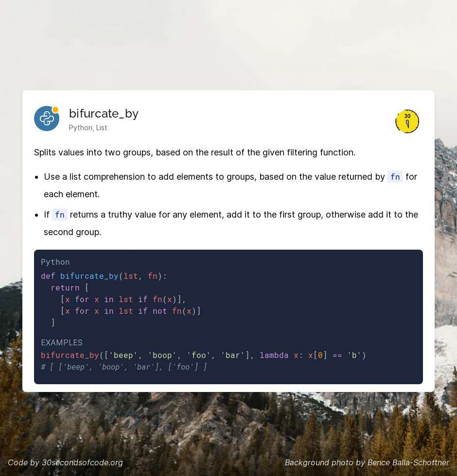
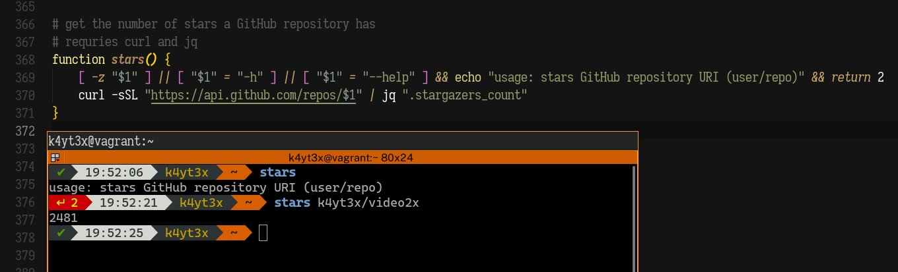

# 1-6

1. 程序员招聘月刊：谁在招人？（2021年2月）

   [https://mp.weixin.qq.com/s/R5KrtXbQ-p2jHEAJmV-taQ](https://mp.weixin.qq.com/s/R5KrtXbQ-p2jHEAJmV-taQ)

2. 漫画 \| CPU战争40年，真正的王者终于现身!

   [https://mp.weixin.qq.com/s/ARmVvuRR8bwmo3Dm1\_mJLA](https://mp.weixin.qq.com/s/ARmVvuRR8bwmo3Dm1_mJLA)

3. 好文分享:

   为什么 Linux 需要 Swapping

   [https://mp.weixin.qq.com/s/sf9G13Lp0LNm\_CvFzDYGaA](https://mp.weixin.qq.com/s/sf9G13Lp0LNm_CvFzDYGaA)

4. 如果 CPU 访问 L1 缓存需要 1 秒，那么访问主存需要 3 分钟、从 SSD 中随机读取数据需要 3.4 天、磁盘寻道需要 2 个月，网络传输可能需要 1 年多的时间。
5. 为什么 Linux 默认页大小是 4KB

   [https://mp.weixin.qq.com/s/rz5H5\_kKul-H1Z8u0aYGcg](https://mp.weixin.qq.com/s/rz5H5_kKul-H1Z8u0aYGcg)

6. 多线程下载大文件速度更快的原因，到底是什么？

   [https://mp.weixin.qq.com/s/7xQfO663MrnTHYDeFXUZSQ](https://mp.weixin.qq.com/s/7xQfO663MrnTHYDeFXUZSQ)

   多线程下载单个文件并不一定优于单线程下载单个文件。

   任何一台机器都有一个实时网络最大可用带宽。

   而机器实时抢占带宽是永远小于实时网络最大可用带宽\(TCP 重传机制\)。

   而之所以广义上，多线程下载优于单线程下载，就是因为单线程触发重传时 小于多线程平均重传的下载速率。

   假如机器使用的不是传统流量调度算法 而是BRP算法，那么多线程下载的优势 就体现不出来了。

   A: 百度网盘\[破涕为笑\]神一样的限速

   B: 哈哈哈，百度网盘： 别和我提多线程，brp 不好使

   C: 我刚在掘金看到一个百度云网盘多线程下载的 还没实验呢🌚

   Java实现大文件多线程下载，提速30倍！想学？我教你啊 [https://juejin.cn/post/6908867438624899079](https://juejin.cn/post/6908867438624899079)

   B: 这个可行，多线程下载 就适合单点限速。

7. Question: 怎么将不同技术栈的页面组合在一个页面，且不存在样式冲突，数据冲突。

   具体场景是，一个 vue 搭建的页面，一个 react 搭建的页面，继承进其他页面这样。

   这其实就是一道典型的前端面试题，考你的知识广度与深度。 只不过是我出的。

   Answer:

   1. Iframe
   2. Web components
   3. 构建时，打包多个子应用
   4. 微件化，远程 load js chunk

8. sudo=速冻 cd=吃的 ls=零食 ps=披萨 ssh=熟食 scp=水产品
9. alias please=sudo
10. 上上周分享条数 71 上周分享条数 51 这周分享条数 29

    哎, 一次比一次懈怠了..

    1. 工作太占据时间
    2. 最近不爱读文章了, 换成了读书
    3. 自身问题影响

    上周分享聚合: [https://thinking.tomotoes.com/archives/2021/1/24-31](https://thinking.tomotoes.com/archives/2021/1/24-31)

11. Chrome 88 支持新的 CSS 属性`aspect-ratio`，可以设置容器的长宽比。

    这么常见的UI构建功能，现在才出现...

    

12. 漫画 \| 轻松写意了解一下Linux 内核的真面目

    [https://mp.weixin.qq.com/s/RySLif5-dZRVpiNGcdbZ2w](https://mp.weixin.qq.com/s/RySLif5-dZRVpiNGcdbZ2w)

13. 

    喜欢列表生成器的语义

14. 抖音支付：帝国的缝合线

    [https://mp.weixin.qq.com/s/Bl3jqK27YzCNtcFwF0WoSw](https://mp.weixin.qq.com/s/Bl3jqK27YzCNtcFwF0WoSw)

15. 网易云音乐：关于给酷狗音乐相关团队申请年终奖励的建议

    [https://mp.weixin.qq.com/s/LPB6GffoosdD4M92fG5NlA](https://mp.weixin.qq.com/s/LPB6GffoosdD4M92fG5NlA)

    A: 哈哈哈，撕起来了

    B: 太刚了

    A: 狗化 可太秀了，哈哈哈

    C: qq音乐用户表示吃瓜

    D: 网易云音乐：关于取消酷狗音乐相关团队年终奖励的建议

    [https://mp.weixin.qq.com/s/PxoggRcAHMwEjuDM-co-NQ](https://mp.weixin.qq.com/s/PxoggRcAHMwEjuDM-co-NQ)

    大阴阳师又发文了

    A: 哈哈哈 搞活能手

16. 如何管理自己的时间资产

    [https://mp.weixin.qq.com/s/AeqtxDmtgIkKzEbcMyZh3Q](https://mp.weixin.qq.com/s/AeqtxDmtgIkKzEbcMyZh3Q)

17. 好文分享:

    为什么 TCP 会被 UDP 取代

    [https://mp.weixin.qq.com/s/BGWkvLl0AAx9slI1lSZMgw](https://mp.weixin.qq.com/s/BGWkvLl0AAx9slI1lSZMgw)

18. 被马斯克一夜引爆的Clubhouse，到底是怎么回事？ [https://www.huxiu.com/article/407961.html](https://www.huxiu.com/article/407961.html)

    等一波国内竞品

    A: 打个赌，不出一个月，国内必有一个打着高知社区为主的特色版clubhouse出现。

    Club house 国内的下一个泡沫…

    B: 感觉只是一阵风，不会成为主流社交方式，甚至跟 yy 十几年前的模式有点像

    C: 感觉就是玩的一阵新鲜

    D: 没邀请码到现在都没进去看过啥样

    A: 会被炒一阵的 现象级应用资本不会放过

    A: 出现了 clubhouse 复刻品 [https://github.com/bestony/neshouse](https://github.com/bestony/neshouse) NESHouse.com —— An open source implementation of ClubHouse

19. 分享篇文章： Ruby 编程语言入门 [https://hutusi.com/articles/ruby-quickstart](https://hutusi.com/articles/ruby-quickstart)

    ```text
    一些我欣赏的特性：
    ​
    a = []
    a << 1        # [1]
    a << 2 << 3   # [1, 2, 3]
    ​
    a = [1, 2, 3, 4, 5]
    a[-2]         # 4, 负数下标从最后一个倒数
    ​
    # 获取子数组 切片
    a[1, 2]       # [2, 3] 第一个下标数字表示起始下标，第二个表示子数组长度
    a[1, 0]       # [] 
    a[0...-1]     # [1, 2, 3, 4]
    ​
    3.times { action }
    ​
    a << 1 这种命令式的符号表达 看起来挺好玩的。
    ```

20. Shell的魅力

    

    A: jq 不会是 jquery 吧。？

    B: 不是 Go写的 查询 json 的一个知名工具

21. 换一个角度分析，网页性能优化

    [https://mp.weixin.qq.com/s/o8HOvYfUNUKPGydSak1mxA](https://mp.weixin.qq.com/s/o8HOvYfUNUKPGydSak1mxA)

22. 如何打造一款游戏外挂

    [https://mp.weixin.qq.com/s/yd20\_S8eql6r4N3yLkGbYA](https://mp.weixin.qq.com/s/yd20_S8eql6r4N3yLkGbYA)

23. A: 现在国内Android开发主流语言是kotlin了嘛

    B: 双混合

    A: 这样不太好吧 像是团队之间互不妥协的结果..

    B: 不过kotlin快成主流了，好多都转了

    A: 嗯呐，好事…

    B: 不过感觉kotlin还是需要时间 毕竟android framework是java开发的 处在这个很尴尬的地步

    A: 是不是，kt 除了 语法层面，没什么提升呢？

    B: 我感觉，比java用起来方便简洁，好像别的没感觉哈哈 就凭它基于jvm

    A: 生态兼容吗..

    B: 兼容的一批 %100共通，可以相互调用

    A: 哇，可以的 底层都是class字节码吧

    如果从底层打通，编译时 混在一起，那就剩下语言隔离了

    B: 是啊，最后编译源文件都是.class

    编译时可以混在一起使用啊.

    都编译成class文件嘛，天然的兼容性，就是项目里可以有java类也可以有.kt类

    定义的类都能互相调用

    还不摆脱不了jvm，要是能摆脱jvm 就是android主流语言了哈哈哈

    A: 哇，这么爽

    C: 字节安卓新项目都是kt了 很香 反观iOS

    A: 之前看过 kotlin 通过内部dsl 写gui 那酸爽

    B: Anko？哈哈哈 kt史上最强框架名不虚传

    A: 算得上让我惊讶系列的技术了

    B: 但是我感觉还是习惯了xml铺布局，写代码生成布局还得写代码哈哈哈

24. NoSQL ：一个帝国的崛起

    [https://mp.weixin.qq.com/s/JedHtkVNklyfs0-viCLLPA](https://mp.weixin.qq.com/s/JedHtkVNklyfs0-viCLLPA)

25. Java的战争

    [https://mp.weixin.qq.com/s/21eCFfRZYyTstnw777-Fhg](https://mp.weixin.qq.com/s/21eCFfRZYyTstnw777-Fhg)

26. Go 语言网络轮询器的实现原理

    [https://mp.weixin.qq.com/s/wwyxfWrvNMRhB1fLrZQRww](https://mp.weixin.qq.com/s/wwyxfWrvNMRhB1fLrZQRww)

27. 调度系统设计精要

    [https://mp.weixin.qq.com/s/R3BZpYJrBPBI0DwbJYB0YA](https://mp.weixin.qq.com/s/R3BZpYJrBPBI0DwbJYB0YA)

    调度系统其实就是调度器（Scheduler），我们在很多系统中都能见到调度器的身影，就像我们在上面说的，不止操作系统中存在调度器，编程语言、容器编排以及很多业务系统中都会存在调度系统或者调度模块。这些调度模块的核心作用就是对有限的资源进行分配以实现最大化资源的利用率或者降低系统的尾延迟，调度系统面对的就是资源的需求和供给不平衡的问题。

    在操作系统的进程调度器中，待调度的任务就是线程，这些任务一般只会处于正在执行或者未执行（等待或者终止）的状态；而用于处理这些任务的 CPU 往往都是不可再分的，同一个 CPU 在同一时间只能执行一个任务，这是物理上的限制。简单总结一下，操作系统调度器的任务和资源有以下特性： 任务 —— Thread 状态简单：只会处于正在执行或者未被执行两种状态； 优先级不同：待执行的任务可能有不同的优先级，在考虑优先级的情况下，需要保证不同任务的公平性； 资源 —— CPU 时间 资源不可再分：同一时间只能运行一个任务；

    除了操作系统和编程语言这种较为底层的调度器之外，容器和计算任务调度在今天也很常见，Kubernetes 作为容器编排系统会负责调取集群中的容器，对它稍有了解的人都知道，Kubernetes 中调度的基本单元是 Pod，这些 Pod 会被调度到节点 Node 上执行： 任务 —— Pod 优先级不同：Pod 的优先级可能不同，高优先级的系统 Pod 可以抢占低优先级 Pod 的资源； 有状态：Pod 可以分为无状态和有状态，有状态的 Pod 需要依赖持久存储卷； 资源 —— Node 类型不同：不同节点上的资源类型不同，包括 CPU、GPU 和内存等，这些资源可以被拆分但是都属于当前节点； 不稳定：节点可能由于突发原因不可用，例如：无网络连接、磁盘损坏等；

28. JVM 三种模式：解释执行；JIT编译执行；JIT编译与解释混合执行（主流JVM默认执行模式）。混合执行模式的优势在于解释器在启动时先解释执行，省去编译时间 JIT动态编译：将热点代码转换成机器码，直接交给CPU;JIT的作业是将Java字节码动态地编译成可以直接发送给处理器指令执行的机器码。

    V8 执行 JS 也是相似的流程。

    都是从解释向编译的过程。

    解释执行后获取到的信息反哺 编译机器码的过程。

29. 垂直社区也许是个伪命题 [https://m.tmtpost.com/4968506.html](https://m.tmtpost.com/4968506.html)

    垂直社区，固然在转化率上更高，但也注定了甲方来源会非常集中。短期看没感觉，但时间一旦拉长，这可能会是一个问题。新用户增长一旦停滞，老用户都买过你的产品了，那转化率依然会下跌。

    简单来说，垂直社区的初期商业化好做，但天花板很快就会出现。

    大平台上的垂类博主靠着高人气高流量快速商业化后进一步加强内容深耕，最后压过你垂直社区。

    A: 说的很有道理

    B: 赞一个，泛化大众化直到平台庞大，流量至上，虽然有些不一定质量高，但是流量够了也好商业化了

30. A: 我真的很羡慕基建 可以纯粹搞技术

    B: 能真正纯粹搞技术的岗位很少的，脱离了业务，技术敏锐度也会下降的

31. 每日一句分享: 乡下人最好的出路就是出走。
32. 没错，我们和美帝的差距就是这么大

    [https://mp.weixin.qq.com/s/6Fw-OlqR1400iTLnSc-lwg](https://mp.weixin.qq.com/s/6Fw-OlqR1400iTLnSc-lwg)

    可以衍生为 应用技术与科学技术的主题。

33. 分享篇文章: 5 React Custom Hooks You Should Start Using \(Explained\) [https://dev.to/alterclass/5-react-custom-hooks-you-should-start-using-explained-5d18?utm\_source=digest\_mailer&utm\_medium=email&utm\_campaign=digest\_email](https://dev.to/alterclass/5-react-custom-hooks-you-should-start-using-explained-5d18?utm_source=digest_mailer&utm_medium=email&utm_campaign=digest_email)

    文章写得挺好的，建议阅读。

34. 分享篇文章： 多线程高并发学习之并发容器 [https://segmentfault.com/a/1190000039163739](https://segmentfault.com/a/1190000039163739)

    文章比较浅，介绍了 Java 中常见的并发容器 和一些基本原理。

    基本上常见的保持一致性的策略： cas\(Compare And Swap\): 原子操作，系统级。基本很多语言都有 Atmoic 提供 cow\(Copy on Wirte\): 乐观锁，读写锁的底层机制

    一些与语言相关的同步机制就不介绍了

35. 分享篇文章： DDD实现之路 [https://insights.thoughtworks.cn/path-to-ddd/](https://insights.thoughtworks.cn/path-to-ddd/)

    A: 文章看了两三遍，其中的一些概念还是没有很好理解。

    看不懂的都是好文...

    B: 知乎上有个人一直在推DDD 看不懂根本

    A: 架构设计的领域，需要场景支持。 没有经验 很难理解他的概念。

36. 分享一个编写时序图的工具: swimlanes.io

    A: 整个过程，用文字描述即可生成对应的图，非常方便。

    B: 怎么有点像 mermaid.js ?

    A: 这个库好强啊..

37. 你不知道的 Proxy

    [https://mp.weixin.qq.com/s/SN8HqiGA30-IJ7OZ3WMr3g](https://mp.weixin.qq.com/s/SN8HqiGA30-IJ7OZ3WMr3g)

38. 分享个软件, 用了好几天了~ [https://github.com/zenghongtu/PPet](https://github.com/zenghongtu/PPet) 在你的桌面放一个萌妹子，多一点趣味~（支持Mac、Win和Linux）

    之前我的网站还搞过这个 live2d 的模型~ 每天看两眼都很开心

39. 分享篇文章: 手撸一个静态文档生成器\[译\] [https://tomotoes.com/blog/build-static-site-generator-nodejs/](https://tomotoes.com/blog/build-static-site-generator-nodejs/)

    如果你还没个人网站的话, 可以参考这篇文章 构建一个简单的生成器.

40. B: 2020美团技术年货-合集：[http://dpurl.cn/uuHl2zr](http://dpurl.cn/uuHl2zr) 2020美团技术年货-前端篇：[http://dpurl.cn/1Ri23Fo](http://dpurl.cn/1Ri23Fo) 2020美团技术年货-后台篇：[http://dpurl.cn/CcyQ7Ai](http://dpurl.cn/CcyQ7Ai) 2020美团技术年货-算法篇：[http://dpurl.cn/AMEswIw](http://dpurl.cn/AMEswIw) 2020美团技术年货-顶会论文精选：[http://dpurl.cn/OLtVREA](http://dpurl.cn/OLtVREA)

    A: 美团博客 网易云音乐博客 腾讯AlloyTeam博客 淘宝前端团队博客

    这几个官方博客,几乎每篇文章都没有水文..

    咦, 字节怎么没有.. 好吧, 字节技术沉淀还是不行.. 照阿里还是有差距的..

    C: 拼多多

    A: 拼多多就算了

    B: 华为：你直接念我名字得了 是不是点我

    A: 华为不是互联网企业嘛, 还能理解.. 不过华为开源产出还是有的

    字节好像没什么开源的产品 字节Github 官方仓库, star 最多的是 一个开源图标库 3k多..

41. 分享篇文章: Epic Games 研究：Fortnite 和游戏行业的未来 [https://www.ruanyifeng.com/blog/2020/06/epic-games.html](https://www.ruanyifeng.com/blog/2020/06/epic-games.html)

    文章出自阮一峰老师之手... 文章介绍得挺详细的..

    为什么学什么知识, 都能找到阮一峰老师...

42. 

    A: 刚刚又突然想到了 惊讶系列分享中的一张图\(已经分享过, 重温下思想\)

    让我吃惊的是, 完全可以通过 fetch 指定 url 的内容 并设置到 innerHTML, 实现爬虫.. 在浏览器就可以跑, 什么库也不需要..

    最后 eval\(code\) 真的很惊艳..

    B: 恭喜你发现了 qiankun 的秘密

    A: 不过建议使用 new Function, Function 比 eval 安全性要高, 并且执行时性能也高

    B: new Function 主要不会污染全局

    A: 还有一点, new Function 仅需要处理传入的字符串一次，后面重复执行都是同一个函数，而eval需要每次都处理，性能更高

    A: 哈哈, qiankun 那个源码使用 new Proxy 代理 假window, new Function 执行代码的

    A: 

    qiankun 沙箱的核心思想... 可能有误, 烦请指正..

    B: 大体上是这样，有很多细节要小心处理 比如 fakewindow 上 freeze 的变量什么的

43. 

     太真实了.. 不过 actionscript 设计得还是挺不错的.. 去掉了 js 的很多历史包袱..

44. 
45. `npm install -g yarn`
46. 
47. 假如重新设计 JavaScript 它会是什么样的？ - 贺师俊的回答 - 知乎 [https://www.zhihu.com/question/442622908/answer/1715676739](https://www.zhihu.com/question/442622908/answer/1715676739)
48. 如何通俗易懂地解释遗传算法？有什么例子？ - 尼布甲尼撒的回答 - 知乎 [https://www.zhihu.com/question/23293449/answer/120185075](https://www.zhihu.com/question/23293449/answer/120185075)
49. 每日一句分享： 互联网就像一个坑坑洼洼的道路系统，路上到处都有修路工人。

    上路时，你的车辆可能被劫持，也可能有黑手伸入车窗偷走你的东西，甚至你不知不觉时，车辆就被卖掉了，供他人使用。你都没有注意到那些犯罪的人，压根不会指责和追究他们的责任。

50. 从 JS 引擎谈到 WebAssembly

    [https://mp.weixin.qq.com/s/p2a8P6\_Ww8UAWOZqbgyAsg](https://mp.weixin.qq.com/s/p2a8P6_Ww8UAWOZqbgyAsg)

    文章写得不错，建议阅读.

    感觉这东西最大帮助就是扩展 web 生态，比如游戏迁移，调用opengl这些库啊.

    我一直觉得大部分场景下，web应用的性能瓶颈是单线程所致。

51. Help users in Iran reconnect to Signal [https://signal.org/blog/help-iran-reconnect/](https://signal.org/blog/help-iran-reconnect/)

    signal 太良心了

52. 
53. 

    好家伙，今年可以参加百亿项目了

54. 分享个项目： rails/kredis [https://github.com/rails/kredis](https://github.com/rails/kredis)

    基于 Redis 封装的数据模型，可以理解为高度集成的 orm， 支持元编程的语言就是硬气。。

55. 分享篇文章： 校招攻略 DLC [https://sspai.com/post/64922](https://sspai.com/post/64922)
56. 分享篇文章：

    6 Reasons Scala is Better Than Java [https://levelup.gitconnected.com/6-reasons-scala-is-better-than-java-c328cfb410d1](https://levelup.gitconnected.com/6-reasons-scala-is-better-than-java-c328cfb410d1)

    一篇介绍 scala 的软文... Both Scala and Java run on JVM. So their code must be compiled into bytecode before running on JVM. But Scala compiler supports an optimization technique called tail call recursion. The optimization makes the Scala code compile faster than Java code.

    ？？？ 几乎每个语言都有自己的狂热爱好者，他们在社区里推销自己想法时，往往把语言包装成 能解决各种问题的银弹。尤其是这些学术派语言...

57. 分享篇好文： Things You Can Do With CSS Today [https://www.smashingmagazine.com/2021/02/things-you-can-do-with-css-today/](https://www.smashingmagazine.com/2021/02/things-you-can-do-with-css-today/)

    总结：

    1. grid 网格布局
    2. is 伪类选择器 .post :is\(h1, h2, h3\)
    3. where 选择器
    4. min max clamp 函数
    5. ch ex 字体尺寸单位
    6. text decoration 的一些 rule
    7. scroll-margin-top
    8. 之前分享过的 aspect-ratio 尺寸等比划分
    9. content-visibility：google 带头提出的一个特性，刚出的时候让我很惊艳，具体做的是：With content-visibility: auto, you can tell the browser not to worry about rendering the elements in there while they are outside of the viewport, which can have a massive impact on initial loading speeds.
    10. 支持嵌套选择

58. 我准备举行个7天沉淀计划，学习点感兴趣的技术，或者做点产品什么的。

    上次元旦三天沉淀计划，产出还是不错的..

    计划形式是，列出 7天之内的 todo list，最好精确到天。 然后每天约定时间，一起对一下，及时调整todo，也复盘下进度。

    想参加的同学可以在群里说，或者私信我。

59. 分享篇文章： New Language Features Preview in Kotlin 1.4.30

    [https://blog.jetbrains.com/kotlin/2021/02/new-language-features-preview-in-kotlin-1-4-30/](https://blog.jetbrains.com/kotlin/2021/02/new-language-features-preview-in-kotlin-1-4-30/)

60. 分享期播客： [https://moon.fm/share/episode/3240/](https://moon.fm/share/episode/3240/) 🎙Ep 02. 开发中的碎碎念
61. 分享篇文章: CSS奇思妙想 -- 使用 background 创造各种美妙的背景 [https://juejin.cn/post/6925600887947657224](https://juejin.cn/post/6925600887947657224)

    chokcoco 每篇文章都很有艺术气息aaa..

62. V8 正式发布 v8.9 版本. [https://v8.dev/blog/v8-release-89](https://v8.dev/blog/v8-release-89)

    1. 支持了顶层 await 语法 \([https://v8.dev/features/top-level-await](https://v8.dev/features/top-level-await)\) 没什么大用, 不支持 函数内部 类内部使用
    2. 优化了 函数 不确定参数传递性能

    A: TLA本来就只支持模块吧

    B: 是的, 在之前需要 babel plugin 支持, 不过现在浏览器支持度上来了

    A: 好像还在stage3

    B: 我刚刚搜了下, 是这样的..

63. 梳理下 Promise API:
    1. Promise.allSettled \(ES2020\) 返回每个 promise 结果, 不管是 fulfilled 还是 rejected
    2. Promise.all \(ES2015\) 如果有一个 promise rejected, 则立刻返回 reject; 否则等待所有 promise fulfilled
    3. Promise.race \(ES2015\) 如果有一个 promise fulfilled or reject 则立刻返回, 可以用于 网络超时 你想到了嘛?
    4. Promise.any \(ES2021\) 如果有一个 promise fulfilled 则立刻返回
64. Question: nodejs 中使用 es module 会编译成什么?

    A: require

    B: 没错 commonjs

    C: node不是可以直接跑esm了吗跑的时候还编译了一层？

    B: 直接跑 esm ? 这个是新版 nodejs 支持了嘛? 我不清楚..

    C: package.json 指定type为module

    B: 我去了解下..

    B: Nodejs 12 支持了 esm 实验特性, 只要 package.json 指定type为module, get

65. 分享篇文章: 深度：揭秘小米隔空充电背后技术 [https://zhidx.com/p/255150.html](https://zhidx.com/p/255150.html)
66. 如果我们把自己的人生看成是一个项目，既要有真才实学，也要懂得推销自己。
67. 分享篇文章: 我的十年回顾 [https://overreacted.io/zh-hans/my-decade-in-review/](https://overreacted.io/zh-hans/my-decade-in-review/)

    著名 JavaScript 程序员、Redux 作者 Dan Abramov 回顾自己的过去十年，从一个没有上大学的俄罗斯高中毕业生，到 Facebook 公司 React 团队的重要成员。

    有空可以多看看 Dan 博客上的文章, 价值都很高的

68. 分享篇文章: How To Implement Inter-thread Communication In Java [https://www.tutorialdocs.com/article/java-inter-thread-communication.html](https://www.tutorialdocs.com/article/java-inter-thread-communication.html)

    文章涉及了 Java 线程通信的简单工具例子.

    并发工具搞来搞去也就那一套...

    还不如从通信机制本身做出创新..

    参考 actor , channel

69. 分享个网站: Akiyoshi's illusion pages [http://www.ritsumei.ac.jp/~akitaoka/index-e.html](http://www.ritsumei.ac.jp/~akitaoka/index-e.html)

    站点收集了各种错觉图片..

    

70. 分享个网站: 荷兰的国家博物馆 [https://www.rijksmuseum.nl/en/rijksstudio](https://www.rijksmuseum.nl/en/rijksstudio)

    

71. 好文分享:

    Future JavaScript: what is still missing? [https://2ality.com/2019/01/future-js.html](https://2ality.com/2019/01/future-js.html)

    摘要: In recent years, JavaScript has grown considerably in size. This blog post explores what’s still missing. Notes: I’m only listing the missing features that I find most important. Many others are useful, but there is also a risk of adding too much. My choices are subjective. Almost everything mentioned in this blog post is on TC39’s radar. That is, it also serves as a preview of a possible future JavaScript.

    面向未来的 JavaScript 应该是什么样.

    不得不说 JS 的历史包袱太重了.

72. 分享一句话: 今天我们看到很多所谓的“城市新穷人”，他们不是“经济穷人”，而是“意义贫困”。
73. 好文分享:

    项飙谈996和异化：城市新穷人不是经济穷人，是意义贫困 \| 专访

    [https://mp.weixin.qq.com/s?\_\_biz=MzA5ODY2NDIyNQ==&mid=2651977911&idx=1&sn=35fea1ba9ddbfca8e24fc83c4f2e32e1&chksm=8b6b72f9bc1cfbefd7ef5ffdbe6711754171a9c374aaa1d4d3d8a7a44e305e73a69d9bd2d15f\#rd](https://mp.weixin.qq.com/s?__biz=MzA5ODY2NDIyNQ==&mid=2651977911&idx=1&sn=35fea1ba9ddbfca8e24fc83c4f2e32e1&chksm=8b6b72f9bc1cfbefd7ef5ffdbe6711754171a9c374aaa1d4d3d8a7a44e305e73a69d9bd2d15f#rd)

    文中涉及到的一些点, 引起了我的共鸣. 一个人如果一天到晚生活在自己的大脑里和心理空间里，自然需要渴求意义来支撑自己。这个时候，人自己就成为了一个封闭的“系统”。

74. 分享个练习 Python 的站点, 一共有36道题目..都挺基础的 [http://www.practicepython.org/](http://www.practicepython.org/)
75. 分享篇文章,几年前读过,现在拿来也不过时: Google Search Operators: The Complete List \(42 Advanced Operators\) [https://ahrefs.com/blog/google-advanced-search-operators/](https://ahrefs.com/blog/google-advanced-search-operators/)

    一些Google搜索时的可以用到的符号

76. 好文分享: Software development topics I've changed my mind on after 6 years in the industry [https://chriskiehl.com/article/thoughts-after-6-years](https://chriskiehl.com/article/thoughts-after-6-years)

    很多观点都很犀利, 我喜欢.

    So called "best practices" are contextual and not broadly applicable. Blindly following them makes you an idiot

77. 每日一句分享:

    Software architecture probably matters more than anything else. A shitty implementation of a good abstraction causes no net harm to the code base. A bad abstraction or missing layer causes everything to rot.

78. 分享篇文章: 2020 年度小结暨羡辙的 30 年小结 [http://zhangwenli.com/blog/2021/01/01/goodbye-2020/](http://zhangwenli.com/blog/2021/01/01/goodbye-2020/)

    羡辙大佬太强了, orz...

    摘要: 如果说这三十年的经历只能总结经验之谈的话，我觉得是——永远与最优秀的人为伍，不管那是你的对手，还是你的伙伴。

    我更相信托马斯·杰斐逊说的 —— 当我越努力的时候，我发现自己越幸运。

79. 我最近fo了一位大佬: [https://mikukonai.com/](https://mikukonai.com/)

    看他的灵感片段 受益良多...

    

    

    

    A: 关于上图的灵感主题, 我有些共鸣.. 也是最近困扰我的一件事..

    A: 我发现 我的系统完全做不到理性驱动, 那些我认为非高质量的信息 往往能给我很大的幸福感, 比如 B站的一些好玩视频..

    B: 刷视频真的好快乐哈哈哈

    C: 会有平衡点 我觉得都是需要的

    A: 哎, 但每次花时间在这些信息上面, 都有很大的负罪感..

    C: 怎么会

    A: 我觉得对我没有任何实质的帮助, 浪费了自己的时间, 我是罪人..

    C: 开心放松就完了，放松放松会冲劲更大

    A: 呃.. 好吧..

    A: 目前的做法是, 睡觉半小时之前吃褪黑素, 然后看会b站.. 就不会浪费太多时间.. 因为看着看着就睡着了...

    D: 我玩一天以后可能晚上会有负罪感，然后睡一觉第二天接着玩

    A: 太真实了....

    E: 以前我会有负罪感，现在一点都没有了上班那么累，多玩会儿不行吗

    A: hah 晚上再不学 一天就白过

80. 

    A: 说的真好

    B: 说的真好

81. 我明天要好好学学计算理论PLT，越想越有趣…

    计算理论与计算模型 - 晓强DL的文章 - 知乎 [https://zhuanlan.zhihu.com/p/158121402](https://zhuanlan.zhihu.com/p/158121402)

82. 
83. 操作系统提供的是一个抽象”。抽象来源于具体，又超越具体。

    进程从根本上来说是操作系统对 CPU 进行的抽象和装扮 从根本上说，线程是操作系统给进程模型提供并发能力的手段进程属于处理器级并发，即在处理器这一层次上提供并发的抽象 线程则属于进程级并发，即在进程这个层次上再提供一层并发的抽象 内存管理从根本上说是操作系统对存储设备进行的抽象和装扮 文件系统从根本上说是操作系统对磁盘进行的抽象和装扮 输入输出从根本上说是操作系统对各种外部设备进行的抽象和装扮

    每次看到这些基本概念, 都很感叹设计的艺术..

84. 分享篇文章: 《操作系统之哲学原理》读书笔记 [https://taifua.com/operating-system-philosophy-notes.html](https://taifua.com/operating-system-philosophy-notes.html)

    反复读了两遍, 就喜欢这么干的文章..

85. 分享篇文章: 纳什：无常命运中的美丽心灵 [https://fwjmath.wordpress.com/2011/07/25/john-nash-as-a-mathematician/](https://fwjmath.wordpress.com/2011/07/25/john-nash-as-a-mathematician/)

    摘要: 很多人来说，数学家可能是遥不可及的存在。他们醉心于那个由各种抽象符号组成的世界，而似乎离现实很远很远。《美丽心灵》以诺贝尔经济学奖获奖者约翰·纳什的经历为素材，讲述了一位患上精神分裂症的数学天才，在爱与理智的帮助下，逐渐痊愈的感人故事。但电影毕竟是艺术抽象，它偏重于纳什博士与精神分裂症抗争的过程。那么，他属于数学家的一面，又是如何呢？

    A: 有空的同学可以看看 美丽心灵 这部电影, 挺感人的.

    B: 美丽心灵还是我十六岁那年看的 当时就觉得女主特别伟大

    A: 可惜的是 现实中 纳什 与 他的爱人 并不像电影中那样.. 曾一度打算离婚..

    电影中 在纳什获奖感谢爱人那一刻 泪崩了..

86. 

    stage 3

87. 分享篇有关 React Hook 使用例子的文章: useEncapsulation [https://kyleshevlin.com/use-encapsulation](https://kyleshevlin.com/use-encapsulation)

    指出了 使用 hooks 典型的场景.

88. 分享篇文章:

    计算的极限（一）：所有机器的机器，与无法计算的问题 [https://fwjmath.wordpress.com/2012/11/21/the-limit-of-computation-1/](https://fwjmath.wordpress.com/2012/11/21/the-limit-of-computation-1/)

    文章涉及了 计算理论 中的一些概念, 有关可计算性理论可以讨论下.

89. 再开个讨论, 时间复杂度的表示 你觉得是否正确

    相信每个计算机同学都有接触过时间复杂度的概念 O\(n\) 大O符号表示法, 是计算理论中 计算复杂性理论 的衡量工具.

    有关它的计算有两个特性, 我想具体讨论下:

    1. 忽视常数项, 常数项视为 O\(1\)
    2. 忽视底次幂, 由最高次幂定

    这真的合理吗?

    我的质疑点有二:

    1. N 没有量化, 常数项没有量化, 为什么 哈希表的存取为 O\(1\), 这就是限制了常数项的缪论.
    2. 理论没有与工程联系起来, 计算机的各种cache,并行,传输开销等, 是理论不涉及的, 它真的实用吗?

    所以说 我在想 时间复杂度 可能只是一种很理论层面上的衡量复杂度的工具.

    我之所以说这么多, 就是我上学的时候 为它花了时间, 现在想想可笑.

    还有一点也随便发泄出来吧, 就是软件工程课程.

    一群不知道哪来的人造出来的概念, 或者根据已有的概念包装下, 竟然成了国内计算机大学的必修课.

    我从来没有从国内教育中获益过.

    到此为止了, 不说这点了.

    因为我眼界有限 并且 接触到的教育资源有限, 我吐槽的教育 只代表我经历过的.

    让我想起了之前看 软件随想录中的一句话:

    不论从什么角度看，这两种文化的差别大致上就是阳春白雪与下里巴 人之间的差别。 事实上，它很精确地反映在全国各个计算机系的课程设置 上。 在常春藤联盟 的院校中，只教授 UNIX 、函数式编程、状态机理论。 当你顺着排名的顺序往下看到那些越来越少人问津的学校，你就会看到 Java 语言开始在课程中出现了。 你再往下看，大概就会看到有一些课程起了这样的名字 ： Microsoft Visual Studio 2005的101 课程，3个学分。 等到你看到2年制学院的部分，会发现有些课程的名字，同 “21天 SQLServer书课程”差不多，简直如同周末有线电视中的广告 一样。 想找好工作吗？现在正是你最好的时机开始学习（另一个声音出来说 ） Java Enterprise Beans !

90. 分享篇文章:

    GO 编程模式：FUNCTIONAL OPTIONS [https://coolshell.cn/articles/21146.html](https://coolshell.cn/articles/21146.html)

    Go 复合结构 初始化的一些实践

    说到 Go, 它设计中有一点, 让我很喜欢

    它不支持 同时"可读可写"

    什么叫 同时"可读可写" ?

    1. i++ , 把 i 加 1, 该表达式会返回 i 未更正的值.
    2. a = 2, 把 a 赋值为 2, 该表达式会返回 2

    这种设计 现在大部分编程语言都有.. 我真的很想吐槽, 这是什么脑残设计..

    c 语言考试, 还就爱考 i++, ++i 这种问题..

    我之所以说这种设计脑残, 就是因为 从语义上来看, 它本应就是一个 只读或者只写的操作.

    把本来很简单的语义搞得异常复杂..

    A: 有点好奇 马老师为什么能在短短一小时里看了那么多篇文章

    B: 你可以看看我发的文章... 真的挺简单的.. 都是已有的概念..

    B: 就比如这篇文章, 我只是想衍生讨论下..

    每次分享这种文章, 也是为了能"下沉市场"...

    B: 我阅读最大的动力, 就是想找到一个让我惊讶 兴奋的知识..

    可是很难遇到.. 我太菜了 就怪我读不懂 paper

91. 分享篇好文: 分布式之系统底层原理 [https://cloud.tencent.com/developer/article/1770779](https://cloud.tencent.com/developer/article/1770779)

    这篇文章 在我的阅读列表存了快一个月了.. 读了很多遍, 每次读它 读到一半就云里雾里.. 至今不是很理解 原子提交协议..

    之所以是好文, 文章前面讲的事务 以及 后面并发控制 让我很受教, 并且它出自潘少\(ants的作者\)之手.

92. Kujira no namida

    [https://music.163.com/\#/song/1434293074/?userid=70921220&app\_version=8.1.10](https://music.163.com/#/song/1434293074/?userid=70921220&app_version=8.1.10)

    A: 当初做这首曲子用了2个小时，是因为情感问题，心里很，不知道怎么形容，

    B: 听起来感觉 挺舒服的.. 空洞.. 小心翼翼地维护.. 淡然.. 给我的一些感触.. hah 你多了一名fans~

    A: 我想这是我做的夹杂情绪最浓的一首

    B: 我有点怕这种东西.. 会让我陷入回忆, 审视自己...

    A: 我想你们理工科的人也可以尝试一些音乐方面的，更有逻辑更严谨

    A: 我想，自己多少在这首曲子上找到了一点自己接触音乐的价值

