# 18-28

1. 分享篇文章:   
   DOM API 清单   
   [https://github.com/anish000kumar/Javascript-DOM-API-cheatsheet](https://github.com/anish000kumar/Javascript-DOM-API-cheatsheet)

   前端同学可以刷下，基础的crud都有涉及

2. 分享篇有趣的文章:   
   Answer to What do computer programmers, software engineers and developers just "get" that other people don't? by Izak Burger [https://www.quora.com/What-do-computer-programmers-software-engineers-and-developers-just-get-that-other-people-dont/answer/Izak-Burger?ch=99&share=cb33d505&srid=iVbmg](https://www.quora.com/What-do-computer-programmers-software-engineers-and-developers-just-get-that-other-people-dont/answer/Izak-Burger?ch=99&share=cb33d505&srid=iVbmg)

   生活常识与领域知识，经验主义偶尔也会带来误解。

3. Answer to What is the most ingenious piece of code you’ve seen a junior developer write? by Timothy High [https://www.quora.com/What-is-the-most-ingenious-piece-of-code-you-ve-seen-a-junior-developer-write/answer/Timothy-High?ch=99&share=732e154d&srid=iVbmg](https://www.quora.com/What-is-the-most-ingenious-piece-of-code-you-ve-seen-a-junior-developer-write/answer/Timothy-High?ch=99&share=732e154d&srid=iVbmg)

   可以与之前讨论的主题\(聊天记录搜索 如何将优化双分支的代码？\)联系在一起..

4. 新的 Visual Viewport API，用于移动端检测键盘之外的窗口。

   [https://twitter.com/rikschennink/status/1361598959828037633?s=05](https://twitter.com/rikschennink/status/1361598959828037633?s=05)

5. [https://github.com/QuantlabFinancial/cpp\_tip\_of\_the\_week](https://github.com/QuantlabFinancial/cpp_tip_of_the_week)  我想学c++的想法又一次被打消了..
6. 文章分享：   
   从17 个方面对比 Kafka、RabbitMQ、RocketMQ、ActiveMQ 等分布式消息队列 [https://www.zhihu.com/question/43557507/answer/370979636](https://www.zhihu.com/question/43557507/answer/370979636)

   A: 现在推荐学哪个好呢？ kafka 吗？

   B: 貌似RabbitMq和Kafka用的多

   成年人不做选择 吞吐量较低-&gt;Kafka or RabbitMq 吞吐量高-&gt; Kafka

7. 每一位程序员都应该学习的优秀代码

   [https://mp.weixin.qq.com/s/Jmwp7O8ng-5WbkWYD8mdsQ](https://mp.weixin.qq.com/s/Jmwp7O8ng-5WbkWYD8mdsQ)

8. 每日一句分享：  
   创造操作系统，就是去创造一个所有应用程序赖以运行的基础环境。从根本上来说，就是在制定规则：什么可以接受，什么可以做，什么不可以做。事实上，所有的程序都是在制定规则，只不过操作系统是在制定最根本的规则。

   摘抄自 Linus Torvalds 自传 Just for fun

   还有一句让我感同身受的话：

   在那个时候，只要一想到姑娘，Linux系统就变得不再重要了。在某种程度上，今天也还是这样。

   我突然发现，现在的 linux 这么庞大的体系 以及在此之上的各种基础设施 都是因为 托瓦茨在大二时 只是为了好玩（just for fun）发展起来的...

9. 文章分享：  
   如何写出无法维护的代码   
   原文：[https://www.mindprod.com/jgloss/unmain.html](https://www.mindprod.com/jgloss/unmain.html)   
   皓叔版：[https://coolshell.cn/articles/4758.html](https://coolshell.cn/articles/4758.html)

   A: 我喜欢这句话：测试是懦夫行为。一个勇敢的程序员是根本不需要这一步的。太多的程序太害怕他们的老板，害怕失去工作，害怕用户抱怨，甚至被起诉。这种担心害怕直接影响了生产力。如果你对你的代码有强大的信心，那还要什么测试呢？真正的程序员是不需要测试自己的代码的。

   B: 确实，如果足够完美，测试就是浪费时间

10. 人物分享：  理查德·斯托曼 简称 rms ，1953年3月16日－，美国程序员，自由软件活动家。他发起自由软件运动，倡导软件用户能够对软件自由进行使用、学习、共享和修改，确保了这些软件被称作自由软件。斯托曼发起了GNU项目，并成立了自由软件基金会。他开发了GCC、GDB、GNU Emacs，同时编写了GNU通用公共许可协议。 [https://zh.wikipedia.org/wiki/%E7%90%86%E6%9F%A5%E5%BE%B7%C2%B7%E6%96%AF%E6%89%98%E6%9B%BC](https://zh.wikipedia.org/wiki/%E7%90%86%E6%9F%A5%E5%BE%B7%C2%B7%E6%96%AF%E6%89%98%E6%9B%BC)
11. 皓叔的这篇文章也挺好玩的，我就知道会有打表~ 编程真难啊 [https://coolshell.cn/articles/1391.html](https://coolshell.cn/articles/1391.html)
12. ideavim 昨天更新了一版，支持了 NERDTree plugin~ 喜大普奔 [https://github.com/JetBrains/ideavim/blob/master/CHANGES.md](https://github.com/JetBrains/ideavim/blob/master/CHANGES.md)
13. 好文分享:

    张一鸣：大学四年收获及工作感悟   
    [https://mp.weixin.qq.com/s/hlhbPO9HB9NFkP6\_fD9WVw](https://mp.weixin.qq.com/s/hlhbPO9HB9NFkP6_fD9WVw)

    优秀的人从不甘于平庸，不过一鸣开饭店的故事居然没有涉及

14. 分享道编程题：   
    [https://www.codewars.com/kata/5a6de0ec0136a1761d000093/train/java](https://www.codewars.com/kata/5a6de0ec0136a1761d000093/train/java) 最有意思的是这道题背后的故事  
    [https://twitter.com/mxcl/status/608682016205344768](https://twitter.com/mxcl/status/608682016205344768)

    A: hah homebrew 开发者因为没写出 board code 被谷歌拒了的故事

    oteto/hiring-without-whiteboards - 20.3k

    [https://github.com/poteto/hiring-without-whiteboards](https://github.com/poteto/hiring-without-whiteboards)   
    Companies that don't have a broken hiring process

    B: 公司50%都在用你做的东西但是就是不收你

15. 图解 \| 你管这破玩意叫计算机？

    [https://mp.weixin.qq.com/s/prJ767KGkhw3cc53BniNJg](https://mp.weixin.qq.com/s/prJ767KGkhw3cc53BniNJg)

    数字电路科普分享，建议阅读。

16. 分享篇文章：   
    Zsh Tricks to Blow your Mind   
    [https://www.twilio.com/blog/zsh-tricks-to-blow-your-mind](https://www.twilio.com/blog/zsh-tricks-to-blow-your-mind)

    原来 zsh 还有这么多便捷操作。

    文章受益总结下：

    1. take：mkdir {folder} && cd {folder} 的命令集合
    2. 历史命令 建议使用 zsh 的 history-substring-search 插件
    3. 搜索历史命令 在 iterm 上的快捷键是 ctrl r {twice}
    4. 键入 folder name，即可自动进入目录 文章其他的点 使用 vim-mode 更方便~

17. IETF的全称是“互联网工程任务组”（Internet Engineering Task Force），主要目标是协调制定互联网标准。几乎所有重要的网络底层协议，都是由IETF制定的，比如TCP协议、IP协议、HTTP协议等。可以毫不夸张地说，没有IETF就没有互联网。

    IETF与其他权力机构没有不同：一些人高高在上，另一些人服从指挥。

    但是，IETF居然是网友自发组织，并且自我管理的！

    所有人都可以参与，都可以报名参加会议。只要加入邮件列表，你就可以把自己看作IETF成员。 这就是说，任何人都可以加入IETF，提出自己的互联网标准！ IETF的运行原则，也完全是民主平等的。 在IETF身上，充分体现了自由、开放、合作、共享的精神。这是互联网的核心价值。正是这样的机构，以及信奉这些价值的人，奠定了互联网的基础。

    摘抄自 阮一峰老师的IETF：互联网精神的典范 一文。

18. vim-easymotion 真是神器啊.. 比 Ace jumper 插件功能更全面  [https://github.com/easymotion/vim-easymotion](https://github.com/easymotion/vim-easymotion)
19. 分享个小众知识：  The Set constructor will still go through the .add method.
20. 国美能否再造国美？  
    [https://mp.weixin.qq.com/s/NMk8hRPNPjQV5WoKqUnzrQ](https://mp.weixin.qq.com/s/NMk8hRPNPjQV5WoKqUnzrQ)   
    全篇文章居然没有提他。还是很期待黄出狱后的动作。

    A: 出来了吗？

    出来有一阵了 可以说 错过了互联网的风口，他老婆没有啥成绩。

21. 词汇分享:  bachelor\[ˈbætʃələ\]  n.单身汉；学士（学位）
22. 刚刚我看到一个故事:   
    Elasticsearch 的前身——Compass 则是在 2004 年，由年轻的 Shay Banon 为妻子学烹饪开发的。

    为了开发这款 App，Banon 认真比较了很多不同技术的优缺点。在他眼里，这款 App 的核心是一个搜索框。只要你在这个搜索框中输入一个概念、一个想法或者一种配料，它就可以开始搜索可能相关的烹饪知识。

    这与知识图谱的概念不谋而合啊。

    好吧，我的理解是 es 的重心在于业务上的那些特征，高可用，高并发。而知识图谱强调知识和相关性，与 nlp 脱不了关系。

23. A: 只看到了爱情的伟大 B: 我也 写过多个关于前女友的惊喜，不过都过去了。 爱情 在我看来，风险太高，投入太多。一旦失败 之前的投入相当于打水漂，血本无归. 不如把时间与精力花在自我提升上，这对追求全体女生都有效，而前者很显然存在单点问题。 当然我做不到。
24. [https://github.com/RealPeha/This-Repo-Has-452-Stars](https://github.com/RealPeha/This-Repo-Has-452-Stars)   
    每点一颗星名字就会跟着改变

    A: 看样子是借助 github action 实现的hook吧。

25. 分享一个字节这边的前端面试题库 [https://bitable.feishu.cn/app8Ok6k9qafpMkgyRbfgxeEnet?table=tblEnSV2PNAajtWE&view=vewJHSwJVd](https://bitable.feishu.cn/app8Ok6k9qafpMkgyRbfgxeEnet?table=tblEnSV2PNAajtWE&view=vewJHSwJVd)  里面的资源很多，前端同学可以看一下，准备下春招了。
26. 双周分享汇总：

    2.7 - 2.17：   
    [https://thinking.tomotoes.com/archives/2021/2/7-17](https://thinking.tomotoes.com/archives/2021/2/7-17) 共分享条数 118 ，暂时未分类，肝不动了...

    2.1 - 2.6:   
    [https://thinking.tomotoes.com/archives/2021/2/1-6](https://thinking.tomotoes.com/archives/2021/2/1-6) 共分享条数 92

    我发现，分类中条目最多的是 “破梗”... 真实... [https://thinking.tomotoes.com/tags/joke](https://thinking.tomotoes.com/tags/joke)

27. Breaking: Mars becomes the second planet that has more computers running Linux than Windows.
28. 分享篇文章:  前缀树算法实现路由匹配原理解析 [https://shiniao.fun/posts/%E5%89%8D%E7%BC%80%E6%A0%91%E7%AE%97%E6%B3%95%E5%AE%9E%E7%8E%B0%E8%B7%AF%E7%94%B1%E5%8C%B9%E9%85%8D%E5%8E%9F%E7%90%86%E8%A7%A3%E6%9E%90/](https://shiniao.fun/posts/%E5%89%8D%E7%BC%80%E6%A0%91%E7%AE%97%E6%B3%95%E5%AE%9E%E7%8E%B0%E8%B7%AF%E7%94%B1%E5%8C%B9%E9%85%8D%E5%8E%9F%E7%90%86%E8%A7%A3%E6%9E%90/)
29. 如何改掉晚睡强迫症? - 江命夏的回答 - 知乎 [https://www.zhihu.com/question/39556368/answer/102910826](https://www.zhihu.com/question/39556368/answer/102910826)

    A: 分享这个可以吗😂

    B: 当然没问题啊，就像我经常提的。 此群的定位并不是我一个人的频道，每位同学都可以分享 自己认为有价值的信息，并欢迎随时发起 理性话题讨论。

    如果有价值这个条件是一个人的主观判断，那么将不会有其他声音的出现，不利于社会价值观

30. 好文分享，文章很有深度。  翻遍 2 万多条专利，看透苹果造车 [https://mp.weixin.qq.com/s/wTOl5O1LqWP7O9uuIN\_AtQ](https://mp.weixin.qq.com/s/wTOl5O1LqWP7O9uuIN_AtQ)
31. 词汇分享:   
    breeze\[briːz\] n.微风，和风

    【记】联想记忆：和风（breeze）吹化了冰冻（freeze）的河流

32. 好文分享：   
    你不会真的以为，自己薅到了微信读书的羊毛吧？ [https://www.huxiu.com/article/410147.html](https://www.huxiu.com/article/410147.html)

    摘要：如果说没有砍价就没有拼多多，那没有无限卡可能就没有今天的微信读书。 用户可以在薅羊毛的过程中感到获利，但资本绝对不会亏损。拉新、留存、促活、曝光、裂变、转化，我们在完成福利场任务的过程中早已被微信读书以各种方式套牢，不知不觉替运营团队完成了产品发展的任务。

    目前国内数字阅读行业的主要参与者分为四类：

    第一类为电信运营商，代表为中国移动的咪咕阅读、中国电信的天翼阅读和中国联通的沃阅读；

    第二类为互联网巨头，通过收购互联网文学网站获取内容、自研或收购阅读 APP 产品获得平台，并利用其自身的流量优势实现内容分发和流量变现，典型代表为腾讯旗下的阅文集团；

    第三类为独立运营的数字阅读企业，通过开发自有阅读平台、获取内容和用户流量，实现产品的平台价值，典型代表为掌阅科技、追书神器等；

    第四类为电商企业，通过传统纸质图书销售向数字化转型介入数字阅读行业，典型代表为京东阅读、当当阅读等。

    如果没有找到合适的商业化方式，任何产品都不会走太远。 举个例子，抖音之所以成为国民级应用，除了它的产品设计外，更重要的是 在早期就摸索到了适合自己的商业模式。

33. 快餐文分享：   
    Generic functions on slices with Go type parameters [https://eli.thegreenplace.net/2021/generic-functions-on-slices-with-go-type-parameters/](https://eli.thegreenplace.net/2021/generic-functions-on-slices-with-go-type-parameters/)

    Golang 泛型的介绍，涉及的点比较少。 这两天 Golang 发布了 1.16, 等到 1.18 就完全支持泛型了。

34. 快餐文分享：  Getting The Most Out Of Git [https://www.smashingmagazine.com/2021/02/getting-the-most-out-of-git/](https://www.smashingmagazine.com/2021/02/getting-the-most-out-of-git/)
    1. recover deleted commits 通过 git reflog，想怎么搞怎么搞。 git reflog 相等于对 git 操作 做了记录。
    2. clean up your commit history git rebase -i {commitID} 可以删除 无意义的 commit，合并重复的 commit 等。
    3. manage third-party code git submodule add {repo-url}
    4. staging selected part git add -p file 将文件的多次修改暂存起来，为了此次 commit 不涉及。
35. 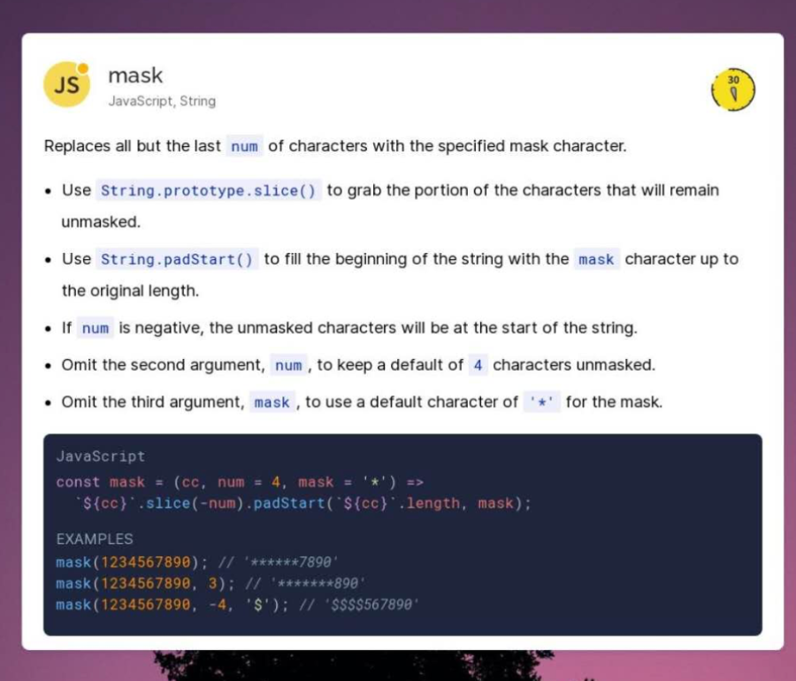
36. 快餐文分享：  18个月，黄光裕如何带国美重回巅峰？ [https://www.36kr.com/p/1106544746892548](https://www.36kr.com/p/1106544746892548)
37. [https://twitter.com/neilsardesai/status/1362890469970214917?s=19](https://twitter.com/neilsardesai/status/1362890469970214917?s=19)  在 icon 上玩游戏，太秀了。 让我想起了之前 在 url 地址栏 玩贪吃蛇的项目。
38. 每日一句分享： 秦时明月\(国产动画\)存在的时间已经超过了秦朝。
39. 项目分享：   
    Python 0.9.1  - Py 0.9.1 源码  
    [https://github.com/smontanaro/python-0.9.1](https://github.com/smontanaro/python-0.9.1) 

    The Python source is copyrighted, but you can freely use and copy it as long as you don't change or remove the copyright

    A: 以这样的方式看到 python 的源码？。。有点不敢相信

    B: 嗯，包含解释器，一些py库，很有研究价值~

40. 分享个可能不了解的事：  京东公司的成立\(98.6月\) 比腾讯 网易 新郎 搜狐 阿里都早。
41. 为什么我觉得 Java 的 IO 很复杂？ - 知乎 [https://www.zhihu.com/question/67535292/answer/1248887503](https://www.zhihu.com/question/67535292/answer/1248887503)  分享篇关于 Java IO 很好的回答，可惜的是 流的概念只是一笔带过。 流是一个抽象的概念，小到电路中的比特流，大到flink为首的多节点流式计算。
42. A: Question: 怎么理解流这个概念的呢？

    B: 就是数据？

    A: 本质是数据，但是为什么会有这个概念呢？它想表达什么？

    B: 就是那种 通过管道 然后数据流？ 交换数据？

    A: 流是数据传输的一种形式。它的特征概念是为了操作服务的。想到了哪些特征呢？   
    A: IO 流 与 IO 强调的并不是一种东西。一个是 数据传输方式，一个是 IO 模型，所以还是避免混淆。

43. A: 不如聊聊比特币  为什么一个虚拟的概念现在市值过万亿美金了呢？这是一个很有趣的问题。

    B: 收割韭菜 以前比特币不是洗钱用的么

    A: 韭菜也是人，为什么会被收割呢？ 洗钱的前提也是有人承认这个东西。

    C: 因为人类是喜欢制造概念并深信与此的动物

    A: 和我的想法 很相近。 合法化的信托机构，以及名人，主流机构的背书。再加上比特币的“合理”供求机制。

44. 科普文分享：  Linux 内核和 Windows 内核有什么区别？ [https://www.cnblogs.com/xiaolincoding/p/14419269.html](https://www.cnblogs.com/xiaolincoding/p/14419269.html)
45. 好文分享：   
    HTTPS知识点梳理   
    [https://juejin.cn/post/6930446060846481416](https://juejin.cn/post/6930446060846481416)

    文章干货很多，值得反复阅读。   
    微信把掘金禁了可还行，真是典型的护墙河。

46. A: 不同的价值碰撞才可以有新的价值嘛w

    B: 是的，可闲聊不会碰撞出价值 只会污染 timeline. 所以说，需要约束 讨论，不然会跑偏的，价值就不存在了。   
    A: 约束讨论是什么意思。。 个人觉得 无论什么话题只要挖掘的够深就是有所谓思考价值的 再严肃专业的话题 不去深入讨论 而是浅尝辄止 也就没有价值   
    B: 不过 很久之前我就意识到 思考的价值 失败了，它做不到最初的立意。   
    不管是否更换血液。 因为涉及到人的问题，是不能用理性去思考的。   
    换句话说，人是不可控的。  
    我觉得是初衷 出了问题。 应该垂类到某一领域，比如计算机。   
    并且人是需要审核的。 起码需要有贡献的意识。

    A: 是啊 只是思考的话 太笼统了   
    B: 我需要思考下 此群存在的意义了，可能又是心中的一个乌托邦。

47. 每日一句分享：  机器学习可以看成是 在连续空间中的近似的逻辑编程。 而逻辑编程可以看成是 在离散空间中的精确的机器学习。
48. 百度贴吧里有哪些神贴？ - 一朵瓜子的回答 - 知乎 [https://www.zhihu.com/question/20011317/answer/1739615930](https://www.zhihu.com/question/20011317/answer/1739615930)

    分享个故事，有关两三面的情愫，因为道德上的约束 主人公始终没敢迈出冲动的那一步，文章描写的很细腻。   
    遇见其实已经很幸运了。

    要知道，人的一生中要走过很多个身影，也许对陈思萌来说，我只不过是在她生命中众多路人中的一个，无关感情痛痒。摘抄自文章。   
    人总是要带着少许的遗憾过生活的。

49. “好内卷”与“坏内卷” [https://mp.weixin.qq.com/s/MYBeSOOP5OBZ38zs98dpEQ](https://mp.weixin.qq.com/s/MYBeSOOP5OBZ38zs98dpEQ)

    薛定谔则说“人活着就是在对抗熵增定律，生命以负熵为生”。 动物群落、人类社会的本质也是熵减 - 摘抄自文章。   
    A: 如是这样讲，所以更要要去探索吧；没有问题发现问题，有困难要克服困难；觉得这篇文章是借着内卷来说明社会风气问题 我就粗略的看了一下 然后看完，个人认为哈；社会发展进程是没有良性结果的，看似很好的状态下，也是在可控范围内进行内部消化；语言确实很有意思   
    B: 这篇文章涉及的宏观角度过大了，我看完是一知半解，想不到思考的点。 A: 所以我刚刚说是有略带影射，说社会风气；把思考范围缩小一点，写实一点 C: 刚在下班时间上卷赢我导师  
    D: 我这样想的，文章中定义的好和坏都是相对于大多数人的，以大多数人这个惯性系来讨论好内卷和坏内卷。apple公司总是做出我无法理解、接受的事情。但是这个团队也在改变着世界。相对于少部分人就要重新定义好内卷   
    B: 赞同，一个概念的定义 是很难下定论的，文中的表达形式 是为了证明例子 有失偏颇。

50. 今晚定了毕业论文的题目: 基于微前端架构的低代码开发平台的设计与实现

    我简单说明下：

    1. 微前端是前端应用中资源的组合方式，类似于现在的微服务概念。
    2. 低代码开发 是 通过可视化配置界面的方式 去生成前端应用。

    有同学想一起讨论下嘛~

    微前端为什么要和低代码开发平台结合呢？ 微前端主要是 负责 用户可以加载不同的业务组件库的。

    想了想 毕设还是改成了 基于微前端架构的绘图平台设计与实现。

    这个比 low code 平台 简单一些。只需要实现 画板 与 元素智能布局。 类似于 [https://app.diagrams.net/](https://app.diagrams.net/)   
    之前在墨刀实现的时候，做过一个类似的产品。

    关键点在于底层绘图引擎的选型。 draw.io 也就是上面最知名的工具，使用的是 svg，绘图引擎有开源 06 年开发。 processon 国内最大的绘图平台使用的就是 刚提到的开源引擎。

    而现在 canvas 是一个更好的选择了。   
    所以 问题来了，canvas 与 svg 的根本差异是什么，它们适于的场景是什么。

    A: 绘图平台和微前端的结合点是什么呀？ 感觉微前端和 low code 平台结合还是好说一些。  
    基本现在混合研发就是做这些事，产品里标准化的部分通过 low code 搭建，高度定制的东西 procode 实现，再用微前端结合在一起。最近我们基本都在这么搞，有一些内部的工程实践

    B: 在于 不同的汇图组件 可以根据用户的需求 模块化地加载。 比如，电路图 需要一些电子元件的图片组件，建筑图 需要对应的建筑标识组件。   
    其实微前端有点强行了，我的目的是为了突出毕设的复杂性。  
    论文嘛，就是概念越多 越复杂越好😷 为了贴合 国内毕业生 强制产出论文的大环境~   
    魔幻的环境待久了，我就成为了魔幻的组成因子，才不管熵增熵减..

51. A: 美团一面有个面试题：在不同的设备尺寸下, rem 如何一致。 现在也没有找到一个很好的答案。   
    B: media query 尺寸 设置对应的 font size 可以用 sass 的 循环来做   
    A: hah 不对，我就这么回答的。对方提到 不同的设备分辨率 你如何保证呢？ B: dpr 能 media query嘛？ 然后我回答，使用 JavaScript 动态计算，然后没想到 分辨率 API 名字。   
    C: dpr是啥（   
    A: 像素比。 Device Pixel Ratio: Number of device pixels per CSS Pixel   
    A: 分享篇文章：

    完全理解px,dpr,dpi,dip [http://www.ayqy.net/blog/%E5%AE%8C%E5%85%A8%E7%90%86%E8%A7%A3px-dpr-dpi-dip/](http://www.ayqy.net/blog/%E5%AE%8C%E5%85%A8%E7%90%86%E8%A7%A3px-dpr-dpi-dip/)

    更正一下: @media \(-webkit-min-device-pixel-ratio: 2\), \(min-device-pixel-ratio: 2\) {}

    原来媒体查询器是支持 dpr 的...

52. 好文分享：

    无代码/低代码 - 前端的中台 [https://github.com/phodal/lowcode](https://github.com/phodal/lowcode)

    文章出自黄峰达老师之手，讲解了低代码平台的意义，以及设计思路。

    文章很有深度，建议阅读。

    low code 的每一个基础设施 的实现难度都很高，并且 low code platform 的适用场景也很垂类。

53. A: 最近我接触到了一个 no code platform，勉强能用的阶段，我现在有点怀疑 我的毕设选题 是否超出预期了。

    B: 不是说是 kpi 驱动的嘛   
    A: 是的，这些平台都是高杠杆，很利于衡量产出。   
    B: 那 low code 的 roi 到底高不高啊

    A: 

    去年阿里的活动页 有70%都是 low code 产出。

    A: 是的，话虽这么说。 其实是公司内部团队之间不愿意互相妥协，都想抓住高杠杆的结果。   
    A: 对于 no code platform 我的设想是： 既可以快速可视化搭建页面，一键完成上线 预览 测试 部署 埋点，形成一个完美的闭环； 又可以像 figma 那样 支持高自定义地设计细节。   
    B: 这个想法很宏大啊

54. A: 其实可以延伸讨论一下 公司个人发展的话题。

    我刚刚反复提到一个关键词，高杠杆。 如果在公司内部，一个人可以抓住一次 所谓 高杠杆 的机会，那么他大概率会成功的，

    B: 撬不动杠杆咋办   
    A: 你不需要撬，你需要观察别人的杠杆是怎么搭建的。

    就好比，在 Google 内部，一个写 Go library 的开发者 与 一个借助 Go 写service 的开发者，他们的产出 是没有可比性的。 这无关 他们的素质，技术水平，教育背景。   
    如今公司内部，开个周会，几乎每一个团队都有两三个平台，这其实能体现出很多东西。   
    B: 写lib的会更高吗   
    A: 不在于高，在于影响。 而影响高 带来的价值是无法衡量的。   
    A: 杠杆 也往往和所在的团队 有很大的关系。   
    C: 做业务，比较容易有产出吧, 搞基建的话，如果基建发展的比较完善了，那想产出不也就比较难了吗   
    A: 基建不会发展完善的，新概念只会不停地出现。

55. 快餐文分享：

    Concurrency with Go Lang   
    [https://mithun-17.medium.com/concurrency-with-go-lang-7129571a68fb](https://mithun-17.medium.com/concurrency-with-go-lang-7129571a68fb)

    文章很简单，都是些基础概念，对 goruntine 感兴趣的同学可以读一下。

56. 好文分享：

    Getting Started with Three.js   
    [https://js.plainenglish.io/a-simple-introduction-to-threejs-9b060c1bb6e7](https://js.plainenglish.io/a-simple-introduction-to-threejs-9b060c1bb6e7)

    文章介绍了 3D 渲染的基本概念，从 OpenGL 到 WebGL 再到之上的 Three.js，并由此 作者写了个小Demo，一步步由浅入深地带你了解 Three.js 中的基本概念。

    在我看来，Three.js 最令人称赞的地方 在于它对 WebGL 的概念抽象 重新建模。GUI 渲染引擎，3D 渲染引擎，游戏渲染引擎... 计算机图形学是一个很广的学科，有太多黑魔法值得挖掘了

    A: 图形学 强烈推荐 games101 这门课 b站搜索就有 还有何渊鸣的 games201 B: 贴下链接：

    1. GAMES101-现代计算机图形学入门-闫令琪 [https://www.bilibili.com/video/BV1X7411F744?from=search&seid=12880289156025443052](https://www.bilibili.com/video/BV1X7411F744?from=search&seid=12880289156025443052)
    2. GAMES201：高级物理引擎实战指南2020 [https://www.bilibili.com/video/BV1ZK411H7Hc?from=search&seid=10863851673950129238](https://www.bilibili.com/video/BV1ZK411H7Hc?from=search&seid=10863851673950129238)

57. 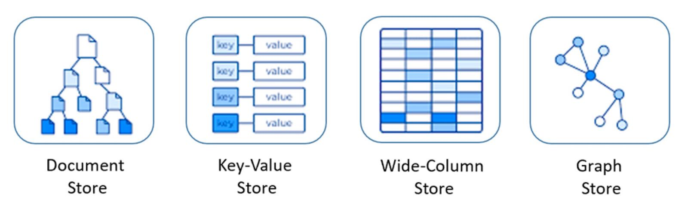
58. 快餐文分享：

    Functional Domain Modeling in Kotlin [https://www.47deg.com/blog/functional-domain-modeling/\#functional-domain-modeling-in-kotlin-0](https://www.47deg.com/blog/functional-domain-modeling/#functional-domain-modeling-in-kotlin-0)

    文章简述了 关于类型建模时的一些最佳实践（模式匹配真的好香..

59. 科普文分享：

    WebRTC for beginners; How it all works from the outside! [https://itnext.io/webrtc-for-beginners-how-it-all-works-from-the-outside-3c806f582229](https://itnext.io/webrtc-for-beginners-how-it-all-works-from-the-outside-3c806f582229)

    文章简述了 WebRTC 背后的基础协议 以及基本的运行原理。

60. A: 有什么背单词软件推荐吗？  B: 高中的时候 本子和笔。。  C: 之前用墨墨背单词，坚持了两年多，加扇贝阅读打卡。 现在用微信读书，每天有空看单词书。
61. 快餐文分享：

    Golang WaitGroup 原理深度剖析 [https://mp.weixin.qq.com/s/CkSd2aldYaoLbd-IKhkpWg](https://mp.weixin.qq.com/s/CkSd2aldYaoLbd-IKhkpWg)

    这性能压榨得太可怕了... 不愧是官方库...

62. 分享下 Kotlin 的一个片段：

    ```text
    import kotlin.browser.window
    ​
    fun onLoad() {
        window.document.body!!.innerHTML += "<br/>Hello, Kotlin!"
    }
    ```

    Kotlin 面向 Web，Android，IOS，Server，everywhere...

63. 漫画 \| 打死我也不搞负载均衡了！ [https://mp.weixin.qq.com/s/aWHKEpwATfTEu-yPC3ogzg](https://mp.weixin.qq.com/s/aWHKEpwATfTEu-yPC3ogzg)
64. 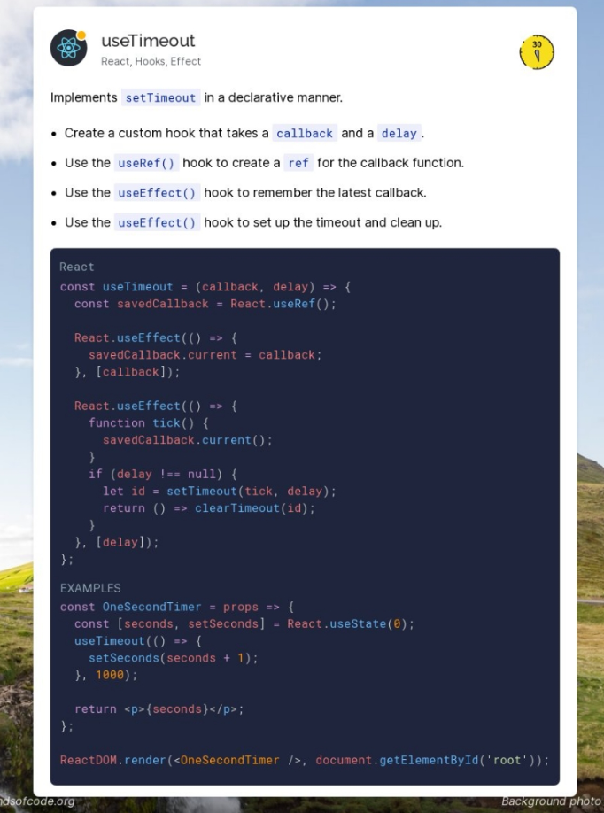
65. 词汇分享:  sin\[sɪn\]  n.罪，罪恶 vi.犯罪
66. 好文分享，图模型的概念，使用场景，以及一些概念。  娓娓道来图模型、图查询、图计算和图学习知识  [https://mp.weixin.qq.com/s/mPebHfCm8\_Sb-miI87zzLg](https://mp.weixin.qq.com/s/mPebHfCm8_Sb-miI87zzLg)
67. 分享篇文章:   
    Go is not an easy language   
    [https://www.arp242.net/go-easy.html](https://www.arp242.net/go-easy.html)

    Go 是一门非常容易上手的语言，但它的学习成本 一点也不简单。   
    文章说的有理有据，简约的抽象从来不会降低复杂性，只是把复杂性转移到了其他地方。   
    当你充分理解抽象背后的概念时，比如 Goruntine,channel，你就会惊叹设计的优美。

68. 分享个有趣的项目：   
    qeeqbox/social-analyzer [https://github.com/qeeqbox/social-analyzer](https://github.com/qeeqbox/social-analyzer)

    finding a person's profile across 350+ social media websites.  
    简单来说是爬虫项目，爬多个社区网站，聚合信息。 在我看来，这个项目其实存在着一些价值，拿到信息后 完全可以分析出一个人的具体画像。   
    而用户画像的价值是很大的，完全可以转换成相应的商业价值。  
    上面提到的行为 属于 数据挖掘领域。 一般企业的这种行为是见不得光的。

69. 分享篇文章：   
    草根前端人的焦虑   
    [https://www.notion.so/b92c170778554d258409d7b6b2de4095](https://www.notion.so/b92c170778554d258409d7b6b2de4095)

    摘要：Vite、ESBuild、SWC、TailWind、Snowpack、Vue3.0、Recoil、Deno、Lowcode... 不管是前端领域、还是技术领域、还是娱乐圈、每年都有涌现出一大堆的新玩意、每年都有新的鲜肉火了。

    文中讲解 个人成长的观点，我挺赞同的。

    1. 不要给自己设置边界。
    2. 技术深度和广度是需要不断学习和累积。

70. 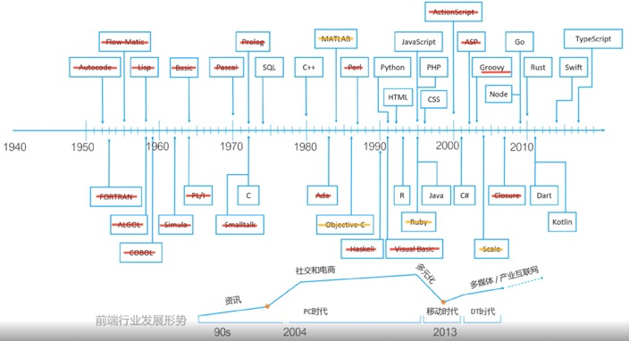
71. 
72. A: 地铁上可以做什么有人推荐吗  B: 听播客，看单词书，或者发呆。  A: 我去搜索有什么好的播客！  B: 地铁其实很适合发呆的，或者观察人 也挺好玩的。  A: 人有什么好观察的啊  B: 对啊，观察一个人 是做什么的，和同伴沟通什么。 每个人都是一本书的，可以与你想象力结合～
73. 分享篇文章:   
    Style Spelling and Grammar Errors with the ::spelling-error and ::grammar-error pseudo-elements

    [https://www.bram.us/2021/02/21/the-future-of-css-style-spelling-and-grammar-errors-with-pseudo-elements/](https://www.bram.us/2021/02/21/the-future-of-css-style-spelling-and-grammar-errors-with-pseudo-elements/)

74. 每日一句分享：

    You can't connect the dots looking forward, you can only connect them looking backward. So you have to trust that the dots will somehow connect in your future.

    来自 05 年 斯坦福的一次演讲。   
    [https://www.youtube.com/watch?v=UF8uR6Z6KLc&feature=youtu.be&ab\_channel=Stanford](https://www.youtube.com/watch?v=UF8uR6Z6KLc&feature=youtu.be&ab_channel=Stanford)

75. 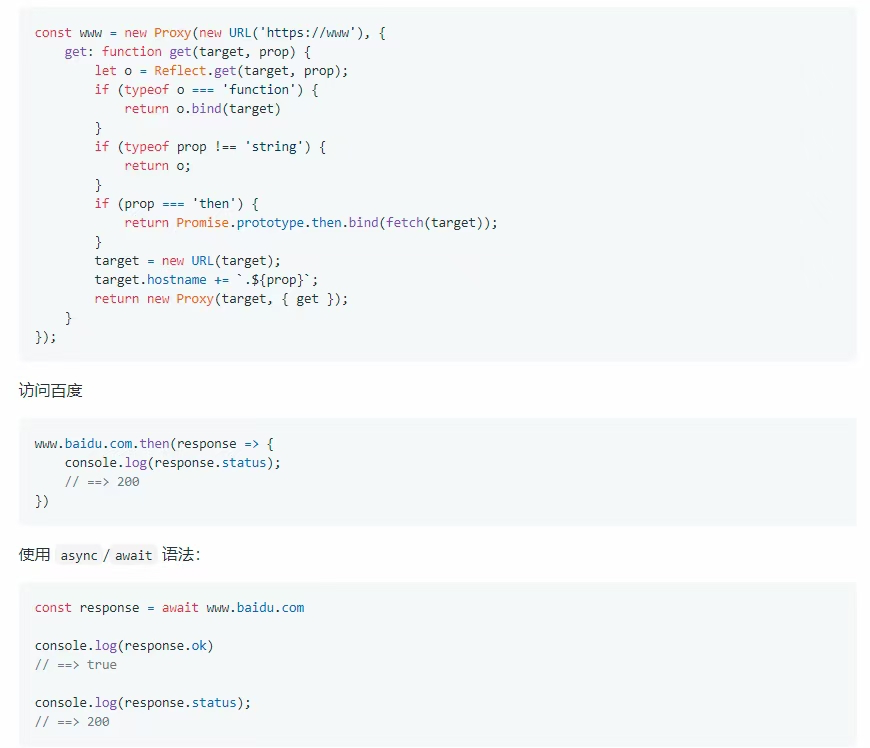

    惊讶系列分享。使用 proxy 定义了一种内部 DSL，这种表达力太强了。

76. A: 整的跟抖音一样   
    B: 短视频 从创新层面来上说，对中国意义很大，这是我目前知道的 唯一一个国内创新概念风靡全球的产品原型。   
    像美团，淘宝，滴滴，即时通讯软件，少儿编程，知乎，都是抄袭国外概念 再利用国内的\*\*机制 做大的。

    A: 是创新 新型精神鸦片

    B: 思考的层面小了 - 并且这句话不太好，有点引战..   
    C: 短视频确实是成功的，而且像这类受众群体非常广泛的产品确实不多见   
    B: 而微信小程序，web app 导流 更是国内拿得出手的创新，简直是魔幻的代表。   
    B: 可以聊聊抖音的产品设计。它的成功与其设计 有莫大的关系。   
    D: 靠算法推荐？   
    B: 全屏展现，划一下即可导向下一个视频。 数据系统强大，随着用户的增多，使用量增多，完全形成了正向循环的视频推荐。   
    C: 一屏只展示一个视频，这就是很创新的一个设计了，而且交互基本都是很简单的   
    B: 是的，网站越简单的设计越高级，符合用户的心智模型。   
    E: 之前听说抖音是介乎于实时和非实时的社交，实时，非实时指获取信息的方式，而且现在我发现老人用户里关注的大部分是熟人   
    F: 快手太low   
    B: 哎，快手现在也没摆脱这个形象.. 它一直很努力的，然而 基础形象定下来，后面再做其他行为补救 也无济于事。 这像极了爱情。   
    F: 抖音短视频 也是抓住了当前人们的碎片化时间吧

77. A: 我小时候爱看 老梁 爱听单田芳 现在喜欢打游戏 街拍 但是还没下载过抖音快手 是因为怕沉迷 其实真的没必要感觉你和谁不一样就感觉自己格格不入 我就不在乎他们怎么看我 我也不反对任何事 南方总有一句话 什么东快傻 觉得低俗 但是什么都不能千篇一律 每个人人格都是独立的 自己都有自己选择什么的爱好和权利 雅俗哪有那么多界限 他怎么选择 你不去批判 才是尊重 人人价值观都一样 人不会繁荣 早灭绝了 你自己定位自己 做什么人 就别后悔 又没触犯道德 法律 伦理 没影响到别人 小时候爱玩贴吧 天涯 就是因为有一群相同价值观的人 可以一起玩梗 秒懂什么的 就像现在群里 冲浪交流思想 虽隔千里 却似近语 这个裙对我的意思就很大 虽然看不太懂学术上我的东西 但是起码让我思考了   
    B: 赞同，每个人的认知成本 生活环境 都是不一样的。

    价值的本身也很难定义。   
    对于一个事物，每个人都会有不同的看法，从不同的层面思考，差异是一定存在的。

    但存在差异并不是坏事，往往越优秀的组织 差异才会越大，顶层与底层的观点。相反平庸或者和睦的团队 差异小的多，要么是认知水平相似，要么是所有人都持有一种声音。

78. 分享篇文章：

    我在小米做爆品   
    [https://mubu.com/doc/qymyWavX\_4](https://mubu.com/doc/qymyWavX_4)

    文章提到了一点：爆品需要自然流量，可以延伸谈谈。

    自然流量就是用户自主寻找商品带来的流量，一个是搜索，搜索对应有一个搜索指数，包括百度指数，还包括天猫，京东拼多多的电商指数，头条指数，微信指数

    搜索指数 是一个很具有商业价值的数据，在信息快速发展的时代，拿到某一宏观指数，就好比拿到了大多数用户的导向。 相信大家 都知道 微信公众号的信息循环一直是一个闭环，它不允许搜索爬虫爬取，所有的信息流量 都尽量导向自身，先不谈互联网精神，就谈谈微信公众号 产生的商业价值。

    事实上，微信文章只支持一个搜索引擎 那就是搜狗（去年已被腾讯收购），搜狗为了得到数据源，每年需要支付上亿；并且 一些灰产早就盯上了 微信文章这一封闭的数据源，现在有很多接口平台，按每次爬取收费，假设一次爬取 1 毛，如果想到达实时爬取这其中的利润是巨大的。

    实时爬取是为了更好得分析，得到更全面的数据，你可能不理解，为什么会有这个需求？这和今天中午提到的数据挖掘是一个领域。

    刚刚在讨论 抖音快手，但重点一直没有扯到商业化上面，我是简单说一下，希望思考时 层面可以大一点，不要局限场景。

    抖音的商业化 毫无疑问最核心的就是广告了，而广告就是靠浏览量赚钱。 在早期 第二年的时候抖音就已经摸索出了自己的商业化并且迅速形成了一个正向循环，这里用一鸣对抖音的定位来概括：我们是把移动应用与人工智能相结合，打造出\*\*\*应用。

    在刷抖音时，可能会觉得除了偶尔的广告并没有什么，没有损失什么，但其实你已经成为了一个神经元，推荐算法中的神经网络的组成因子，这会让你越来越沉浸，换句话讲 你为自己的数据流赋能。 当你打开各种权限时，参加各种活动时，你实际上是在推进运营任务的各项指标。 当有类似春节的这种活动时，日活可以轻松破千亿。

    这带来的商业价值 不可想象，它给了字节充足的粮草去开张阔土。

79. 快餐文分享：

    Switching from Rust to TypeScript \(and vice versa\) [https://blog.logrocket.com/switching-from-rust-to-typescript-and-vice-versa/](https://blog.logrocket.com/switching-from-rust-to-typescript-and-vice-versa/)

    摘要：we’ll show you how to transition from writing apps in Rust to TypeScript and vice versa. We’ll explore how these languages are similar, how they differ, and common challenges associated with each. We’ll then discuss the benefits of adopting TypeScript in Rust as well as best practices for how to do so.

    今天中午准备详细讨论下 文中涉及的一些点。 主题有：错误处理，类型检查，模式匹配，scope ...

    文章第一个主题是有关包管理，可以简单枚举一下 各大语言的包管理机制：

    1. Java，Kotlin 等（JVM 平台语言） - Maven、Gradle 非官方
    2. C\# - NuGet 官方
    3. Haskell - Cabal 官方
    4. C++ - Conan （代表，C++ 的实在太多了）
    5. JavaScript - NPM 号称世界上 package 数量最多的生态，懂得都懂..
    6. Rust - cargo 官方
    7. Ruby - RubyGem 官方
    8. Golang - GoModule 官方
    9. Python - pip 官方，Conda 非官方 暂补充...补充一下，Vim - vim-plug，Vundle 等。

    A: 什么 cpp居然有包管理器   
    B: CPP 很多的~   
    A: 很多说明没有统一 可以讨论下 统一性技术（完全由一个机构决定） 与 非统一性技术 的发展利弊。  
    统一性技术的代表 毫无疑问是 微软 苹果 为代表的。 微软的 .net 生态，苹果所有终端应用的生态闭环。

    非统一性技术的代表 就是 Web，目前没有任何一家公司 资本可以统一 Web 技术的发展。 这也是现在 Web 技术混乱，动不动娱乐圈的一原因。   
    当然 Google 也有很多 统一性的技术，但开源做得好（偶尔独裁），就不谈了。   
    而每一项技术也是一种资源，并且还是不会涉及到商业垄断的资源。

  
    文章的第二个主题是有关类型检查，可以延伸谈一下强类型与弱类型 在工程实践中的作用。   
    强类型 与 弱类型主题有点小，扯的话绕不开 防御性编程，编程规范，不如谈谈类型系统。   
    先抛出个问题，编程的本质是什么？   
    在我看来，编程的本质就是 运算推导结果的过程。   
    而类型系统的意义就在于 它为推导的过程添加约束，白话讲是决定了一个 symbol 的可取值范围。

  
    第三章节是有关错误检查，这点之前讨论过一次了。   
    错误处理没有银弹可言，不管是 Go 的多返回值，还是使用 union type 封装，或者在函数签名中 mark exception，都不是一个很优雅的方式。  
    归根结底在于 运行时的异常 是无法检查出来。   
    像一些编译时的异常 可以用过一些语法糖来避免，就比如 kotlin 中的!! assert，java9 提供的 option，以及 js 的 ?.   
    A: 什么叫编译时的异常呢 你说的这些是为了解决空指针异常把

    编译时，解释器 会在最初的运行时进行 基本推导，你说的空指针异常 是存在于编译时与运行时的，我上面抛出的信息没有加场景。

80. 分享篇文章：

    “I WILL SLAUGHTER YOU”   
    [https://daniel.haxx.se/blog/2021/02/19/i-will-slaughter-you/](https://daniel.haxx.se/blog/2021/02/19/i-will-slaughter-you/)

    curl 作者收到死亡威胁邮件。 故事太离奇了，对方因为 使用 curl 失去了家庭、6 年工作、国家..

    [https://news.ycombinator.com/item?id=26192025](https://news.ycombinator.com/item?id=26192025) 相关 hn 上的讨论

    I'm not a psychiatrist, but it seems that this person has some severe psychotic disorder. The whole thing reads like a cheap knockoff of "A Beautiful Mind".

    摘抄自一条评论。 显然他可没有纳什那么有成就。

81. 卡颂的财富增长实践  [https://mp.weixin.qq.com/s/PUBD9NGTbiHW-ziDPVOsJQ](https://mp.weixin.qq.com/s/PUBD9NGTbiHW-ziDPVOsJQ)
82. A: 云真机平台\(可在 web 端实时操作手机 的技术\)，有同学了解吗..   
    刚刚想了下 应该是基于 webrtc 做了视频流推送，然后在phone shell 上捕获动作，发送到 手机端，手机端 收到信号 再做相应的处理。   
    想完成 实时操作，每一环节都很难.   
    B: 我只略懂安卓的投屏和控制呀 web实时操作手机，ws-scrcpy做的不就是这个事吗

    主要两个线程。一个建立adb forward sockect链接，传输手机画面视频流到PC，然后可以用各种前端技术把视频流显示到web上。第二个线程捕获web上的键鼠事件，转化成手机的事件，传输并注入到手机中完成实时控制

    移动测试开发Scrcpy 工具码流格式化 [https://testerhome.com/articles/19417?order\_by=like](https://testerhome.com/articles/19417?order_by=like)   
    这个文章探讨的就是上面说的第一个线程，也就是投屏。第二个线程实时控制可以参考安卓系统层提供的设备控制接口文档   
    A: 受教了，这里面的技术细节 确实挺多的。 电脑控制手机 以及手机响应这个比较清楚。 手机实时投屏 文章介绍的两种机制 为我解惑了。

83. 分享个概念： 破窗效应 - [https://zh.wikipedia.org/wiki/%E7%A0%B4%E7%AA%97%E6%95%88%E5%BA%94](https://zh.wikipedia.org/wiki/%E7%A0%B4%E7%AA%97%E6%95%88%E5%BA%94)  以一幢有少许破窗的建筑为例，如果那些窗没修理好，可能将会有破坏者破坏更多的窗户。最终他们甚至会闯入建筑内，如果发现无人居住，也许就在那里占领、定居或者纵火。 又或想像一条人行道有些许纸屑，如果无人清理，不久后就会有更多垃圾，最终人们会视为理所当然地将垃圾顺手丢弃在地上。因此破窗理论强调着力打击轻微罪行有助减少更严重罪案，应该以零容忍的态度面对罪案。
84. 词汇分享:  bud\[bʌd\]  a small part of a plant, that develops into a flower or leaf  n.芽，花苞 vi.发芽，萌芽
85. 【第2206期】奇怪的知识——位掩码 [https://mp.weixin.qq.com/s/zT4dZPYN3vYMRABWkH5SFQ](https://mp.weixin.qq.com/s/zT4dZPYN3vYMRABWkH5SFQ)  分享篇科普文章，简述了位运算的一些基础概念与实践。
86. 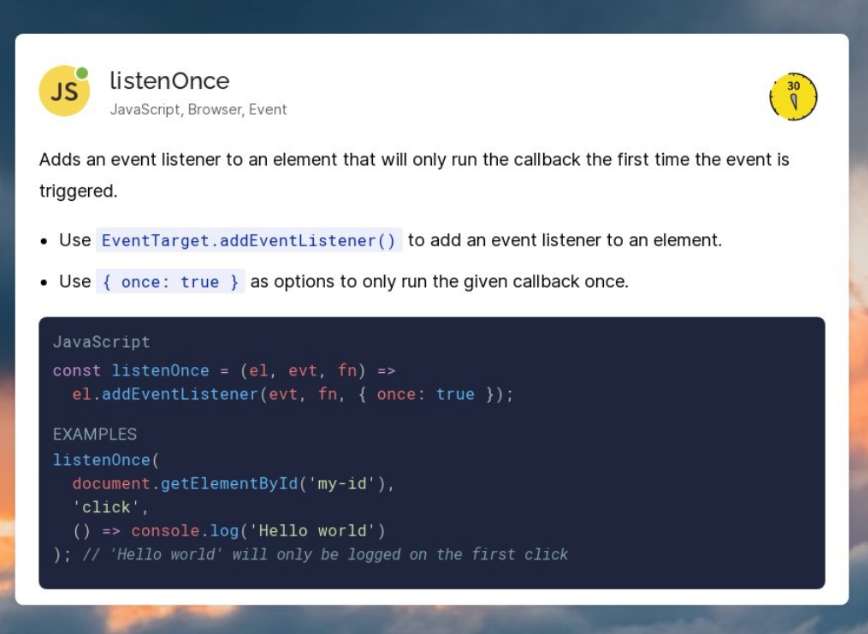
87. 每日一句分享：   
    无常，宇宙中唯一的常量。

    上面的话 来源于 雪莱的诗《Mutability》 人世的明日绝不会雷同于今朝，万古不变的，唯独只有无常。

88. Why build concurrency on the ideas of CSP?

    Concurrency and multi-threaded programming have over time developed a reputation for difficulty. We believe this is due partly to complex designs such as pthreads and partly to overemphasis on low-level details such as mutexes, condition variables, and memory barriers. Higher-level interfaces enable much simpler code, even if there are still mutexes and such under the covers.

    One of the most successful models for providing high-level linguistic support for concurrency comes from Hoare's Communicating Sequential Processes, or CSP. Occam and Erlang are two well known languages that stem from CSP. Go's concurrency primitives derive from a different part of the family tree whose main contribution is the powerful notion of channels as first class objects. Experience with several earlier languages has shown that the CSP model fits well into a procedural language framework.

    摘抄自官方 FAQ - [https://golang.org/doc/faq](https://golang.org/doc/faq)   
    官方 FAQ 有很多有价值的信息，建议花时间翻翻看，我非常欣赏它的设计原则。

89. 快餐文分享:

    面试官：前端跨页面通信，你知道哪些方法？ [https://juejin.cn/post/6844903811232825357](https://juejin.cn/post/6844903811232825357)

    对于同源页面，常见的方式包括：

    广播模式：Broadcast Channe / Service Worker / LocalStorage + StorageEvent

    共享存储模式：Shared Worker / IndexedDB / cookie

    口口相传模式：window.open + window.opener

    基于服务端：Websocket / Comet / SSE 等

    而对于非同源页面，则可以通过嵌入同源 iframe 作为“桥”，将非同源页面通信转换为同源页面通信。

90. 分享篇文章:   
    Java Threads: Are They Memory Efficient?   
    [https://dzone.com/articles/java-threads-may-not-be-memory-efficient](https://dzone.com/articles/java-threads-may-not-be-memory-efficient)

    摘要: This study clearly indicates that memory is allocated to threads at the time of creation, and memory is not allocated based on the thread’s runtime demand.

    Java 线程占用内存居然是预分配一个数值的，这与前几天分享的 Go waitgroup 源码解析文章 中 为了减少内存对齐做的优化，给我的触动真是截然不同。

91. 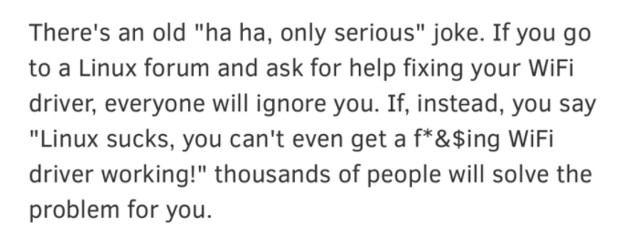

    提问的艺术

92. 分享个概念:  函数染色: Dan 用这个术语来形象的描述这一现象：一旦一串函数调用里有一个需要加 async，则其所有祖先函数都得被迫加 async。 [https://overreacted.io/algebraic-effects-for-the-rest-of-us/\#a-function-has-no-color](https://overreacted.io/algebraic-effects-for-the-rest-of-us/#a-function-has-no-color)
93. 朝夕光年，字节跳动的游戏梦 [https://mp.weixin.qq.com/s/T7BZlX68md1\_OC-dSGRHHw](https://mp.weixin.qq.com/s/T7BZlX68md1_OC-dSGRHHw)  分享篇文章，讲解了字节在游戏领域的动作以及 与国内游戏巨头难以跨越的鸿沟。
94. 快餐文分享:   
    Web Vitals Explained   
    [https://dev.to/laurieontech/web-vitals-explained-114j](https://dev.to/laurieontech/web-vitals-explained-114j)

    CLS FID LCP FCP 你知道指的是什么性能指标吗？

95. 分享个有趣的帖子:  王伟在公司厕所，带薪拉屎  [https://www.v2ex.com/t/755667](https://www.v2ex.com/t/755667)
96. 刚刚了解到了 一个工作法\(偏概念\):

    在定义 todo list 的同时，建议也写一份 not-todo list，意义是不要让低优先级的事情干扰高优先级的事情。

97. HTML tip: Use the `start` attribute to change the starting point for your ordered lists.
98. 快餐文分享：

    \[译\]只使用 CSS 进行用户追踪 [https://mp.weixin.qq.com/s/Xxs1sG7CrbSR1uV8r0gm4g](https://mp.weixin.qq.com/s/Xxs1sG7CrbSR1uV8r0gm4g)

    * 通过字体加载 判断 系统信息
    * 通过媒体查询器找到设备信息
    * 通过 hover active 伪类追踪用户行为

99. 
100. 网络 IO 演变发展过程和模型介绍 [https://mp.weixin.qq.com/s/EDzFOo3gcivOe\_RgipkTkQ](https://mp.weixin.qq.com/s/EDzFOo3gcivOe_RgipkTkQ)  
     快餐文分享，文章讲解网络IO比较详细，建议阅读。   
     如果在衍生下 epoll 的诞生背景 c10k 问题，就更好了。

     摘要:两台计算机而言，要进行网络通信，其数据都是先从应用程序传递到传输层\(TCP/UDP\)到达内核态，然后再到网络层、数据链路层、物理层，接着数据传递到硬件网卡，最后通过网络传输介质传递到对端机器的网卡，然后再一步一步数据从网卡传递到内核态，最后再拷贝到用户态。

101. 开发者怎样才能写出好的 API？ [https://www.infoq.cn/article/rk4gcSYZiYGctrYlTwZI](https://www.infoq.cn/article/rk4gcSYZiYGctrYlTwZI)  可以的，API 不应该限定实现 主题的最佳实践就是 路由加版本了。
102. TypeScript 4.2 正式发布：更智能的类型别名保留，声明缺失的帮助函数，还有许多破坏性更新  [https://mp.weixin.qq.com/s/Dps5LCx5NClq5eB6Xf2jgw](https://mp.weixin.qq.com/s/Dps5LCx5NClq5eB6Xf2jgw)
103. JavaScript 到底是哪个国家发明的？Brendan Eich 生于靠近移民大熔炉纽约的宾州，Eich 又是个德裔姓氏，说明他祖籍显然来自欧洲。而欧洲又有被元太祖成吉思汗征服的历史，基于蝴蝶效应、命运石之门理论与混沌经济学等诺奖级研究，如果成吉思汗没有征服欧洲，Brendan 的祖先就不会移民美国，自然也就不会有 JS。由于元朝是中国的朝代，所以铁木真作为中国的民族英雄，没有他就没有美国的 JavaScript。 所以，JavaScript 表面上是美国发明的，但本质上还是中国的！  Doodle 昨天的一则想法，hh 挺好玩的。  这种含沙射影的阴阳文学，最近很火喔..
104. 分享个新了解到的概念 - 混沌工程

     混沌工程：混沌工程，是一种提高技术架构弹性能力的复杂技术手段。Chaos工程经过实验可以确保系统的可用性。混沌工程旨在将故障扼杀在襁褓之中，也就是在故障造成中断之前将它们识别出来。通过主动制造故障，测试系统在各种压力下的行为，识别并修复故障问题，避免造成严重后果。 它也可以视为流感疫苗，故意将有害物质注入体内以防止未来疾病，这似乎很疯狂，但这种方法也适用于分布式云系统。混沌工程会将故障注入系统以测试系统对其的响应。这使公司能够为宕机做准备，并在宕机发生之前将其影响降至最低。 如何知道系统是否处于稳定状态呢？通常，团队可以通过单元测试、集成测试和性能测试等手段进行验证。但是，无论这些测试写的多好，我们认为都远远不够，因为错误可以在任何时间发生，尤其是对分布式系统而言，此时就需要引入混沌工程（Chaos Engineering）。 混沌工程、故障注入和故障测试在关注点和工具中都有很大的重叠。

     混沌工程 相关主题：链路压测、故障测试、监控报警、熔断降低。 都是为了保证系统的 stability。

105. 快餐文分享：

     \[译\] 精通 Intersection Observer API [https://juejin.cn/post/6844904034193637389](https://juejin.cn/post/6844904034193637389)

     Intersection Observer 不会阻塞主线程，并且还支持 threshold rootMargin 选项，回调函数中 intersectionRatio 可以实时拿到当前的交集所占的比率。

106. 分享篇文章：   
     Web实时语音/视频聊天/文件传输 [https://juejin.cn/post/6844903993307561991](https://juejin.cn/post/6844903993307561991)

     想通过 WebRTC 连接 实现 实时的语言 视频信息传输，还需要特定的STUN服务器（穿破NAT）...   
     文章写得很有条理 有关 webrtc 的基本介绍，以及现代浏览器如何获取到 视频音频数据。

107. 分享个 WebRTC 与 Websocket 异同的分析：   
     WebRTC is designed for high-performance, high quality communication of video, audio and arbitrary data. In other words, for apps exactly like what you describe.

     WebRTC apps need a service via which they can exchange network and media metadata, a process known as signaling. However, once signaling has taken place, video/audio/data is streamed directly between clients, avoiding the performance cost of streaming via an intermediary server.

     WebSocket on the other hand is designed for bi-directional communication between client and server. It is possible to stream audio and video over WebSocket \(see here for example\), but the technology and APIs are not inherently designed for efficient, robust streaming in the way that WebRTC is.

     As other replies have said, WebSocket can be used for signaling.

     [https://stackoverflow.com/questions/18799364/webrtc-vs-websockets-if-webrtc-can-do-video-audio-and-data-why-do-i-need-web](https://stackoverflow.com/questions/18799364/webrtc-vs-websockets-if-webrtc-can-do-video-audio-and-data-why-do-i-need-web)

108. 一个介绍 WebRTC 更详细的文章： [https://bloggeek.me/what-is-webrtc/](https://bloggeek.me/what-is-webrtc/)
109. 分享篇文章：  Clubhouse被曝幕后服务商：深度揭秘声网为何能先发一步找到爆款？  [https://www.36kr.com/p/1084968817132552](https://www.36kr.com/p/1084968817132552)  为什么国内的 paas 厂商在国内没打出名声呢..
110. 好文分享：   
     前端优秀实践不完全指南   
     [https://juejin.cn/post/6932647134944886797](https://juejin.cn/post/6932647134944886797)

     文章出自 chokcoco 老师之手，不用我多说了吧..   
     前端开发时 很重要的一环 就是 体验，该如何保障体验呢？上文给了很好的实践指南，建议阅读。  
     总结一下之前没有注意过的点：

     1. object-fit 指定可替换元素如何适应父元素的尺寸
     2. object-position 指定可替换元素在父元素的显示位置
     3. sroll-snap-type 指定滚动时 临界点的行为
     4. user-select: all 点击选中当前元素中的内容
     5. 使用 button 打开链接时，是不支持鼠标右键打开页面的，应该杜绝这种行为
     6. 设计时要防范 色彩对比度 过低
     7. 遵守无障碍设计

111. 分享个知识：埋怨的拼音是 man yuan...
112. 每日一句分享：   
     理性的调节性是引导经验去追求无限，追求绝对，但是永远也达不到。达不到也有作用 — 它使得经验科学不断的前进，并且有了明确的目的和方向…

     摘抄自 德国哲学家康德《纯粹理性批判》 一书。   
     让我想起了，我之前批判编程语言设计时，不应该映射操作系统、编译器的概念 的行为。

     更详细的 可以看这篇 我写的文章：   
     漫谈编程语言 - [https://tomotoes.com/blog/talking-about-programming-language/](https://tomotoes.com/blog/talking-about-programming-language/)   
     果然哲学是其他学科的奠基... 可以在更深的层级解释 各种行为\现象...

113. 每日一句分享: 如果你只看大众媒体和算法推荐给你的文章，你最终将罹患智力糖尿病。

     摘抄自阮一峰老师的科技周刊。

     有一个名词叫信息茧房，说的也是这种现象。   
     信息茧房是指人们关注的信息领域会习惯性地被自己的兴趣所引导，从而将自己的生活桎梏于像蚕茧一般的“茧房”中的现象。   
     A: 那怎么破解呢？   
     B: 建立二向思维（在保有自我倾向性思维时，通过大量浏览汲取与自我倾向性不同或对立的信息，）

114. 我突然有个疑问，刚刚看一个文档的伪代码有感...   
     如何 在 ts 中定义 float 类型？

     是不是做不到呢..

     ```text
     type float = `{number}.{number}` ？？
     ​
     最终: type FloatCast<T extends `${number}.${number}`> =  Count<ToString<T>, '.'> extends 1 ? Float : String
     ```

     这种类型无法限制，1.-1.1，1.0.1 都是合理的

     我想了想，因为 ts 不提供 define basic 的能力，可以把 Float 定义一个 unique type，再借助 多个 type func 来约束。 `type FloatCast<T> = Count<ToString<T>, '.'> extends 1 ? Float : Number`

115. 分享篇文章：   
     揭开在线协作的神秘面纱 – OT 算法 [http://www.alloyteam.com/2019/07/13659/](http://www.alloyteam.com/2019/07/13659/)

     摘要：相信大家或多或少都有使用过在线文档，国内的像我们在做的腾讯文档还有其他家的很多类似产品。今天主要为大家揭开在线协作的神秘面纱，那就是 OT 算法。

116. 协作开发后，最有趣的一点是 之前 eslintrc 只有 3 条rule，我接入后 直接干到 18 条
117. 春招开始了，大家把握住啊。  心态要保持住，对自己预期要超出，多看牛客 多刷题，经典面试题或者技术概念，不要只限于学，要多用自己的语言去表达，把它变成自己的，积累多了 offer 就多了。
118. 好文分享：   
     你不好奇 CPU 是如何执行任务的？ [https://mp.weixin.qq.com/s/k9r7XtAq7VnAvyZ2G5Kdgg](https://mp.weixin.qq.com/s/k9r7XtAq7VnAvyZ2G5Kdgg)

     文章简述了 CPU 选择执行线程的常见策略，对伪共享问题 阐述得比较清楚，内存对齐 主要就是为了防止 内存伪共享 的现象。

119. 分享个项目：   
     haltakov/natural-language-youtube-search [https://github.com/haltakov/natural-language-youtube-search](https://github.com/haltakov/natural-language-youtube-search)

     Search inside YouTube videos using natural language

     该项目会把 youtube 上的视频下载下来，解析每一帧画面（识别画面中的东西），然后支持用户使用语言搜索到相应的画面，即 对视频进行帧搜索的工具。

120. 分享个网站：   
     2020 JavaScript Rising Stars   
     [https://risingstars.js.org/2020/en](https://risingstars.js.org/2020/en)

     The following graphs compare the number of stars added on GitHub over the last 12 months.

     相关链接：[https://2020.stateofjs.com/zh-Hans/](https://2020.stateofjs.com/zh-Hans/)

121. 分享篇文章：   
     数字世界中的纸张——理解 PDF [https://type.cyhsu.xyz/2018/09/understanding-pdf-the-digitalized-paper/](https://type.cyhsu.xyz/2018/09/understanding-pdf-the-digitalized-paper/)

     文章简介了 PDF 的基本原理 以及常见特征背后的原因。

122. 快餐文分享：   
     CSS-in-JS support in DevTools [https://developers.google.com/web/updates/2021/02/css-in-js](https://developers.google.com/web/updates/2021/02/css-in-js)

     文章涉及了 DevTools 中的 Style 显示编辑机制，感兴趣的同学可以了解下。

123. 介绍一门小众的编程语言：   
     Ballerina - [https://ballerina.io/](https://ballerina.io/)   
     官方介绍：Ballerina is an open source programming language and platform for cloud-era application programmers to easily write software that just works.

     特性：

     1. 语法层面支持网络基础设施的概念（service，resource...）;
     2. 可以随时将代码渲染成 流程图（AST 设施的一定很有规范，才能做到）；
     3. 静态类型，支持复合结构
     4. 内置大量 网络协议与云基础设施库（docker，k8s, grpc...）
     5. 快速发布，快速发布（抽象层级这么高..）

     另：有趣的是 官网上有两段 我曾分享过的名言：

     1. A programming language that doesn't change the way you think about programming is not worth knowing.
     2. Be conservative in what you send, be liberal in what you accept.

     还有一点 官方 blog 反复提到的特性：可完美兼容 JVM 生态，因为语言的运行时依赖 JVM... jBallerina is an implementation of the Ballerina language specification that targets the JVM.

     现在实现一门编程语言 比之前选择要多 ，往往只需要设计一门语言的标准（这是最难的，我见过太多小众语言只是 常见语法的组合，没有自己的设计原则），语言的后端有很多成熟的方案（JVM，LLVM..\)

124. 分享篇文章：

     The Ballerina Language and Platform Support for WebSockets [https://hackernoon.com/the-ballerina-language-and-platform-support-for-websockets-tv5k33wi](https://hackernoon.com/the-ballerina-language-and-platform-support-for-websockets-tv5k33wi)

     文章前半部分讲解了 实现 web 全双工通信的历史：轮询、长轮询、WebSocket，后面给出了 Ballerina 实现 ws 的实践。

125. 

     CSS IS AWESOME~

126. 每日一句分享: 如果你经营酒店，退房时间放宽30分钟。如果你经营餐馆，给客人提供免费的小点心。如果你经营面包店，柜台上放一些额外的饼干。

     这些短期成本会创造顾客长期的忠诚度。

     -- David Perell

127. 人物分享： What Impossible Meant to Feynman [https://nautil.us/issue/68/context/what-impossible-meant-to-feynman](https://nautil.us/issue/68/context/what-impossible-meant-to-feynman)

     理查德·费曼是当代最著名的物理学家之一，作者在1970年代读本科期间，听过费曼的课，并与他有密切的接触。本文回忆了一些往事，主要是费曼对碰到的新问题如何做出反应（摘抄自阮一峰老师周刊）。

     wiki 链接：[https://zh.wikipedia.org/wiki/%E7%90%86%E6%9F%A5%E5%BE%B7%C2%B7%E8%B2%BB%E6%9B%BC](https://zh.wikipedia.org/wiki/%E7%90%86%E6%9F%A5%E5%BE%B7%C2%B7%E8%B2%BB%E6%9B%BC)   
     中学时代的费曼对数学和女孩子尤其感兴趣，但认为语文和哲学浮于表面，所以不喜欢。

128. A: 问一个小众的问题，大家知道在 JS Array.forEach 中 如何提前退出吗？   
     B: 在外层设置flag？直接 break flag？   
     C: 在foreach里 process.exit\(\)

     A:直接 execSync\(shutdown\) 

     A: 我的答案是 使用 Array.every or Array.some return false/true   
     答非所问，不过确实能达到想要的效果。   
     C: 😒你都说用foreach了，咋还换方法的 如果是我，我就直接for循环了 ，清晰一点

     A: 还有种方法 改变 顺序机制，就是 函数内部 throw error外层 catch

129. 分享篇资讯：   
     字节跳动筹备将抖音电商整合落地至上海 [https://www.36kr.com/p/1113574893676805](https://www.36kr.com/p/1113574893676805)

     2020年中，字节跳动就曾释放消息称，未来3年在上海员工将增至2万人，在沪电商业务将整合升级为抖音电商板块。春节前后的这波调整，就属于此前计划的落实与推进。 一位接近抖音电商研发团队的人士告诉36氪，对于不想前往上海的员工，公司的态度是可以选择转岗。

130. 万字复盘：  
     为何我认为在线教育注定失败   
     [https://www.huxiu.com/article/411665.html](https://www.huxiu.com/article/411665.html)

     摘抄：事实上，有真人的在线教育行业，就是规模不经济的。当你的团队开始有第7个全职老师之后，你就需要从教师团队里分离出一个不做任何教学工作只是管理老师教学的人，当你有第4个教务之后，你就得有一个教务主管……以此类推，这个管理金字塔会不断延伸下去，你的组织里注定会出现越来越多为了监督管理其他人是否在努力工作而存在的、但是并不为前线业务直接做出贡献的人。这是最大的问题。

131. 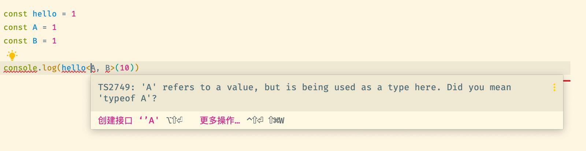

     TS 不是 JS 的超集，hh 来自 jjc 老师最新朋友圈有感~

     以上代码明明是 输出 false，false在 TypeScript 中却编译失败~   
     这说明 TS compiler 词法分析的过程中 泛型操作符 比 大于小于操作符 优先级更高。   
     A: 泛型的语法解析 - 编译器是怎么解析有歧义的泛型调用表达式？ - d41d8c的回答 - 知乎 [https://www.zhihu.com/question/445904308/answer/1751558809](https://www.zhihu.com/question/445904308/answer/1751558809)

132. 分享篇挺好玩的文章（小孩子别看）：  我拍了四年公厕涂鸦，这感觉就像读了别人的日记  [https://mp.weixin.qq.com/s/dXueBDK5hMu-nJCZ1p2zZA](https://mp.weixin.qq.com/s/dXueBDK5hMu-nJCZ1p2zZA)
133. 惊讶系列分享：   
     cowboy/abstraction-2020.js   
     [https://gist.github.com/cowboy/8270edb119c8ca700c3b1093659b3e4c](https://gist.github.com/cowboy/8270edb119c8ca700c3b1093659b3e4c)

     ```text
     let $elseif, $else, $if = state => state ? (
       $elseif = () => () => {},
       $else = () => {},
       f => f()
     ) : (
       $elseif = $if,
       $else = f => f(),
       () => {}
     )
     ```

     短短几行代码实现了状态转移，OMG...

     [https://gist.github.com/cowboy/2784002](https://gist.github.com/cowboy/2784002) 这是 12 年版本的abstraction.js

134. think of the computer display as a flip-book（翻页书）, and the pages of the flip-book as frames played at some rate when you flip them. In other words, a computer display is nothing but an automatic flip-book that plays at all times when things are changing on the screen.
135. 好文分享：   
     A deep dive into React Fiber internals   
     [https://blog.logrocket.com/deep-dive-into-react-fiber-internals/](https://blog.logrocket.com/deep-dive-into-react-fiber-internals/)

     摘要：“Fiber is reimplementation of the stack, specialized for React components. You can think of a single fiber as a virtual stack frame. The advantage of reimplementing the stack is that you can keep stack frames in memory and execute them however \(and whenever\) you want. This is crucial for accomplishing the goals we have for scheduling. Aside from scheduling, manually dealing with stack frames unlocks the potential for features such as concurrency and error boundaries. We will cover these topics in future sections.”

     深度好文，讲解了 React 15 的 Stack reconciler 的缺陷、JS 执行的机制、React 16 Fiber 意义所在、以及 React16 的渲染原理。   
     这篇文章值得前端同学花时间看一下，讲得很全面。

136. 为什么提出 Fiber？   
     因为浏览器环境 运行 JS 是单线程模型，如果当一个状态需要超过一帧才能更新时 会造成页面响应卡顿俗称掉帧，所以 React 16 在此之前提出了 Fiber，一种在上层 控制 执行机制的模型。  
     抽象来讲，浏览器是一个单核的操作系统，浏览器执行的时间 就是最宝贵的资源。 假如 有一个线程执行时间过长，就会造成系统假死。 所以需要避免这种形象的出现，在操作系统上 是有时钟中断的，而 Fiber 的设计概念就是让中断机制置于每一个渲染单元。   
     之前看国内 很多有关 Fiber 的文章时，经常把其与协程，纤程联系在一起，这完全就是不同的概念，协程是线程的进一步抽象，相当于重写 接管了线程的执行机制，它的主要意义是为了减少内核态切换带来的开销。   
     当然多了一层抽象，可做的优化点 有很多，最简单的就是资源复用，比如池化，之前看 ants 源码（潘神写的 golang 的协程池库）内部就是用的 Golang 中的 sync.Pool..

     我还想提下关于 创造性的概念 是有多么重要。   
     协程的概念 并不是 Go 提出的，goruntine 只是官方对自身协程的封装，goroutine 其实就是一些用户级的 “continuation”（[https://en.wikipedia.org/wiki/Continuation](https://en.wikipedia.org/wiki/Continuation)）。 以及通过 channel 来通信，也不是 Go 提出的，是来源于 一篇 1978年的 paper。

137. A: 我突然感受到 文章局限了我的思想，刚刚的思考 是在文章总结好的知识体系上进行的，我做的只不过把中心思想 转换为我的理解，像个复读机。

     就像我刚刚提到的问题，我觉得它很重要 但文章没有涉及。 可能作者是不知道 或 没想到，该文章总结的知识体系 应该是不系统的。 我只是满足于 总结好的知识，在其基础上 进行思考，但却没想过 基础是否合理。

     我之所以提这点，是因为我平时阅读文章，获取信息都是这样的，就算主动思考，沉淀知识 再与其他节点关联，也只不过是个复读机。

     并且更重要的是，关于一个 topic，很多文章 总结好的知识都是类似的，刚提到的问题 google 下居然没找到相关信息，这是否能说明 一些现象呢？

     或许 关于一个知识的系统性 在文章这种信息媒介上 是很难体现到位的。   
     又或许 一个知识的系统性 本身就是无法定义的，很难衡量的。   
     B: 我觉得文章是其个人对知识的总结和见解 确实有局限性，所以还是读书更可能构建知识的系统性   
     A: 赞同，可是问题是 新技术的时效性很强，书籍这种载体尤为明显..   
     C: 新技术的具体提现不应该是产品嘛 文字作为记录介质，不觉得夹杂太多东西 作为一个陈述性的途径，更多是表达不同观点和做解释   
     A: 是的，过度提炼 迷失自我了。

138. 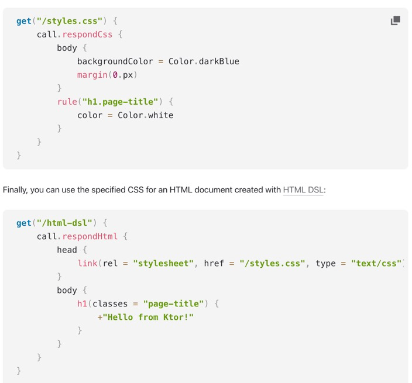  Kotlin 高阶函数调用方式 极大地增强了 语义表达能力...  A: kotlin的lambda 就像是为dsl而生的
139. 每日一句分享: 对爱情的渴望，对知识的追求，对人类苦难不可遏制的同情，这三种纯洁而无比强烈的激情支配着我的一生。 - 罗素
140. 重磅！七国首脑会议决定制裁Go语言！ [https://mp.weixin.qq.com/s/xCv0xTZ8T37q23gQy1gVqQ](https://mp.weixin.qq.com/s/xCv0xTZ8T37q23gQy1gVqQ)
141. Terms cheatsheet：

     SPA→ Single Page App

     PWA→ Progressive Web Application

     AMP→ Accelerated Mobile Pages

     CMS→ Content Management System

     SEO→ Search Engine Optimisation

     UX→ User Experience

     UI→ User Interface

     DRY -&gt; Don't Repeat Yourself

     KISS -&gt; Keep it Short, Stupid

142. 
143. 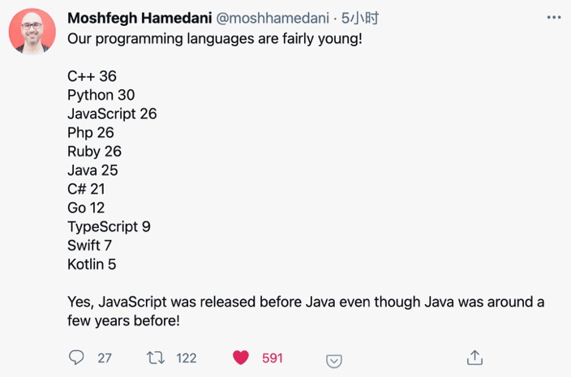

     让我想起了那个梗，应聘需求 - 需要 Swift 8 年开发经验..

144. 为什么小程序强调双线程，普通web浏览器的渲染线程和js引擎不是本来就是两个不同线程的吗? - Liuyl的回答 - 知乎 [https://www.zhihu.com/question/446103629/answer/1747236457](https://www.zhihu.com/question/446103629/answer/1747236457)  分享篇回答，简单粗暴。
145. 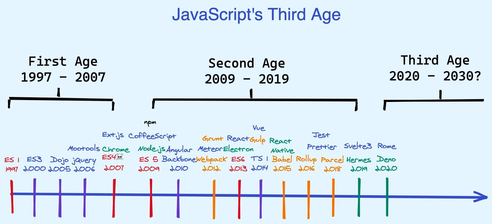
146. A: 家人们 分享点实用的pc端软件呗  B: 可以看下 我之前的一篇文章，里面有关于 Windows 的常用软件 [https://tomotoes.com/blog/Y9KK/](https://tomotoes.com/blog/Y9KK/)
147. Why doesn’t React put memo\(\) around every component by default? Isn’t it faster? Should we make a benchmark to check?

     Ask yourself:

     Why don’t you put Lodash memoize\(\) around every function? Wouldn’t that make all functions faster? Do we need a benchmark for this? Why not?

     Dan 有关 为什么不将 React.memo 设置成默认行为的回答。 [https://twitter.com/dan\_abramov/status/1083897065263034368?s=20](https://twitter.com/dan_abramov/status/1083897065263034368?s=20)

     在我看来有两点：

     1. 为了性能提高会增加大量的内存消耗
     2. 有些引用 props 在使用不当的情况下，是会一直 rerender 的

     我一直在想 React.memo, PureComponent 好像是 React 设计时的妥协.. React 的思想是 重复渲染 entire tree，不支持细粒化代理更新，那 memo 算不算 开发者为了 其设计思想 买单呢？

     翻到了一个 issue：   
     Q: When should you NOT use React memo? \#14463   
     [https://github.com/facebook/react/issues/14463](https://github.com/facebook/react/issues/14463)

     讨论得很热闹，不过没有得到一个完美的答案。

