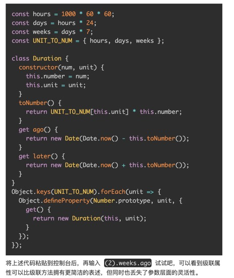
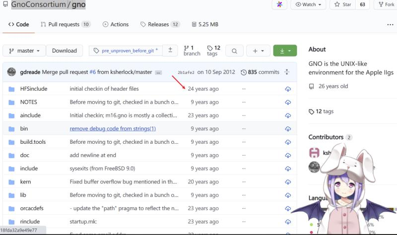
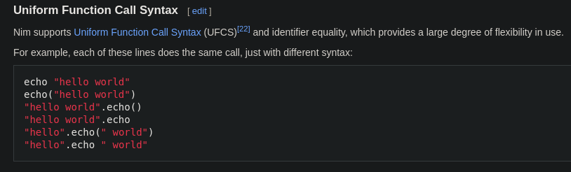
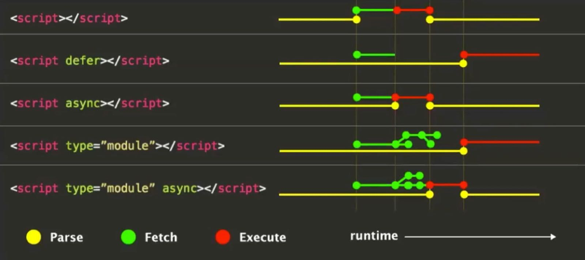
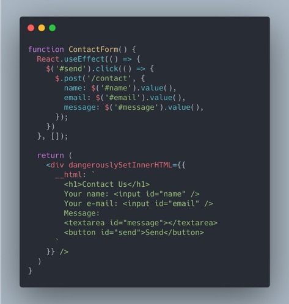
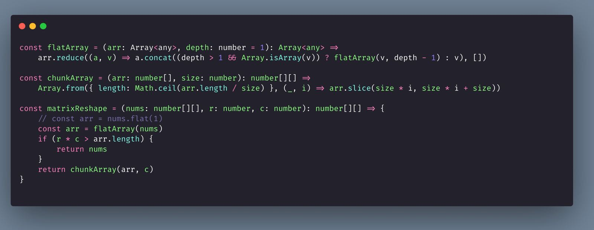

# 7-17

1. 分享本书：改变未来的九大算法 \
   [https://book.douban.com/subject/24529132/](https://book.douban.com/subject/24529132/) \
   虽然书名取得很一般，但内容还是不错的。
2. Rust相较于Haskell除了效率还有何优势？ - parker liu的回答 - 知乎 [https://www.zhihu.com/question/31644802/answer/1720583773](https://www.zhihu.com/question/31644802/answer/1720583773)
3. ES6 提出 class 关键字是希望解决什么问题？它是不是鸡肋？ - 大宽宽的回答 - 知乎 [https://www.zhihu.com/question/432832293/answer/1719931291](https://www.zhihu.com/question/432832293/answer/1719931291) \
   宽老师居然来飞书做架构师了..
4.  你辛苦学会的 Webpack dll 配置，可能已经过时了 \
    [https://mp.weixin.qq.com/s/jtIbVc9Bl50TIs7YilWbFg](https://mp.weixin.qq.com/s/jtIbVc9Bl50TIs7YilWbFg)

    之前一直没想过前端工程与dll之间的关系..
5. 分享本画册，里面的绘画都超治愈。 \
   生活蒙太奇 \
   [https://book.douban.com/subject/35088492/](https://book.douban.com/subject/35088492/) \
   摘要：我总觉得，这个世界的联系很多时候是靠共感产生的。虽然人有千差万别，但我某时某刻的所思所想一定可以代表某时某刻的一部分人。我希望能把我感受到的情绪准确地传达到那部分人心里，利用共感让他们的世界能短暂地和漫画里描绘的世界联系起来。
6. 有哪些好看到爆的油画壁纸？ - 一盏茶酱的回答 - 知乎 \
   [https://www.zhihu.com/question/311419280/answer/1485398578](https://www.zhihu.com/question/311419280/answer/1485398578) \
   写实油画 看起来太有魅力了。
7.  分享篇文章：

    React 事件系统工作原理 \
    [https://musicfe.dev/react-event/](https://musicfe.dev/react-event/)

    摘要：React 为我们提供了一套虚拟的事件系统，这套虚拟事件系统是如何工作的，笔者对源码做了一次梳理，整理了下面的文档供大家参考。
8.  快餐文分享：

    聊聊 JavaScript 的并发、异步和事件循环 \
    [https://musicfe.dev/eventloop/](https://musicfe.dev/eventloop/)

    文章涉及了一些基本的概念，可以简单看下。
9.  惊艳系列文章分享：

    用「增量」思想提升代码检查和打包构建的效率 \
    [https://musicfe.dev/delta-mind/](https://musicfe.dev/delta-mind/) \
    具体原理是使用 git diff 找到需要构建的资源。 文章很久之前读过，当时留下来挺深的印象，惊讶系列的知识实在太难遇到了..
10. 学到一个名词：语法噪音 \
    syntactic noise is syntax within a programming language that makes the programming language more difficult to read and understand for humans. 你有想到哪些语法噪音呢。
11. 

    设计 内部 DSL ，在我看来就是设计面向开发者的 UI。

    C# 的 linQ 无疑是实用性与优美性兼得的DSL。
12. 好文分享：

    前端 DSL 实践指南（上）—— 内部 DSL \
    [https://musicfe.dev/dsl/](https://musicfe.dev/dsl/)

    经典老文，建议阅读\~
13. 好文分享：

    前端响应式编程与实时计算：从 RxJS 到 Flink \
    [https://mp.weixin.qq.com/s/m5kBSTYg95qHHOaZn1NV0g](https://mp.weixin.qq.com/s/m5kBSTYg95qHHOaZn1NV0g)

    好文很难遇到，且行且珍惜。\
    RxJS 的事件组合机制, 太利于对View 驱动抽象了，惊讶。 \
    refresh$ = merge(clickRefresh$, autoRefresh$, pullRefresh$));
14. 分享篇文章：

    State of the Common Lisp ecosystem, 2020 🎉 \
    [https://lisp-journey.gitlab.io/blog/state-of-the-common-lisp-ecosystem-2020/](https://lisp-journey.gitlab.io/blog/state-of-the-common-lisp-ecosystem-2020/)

    了解下 Lisp 的生态\~
15. 故事分享：

    A short history of ReScript (BuckleScript) \
    [https://discuss.ocaml.org/t/a-short-history-of-rescript-bucklescript/7222](https://discuss.ocaml.org/t/a-short-history-of-rescript-bucklescript/7222)

    一个Ocaml狂热爱好者与他的一个想法 到 实践 推出 ReScript 的故事。\
    作者开发了 一个比编译器还复杂的解释器，找到了作者的知乎账号： [https://www.zhihu.com/people/hongbo\_zhang](https://www.zhihu.com/people/hongbo\_zhang)

    A: 原来是国人..

    B: 张宏波大神

    A: 之前只是听说过 ocaml，原来这么强大的一门语言。
16. 快餐文分享:

    Web前端剪切板文本分享到文件发送 \
    [https://mp.weixin.qq.com/s/TrrxxeGdPsF5wVoGMcuw4w](https://mp.weixin.qq.com/s/TrrxxeGdPsF5wVoGMcuw4w)

    目前 Web 还不支持复制多个文件,文件夹,Gif 动图... \
    里面涉及了 之前我们讨论过的 复制图片的点.
17. 分享篇文章: \
    Build a Regex Engine in Less than 40 Lines of Code \
    [https://nickdrane.com/build-your-own-regex/](https://nickdrane.com/build-your-own-regex/)

    40 行写一个简易的正则引擎\~

    文章简单易懂, 推荐阅读.

    [https://github.com/nadrane/build-your-own-regex/blob/master/solution.js](https://github.com/nadrane/build-your-own-regex/blob/master/solution.js) \
    这个正则引擎的实现 读起来有股淳朴的味道..
18. hah 分享篇文章:

    10 Things I Hate About SQL \
    [https://dev.to/shaqq/10-things-i-hate-about-sql-a9e](https://dev.to/shaqq/10-things-i-hate-about-sql-a9e)

    暴躁老哥 在线吐槽. With PostgreSQL, MySQL, Spark SQL, Presto SQL, SQL Server, Oracle SQL, and probably many others… we just can’t get a break! Each of these SQL implementations have slight idiosyncrasies that make it very painful to transfer queries from one system to another.
19. 想讨论下关于 React 状态管理的问题..

    随着项目的迭代, React 的项目慢慢 分成了 状态管理库(Redux)中的状态 与 组件内部的状态..

    感觉状态越来越混乱了..

    这应该是一个现代前端项目无法绕过的问题.. 全局中的状态 往往都是 很多组件需共用的状态, 组件内部一般都是 关于该组件的 UI 状态..

    这是我目前的划分, 有什么更好的实践嘛? 总觉得没有统一美..

    业界感觉除了 rxjs 也没有什么其他的实践, mobx 那一套 感觉只是加了成 proxy 的概念

    可以想想.. 感觉这块状态管理有痛点欸..

    想出来你就是下一个 Dan
20. 分享期视频: \
    炒房、卖房、租房，潘石屹的中国房地产行业掘金史【中国商业史21】第1集 \
    [https://www.youtube.com/watch?v=ISlfUzVUcSA\&ab\_channel=%E5%86%B2%E6%B5%AA%E6%99%AE%E6%8B%89%E6%96%AF](https://www.youtube.com/watch?v=ISlfUzVUcSA\&ab\_channel=%E5%86%B2%E6%B5%AA%E6%99%AE%E6%8B%89%E6%96%AF)

    这系列只讲经济不讲政治.. 多少有失偏颇.. 不过无聊的时候看一看还是挺有趣的..
21. [https://weibo.com/1787076481/K15Zi8Xk2?type=repost](https://weibo.com/1787076481/K15Zi8Xk2?type=repost)

    JavaScript 2020 年度普查 (2) · 技术章 | 程序员黄玄 - 2020 年最受关注的技术 —— 横跨 JS 方言、前端/后端/测试框架、数据层、构建工具、桌面端移动端 App 开发方案。

    视频做的很棒，建议观感\~
22. 读到一句话，感觉写的很有道理。 \
    人是社会动物，有欲望，有理智；人也是经济动物，凡事会计算利益得失。人永远在利益与代价之间，在理性与感性之间，决定自己的行动。
23. 文章分享：

    「字节跳动」投资2020：全面开花、深入布局 \
    [https://36kr.com/p/1090378619357956](https://36kr.com/p/1090378619357956)

    字节的战略布局越来越广了..
24. A: 每天调UI库的API，调到不知道该怎么提升...

    B: 可以提升到 如何在繁琐的业务中提升自己的主题。

    加班只是为了自己的今天，提升自己是为了自己的明天，有多少人只有今天没有明天，当你加班缓过神来，一定要努力提升自己。

    具体来说，提升就是学习嘛\~ 如何学习呢，这个话题就大了。

    我不想提什么广度，方向，学习资源这些横向的事，想讨论下竖向的事情。 其实这也是老生常谈的话题了，我分享下我的学习方法。

    每天读各种文章，不管是什么方向，什么领域，从这些信息中提取关键信息 反馈到自己的系统，增强与其他知识的联系。 关于如何读书，又是一个很大的话题了。

    我一般都是先简单过一遍，没有兴奋的点就pass，如果有就精度几遍，读的时候一定要思考，提问。 就比如一个应用层的框架，一定要思考到操作系统层面。 呃，以上观点 主观性极强，你可以做个参考..

    A: 我感觉还是主观能动性

    B: 哦，你说这点嘛，我理解。

    A: 我有时候读着读着就发现我需要a知识点，然后读a知识点又发现b知识点不知道，然后去读b...

    B: 哇，我超喜欢这个过程..大把的知识\~

    B: 我只是知识的搬运工，自己创造不了新的知识理论.. 太菜了
25. [https://shimo.im/sheets/wV3VVxGO5EsGXX3y/MODOC/](https://shimo.im/sheets/wV3VVxGO5EsGXX3y/MODOC/) 《个人七天沉淀计划模板》

    七天沉淀计划，还有同学要参加吗？ 我具体讲一下：

    

    意义我再补充下，关于上面的群体性，大家可能理解的不是很全面，具体指的是，当你进入到一个群体时，你的上进心 就会被潜意识地挖掘。

    每天都是由事情所驱动，不会有所懈怠，尽可能的不浪费时间。

    想参加的同学可以试一下，不需要 7 天全部，也可以单独两三天这样。
26. 

    对齐工程师可还行
27. JS 主题图标和插画艺术展 \
    [https://zhuanlan.zhihu.com/p/124302068](https://zhuanlan.zhihu.com/p/124302068)

    拟物风 爱了爱了..
28. [https://www.remotion.dev/](https://www.remotion.dev/) \
    使用 React 创造 视频...

    GUI 表达语法 的扩展程度超出我的想象。

    关于刚刚分享工具详细介绍： \
    A soft introduction to Remotion \
    [https://www.youtube.com/watch?v=szh2Qgo9SVE\&ab\_channel=uidotdev](https://www.youtube.com/watch?v=szh2Qgo9SVE\&ab\_channel=uidotdev)

    This new tool merges the video creation process with software development concepts like source code control. You don’t create videos, you program them.
29. A: 列举一下 目前我了解到的 React render domain：Web、App、PDF、CommandLine、Sketch、Video、PC native software，几乎所有可想象到的终端\~

    现在看来 ，React 的架构设计（core 与 render 的分层）真包含着大智慧。

    B: 确实 还有渲染到游戏机液晶屏的 将 React 渲染到嵌入式液晶屏 - doodlewind的文章 - 知乎 [https://zhuanlan.zhihu.com/p/89574235](https://zhuanlan.zhihu.com/p/89574235)

    A: hah 我看过这篇文章，关注作者很久了，是位白学家大佬 他之前写过一篇实现v8引擎

    B: 受益匪浅
30. A: 为什么python在科学计算这么火呢？是因为研究者喜欢吗？我一直搞不清..

    B: 因为大部分库都是写给py的吧

    C: 动态类型，运算符重载，调c方便

    A: 好吧\~\_\~ 运算符重载 是挺酷的，但是对工程化的提升不大.. 好吧，灵活性与工程化本来就很难兼得
31. Podcast分享： [https://moon.fm/share/episode/3453/](https://moon.fm/share/episode/3453/)\
    🎙Ep 07. Lisp 程序员眼中的 Python?

    讲了很多语言特性，编程范式，可以当做饭后零食\~
32. 好文分享: \
    分布式一致性与共识算法 \
    [https://mp.weixin.qq.com/s/iPynSikOAihYMIcCERtrgg](https://mp.weixin.qq.com/s/iPynSikOAihYMIcCERtrgg)
33. 惊讶系列分享，文中 画板的例子太秀了。 \
    你可能不知道的 transition 技巧与细节 \
    [https://juejin.cn/post/6924114612799406093](https://juejin.cn/post/6924114612799406093)
34. 正在找工作的前端同学可以看看，面试题都很典型。 \
    2021 千字大厂面经 & 个人成长经验分享 \
    [https://juejin.cn/post/6922290178836922381](https://juejin.cn/post/6922290178836922381)
35. CSS奇思妙想 -- 使用 CSS 创造艺术 \
    [https://juejin.cn/post/6922257014840098830](https://juejin.cn/post/6922257014840098830) \
    我愿称为大艺术家chokcoco\~
36. 🌚如何更容易上手 Typescript 类型计算？ \
    [https://juejin.cn/post/6924848590544207885](https://juejin.cn/post/6924848590544207885) \
    摘要： 最近在国内的前端圈流行一个名词“TS 体操”，TS 对应 TypeScript，“体操”是 TC 的戏称，而 TC 就是 turing completeness （图灵完备）的意思，具体就是指验证 TypeScript 的 Type-level programming （编译时（compile time）的相关语法）是图灵完备的，经过传播之后，也泛指以一个 TS 类型作为输入，通过写 TS 代码输出另外一个类型的实践。

    文章分享，写的很不错，demo也值得刷一下。
37. 实用函数式编程技巧：\
    Combinator Pattern \
    [https://juejin.cn/post/6919302763306287117](https://juejin.cn/post/6919302763306287117)\
    好文分享。 好文不易，受教了。 \
    尤其是讲 rxjs 与 函数组合概念章节 很赞，文中的 demo 将 generator 与 fp tools 结合 给了我另一个视角去思考迭代器。非常建议阅读。
38. 【译】主板芯片组和内存映射 \
    [https://juejin.cn/post/6927099189872721928](https://juejin.cn/post/6927099189872721928) \
    文章分享，干货不少，示例图有些歧义，现在北桥一般都集成进cpu了。
39. 程序调用 dll 的本质是什么？ \
    [https://www.v2ex.com/t/752972](https://www.v2ex.com/t/752972)

    帖子中 有人说 dll 的主要作用有 2 个，一个是代码复用，另外一个是节省内存。 我再补充下，还有混淆加密关键文件的作用。
40. Podcast 分享：[https://moon.fm/share/episode/3495/](https://moon.fm/share/episode/3495/)\
    🎙Ep 18. 竟然有人在前端做科学计算？

    解决了我昨天的那个py发展的问题，是因为 py 已经有很好的计算工具生态 比如numpy，借助 ai 的风潮，在科学计算领域成为了现象级的语言.
41. 文章分享： \
    一名近六年工作经验的程序员通过日常开发，沟通，排查和解决问题，来提升开发效率的经验 \
    [https://lichuanyang.top/posts/3423/](https://lichuanyang.top/posts/3423/)

    虽然文章不长，但是我觉得在工作中确实会被一些除技术外的事情影响进度，如何提高效率很重要
42. 词汇分享： \
    chew\[tʃuː] \
    v.咀嚼；思量 \
    【记】联想记忆：chewing gum（口香糖） 【考】chew sth. over 思量
43. vs stories 插件作者 ben今天推出了 最近研发的vscode clubhouse 插件\~ 执行力max..

    [https://youtu.be/hy-EhJ\_tTQo](https://youtu.be/hy-EhJ\_tTQo)

    I built an audio social network that's going to be the next billion dollar unicorn. [https://dogehouse.tv](https://dogehouse.tv) [https://github.com/benawad/dogehouse](https://github.com/benawad/dogehouse)
44. CSS 专业技巧 一个帮你提升 CSS 技巧的收藏集。

    [https://github.com/AllThingsSmitty/css-protips/tree/master/translations/zh-CN](https://github.com/AllThingsSmitty/css-protips/tree/master/translations/zh-CN)

    文章中一些技巧很有实践意义，总结了下:

    1. all: unset; 可以用all简写來指定所有元素的属性。
    2. 安装字体时，使用 local 函数检查是否本地安装
    3. a\[href^="http"]:empty::before { content: attr(href); }
45. 盘点春节红包大战：流量和多巴胺\
    [https://mp.weixin.qq.com/s/0DoZxo8QgqgTQoeUtJkncw](https://mp.weixin.qq.com/s/0DoZxo8QgqgTQoeUtJkncw)
46. 每日一句分享： \
    “Our mission is to organize the world’s information and make it universally accessible and useful.”

    来自 Google 's mission - [https://about.google/](https://about.google/)
47. hah 它终于来了。

    reactend/reactend-express \
    [https://github.com/reactend/reactend-express](https://github.com/reactend/reactend-express)

    React renderer to build Node.js server 感觉也就是一个玩具，使用 JSX 表达，让我想起了 使用 xml 配置 tomcat .. 实用价值几乎为0..
48. B: 可以衍生谈一谈这点：

    JSX 最初是用来描述 GUI 的，最大的特点是 可以在 GUI 内部包含逻辑，包含状态。

    而编程其实就是在写 UI，这里的 UI 是一个更高层次的，指的不仅是 Web，Command，还有面向开发者的 UI。

    在设计接口，设计API时，从另一个角度来看，我们本质上是在写UI。

    并且 声明式编程范式，也是一种很好的体现。

    JSX 代表的是一种表达方式，一种可以很好切合 声明式范式 需求的语义方案。

    关于声明式编程 其实可以多谈一谈。

    如果用一句话概况声明式编程的话，它最大的特点是: 它的所有语义表达, 只是在声明要做什么，具体怎么做，剩下的它不需要关心，只需要交给编译器。

    函数式编程其实就是声明式编程的一种体现。

    一些业界典型实践有，sql ，graphql，jsx

    A: 与声明式对应的是啥来着 OO？

    B: 不不不，oo 其实算不上是语义范式，是命令式的建模

    我觉得没有对应的，只是思考的层次不同吧。

    C: 声明式对应命令式吧 比如gui开发，声明式比如HTML，命令式比如qt

    B: 命令式 感觉和 声明式的思想一样的，只不过是被声明的对象不同。

    声明式的出发点是开发者，命令式的出发点是 编译器，操作系统，运行时。 照这么说，感觉所有语义范式 应该都是声明式的，只不过是声明粒度不同而已。

    而 oop 与 fp，算不上语义范式，是编程范式。

    oop 对应建模，状态传递，fp 对应 状态映射，其实 oop 与 fp 之间的关系很近的。

    A: 嗯，实际写代码的时候我基本都不 care 声明式还是命令式啥的范式。。按直觉去写了 \
    B: hah 我除了遵循 fp 的编程规范外，做到最多的事 就是隔离状态。
49. 好文分享：

    我的信息方法论：原则与实践 \
    [https://blog.ddlee.cc/posts/3a6233e2/](https://blog.ddlee.cc/posts/3a6233e2/)

    摘要：很多人都谈，我们处于一个信息过载的状态，这个时代唯一稀缺的资源便是我们的注意力。作为个人而言，如何在数字时代更健壮和自信地生活？我将在这篇文章里试图梳理自己在信息的获取和处理方面的态度和思考，以原则和实践分别叙述出来。

    这篇文章很有价值，建议阅读。

    信息源头 -> 阅读者

    信息源头 -> 平台 -> 阅读者（数量增多）

    信息源头 -> 平台（过滤，推荐，隐藏） -> 阅读者（数量增多）

    RSS：

    * Rich Site Summary & Really Simple Syndication（前者注重格式，后者强调目的：方便更新）
    * 一种信息流动的格式/协议：「允许内容提供者按一定格式组织和发布内容，方便内容消费者抓取。你甚至可以认为，它是一项信息提供者和消费者之间的“契约”。」

    如何使用 RSS：

    1. 找到网站（我主要以大佬们的博客为主）的 RSS 链接
    2. 去 [Feedly](https://feedly.com/) 服务，创建账号，搜索 RSS 订阅（想用 mac 的客户端 reeder 发现要 A 区账号而且还要钱。。）
    3. 手机也可以下载 Feedly（需要 A 区账号）
50. A: 之前我看 Go web frame 源码时，经常看到使用前缀tree做路由匹配 其实是字典树，也叫字母树的一种应用。

    B: trie树 leetcode上刷到过
51. 分享道 leetcode 上的必刷题：

    基本计算器 \
    [https://leetcode-cn.com/problems/basic-calculator/](https://leetcode-cn.com/problems/basic-calculator/)

    没有尝试过的同学可以试下，推荐。

    可惜 scriptoj 平台不继续运营了。 [http://scriptoj.mangojuice.top/](http://scriptoj.mangojuice.top/)

    这平台里面 一百多道的题 我曾经全刷过，有关于 Virtual DOM 的实现，有关于 写一个 brainfuck 的解释器， linq 的 js 版本等等，里面的题目质量不底， 有工程实践味道。 \
    另一个推荐的平台就是 codewars 了，支持很多编程语言，题目也由浅入深，推荐。[https://www.codewars.com/](https://www.codewars.com/) 断断续续的 刷到了 3段。
52. 哇 发现一个老古董\~ \
    GnoConsortium/gno \
    [https://github.com/GnoConsortium/gno](https://github.com/GnoConsortium/gno) \
    

    24 年前... 都比我大了。
53. Q: 给你一个 fetch 函数，fetch => Promise\<Data>. 请你实现 请求 8 秒无结果后，超时报错的机制。

    A: ablortController 加上promise.race \
    Q: 回答上了 promise.race 就成功了。
54. 分享篇多年前看过的好文，出自黄峰达老师之手：

    演进：如何用练习快速提升技术

    [https://mp.weixin.qq.com/s?\_\_biz=MjM5Mjg4NDMwMA==\&mid=2652975915\&idx=1\&sn=1d0c3bb0937e3d9cf1f74b1257c7aacc\&chksm=bd4ae0088a3d691e44cfaf0a3baae2cbd9b3611996663e4c00df5bbe79974b6ed005857995f4](https://mp.weixin.qq.com/s?\_\_biz=MjM5Mjg4NDMwMA==\&mid=2652975915\&idx=1\&sn=1d0c3bb0937e3d9cf1f74b1257c7aacc\&chksm=bd4ae0088a3d691e44cfaf0a3baae2cbd9b3611996663e4c00df5bbe79974b6ed005857995f4)

    对最开始刚学计算机的我，产生了很大的影响，还记得看完后 我练了一周的指法... \
    当时看完真是 收益匪浅，现在看了一遍 没多少感觉了..
55. 快餐文分享：

    如何把css'content的操作跟价值发挥到最大\
    [https://juejin.cn/post/6844903917348732936](https://juejin.cn/post/6844903917348732936)

    counter 函数 与 content 中的字符拼接 可以关注一下
56. 文章分享：

    go-patterns - Semaphore

    [https://hxangel.gitbooks.io/go-patterns/content/synchronization/semaphore.html](https://hxangel.gitbooks.io/go-patterns/content/synchronization/semaphore.html)

    使用 channel 实现 信号量，代码很简单，文章很短，建议阅读。
57. 分享篇有趣的文章：

    代码要按行收费？！\
    &#x20;[https://mp.weixin.qq.com/s?\_\_biz=MjM5NzAxMzMxOQ==\&mid=2675249783\&idx=1\&sn=89853b6c2302f2f7dbffea43739b3a61\&chksm=bc61c05f8b164949156fe0619071eecc1b1faa8f0d33a9bdc0326bc139962d3a5eae3ad4465c](https://mp.weixin.qq.com/s?\_\_biz=MjM5NzAxMzMxOQ==\&mid=2675249783\&idx=1\&sn=89853b6c2302f2f7dbffea43739b3a61\&chksm=bc61c05f8b164949156fe0619071eecc1b1faa8f0d33a9bdc0326bc139962d3a5eae3ad4465c)

    摘要：有一个站在巅峰的男人曾经应拉里 · 佩奇的邀请将谷歌的所有代码写成了一行，并且能完整的实现了谷歌现有的所有功能，人们甚至发现谷歌搜索快了将近 30%。后来有华尔街和硅谷的资深从业者看到这行代码后久久不能平静，对这行代码给出了 5600 亿美元的估值，当然这行代码一般人是看不完的，据说这行代码的长度可以从加州连接到 M31 星系。
58. 分享篇 科普文章：

    原子的故事 \
    [https://oldj.net/article/2020/09/20/story-of-the-atom/](https://oldj.net/article/2020/09/20/story-of-the-atom/)
59. 分享篇文章：

    编程语言社会学 \
    [https://yuheng.io/articles/proglang-sociology](https://yuheng.io/articles/proglang-sociology)

    作者的一个观点我很赞同：编程语言的语法就是开发者的用户界面。很大程度上，编程语言的风格决定了开发人员的思维风格，编程语言的局限也会成为开发人员的思维局限。
60. 分享篇文章：

    互联网不需要皇帝 \
    [https://greatdk.com/1696.html](https://greatdk.com/1696.html)

    摘要：互联网世界的许多东西都已经或正在消亡：RSS 在消亡，电子邮件在消亡，BBS 在消亡，超链接协议在消亡，浏览器也在消亡，剩下的只有 App，他们是互联网世界里，新立起来的一座座孤岛。 在 App 的世界中，自由举步维艰：内容审查，智障能推荐，跳转拦截，接口封闭，你的选择的权利，拒绝的权利，保存的权利，沟通的权利，都在逐渐丧失。

    哎，典型的囚徒困境 ，如果没有不可抗力 是无法破的。
61. 快餐文分享：

    Go 并发编程范例 \
    [https://steeed.gitee.io/gotour-concurrency-coding-example.html](https://steeed.gitee.io/gotour-concurrency-coding-example.html)

    Goruntine + channel 实现多种并发模型 真的不要太简单。
62. 好文分享：

    Let's Create a Simple Load Balancer With Go \
    [https://kasvith.me/posts/lets-create-a-simple-lb-go/](https://kasvith.me/posts/lets-create-a-simple-lb-go/)

    摘要：Load Balancers plays a key role in Web Architecture. They allow distributing load among a set of backends. This makes services more scalable. Also since there are multiple backends configured the service become highly available as load balancer can pick up a working server in case of a failure.

    文章写的很好，由浅入深 先介绍了 负载均衡常见的策略，然后给出了实践，重试机制，心脏检测都有涉及，可惜的是反向代理的核心流量转发 使用的是 Go library 中的 ReverseProxy..
63. 人物分享：

    欧长坤 - 2020 年终总结 \
    [https://blog.changkun.de/posts/2020-summary/](https://blog.changkun.de/posts/2020-summary/)

    这是一位我仰慕已久的大佬。
64. mutex 是 mutual exclusion 的简写，翻译一下：互相排斥。
65. 好文分享：

    工程师应该怎么学习 \
    [https://xargin.com/how-to-learn/](https://xargin.com/how-to-learn/)

    摘要：现在很多年轻的程序员会从网络博客来学习技术，但博客内容大多缺乏体系(主要说总结性质的博客内容)，不系统。很多博主为了掩饰自己的未知，遇到不知道的关键点就一笔带过，进而导致缺失。即使原作者非常努力，内容上没有缺失，你能从中获取的也只是别人总结好的知识，没有自己的主动思考，这中间便缺少过程式的沉淀，一味地满足于背诵别人总结好的知识，最后也只不过沦为他人的复读机而已。

    人这一辈子，最重要的是能把路越走越宽。对于工程师来说，能够锻炼软技能的场合其实不是很多，但也不代表完全没有。即使没有也可以自己创造机会，例如组内、组间、部门内的技术分享都是不错的机会。
66. 我还真搜到了文中提到的 awesome-awesome-awesome repo，\
    hah [https://github.com/t3chnoboy/awesome-awesome-awesome](https://github.com/t3chnoboy/awesome-awesome-awesome)

    项目描述是 A a curated list of curated lists of awesome lists. \
    哈哈哈 这种黑色幽默 太可爱了。
67. 人每天只有八个小时工作时间，谁都一样。其中能高效工作的时间绝对不超过4个小时。 这些工程师编写的代码行数绝对不算多，但从事的项目影响大。 比如 Pike，大部分时间花在了审查其他成员的 Go 代码上。而一个刚入行的 Golang 工程师，每天的任务就是写作 Go 的标准库，今天写 http 明天写 sort，写的比 Pike 多很多。 考核时，高级工程师因为带领着高效团队，每季度 OKRs 上都有诸多亮点；而刚入行的工程师，只能报告一些比较琐碎的成就。 这个观察近乎于常识，然而对于当时的我来说是一个顿悟：做出 MapReduce 框架的和写琐碎 MapReduce 程序的工程师之间的差距并不是他们的工具和编程效率，也往往不是教育背景或者经验，而是他们各自的杠杆：所带领的团队。

    问题是，没有人会给你这个杠杆。

    摘抄自 4G Spaces - 技术管理猪鸡-1 开篇 \
    [https://blog.youxu.info/2015/05/17/tech-lead-1/](https://blog.youxu.info/2015/05/17/tech-lead-1/)
68. 分享篇文章：

    Writing JavaScript tools in other languages – a new trend\
    [https://2ality.com/2020/10/js-plus-other-languages.html](https://2ality.com/2020/10/js-plus-other-languages.html)

    摘要：Recently, we have seen an uptick of JavaScript tools being written in languages other than JavaScript. This blog post lists a few examples and explains the appeal of not using JavaScript.
69. 

    自由过了火\~
70. Answer to What should you never say to a programmer? by Aladin Bensassi [https://www.quora.com/What-should-you-never-say-to-a-programmer/answer/Aladin-Bensassi?ch=99\&share=753c53dd\&srid=iVbmg](https://www.quora.com/What-should-you-never-say-to-a-programmer/answer/Aladin-Bensassi?ch=99\&share=753c53dd\&srid=iVbmg)

    代入感很强，已经开始生气了..
71. 

    hah 第一次碰到 so 维护..
72. Learn fp visually

    [https://david-peter.de/cube-composer/](https://david-peter.de/cube-composer/)

    一个 立方体映射的游戏，玩到 3.1 就玩不动了..
73. 词汇分享： \
    Ponder /ˈpɑːn.dɚ/

    to think carefully about something, especially for a noticeable length of time:

    例：She sat back for a minute to ponder her next move in the game.
74. 刚刚学到两个快捷键，在 Chrome 下键入：

    1. Command + up arrow：页面滚动至顶部
    2. Command + down arrow: 页面滚动至底部 平时都是用 vimium 的 G 与 gg...

    并且在 Finder 中键入：

    1. Command + up arrow：返回上一目录
    2. Command + down arrow: 返回刚刚的目录 这些快捷键 与 鼠标手势，剪切板手势结合 简直完美\~
75. 如何监听 React 应用的性能：
    1. 使用 React 官方提供的 Development tool plugin 中的 Profiler panel，控制台可见
    2. 与上面类似，使用 React 提供的 Profiler 组件，在 onRender props 中可以拿到渲染的信息。
    3. 使用 Chrome Dev Tools 的 performance tab，使用之前需要禁用 React Development tool 插件，不然会影响性能，记录之后 在 timing 中有查阅。
    4. 使用 performance api 拿到信息，不过经常用于埋点。
76. React 组件测试的两种场景：

    1. 组件 snapshot 测试，常见的工具有 jest

    > 将组件渲染出来的元素截取 与预期元素做判断，可以看做一种断言测试。

    &#x20;   2\. e2e 测试（end to end），一般使用 headless browser 作为测试工具，常见的工具有 cypress

    > 在“真实”环境下，模拟用户运行应用测试。

    测试的类别：单元测试，集成测试，冒烟测试 等...

    随便提下：AB 测试与灰度发布 其实是一种概念，AB 测试可以看做带有埋点系统的灰度发布。 \
    之所以这么划分，在我看来 是因为出发点的不同。\
    AB测试 是从产品，数据角度。 灰度发布 是从运维，开发角度。
77. A: 可以讨论下 测试驱动开发。业界俗称 TDD

    测试驱动开发 我觉得最关键的是 分场景。 需要质量保障，可以按模块分期迭代的场景比较适合。

    因为我从来没写过测试，所以对它的解决的痛点不是很了解。

    B: 先编写测试 测试飘红写业务代码，然后绿了在重构，红绿红绿

    A: 原来这就是 测试驱动开发，还能被绿，开心。

    感觉最好的测试 就是防御性编程了。

    我指的是，开发时遵守规范，如果当复杂性很难控制 或者 数据流模糊不清，就是测试失败了。

    我感觉很多时候，先写测试用例，大概率会重写，因为有的点 只有开发时才会意识到...

    还是看测试粒度吧.. \
    B: 我觉得tdd是个好的锻炼思维逻辑还有对后期代码维护调试的方法

    传统的tdd应该就是先写测试，不写业务代码，全权由测试引出需要抽象的那些，看过一些大佬码代码的过程 是啊，正常写代码也是迭代的过程吧，那些点就是重构的阶段了也符合tdd \
    A： 哦，看起来 测试驱动 应该是强调 思维重心，先由 测试引出设计，这个听起来挺厉害的... \
    B: 是啊，而且先写测试也能强迫你出松散耦合的设计 而且测试可以当做文档使用

    A: 了解，测试当文档使用，指的是测试的伪代码吗？还是说 测试有一套 dsl 可以描述信息？ 感觉 tdd 并不适合UI开发。 \
    B: 一个测试对应一个功能，一个测试对应一个类 加上测试方法命名规范，基本上就知道这个测试 A: 我刚刚想了下，感觉 tdd 的适用性 与 前端（这里泛指GUI）与后端开发模式的不同存在很大关系。\
    今天早上看了一篇文章，写的很有道理，关于GUI 开发复杂性。

    The complexity that lives in the GUI \
    [https://blog.royalsloth.eu/posts/the-complexity-that-lives-in-the-gui/](https://blog.royalsloth.eu/posts/the-complexity-that-lives-in-the-gui/) \
    文章把主要的痛点 都归结于组件之间的状态管理。 正因为组件（模块，单元，类 一种概念）之间的状态 划分不清，开始设计时 很难把所有的 UI 状态，数据状态都想到位。
78. 好文分享：

    深入理解JSCore \
    [https://tech.meituan.com/2018/08/23/deep-understanding-of-jscore.html](https://tech.meituan.com/2018/08/23/deep-understanding-of-jscore.html)
79. 分享两篇关于介绍 React-Native 比较简明的文章：
    1. React Native架构一览 [http://www.ayqy.net/blog/react-native-architecture-overview/](http://www.ayqy.net/blog/react-native-architecture-overview/)
    2. React Native架构演进 [http://www.ayqy.net/blog/react-native-new-architecture/](http://www.ayqy.net/blog/react-native-new-architecture/)
80. HTTP2.0 的多路复用 与 浏览器网络连接限制 针对 Web 应用优化的建议：

    1. 如果服务端配置了 HTTP 2.0 ，那么建议域名收敛，可以最大程度上 多个请求复用同一个链接，可以消除重复连接带来的消耗。
    2. 如果服务端没有配置 HTTP2.0，并且请求数量很多，建议域名分散，最大程度上 不阻塞 请求统一域名下的资源。

    我总结的这个主题，有同学想讨论下吗。 \
    域名收敛 与 域名分散 居然出现在了同一个场景。\
    好吧，其实我对浏览器限制同一域名最大请求限制数 这个规则挺好奇的。 \
    其实这点与 tcp 拥塞避免 规则 可以联系到一起。\
    &#x20;一句话概括：为了正义.\
    可以看下这个回答 浏览器允许的并发请求资源数是什么意思？ - bombless的回答 - 知乎 [https://www.zhihu.com/question/20474326/answer/15691654](https://www.zhihu.com/question/20474326/answer/15691654)
81. 分享个好玩的项目：

    GTAmodding/re3 \
    [https://github.com/GTAmodding/re3](https://github.com/GTAmodding/re3)

    GTA3 罪恶都市源代码 全局搜了下 nuttertools 居然啥也没找到，这不是真的罪恶都市
82. 优化 HTTPS 的一些策略：
    1. session 复用，将非对称加密的结果保存到 session 中，下一次连接直接复用
    2. TLS 1.3 ，一次 RTT 即可握手成功
    3. TCP fast open, 将 三次握手 优化成 二次 + 凭证 认证
    4. HSTS：强制使用 HTTPS 访问，减少一次 302
83. 分享篇文章：

    DNS的历史和原理 \
    [https://yangwang.hk/?p=852](https://yangwang.hk/?p=852)

    摘要：在1973年，IETF（国际互联网工程任务组）发布了RFC 606，RFC 608等几个文档，决定由斯坦福研究院网络信息中心（NIC）作为hosts文件的官方来源，互联网上的所有主机均从该中心下载hosts文件使用。这套方案从1973到1983运作了差不多十年时间。相比于70年代，十年后的主机数量已经庞大得让这套系统得缺陷也被暴露出来：由于主机的增加，hosts文件像滚雪球一般变得越来越大。更糟糕的是主机名到IP地址的映射关系不是固定的，换人话说，那就是一台主机的IP地址可能随时间发生变化。主机数量越多，文件的变化率也就越大。以至于到后期每天都要从NIC重新下载最新的hosts文件。
84. 想讲讲 客户端缓存，也就是只有静态页面，没有服务端的应用 该怎么利用好缓存，让页面加载更快。 \
    我在这方面有一些实践，因为我的网站是一直是托管在 github page 和使用 jsdriver cdn 这样的，除了域名 没有买过服务器，所以网络请求的优化也无法涉及，只能从客户端性能这边入手。 \
    但是 只讲下 页面缓存，其他优化的点 暂时不涉及。 \
    我最开始使用的页面缓存 很蠢，我把关键 css，js 的内容保存到 localStorage 中，然后页面 onload 时，判断是否命中，命中的话读取，反之拉取数据。\
    这是真的，我大二的实践，当时还写了一个简单的版本管理... \
    唯一的性能就是 从磁盘与从网络 读取的速度不同了，但是由于 localStorage 最大 5 mb ，没办法继续。\
    然后我开始想办法 在用户进入我的首页时，就把其他页面的资源加载好，就比如我其中一个实践是：

    在用户进入 tomotoes.com 时，会加载一个display:none 的 blog 页面的 iframe，然后用户大概率会进入到博客，此时 博客的所有资源都是从 内存中加载的，超快。 \
    但是很明显，牺牲了首页的性能换来了其他页面的性能提升。 \
    然后，我就开始钻研起了 pwa-service-worker 的 缓存机制 \
    A: 这种像是prefetch啊 \
    是的，不过我的优先级很高，hh\~ 关于全站上 sw 这事我做了一周多，因为我的网站分为多个子站点，而每个站点的技术栈不同，打包的机制不同，想把所有站点全上 sw 缓存 就必须把所有打包机制全统一化，就比如 主页使用 gulp，博客使用 hexo，关于页 webpack 等等。 \
    其实 sw 缓存还有代理的功能\~ 配置项很多，玩法就很多
85. 

    注意，module 文件 A 中 import 的其他文件（B，C） 加载机制是不同的。

    1. A 与 BC 是串行加载，只有 fetch A 之后 才能加载 B C
    2. B 与 C 是可以并行加载

    如果是手动加载 script，默认是 async 的方式 \
    [https://javascript.info/script-async-defer](https://javascript.info/script-async-defer)
86. Windows 10X 上手体验 \
    [https://sspai.com/post/64991](https://sspai.com/post/64991)

    好家伙，Windows 又新增了一种设计系统.. 之前的 WinXP，Win7 拟物，Win10 Fluent Design 还不嫌乱嘛..
87. 很好奇 TLS1.3 改进了什么算法，一次 RTT 即可握手成功。TLS 详解握手流程 [https://juejin.cn/post/6895624327896432654](https://juejin.cn/post/6895624327896432654)

    摘要：TLS 三个版本的握手方式，你都了解吗？

    介绍了 RSA、DH、TLS1.3 握手流程，只是宏观层面...\
    The Transport Layer Security (TLS) Protocol Version 1.3 \
    [https://tools.ietf.org/html/rfc8446](https://tools.ietf.org/html/rfc8446)

    找到了 TLS1.3 的 rfc，算了还是宏观了解下吧。
88. Question：抓包工具是 如何拦截记录 HTTPS 请求的呢？

    抓包工具实际上是作为 客户端与服务端的中间人。 \
    客户端以为是与服务端通信，实则是与抓包工具。 服务端以为是与客户端通信，实则是与抓包工具。

    服务端与抓包工具的通信 就是正常的通信。 \
    而客户端与抓包工具的通信 是在 用户已经在系统安装了抓包工具根证书的前提下的。

    当客户端与抓包工具通信时，验证抓包工具的证书，会以已经安装好的根证书去验证。自己验证自己是一定会通过的。 \
    所以说，当抓包工具不使用时，尽快把它的根证书下掉，万一黑化 很可怕的。
89. 

    A: hah 我今天早上 也刷到这张图了 \
    B: 这是一台已觉醒的服务器对后一台的温柔。。
90. Kotlin基金会成立 \
    [https://kotlinlang.org/docs/kotlin-foundation.html](https://kotlinlang.org/docs/kotlin-foundation.html) \
    这两天 Kotlin, Rust 的基金会都成立了，好耶\~
91. 写一篇最好懂的HTTPS讲解 \
    [https://juejin.cn/post/6925296374628122632](https://juejin.cn/post/6925296374628122632) \
    分享篇科普文，文中有一处错误，通过数据解密成功失败去认证权威性 显然是不对的，而是在使用公钥解密后拿到数据摘要，客户端本地在使用hash生成一份数据摘要，只有这两份摘要相同才认证成功。
92. 分享篇老文 \
    Tutorial - Write a Shell in C \
    [https://brennan.io/2015/01/16/write-a-shell-in-c/](https://brennan.io/2015/01/16/write-a-shell-in-c/)

    之前使用 Golang 写过 一个简易的 Shell，原理很简单。

    文中介绍了下：Let’s look at a shell from the top down. A shell does three main things in its lifetime.

    Initialize: In this step, a typical shell would read and execute its configuration files. These change aspects of the shell’s behavior. Interpret: Next, the shell reads commands from stdin (which could be interactive, or a file) and executes them. Terminate: After its commands are executed, the shell executes any shutdown commands, frees up any memory, and terminates.
93. 好文分享：

    An Interactive Guide to CSS Transitions \
    [https://www.joshwcomeau.com/animation/css-transitions/](https://www.joshwcomeau.com/animation/css-transitions/)

    摘要：The world of web animations has become a sprawling jungle of tools and technologies. Libraries like GSAP and Framer Motion and React Spring have sprung up to help us add motion to the DOM.

    The most fundamental and critical piece, though, is the humble CSS transition. It's the first animation tool that most front-end devs learn, and it's a workhorse. Even the most grizzled, weathered animation veterans still reach for this tool often.

    文章很有价值，建议阅读。总结下自己从文章受益的点：

    1. 有的规则不能被子像素渲染，比如 margin，所以过渡时无论是 cpu 还是 gpu 渲染都需要 round to the nearest pixel, creating a stepped, janky effect.
    2. 过渡行为中定义的 transition 其实是在过渡行为结束后 才会起作用，这一点可以和之前分享过 chokcoco 你可能不知道的 transition 技巧与细节一文 联系在一起。 （可以在群记录中搜索 画板例子太秀了 关键词）
    3. Doom flicker，触发动画的元素 与 动画运动元素 一定要分清
    4. @media (prefers-reduced-motion: reduce) 可以使用此选择器禁用动画 关于最后一点，确实 动画太多，整个页面看起来较油腻，建议设计时 动画要小而精美。
94. 分享一个数据结构的基础知识：
    1. 树是图的联通无环类型
    2. 链表是树的非叶节点只有一个子节点类型
95. 词汇分享：

    plight /plaɪt/ 困境

    an unpleasant condition, especially a serious, sad, or difficult one:

    eg: the plight of the poor/homeless eg: Few of us can be unmoved by the plight of the refugees. 光被挡住了，就会陷入困境。
96. 提个观点，平衡二叉树（AVL）树 是二分搜索在存储结构设计上的体现。

    A: 在学红黑树，突然联想到的一个概念.. \
    B: 我之前面试的时候，让我手撕红黑树 \
    A: 之前X给我讲过 java hashmap 的底层设计。 hashmap 不可避免的问题是 hash 冲突，解决 hash 冲突的两种办法：开放寻址，链式解决。 \
    java hashmap 的设计是当相同地址，冲突的元素小于等于 8 时，是链表挂载；当大于 8 时会变成一根红黑树（当然概率很小）。 \
    所以说 hashmap 存取 都为 O(1) ，在 java 的 hashmap 某些场景中（冲突数大于 8）是不成立的。 \
    当然 O(1) 本身就是个伪命题，感兴趣可以延伸讨论下 之前我的观点（聊天记录搜索 大 O符号表示法） \
    C: 解决哈希冲突还可以在哈希 \
    推荐一个红黑树操作的可视化演示网址

    [https://www.cs.usfca.edu/\~galles/visualization/RedBlack.html](https://www.cs.usfca.edu/\~galles/visualization/RedBlack.html)
97. 文章分享： \
    如何基于心智模型打造更棒的用户体验 \
    [https://mp.weixin.qq.com/s/6-M3iyHQYHxYUNNWoUAx\_Q](https://mp.weixin.qq.com/s/6-M3iyHQYHxYUNNWoUAx\_Q)

    摘要：用户体验设计存在的一个主要原因，就是为了迎合人们的心智模型，从而帮助他们以尽可能最佳的体验去完成任务。

    那么关键的问题来了，如何将心智模型应用于 UI-UX 设计中呢？我们又要如何利用用户体验中的这种心理因素来构建更人性化的产品呢？
98. 快餐文分享：

    CSS现状和如何学习 \
    [https://mp.weixin.qq.com/s/ztU1tESHy-5kF2iFpZbgfw](https://mp.weixin.qq.com/s/ztU1tESHy-5kF2iFpZbgfw)

    hah 我曾经也写过 CHSS，文章实在太长了...

    摘要：CSS与其编程语言不同，她没有循环、逻辑和其他概念，它只是声明式的语言，因此，CSS很容易上手。也许正是因为如此，它才获得了简单的美誉。在 "不复杂 "的意义上，它是简单的，但这并不意味着它很容易。把 "简单 "误认为是 “容易”，只会让人心痛”。
99. 分享个很全面的 Vim Cheatsheet：[https://devhints.io/vim](https://devhints.io/vim)
100. 每日一句分享： \
     如果把人看作一个machine，这个machine有输入有输出，最初这个machine只拥有时间维度，逐渐它拥有了技能维度，积累了金钱维度，把时间、技能与金钱看作它的输入端，那它输出端就是金钱、技能与影响力维度，其中金钱和技能在输入与输出间自循环，一般是正向的。 [https://twitter.com/madawei2699/status/1361562843372417026?s=20](https://twitter.com/madawei2699/status/1361562843372417026?s=20)
101.    安利下 三款命令行应用：

        1. exa - ls 的替代品，更强大 配置项众多 [https://github.com/ogham/exa](https://github.com/ogham/exa)
        2. cheat - man 的替代品，所有文档由社区维护，也可自定义 [https://github.com/cheat/cheat](https://github.com/cheat/cheat)
        3. broot - file browser 在 Windows 上用了挺久了，非常强大。 [https://github.com/Canop/broot](https://github.com/Canop/broot)

        一些其他的 autojump fzf ni bat git-extra gacp silver-searcher ...
102.    分享个项目：

        50projects50days \
        [https://github.com/bradtraversy/50projects50days](https://github.com/bradtraversy/50projects50days)

        使用 CSS HTML JS 构建的 50 个小项目，代码质量可以、项目也都很不错，可以作为练手项目。 比如使用 React Hooks + TS 重写一些例子。 下面是我重写 ToDo App 的一个例子： [https://github.com/Tomotoes/50projects50days-react/blob/master/src/todo-list/index.tsx](https://github.com/Tomotoes/50projects50days-react/blob/master/src/todo-list/index.tsx)
103.    好文分享：

        Exploring Node.js Internals \
        [https://www.smashingmagazine.com/2020/04/nodejs-internals/](https://www.smashingmagazine.com/2020/04/nodejs-internals/)

        文章介绍了 Nodejs 的内部构造 以及 调用 系统 API 时 底层是如何运行的，并在最后指出了IO操作时，JS 并非是单线程的。

        摘要：we will dig deeper into the Node.js runtime, understanding how it runs JavaScript, seeing whether it actually is single-threaded, and, finally, better understanding the interconnection between its core dependencies, V8 and libuv.

        文中指的 运行在虚拟机的语言 ，可简单列举下：

        1. JVM (java,scala,kotlin,groovy,Clojure...)
        2. CLR (C#)
        3. BEAM (erlang, elixir)

        我记得很久之前（大家在讨论 arguments 特性时） 我曾提过一点： 学习 JavaScript 最痛苦的地方就是，环境（Nodejs、浏览器）给你的 API，是无法直接查看源码的，它不像其他语言会有自建的 SDK，它的所有 API 都像是个带有规则的黑箱。 如果想查看源码，只能去翻看相应的 v8 构建。 \
        其实有的语言，比如 Go，Java 也是对一些 built-in 函数、关键字 有所黑箱，因为有的东西 确实无法自举... \
        实现的层级 不同没办法的。 \
        A: Python JS这些脚本语言算是跑在虚拟机上的吗

        JS 不是跑在虚拟机上的，它是一门解释编译语言，有对应的解释器与运行环境就可以了。 Python 也是如此的，是一门解释语言，不需要虚拟机。 \
        虚拟机最大的好处 就是可以使用虚拟机上面已有的生态，开发语言时也无需考虑后端（指编程语言）的设计。 \
        当然 跨平台 拿到现在就没什么亮点了。
104.    好文分享：

        随机数的故事 - 李银城的文章 - 知乎 \
        [https://zhuanlan.zhihu.com/p/205359984](https://zhuanlan.zhihu.com/p/205359984)

        文中涉及了一些知识，概况一下：

        1. v8 Math.random 是借助系统上的随机数能力实现的
        2. 系统上随机数 是不安全的，在大的数据量下会有特征
        3. 可以借助window.crypto.getRandomValue实现更安全的随机
        4. 真随机的实现有多重多样，文中说的 根据系统运行时的噪音生成、大气噪音、量子随机等等
105.    

        这买了血赚，才 20k
106.    

        React 的正确打开方式
107. 每日一句分享： \
     线程的实现模型主要有3种：内核级线程模型、用户级线程模型和两级线程模型（也称混合型线程模型），它们之间最大的差异就在于用户级线程与内核级线程的对应关系。
108.    分享篇文章：

        平台与创新的悖论：Facebook头顶紧箍咒 \
        [https://www.huxiu.com/article/409688.html](https://www.huxiu.com/article/409688.html)
109.    分享篇文章(官方faq)：

        Why is esbuild fast? \
        [https://esbuild.github.io/faq/](https://esbuild.github.io/faq/) \
        这篇文章 建议前端同学阅读，里面有涉及 JS 运行时的缺陷。
110.    词汇分享：

        typist\[ˈtaɪpɪst] \
        n.打字员
111.    分享道题目：

        重塑矩阵 \
        [https://leetcode-cn.com/problems/reshape-the-matrix/](https://leetcode-cn.com/problems/reshape-the-matrix/)

        感兴趣的同学可以刷一下。\
        &#x20; \
        分享下我的做法
112.    好文分享：

        JavaScript Promises: 9 Questions \
        [https://danlevy.net/javascript-promises-quiz/](https://danlevy.net/javascript-promises-quiz/)

        My goal is to try a new ‘quiz tool’ I built for my blog, and get feedback on how well you learned from the excercise.

        除了第一个比较特例，剩下的都正确了，文章是以题目+讲解的形式 去学习 Promise 。
113.    分享个项目：

        apankrat/nullboard \
        [https://github.com/apankrat/nullboard](https://github.com/apankrat/nullboard) \
        Nullboard is a minimalist kanban board, focused on compactness and readability.

        53kb 的“单页面”看板应用，看了下源码 太强了..\
        该应用使用 jQuery 写的，假如是 React 的 会是什么形式呢？ 首先一定会分隔成多个组件，每个组件有多种状态... \
        这种 jQuery 一把梭 的方式看起来挺酷的.. 所以说 React 的组件化 与 状态驱动 思想 很利于工程化，在大中型项目中会感受到明显收益，而小型项目中引入（主要还是看场景）多少有点过渡设计的味道。 \
        好吧，这句话没什么价值。 因为项目大小 与 工程化 没有一个很好的鉴定。
114. Podcast 分享： \
     OCaml编程语言 - 张宏‪波‬ \
     [https://podcasts.apple.com/cn/podcast/ocaml%E7%BC%96%E7%A8%8B%E8%AF%AD%E8%A8%80-%E5%BC%A0%E5%AE%8F%E6%B3%A2/id1098682510?i=1000396401474](https://podcasts.apple.com/cn/podcast/ocaml%E7%BC%96%E7%A8%8B%E8%AF%AD%E8%A8%80-%E5%BC%A0%E5%AE%8F%E6%B3%A2/id1098682510?i=1000396401474)
115. Tailwind CSS （可能）是名过其实的 \
     [https://juejin.cn/post/6930196913119576077](https://juejin.cn/post/6930196913119576077) \
     分享篇文章，文中的观点很赞同：对于原子类的使用，一直有这样的痛点：当封装的粒度太小时，会显得异常繁琐，反之想自定制化时又经常不合适。
116.    A: 感觉技术的发展有点像个圈子 新的东西也很容易找到以前的影子

        是啊，计算机领域多久没更新新的理论了，很多基础概念都是89十年代的那群大佬已经定下的了。 \
        就比如 redux 提倡的全局唯一状态不可修改，纯函数，都是来自 fp 的基础理论。 \
        今天我了解到了一个概念，编程范式会对GC有明显的影响。 \
        我想说的重点不是这句话，而是 我觉得很多基础设施决定了上层的发展，同时也限制了新的创新。 \
        举个例子，假如从一开始就不是冯诺依曼体系的计算机，而是细胞自动机或者其他体系，还会有并发原语，数据结构等这些概念的出现嘛。&#x20;
117. 今天还和一朋友讨论 css 的设计，不正交性，理论耦合过深。\
     我相信很多同学从一开始接触前端 都用过dreamweaver，它支持可视化搭建界面，就像 winform,android studio那样，为什么它没有继续流行起来？ \
     我相信在以后(现在 low code 平台已经成为了大厂绩效的风向标)，一定会再出现的。
118.    分享篇文章: Java 新特性解析：模式匹配 \
        [https://www.infoq.cn/article/1CB7jiLBmvU3Hbxw2ZO7](https://www.infoq.cn/article/1CB7jiLBmvU3Hbxw2ZO7)

        这怎么越来越 Scala 化了... 有趣
