# 1-18

1. 好文分享：

   Blogged Answers: A \(Mostly\) Complete Guide to React Rendering Behavior [https://blog.isquaredsoftware.com/2020/05/blogged-answers-a-mostly-complete-guide-to-react-rendering-behavior/](https://blog.isquaredsoftware.com/2020/05/blogged-answers-a-mostly-complete-guide-to-react-rendering-behavior/)

   摘要：下面的图片。

   这篇文章大而全，从各个场景介绍了 React 渲染的行为，用空的前端同学 强烈建议话时间读一下。 我断断续续读了快一个小时，比之前分享的那篇用 TypeScript 写 Curring Type 文章还要长.. 有空的前端同学 强烈建议花时间读一下。

   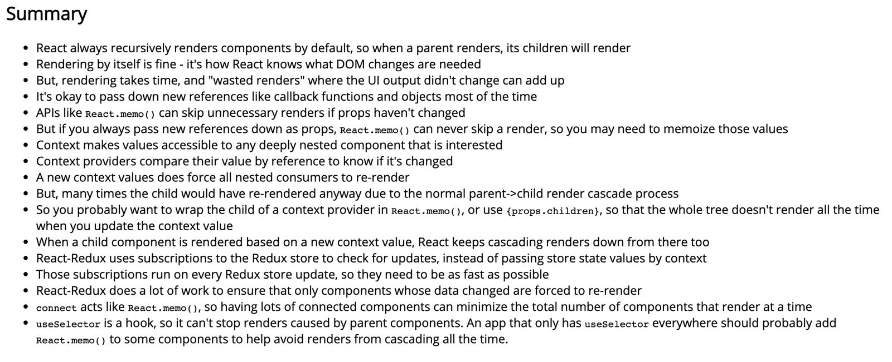

2. 应用程序的内存布局。

   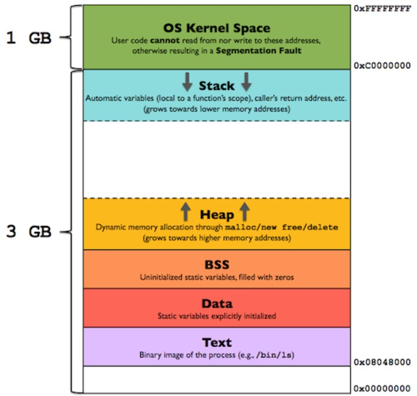

   栈区（Stack）— 存储程序执行期间的本地变量和函数的参数，从高地址向低地址生长； 堆区（Heap）— 动态内存分配区域，通过 malloc、new、free 和 delete 等函数管理； 未初始化变量区（BSS）— 存储未被初始化的全局变量和静态变量； 数据区（Data）— 存储在源代码中有预定义值的全局变量和静态变量； 代码区（Text）— 存储只读的程序执行代码，即机器指令； 上述五种不同段虽然存储着不同的数据，但是我们可以将它们分成三种不同的内存分配类型，也就是静态内存、栈内存和堆内存。

   摘抄自 内存管理设计精要 [https://draveness.me/system-design-memory-management/](https://draveness.me/system-design-memory-management/)

3. 每日一句分享:  产品负责界定和提供长期用户价值，运营负责创造短期用户价值+协助产品完善长期价值。
4. 数据最具有说服力，数据最具有迷惑性。

   有的人就是喜欢读那种“干货满满”的文章，要么充斥着大量的图表和数据，要么夹杂着大量的参考文献，给人一种论据充分、无可置疑的印象。

   实际上此类文章更难以辨别真伪，因为查证是个递归的过程，一个证据往往需要更多的证据去支撑。这一方面成本极高以至于一般人懒得彻底查证，不如直接选择相信；另一方面会有自我引用和循环引证之嫌疑，例如有个著名的段子：一个人发表了十篇文章，总被引次数为45次。

   至于数据的迷惑性就更高了。一方面，数据是客观的，但数据的分析和解释是主观的。另一方面，数据比文字更容易造假，更容易造出合理但不符合事实的数据，本福特定律并不只是审计人员才懂。这方面举两个例子吧：一是法广报道中国疫情“中国本土新冠确诊暴增7.5倍”，实际上只是从2增加到15。二是“中国国足世界杯只输过3场”，这个就不需要解释了。

   道理不言而喻，一目了然。有句话说得好，绝对的谎言不足以彻底迷惑人，半真半假的谎言才足够具有欺骗性。

   来自 Aurora 的一则灵感。

5. 词汇分享:  profound - adjective /prəˈfaʊnd/
   1. felt or experienced very strongly or in an extreme way: Eg: His mother's death when he was aged six had a very profound effect on him.
   2. showing a clear and deep understanding of serious matters: Eg: profound truths/wisdom
6. 分享篇文章:

   How I cut GTA Online loading times by 70%   
   [https://nee.lv/2021/02/28/How-I-cut-GTA-Online-loading-times-by-70/](https://nee.lv/2021/02/28/How-I-cut-GTA-Online-loading-times-by-70/)

   文章讲述了作者难以忍受 GAT OL 缓慢的加载速度-7分钟\(与7年前发布时基本没变\)，使用反汇编工具，一步一步调查出花费时间的瓶颈 的经历。 瓶颈是 GTA OL 在启动时会加载 10mb 63k item json\(作者猜测是有关 游戏内购买商品\) 数据，并且存储为一个数组，解析后还会逐个检查 hash ，这几个流程将花费6分钟.. 作者在最后呼吁 R\* 解决这个问题\(确实很容易解决，结尾也给出了方案\)。

7. 主板上这家伙，要当CPU和内存的中间商！ [https://mp.weixin.qq.com/s/UKPagzvcwyY5RzOLWIff5g](https://mp.weixin.qq.com/s/UKPagzvcwyY5RzOLWIff5g)  快餐文分享，简单介绍了内存条的组成单元，以及与 OS 交互的基本原理。
8. 二月分享：   
   2.1 ~ 2.6 （97）：[https://thinking.tomotoes.com/archives/2021/2/1-6](https://thinking.tomotoes.com/archives/2021/2/1-6)   
   2.7 ~ 2.17 （118）：[https://thinking.tomotoes.com/archives/2021/2/7-17](https://thinking.tomotoes.com/archives/2021/2/7-17)   
   2.18 ~ 2.28 （147）：[https://thinking.tomotoes.com/archives/2021/2/18-28](https://thinking.tomotoes.com/archives/2021/2/18-28)  
   终于整理完了，2 个半小时... 早知道不学这么多东西了。   
   并且以后 可能会去掉 分类（Tag）[https://thinking.tomotoes.com/tags](https://thinking.tomotoes.com/tags)。

   这两期的汇总一直没时间同步到分类，太花时间了😷

9. 漫画 \| Linux之父：财务自由以后，我失眠了！ [https://mp.weixin.qq.com/s/j3c1feAroSErPcdwGNyccA](https://mp.weixin.qq.com/s/j3c1feAroSErPcdwGNyccA)  分享篇文章，简单介绍了 托瓦茨 的开发 linux 经历，文中有很多梗 来自托瓦茨的自传 Just for fun.
10. 快餐文分享:

    Architecturally Significant Requirements   
    [https://luminousmen.com/post/architecturally-significant-requirements](https://luminousmen.com/post/architecturally-significant-requirements)

    文章介绍了架构中的常见术语: Availability\(可用性，3个9\) ，Fault Tolerance\(容错性，包括可用性\)，Durability\(持久性，主要手段通过 校验和 等编码算法 或 多地备份保证\)，Resiliency\(弹性，抵抗系统攻击，某一节点出错的能力，比较常见的有 服务熔断，降级，限流等容灾手段\)，Reliability\(可靠性，符合预期\)，Scalability\(扩展性，基本上符合 SOA 架构的，扩展性都很容易保证\)。

11. 每日一句分享:  成功的反义词不是失败，而是什么都不做。
12. 词汇分享:   
    rim - noun /rɪm/   
    the outer, often curved or circular, edge of something

    Eg: The rim of the cup was chipped and broken.   
    让我想起了之前 吐槽 nim 语法 过于灵活\(对一个方法 既可以命令式，也可以函数调用，调用形式像是 py2 与 py3的融合\)。  
    一种语义对应多种行为，过于灵活，无疑会增加开发者的心智负担，在我看来设计得不严谨，不利于工程化。   
    当然，灵活性与工程化本来就很难兼得。

13. 之前学 rust 的时候，有一个特性很让我无语，rust 函数可以在内部写一个表达式，代表的就是函数返回值，可以不声明 return。 但除了减少代码量，我看不到任何好处，把函数中 最关键的意图隐藏在代码内部.. 并且 rust 为了实现 0gc，在语言上增加了太多的概念，付出代价不小，所有权，生命周期，在语法上的表现就是 各种符号混杂在一起，你需要理解每一个概念，才能正常开发。  如果不是为了开发稳定的运行时应用，比如操作系统，我暂时还想不到有什么非用不可的领域。
14. 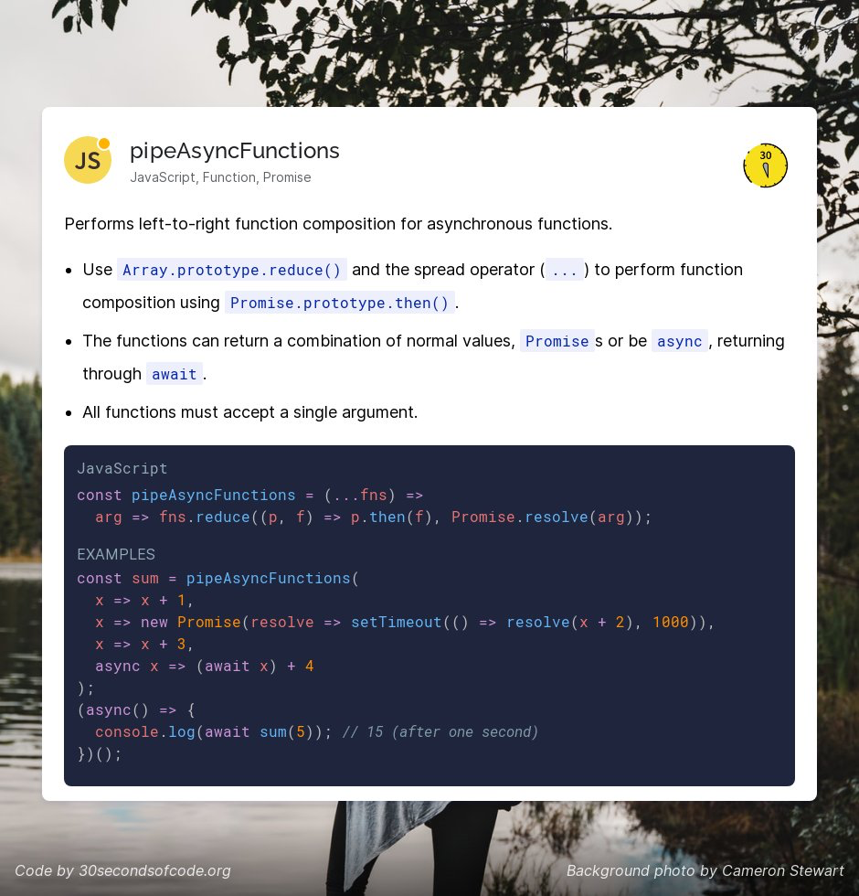 对 30s 代码感兴趣的同学，可以看下我之前写的这篇文章:  30s 源码刨析系列之函数篇 [https://tomotoes.com/blog/30s-javascript-function/](https://tomotoes.com/blog/30s-javascript-function/)
15. 为什么说 immutable 是 React 的核心，如何理解这一概念？ - Liuyl的回答 - 知乎 [https://www.zhihu.com/question/446377023/answer/1756125862](https://www.zhihu.com/question/446377023/answer/1756125862)  分享个回答，不可变保证了调度时的灵活性，角度清奇。
16. 快餐文分享:  前端工程师所需要了解的WebView  [https://mp.weixin.qq.com/s/PipKSnMQaTBhE5kSwG3DVQ](https://mp.weixin.qq.com/s/PipKSnMQaTBhE5kSwG3DVQ)  文章简介了 Webview 的概念，jsb的意义，后面列举了下 Android webview,ios webview 所支持的能力。
17. 分享篇池老的文章:   
    最容易被忽视的流量入口  
    [http://weixin.sogou.com/weixin?type=2&query=MacTalk+%E6%9C%80%E5%AE%B9%E6%98%93%E8%A2%AB%E5%BF%BD%E8%A7%86%E7%9A%84%E6%B5%81%E9%87%8F%E5%85%A5%E5%8F%A3](http://weixin.sogou.com/weixin?type=2&query=MacTalk+%E6%9C%80%E5%AE%B9%E6%98%93%E8%A2%AB%E5%BF%BD%E8%A7%86%E7%9A%84%E6%B5%81%E9%87%8F%E5%85%A5%E5%8F%A3)   
    摘要:

    1. 在文字互联网的时代，搜索引擎成了信息流动的入口，Google 和百度这样的公司，收割了 PC 时代所有的信息内容，成为最大的流量入口。
    2. 在移动互联网时代，流量被重新分配，每个 App 有了自己的品牌和搜索服务，人们需要进入 App，才能消费内容。
    3. 新的流量分发入口，只不过承载的内容介质是视频。

    有趣的事，上一周刚分享过 一个可以在视频中 根据语义搜索相应帧 的项目。

18.   学 Ruby 岂不是要倾家荡产
19. 自适应 CSS 栅格：自由布局的最终版本 - 霜羽的文章 - 知乎 [https://zhuanlan.zhihu.com/p/354154177](https://zhuanlan.zhihu.com/p/354154177)  快餐文分享，文章例子清晰易懂，并且只涉及了一些常见的 grid 属性，可以简单刷一下。
20. 每日一句分享:  可以把自己当成一家公司来经营，时间和注意力就是你拥有的最多的资源，公司的使命可以是让自己拥有快乐人生。想要经营好一家公司，应当能有效管理好各种资源，要挖掘自己的兴趣和特长，并且把资源投入到能带来更大长期回报（财富/快乐）的项目上，还要保持身心健康，让身体和大脑能更有效地合作。
21. 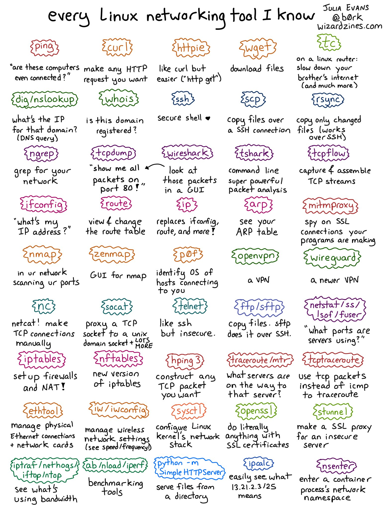
22. 分享个工具：   
    HTTPie - [https://httpie.io/docs](https://httpie.io/docs) like curl but easier

    http \[method=get\] \[key=value =&gt; data in post/put\] \[key==value query string in get\] \[key:value =&gt; field in header\] \[field:=json or field:=@file.json\] \[--flag\] url\[or :port\]

    1. http PUT pie.dev/put X-API-Token:123 name=John
    2. http pie.dev/image/png &gt; image.png

23. 学徒涌现，但clubhouse模式在中国没有前景｜深网  [https://mp.weixin.qq.com/s/kckFEjjgNxqn-62R-Qu9-g](https://mp.weixin.qq.com/s/kckFEjjgNxqn-62R-Qu9-g)  分享篇文章，作者从 监管成本，商业模式，语音不利于知识检索的角度分析 clubhouse 难以在国内出现成功的复刻品。
24. 分享篇文章:

    Speed is the killer feature   
    [https://bdickason.com/posts/speed-is-the-killer-feature/](https://bdickason.com/posts/speed-is-the-killer-feature/)

    摘要:New features might help your users accomplish something extra in your product. Latency stops your users from doing the job they already hire your product for.

    文章阐述了及时响应 对一款产品是否能取得成功的重要性。

25. 分享篇很有味道的文章:  耦合 - [https://mp.weixin.qq.com/s/Fp2lYL8Qno15erQ4Z8EPoA](https://mp.weixin.qq.com/s/Fp2lYL8Qno15erQ4Z8EPoA)  如果你能在生前把它们都解耦，你将拥有一个光辉的名字：佛。
26. 分享篇文章:   
    分布式相关理论和分布式事务   
    [https://juejin.cn/post/6935352650275749896](https://juejin.cn/post/6935352650275749896)

    文章列举了分布式系统中常见的概念，分布式锁，事务的几种实现，涉及到的点都很浅。

27. 列举下 目前分享文章的标签:
    1. 快餐文，干货很多，偏总结性知识，引起的思考很少。
    2. 好文，偏某一领域的深挖知识，引起的思考很多，文章体系偏严谨。
    3. 没标签，很难引起共鸣。
    4. 惊讶系列，技术系列的文章，或者 代码片段，很少遇到。
28. 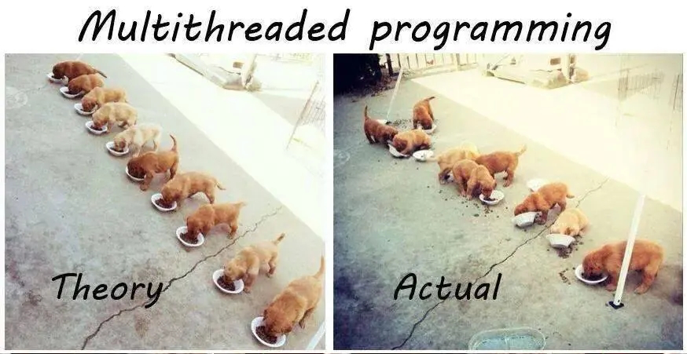
29. 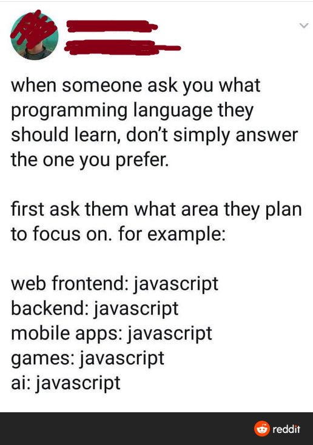
30. 点击“我不是机器人”后，网站到底怎么知道你真的是人？ [https://mp.weixin.qq.com/s/N\_f7jp4TlIozxGR-mYHEhg](https://mp.weixin.qq.com/s/N_f7jp4TlIozxGR-mYHEhg)  很有意思的文章
31. 每日一句分享:  If we don't create the thing that kills Facebook, someone else will. 
32. 分享篇文章:   
    Announcing Flutter 2   
    [https://developers.googleblog.com/2021/03/announcing-flutter-2.html?m=1](https://developers.googleblog.com/2021/03/announcing-flutter-2.html?m=1)   
    Flutter2.0发布，不只是移动端跨端，还支持编译成 web,pc-native。

    虚假的跨端:支持 web ios android windows apple linux   
    真实的跨端: 支持 微信小程序，百度小程序，支付宝小程序，参考 taro

33. 分享个流量孤岛的概念:  指移动端时代，各大企业为了维护各项用户指标，建立起来的一系列护城河。将流量划分成一座座孤岛，互不相同，自建生态，属于国内创新型概念。  来自今天一位吃饱饭后打工人的碎碎念。 互联网精神是什么？在资本的视角下 不值一谈。牺牲用户信息的流动性，巩固自身的生态才是王道。
34. 请不要叫我做题家   
    [https://mp.weixin.qq.com/s/U59O-2SzEmTfaSKz3NNk7Q](https://mp.weixin.qq.com/s/U59O-2SzEmTfaSKz3NNk7Q)

    分享篇文章，直指教育机制与个体发展之间的矛盾。   
    摘要: 中国式应试教育绝非完美，英美教育制度也不乏优点，但对这个国家最普遍的个体来说，他们接受教育的目的不是拓宽视野，不是结交名流，不是跻身精英，而是逃离贫穷。 做题依然是他们手里唯一的筹码。   
    让我想起了之前分享过的一句话:培养一个巴黎人，需要三代人的努力。

35. Redis 多线程网络模型全面揭秘   
    [https://mp.weixin.qq.com/s/-op5WR1wSkgAuP7JYZWP8g](https://mp.weixin.qq.com/s/-op5WR1wSkgAuP7JYZWP8g)   
    好文分享，文章对 Redis 的 IO 模型，介绍得很详细，从宏观角度给出概念，图解，与源码解析。也分析了 Redis 6.0 引入多线程之后 发生的变化。   
    文章写得很好，建议多读两篇，多线程 源码那里可以略过。

    摘要: Redis 内部实现了一个高性能的事件库 --- AE，基于 epoll/select/kqueue/evport 四种事件驱动技术，实现 Linux/MacOS/FreeBSD/Solaris 多平台的高性能事件循环模型。Redis 的核心网络模型正式构筑在 AE 之上，包括 I/O 多路复用、各类处理器的注册绑定，都是基于此才得以运行。

36. 惊讶系列分享: 解构模板字符串。  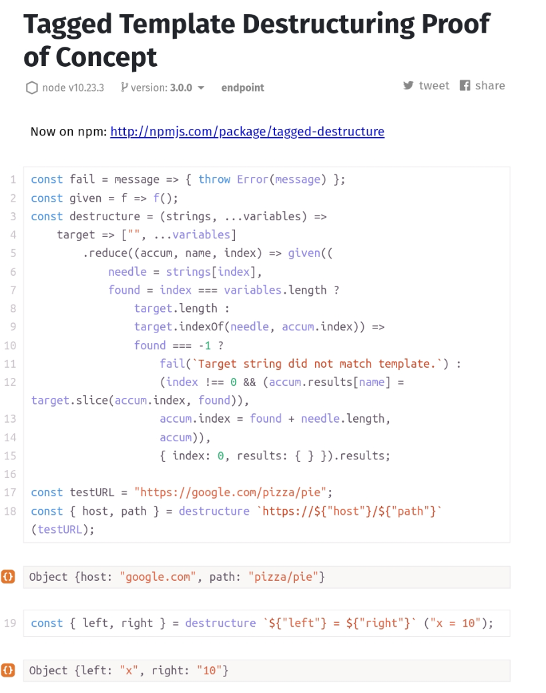
37. 好工整的程式。  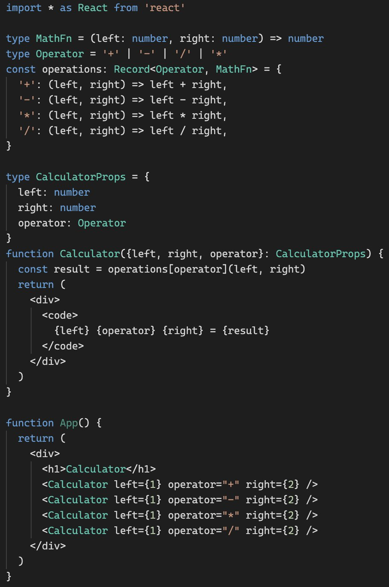
38. A: 问一下vue创建和卸载组件是同步还是异步啊？

    B: Vue 创建组件是同步的过程，加载组件是异步的过程。

    创建与加载是两种不同的概念，组件被加载后才可以创建。

    创建属于一个原子操作，不可被拆分。

    Vue2 官方文档中有写，支持异步加载组件：[https://cn.vuejs.org/v2/guide/components-dynamic-async.html](https://cn.vuejs.org/v2/guide/components-dynamic-async.html)

    Vue3 也是可以借助 defineAsyncComponent 定义一个异步加载的组件

    还有一些常见的方法 使用懒加载包一层，等到被激活才加载。 如果说到 Vue 卸载组件，具体 应该指的是 destroyed 钩子中 remove component 的底层实现是否是异步化了，等我翻翻源码。[https://github.com/vuejs/vue/blob/5255841aaff441d275122b4abfb099b881de7cb5/src/core/instance/lifecycle.js\#L97](https://github.com/vuejs/vue/blob/5255841aaff441d275122b4abfb099b881de7cb5/src/core/instance/lifecycle.js#L97)

    destroyed 钩子中 卸载组件会将 父组件的 children 中移除该组件，并将组件的引用置于 null，等 gc 回收，是一个同步的过程。

    如果异步化的话，页面就不会实时更新了。

39. 春招已经开始，找工作的同学把握住啊，多刷下牛客 看看面经，算法题 也不要落下 ，偶尔 ac 几道题积累下经验，除了准备基本的面试题，思维题 与 场景题 也是经常考的。场景题需要技术的广度，这个没有短期提高的技巧，只能平时多学习。思维题 等死就好了。   
    投简历的时候 可以先投一些小厂找找感觉，后面再投一些大厂，并且记住投大厂的时候 部门也很重要，不要心急。   
    准备基础面试题时 不要眼高手低，一定要多思考（思考到操作系统层面，很多已有的概念都能找到身影） 并 与其他知识点关联起来，还有一个技术的意义，适用的场景 都要多多少少了解下，这样回答问题的时候 才能把面试官经验住。   
    并且演技也很重要，不要说太流畅 像背书一样就不好了。

    回答面试题时 最好以网状的结构，从一个点挖到另一个点（需要你主动引导），这样是最佳的。

40. 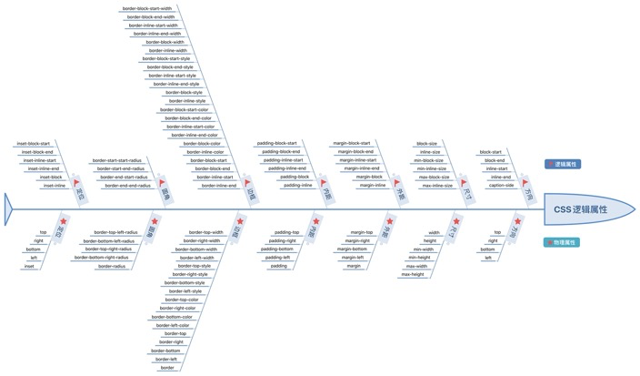  CSS IS AWESOME~
41. 用WebRTC来实现P2P直播 - Yard的文章 - 知乎  [https://zhuanlan.zhihu.com/p/101991665](https://zhuanlan.zhihu.com/p/101991665)  快餐文分享，介绍了 WebRTC 中的常见概念，总结一点: SDP 负责媒体信息交换，ICE 负责网络信息交换，如果不能透过 NAT 直连，只能通过 TURN 来中转，这样多端的流媒体才能流动起来。  但这对 TURN 服务器消耗的带宽是巨大的，而云服务中带宽用量一般都不便宜。还记得之前看 熊猫直播 复盘的一篇文章，带宽花费巨大。
42. 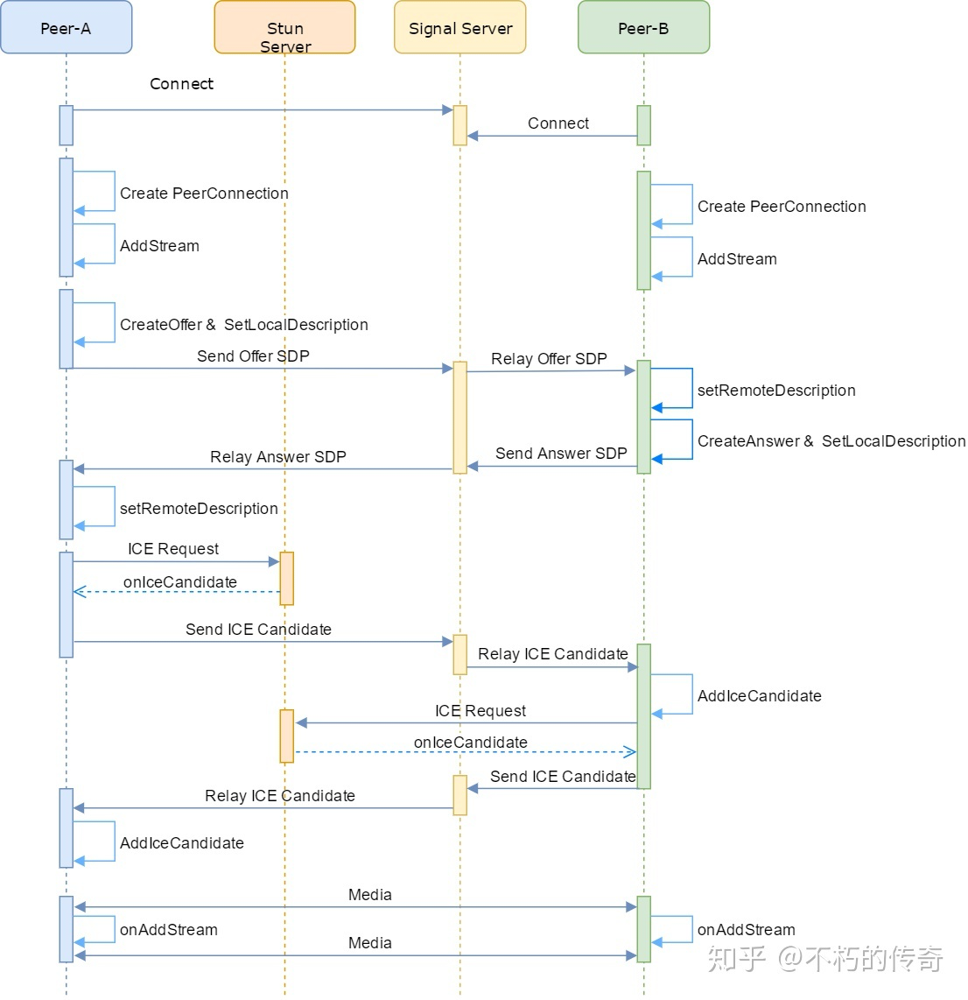  WebRTC 本质是P2P网络架构\(提供了 STNU 用于NAT打孔\(属于 钻了网络协议的漏洞\)，TURN 用于转发，传输数据 over udp\) 再结合 优秀的音视频处理库\(可看之前分享过的一篇文章，GIPS 公司的内部作品，后被Google收购\)，比如回声消除，消音，结合网络带宽智能调节码流等，这些功能是 WebRTC 主要的优势。  而国内的网络 因为NAT类型，天生是很难支持 P2P的。 所以 声网 与 一些厂商 关于 WebRTC 的 PaaS 服务才会那么贵，中小型企业 搭建需要花很多成本。 现在有关在线语音，声网与腾讯云是 1000分钟 7元。
43. 每日一句分享:  我从小公司跳槽到大公司。我发现，大公司的很多工作都在学习他们庞大的自定义领域，而不是学习某种的公开技术。
44. [https://github.com/git/git/blob/master/banned.h](https://github.com/git/git/blob/master/banned.h)

    因吹斯汀 这算不算 unix style 的 api 设计的问题呢

45. 分享个概念-XaaS：  XaaS is a general, collective term that refers to the delivery of anything as a service. It recognizes the vast number of products, tools and technologies that vendors now deliver to users as a service over a network -- typically the internet -- rather than provide locally or on-site within an enterprise. There are countless examples of XaaS, but the most common encompass the three general cloud computing models: Software as a Service \(SaaS\), Platform as a Service \(PaaS\) and Infrastructure as a Service \(IaaS\).  XaaS：Anything as a service.
46. 分享篇文章：   
    The Ultimate Beginners Guide To Kubernetes and Container Orchestration  
    [https://hackernoon.com/the-ultimate-beginners-guide-to-kubernetes-and-container-orchestration-5d83354y](https://hackernoon.com/the-ultimate-beginners-guide-to-kubernetes-and-container-orchestration-5d83354y)

    文章介绍了 K8S 的相关概念与出现的背景意义以及具有的优势。

47. 计算机的文件系统是一种存储和组织计算机数据的方法，它使得对其访问和查找变得容易，文件系统使用文件和树形目录的抽象逻辑概念代替了硬盘和光盘等物理设备使用数据块的概念，用户使用文件系统来保存数据不必关心数据实际保存在硬盘（或者光盘）的地址为多少的数据块上，只需要记住这个文件的所属目录和文件。  严格地说，文件系统是一套实现了数据的存储、分级组织、访问和获取等操作的抽象数据类型（Abstract data type）。
48. 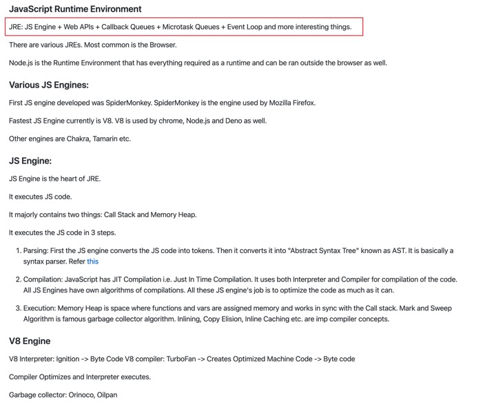

    错误的 JRE：Java Runtime Env   
    真正的 JRE：JavaScript Runtime Env

49. 好文分享：   
    为啥负利率国债有人抢着买？因为时代变了   
    [https://mp.weixin.qq.com/s/NdNv3LiO\_3IxrgyeG5Xubw](https://mp.weixin.qq.com/s/NdNv3LiO_3IxrgyeG5Xubw)

    文章分析了 经济微增长时代 带来的危机，各国的现状，以及如何做出应对（人口增长要保持，寻找新的技术突破，降低贫富分化 给基层让利 参考 拼多多）

    文章摘要： 最终消费的动力主要来自三点： 1、孩子；2、年轻的女人；3、技术的更新迭代。

    现在互联网技术风口耗尽了，整体格局也差不多了。现在互联网大厂连菜贩子的生意都抢，大部分行业跟餐饮业一样，一片红海。

    那整个社会佛系了它不好吗？没这么简单了。比如作为富豪阶层却有大量的钱投资不出去，放手里通货膨胀贬值，存银行也不赚钱，最后想来想去，只好去追那些少数优质资产，最后把那些资产给追到天上去了。

    “每一个人自由发展是一切人自由发展的条件”，给每个人发展的机会，才是最大的福利。文中提到了一句话：“富人通胀，穷人通缩”，整篇文章从经济发展的宏观视角 去分析在负利率、微增长时代 整个社会将会呈现 M 型经济体系。 文中的很多话 引起了我的共鸣，但很难引起思考，视角太宏观了..   
    文中提到了一句话：“富人通胀，穷人通缩”，整篇文章从经济发展的宏观视角 去分析在负利率、微增长时代 整个社会将会呈现 M 型经济体系。 文中的很多话 引起了我的共鸣，但很难引起思考，视角太宏观了..

50. 分享个网站：

    Your GitHub story in 3D   
    [https://skyline.github.com/](https://skyline.github.com/)

    Github 官方产品，View a 3D model of your GitHub contribution graph. Share it, print it, and more!  
    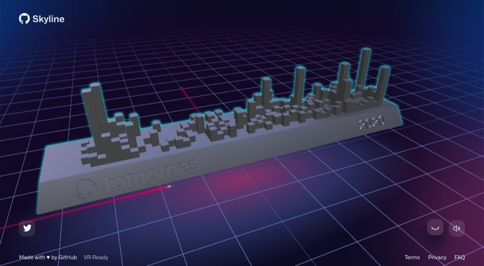

    看了一下，居然是使用 Vue 的 ssr 框架 nuxt.js 写的，3D 动画是通过 WebGL 实现~

51. 快餐文分享：

    知乎文章转视频实现\(乞丐版本\)   
    [https://zhuanlan.zhihu.com/p/353515449](https://zhuanlan.zhihu.com/p/353515449)

    对不起，熟悉 ffmpeg 就可以为所欲为。   
    这是文章的源码 repo - [https://github.com/leoython/text-to-video](https://github.com/leoython/text-to-video) 简单粗暴，可以看下。

52. 快餐文分享：   
    My guiding principles after 20 years of programming  
    [https://alexewerlof.medium.com/my-guiding-principles-after-20-years-of-programming-a087dc55596c](https://alexewerlof.medium.com/my-guiding-principles-after-20-years-of-programming-a087dc55596c)

    一位编程 20 年的前辈，列举出职业生涯中积累的 20 条原则。   
    文中有两个观点很赞同：

    1. Expose yourself to other languages, technologies, culture and stay curious.
    2. Never start coding \(making a solution\) unless you fully understand the problem.

    第一点保持好奇心、保持热情 才能源源不断的持续进步。   
    第二点很有共鸣，之前打 ACM ，经常读完题目 根据内心最直观的想法去 coding... 然后再花大量时间 debug...

53. 分享篇文章：

    Does every programming language have a central package repository? [https://codelani.com/posts/does-every-programming-language-have-a-central-package-repository.html](https://codelani.com/posts/does-every-programming-language-have-a-central-package-repository.html)

    摘要：The other day I was curious: does every programming language have one of these? I decided to find out. I pointed my crawler and trained a model to check for a package repository for every one of the 3,006 languages I am tracking. The results surprised me.

    文章简介了 作者训了模型 爬取了 3,006 languages\(WTF，猜测 这里不应该是PL的个数，作者没给出 context\)，然后总结了下具有包管理的语言数据~

    可以与之前的包管理的讨论 联系起来~

    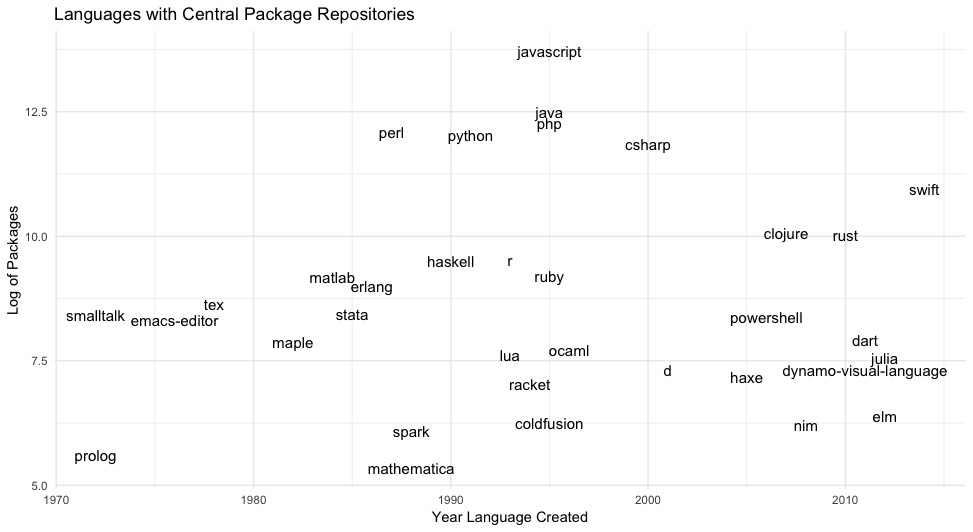

54. 今天在 Twitter 上刷到一条消息，大体内容是 为什么有这么多公司 招 K8S 工程师？具体是干嘛？ 下面有条热评 - 是写 yaml 高级工程师。

    给我的感受是 听起来很 easy，但 easy is not simple。   
    正如这篇文章所说：To understand all the peculiarities and to have the ability to configure and debug such systems, one should have a good understanding of microservice architecture and containerization\(容器化\) principles.   
    之前也有分享过很多类似的观点，比如 Golang 的设计，CSS 隐藏在背后的复杂性 等。

55. 每日一句分享：   
    Program testing can be used to show the presence of bugs, but never to show their absence. - Dijkstra   
    测试只能表明程序中存在错误，而不能表明程序中没有错误。

    很明显，这句话是在说 测试不能兼顾到程序运行时的所有场景，但是如果能枚举程序运行时的每一个场景（理想） 是不是就能达到完美的测试呢？

    就比如 类型系统，int num = "Hello World" 显然是错误的，因为 int 枚举出了取值类型与取值范围。

    对于一个程序普通的编译时错误，可以通过静态分析来解决，而运行时的错误 是无法兼顾到的，你永远不可能检测到 外部 IO 到时是什么，这时候唯有 形式化方法 才能解决。   
    当然 不提场景都是无意义的，形式化方法 也是场景有限。

56. 快餐文分享：   
    形式化方法基础 [http://kaelzhang81.github.io/2018/03/19/%E5%BD%A2%E5%BC%8F%E5%8C%96%E6%96%B9%E6%B3%95%E7%AE%80%E4%BB%8B/](http://kaelzhang81.github.io/2018/03/19/%E5%BD%A2%E5%BC%8F%E5%8C%96%E6%96%B9%E6%B3%95%E7%AE%80%E4%BB%8B/)

    摘要： 针对60年代出现“软件危机”，业界提出两种解决方法：

    1. 采用工程方法来组织、管理软件的开发过程；
    2. 深入探讨程序和程序开发过程的规律，建立严密的理论，以期能用来指导软件开发实践。 前者导致“软件工程”的出现和发展，后者则推动了形式化方法的深入研究。

    形式化方法是基于数学的特种技术，适合于软件和硬件系统的描述、开发和验证。将形式化方法用于软件和硬件设计，是期望能够像其它工程学科一样，使用适当的数学分析以提高设计的可靠性和鲁棒性。但是，由于采用形式化方法的成本高意味着它们通常只用于开发注重安全性的高度整合的系统。

    文章介绍了 形式化方法的常见概念，感兴趣的同学可以了解下。

57. 快餐文分享：   
    Will it finally: a try/catch quiz   
    [https://frontarm.com/james-k-nelson/will-finally-run-quiz/](https://frontarm.com/james-k-nelson/will-finally-run-quiz/)

    文中用多个问题 列举了 try catch finally 在不同场景下执行的不同结果，并给出了答案。

    我的理解是，try catch finally 是一套独立的 execute context，如果运行时 throw error，则 按照顺序（t-c-f）运行完成之后，所在的 func frame 会自动弹栈；如果没有 catch 到 error，运行完成后 还会继续往下执行;

    除了涉及 error 的场景还有 try catch 中调用 return ，catch statement 中 throw error 的场景，这两种场景都偏少见（主观觉得研究这些语法毫无意义） 文章也给出了相应的例子，可以看一下。

58. 概念分享： 锚定效应\(认知偏差的一种\) Wiki 定义：  
    人类在进行决策时，会过度偏重先前取得的资讯（这称为锚点），即使这个资讯与这项决定无关。在进行决策时，人类倾向于利用此片断资讯（锚点），快速做出决定。在接下来的决定中，再以第一个决定为基准，逐步修正。但是人类容易过度利用锚点，来对其他资讯与决定做出诠释，当锚点与实际上的事实之间的有很大出入，就会出现当局者迷的情况。

    想到的例子：小米手机发展史，估计大家都知道小米手机 主打的就是性价比，在最开始进入手机行业时，米 1 的发布定价 就成为了锚，成功打乱了平静的市场，把各大厂商的价钱压低很多。

    来自知乎上的例子：比如当一只股票价格过高时，上市公司就会拆股，比如一拆五，就是一股变五股，那么股价就会降低。以前100块，一拆五后，理论上会变为20元。一些算术不好的股民就会认为，以前要100元，现在只要20元。赶紧买！   
    大家生活中有遇到过锚定效应的例子吗？ - 小菜鸡的回答 - 知乎 [https://www.zhihu.com/question/21230051/answer/203976948](https://www.zhihu.com/question/21230051/answer/203976948)

59. 别低头，往前看   
    [https://mp.weixin.qq.com/s/QNm-6nblReW6bzuCy5iZHg](https://mp.weixin.qq.com/s/QNm-6nblReW6bzuCy5iZHg)

    分享篇文章，讲解了 回忆时的自我抽离与自我沉浸视角的概念。以及如何利用自我抽离视角 去放下挥之不去的回忆，如何通过一些积极的事情，站在自我沉浸视角 去更好的生活。

    摘要: 永远把自己看作是一个不断流动、成长、变化的系统，每一刻的“我”都只是当下的我，我所有的错误和失败都只是我的经验，都是帮助未来的“我”变得更好的方式。   
    文中提到了 在自我沉浸视角会被迫 采用回避策略，逃避创伤，为了不再受伤，宁可保原状，停滞不前。久而久之，就会产生回避型人格障碍。

60. 分享期视频:  【巫师】女首富的躺赢和撕逼之路，护肤和化妆品背后的资本帝国：欧莱雅 [https://youtu.be/GEa6Ic3tfDI](https://youtu.be/GEa6Ic3tfDI)  视频很精彩，值得一看。  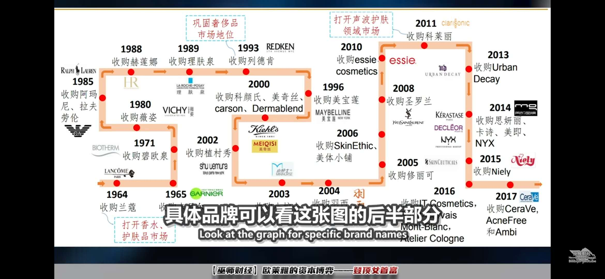
61. 分享期Podcast:   
    [https://moon.fm/share/episode/4178/](https://moon.fm/share/episode/4178/)   
    🎙数据挖掘---龙星镖局\(Justin\)

    本期主要讲了数据挖掘是什么，应用场景在哪里\(比如分析股票，推荐feed等\) 以及应用深度学习分析的流程\(花了很长时间讲监督学习与非监督学习的原理\)，总体而言 数据挖掘是个综合性很强的领域。

62. 分享一个充满设计感的网站，给我的感觉很惊艳：   
    [https://www.samuelday.de/](https://www.samuelday.de/)  
    A: 有点苹果官网的感觉 各种视觉差

    B: 看了一下，动画是用 svg 写的，站点是用 webflow 平台搭建的..

63. 快餐文分享：

    大型 Web 应用插件化架构探索   
    [https://mp.weixin.qq.com/s/EBI3NvirxKfRIRE9amJ4TQ](https://mp.weixin.qq.com/s/EBI3NvirxKfRIRE9amJ4TQ)

    文章介绍了前端常见应用的插件系统：Atom、VSCode、Figma，以及 Figma 为了实现插件沙箱化 所做的实践，从iFrame（封闭性完美，但也由于太过封闭，无法高效通信）到 Proxy Global 对象 （依旧可通过原型链干涉外部）再到使用 外部WASM 编译器去执行插件。  
    作者最后也给出了 使用 WebWorker 做沙箱的一些探讨，和 CSS 隔离的一些方案。

64. 词汇分享：   
    infomercial - /ˈɪn.foʊ.mɝː.ʃəl/   
    a long television advertisement, that contains a lot of information and seems like a normal programme

    Eg：About 3% of viewers who watch infomercials buy the product being pitched\(推销\).

    本词直译是电视广告，听起来有点距离（不会还有人在看电视吧），我觉得叫做信息广告更合适，伪装成正常信息的广告。   
    像知乎回答 中的信息倒流到某电商，B 站中的恰饭视频，或者在 Ins 上刷到图片后 下面出现的 Product 链接.. 都称得上互联网时代的“电视广告”（infomercial ）   
    归根结底的原因是 信息流动的主要载体一直在变化。

65. 每日一句分享:  调试就像身处在一部犯罪电影中，你既是侦探也是凶手 - Sindre Sorhus
66. 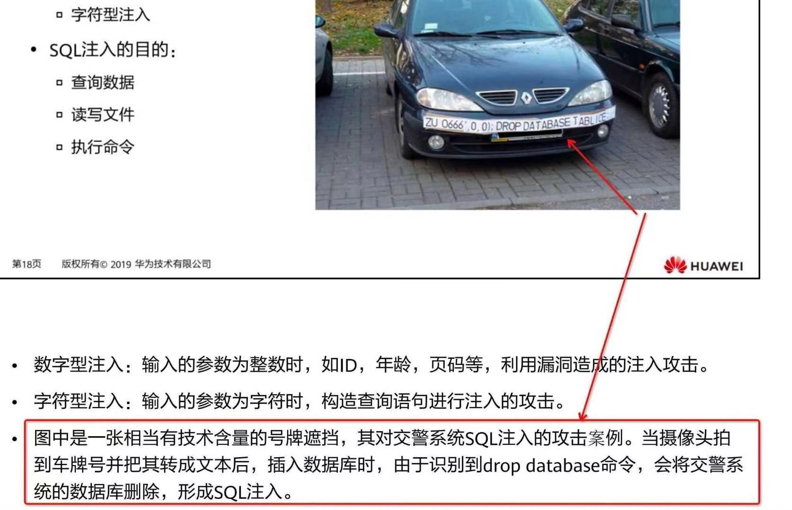
67. 《计算机科学概论》读书笔记分享:

    计算思维中的几种重要思想:

    1. 符号化思想 于人而言，信息与二进制之间的相互转换。于计算机而言，逻辑门电路构成了复杂的电路 这离不开电路特性与逻辑运算之间的转换。
    2. 程序化思想 不管一个问题多么复杂，只要是可计算的，就可以将问题解决过程分解成一系列基础指令。程序是一系列按照规定组合的指令集合。
    3. 递归化思想 递归思想的场景是将一个复杂的问题，层层转化为原问题相似的规模较小的问题求解。能够用有限的步骤定义无限的能力。许多重要思想，如分治思想、回溯思想、迭代思想、动态规划思想都与递归思想紧密相关。

68. 快餐文分享：   
    Introduction to the A\* Algorithm   
    [https://www.redblobgames.com/pathfinding/a-star/introduction.html](https://www.redblobgames.com/pathfinding/a-star/introduction.html)

    文章介绍了 A\* 算法，BFS 算法，Dijkstra 算法 在最短路径中的原理 以及差异 并给出了动画证明 与 每一种算法的实现。

    之前一直很想了解下 A\*算法，在搜了很多资料后 发现它实质上就是 Dijkstra 算法的策略升级版。 简单点来说， Dijkstra 算法基于简单的贪心策略（有个权重 hash，每次 visit 都会更新）但算法的整体过程还是没有明确终点的概念，所以它可以找到基于每一个点的最短路径。 但 A\* 算法则有明确的终点的概念，这里指的是 利于一些预估算法（曼哈顿距离算两点距离，或者 欧式距离这类）每次 visit 节点时 会动态选择 （当前节点 与 终点 结合 预估算法的距离）下一个最优的节点 作为起始节点。

    A\* 与 Dijkstra 算法的共同点 都是加权贪心策略，不同的是 A\* 可以用预估算法（也叫 启发式算法）做减枝优化。  
     为什么之前搞算法 写减枝策略时 没有想到这一点呢... 我之前的减枝 只是简单的 判断当前节点的访问代价，每次遇到障碍图时 就不适用了.. 如果有引导算法 再加 优先队列 就轻松多了..

69. 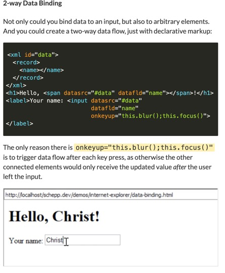

    A: 原来 Web 上的 数据绑定概念 很早就可以使用 plain html 实现了.. 我记得 最开始学 Web 的时候，只是简单了解过上面的标签用法，当时还没有 数据绑定的概念...

    B: HTML里还能写xml啊 涨姿势

    A: 是的，不过就算使用 也会隐藏起来不显示，H5 已经弃用了这个 xml tag.  
    [http://www.html-5.com/changes/deprecated/xml-tag.html](http://www.html-5.com/changes/deprecated/xml-tag.html)

70. 分享个鲜为人知的属性：

    document.currentScript 返回当前正在运行的脚本所属的`<script>` 元素.

    if \(document.currentScript.async\) { console.log\("Executing asynchronously"\); } else { console.log\("Executing synchronously"\); }

71. 快餐文分享：   
    你在用的浏览器又更新了，这些新功能值得一试   
    [https://sspai.com/post/65371](https://sspai.com/post/65371)

    Chrome 89 版本提供了很多人性化的功能：

    1. 自带「稍后读」
    2. 新增标签页搜索入口
    3. 默认使用 HTTPS 连接 ，减少 重定向，更详细的可看这篇文章 [https://9to5google.com/2021/01/11/google-chrome-address-bar-may-soon-default-to-https/](https://9to5google.com/2021/01/11/google-chrome-address-bar-may-soon-default-to-https/)

72. 分享篇文章：   
    Chrome 89 DevTools 新功能   
    [https://developers.google.com/web/updates/2021/01/devtools](https://developers.google.com/web/updates/2021/01/devtools)

    文章顶部有中文视频介绍... 并且主持人的口音很好玩，听起来像粤语..

    于我（CV 程序员）而言，最有用的功能 就是支持右键快速复制 CSS rules 了。

73. 每日一句分享:  大多数人都高估了他们一天能做的事情，但低估了他们一年能做的事情。
74. WebP2P 让你的直播免流 - villainHR的文章   
    [https://zhuanlan.zhihu.com/p/33716171](https://zhuanlan.zhihu.com/p/33716171)   
    快餐文分享，文章主要讲解了 WebRTC 建立 P2P 连接的细节。   
    文章有一点跳过了，为什么双方都是 对称性NAT 无法打洞，对称性 NAT 在 每一次内网与不同的外网主机通讯时，会 重新分配另一个内网端口号，当双方都是 对称性 NAT 时，理论上是无法打洞成功的。   
    而国内的运营商的 4G网络，公共 WiFi，因为安全因素 都选择采用的是 对称 NAT，这就是为什么 P2P网络 在国内几乎没办法落地的原因。  
    当然可以使用 一台高带宽的服务器做中转，去伪实现双端通信\(对服务器可用性要求会很高\)。   
    其实打洞也是个很有趣的行为，属于网络协议的安全漏洞了。

    打洞的过程: A 和 B 需要和 STUN 服务器建立连接，获得 A/B 的公网 ip:port 和私网 ip:port。 B 往 A 发送一个打洞包，此时，已经在 B 的 NAT 上留下到 A 的 打洞 session。但是，由于该包没有 A NAT 的 session 记录，会被 A 拒绝掉。 A 往 B 发送一个打洞包，该包会在 A 的 NAT 上增加 B 的 session。此时，由于 B 的 NAT 上存在 A 的 session，该包是可以直接被 B 的 NAT 通过的。 打洞完成。

75. 姓 TRUE 可还行..  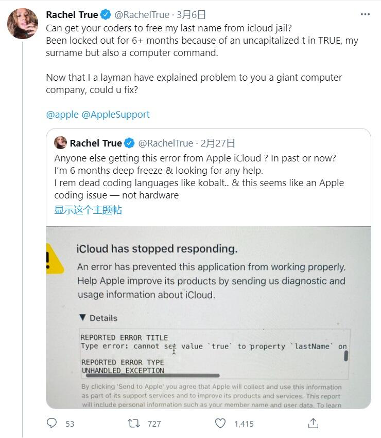
76. 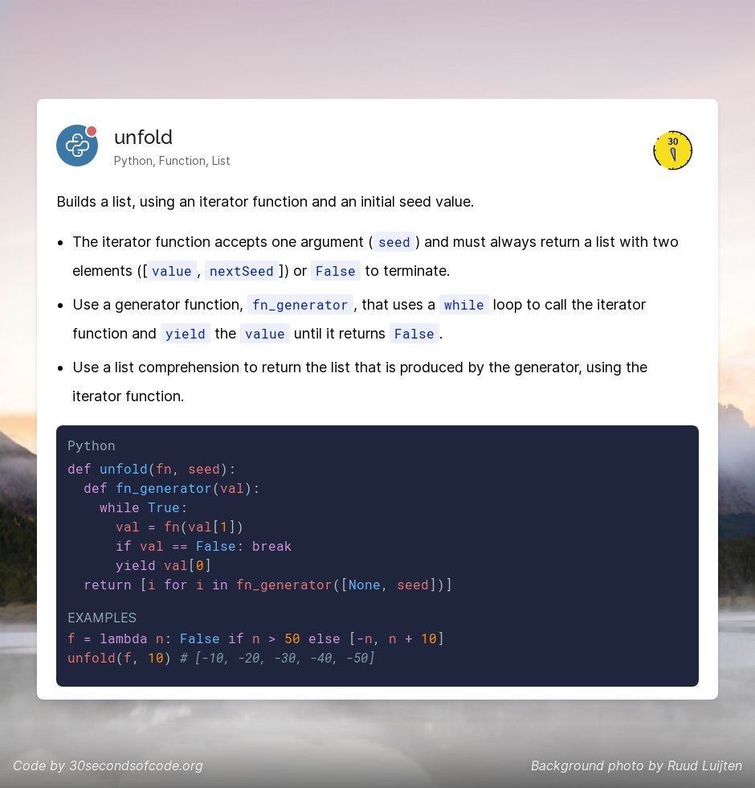  unfold 是 FP 中常见的 functor，可以隐藏与上下文无关的状态，减少复杂性。
77. 分享篇故事:   
    一个程序员眼中的上帝，会设计出啥样的电脑系统？   
    [https://www.techug.com/post/what-kind-of-computer-system-will-a-programmer-design.html](https://www.techug.com/post/what-kind-of-computer-system-will-a-programmer-design.html)

    曾有幸访问过主人公的作品网站，抛去种族主义，精神问题不谈，是个纯粹的人。

78. 黄玄 base64 原理的视频  [https://www.bilibili.com/video/BV1xy4y187MF](https://www.bilibili.com/video/BV1xy4y187MF)  不得不说视频做的真好hh
79. A: 既然谈到这些自带的数据结构，那么问题来了。   
    Question: 对象存储键值对 与 Map 有什么差别吗？

    B: 对象只能存字符串吧   
    A: 是的，对象的 key 只能字符串，Map 的 key 不限类型。   
    C: obj\[{}\] = 10; 它是存的时候就变成了字符串，还是读取的时候呢

    A: 存储的时候。 会调用 toString 方法，转换为 key。

    还有一点，Map 实现了\[Symbol.iterator\] 方法，最明显的体现就是 Map 可以被 for of 遍历。  
     C: 貌似String也实现了这个方法😂 太神奇了   
    A: 是的，可以支持 for of，或者 \[...variable\] 就证明该变量实现了 Symbol.iterator~   
    有趣的是 Python 也是有相关的魔法方法的，**iter** 与 **next**   
    \|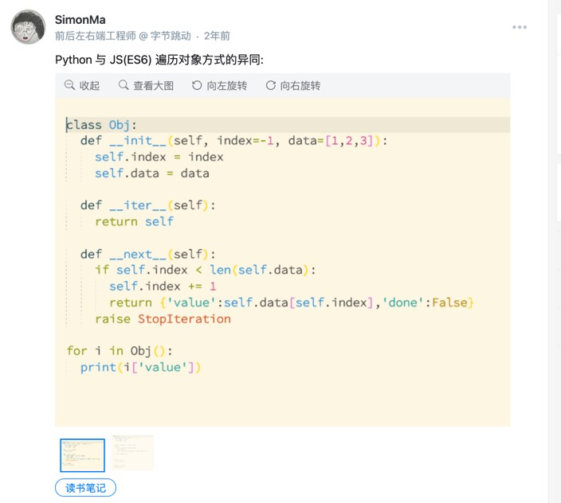   
    这其实称得上 另一种形式的运算符重载了~   
    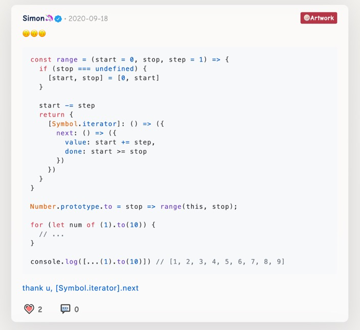

80. 这种对 UI 的计算，看起来真是太酷了~ 理性与美感的结合。 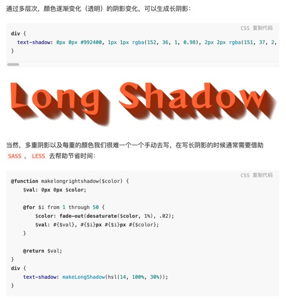
81. 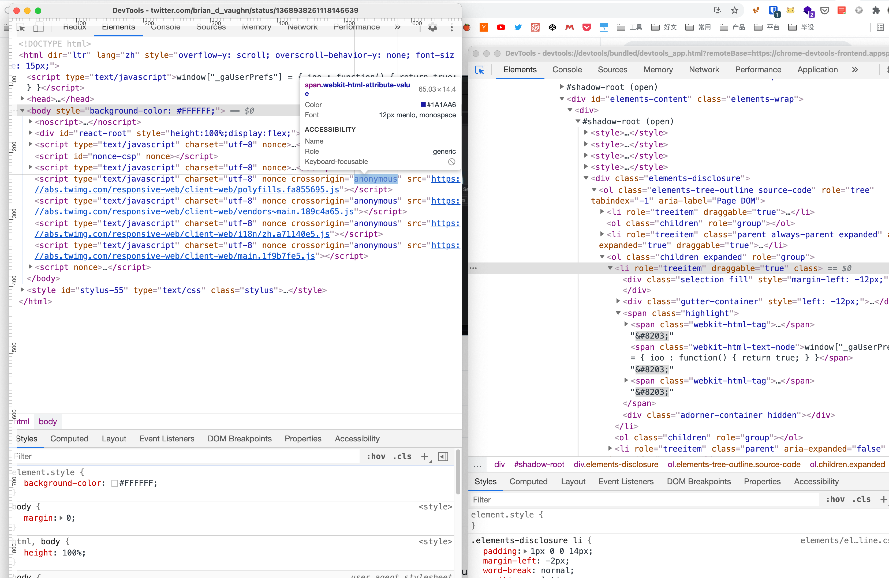  原来 DevTools 也是可以被调试的...  用 DevTools 去调试 DevTools，果然 递归是计算理论的基础。
82. 分享个项目：

    xiaochunjimmy/Sogou-Input-Skin   
    [https://github.com/xiaochunjimmy/Sogou-Input-Skin](https://github.com/xiaochunjimmy/Sogou-Input-Skin)

    作者设计了搜狗拼音输入法的几款极简风格皮肤，十分漂亮~ 

83. 分享一门小众语言：   
    LiveScript - [http://livescript.net/](http://livescript.net/)

    LiveScript is a language which compiles to JavaScript. It has a straightforward mapping to JavaScript and allows you to write expressive code devoid of repetitive boilerplate. While LiveScript adds many features to assist in functional style programming, it also has many improvements for object oriented and imperative programming.

    JavaScript 最初的名字是 Mocha，然后改成了 LiveScript，最后定为了现在的名称。

    该语言的一些语法 看起来还是挺有吸引力的，支持列表生成式，\|&gt; pipe 式调用，支持链式比较..   
    不过其他的语法 "噪音"都很强.. 尤其是使用缩进来划分代码块...

    并且该语言还完成了自举，看得出来 开发者很用心 （没错，我就在点你 swift）

84. 每日一句分享:  There are two ways of constructing a software design: One way is to make it so simple that there are obviously no deficiencies, and the other way is to make it so complicated that there are no obvious deficiencies.
85. 分享篇短文:   
    -2000 Lines Of Code   
    [https://www.folklore.org/StoryView.py?story=Negative\_2000\_Lines\_Of\_Code.txt](https://www.folklore.org/StoryView.py?story=Negative_2000_Lines_Of_Code.txt)

    用代码函数衡量生产率太蠢了。

86. 快餐文分享:   
    What Is JavaScript Made Of?   
    [https://overreacted.io/what-is-javascript-made-of/](https://overreacted.io/what-is-javascript-made-of/)

    Dan 19年的一篇文章，整体偏基础概念。

87. 【译】下一代前端构建工具 ViteJS 中英双语字幕 ｜ 技术点评 [https://juejin.cn/post/6937176680251424775](https://juejin.cn/post/6937176680251424775)  GitHub Open Source Friday 关于 vite 的访谈
88. 刚刚了解到原来二次加盐 主要目的是为了防止彩虹表查询的。  记得字节一面问过这个问题，我回答很笼统: 为了增加密码被暴力破解的难度。
89. “能量既不会凭空产生，也不会凭空消失，它只能从一种形式转化为别的形式，或者从一个物体转移到别的物体，在转化或转移的过程中其总量不变”。这叫做能量守恒定律，1847年由德国物理学家、生理学家赫尔姆霍茨（1821—1894年）首先提出。  “复杂度既不会凭空产生，也不会凭空消失，它只能从一种形式转化为别的形式，或者从一个抽象概念转移到别的抽象概念，在转化或转移的过程中其总复杂度不变”。这叫做复杂度守恒定律。  当然如果做到 足够复杂且没有缺陷，那么整体的复杂度会转换为 一个个功能的认知成本，复杂度被隐藏了。  从宏观角度而言，复杂度是守恒 或者 由于设计得不合理 复杂度会增高，但从用户的角度，是感受不到所有复杂度的。 就像 程序员 不必懂得计算机中是如何控制电流的。
90. 想到一个问题: 当两个客户端在建立 TCP 长连接后，网络传输的物理介质突然 down 掉，这时 TCP 连接还会继续吗？ 答案是会的，因为 长连接 是使用心跳检测机制 来保证连通性的。等到下一次心跳才会断开，而这里的断开 也就是在系统的内存区中 清除连接状态。
91. 分享个网站:   
    看看AI怎么接着写   
    [https://sundamao.com/](https://sundamao.com/)

    有点惊讶，这AI回答的很有逻辑，虽然读起来怪怪的...   
    数据集应该全是爬到的..

92. 一首小诗:   
    I have updated the dependencies that were in the package.json

    and which you were probably pinning for some reason

    Forgive me they were outdated so vulnerable and so old

    [https://twitter.com/tesseralis/status/1369162628384235522?s=19](https://twitter.com/tesseralis/status/1369162628384235522?s=19)

93. Node.js 并发能力总结  [https://mp.weixin.qq.com/s/cXwM\_ENAjxvvwaBHEsuHbA](https://mp.weixin.qq.com/s/cXwM_ENAjxvvwaBHEsuHbA)  快餐文分享: 文章给出了 限制数量 异步请求，超时异步请求的实现，并简单介绍了 asyncHook 的作用，多线程多进程在 Nodejs中 使用。
94. Question: Nodejs 适用于 IO 密集型还是 CPU 密集型？   
    计算密集与IO密集最本质的差别 就是 计算密集主要在用户态花费时间，IO密集则是在内核态。   
    A: 不是吧

    我觉得 计算密集\(CPU密集\) 主要就是计算，不需要进入内核，用户态就可以完成。 IO 密集因为需要很多读取写入，程序需要各种系统调用完成，而这一过程是在内核态进行。这是我的理解 。  
    答案是 IO 密集型，主要靠 libuv 库 将阻塞IO请求 转换为 异步请求。

95. 漫画 \| Google剽窃了我的算法！  [https://mp.weixin.qq.com/s/eZIjMAYu0xp8nOGj9Q48sA](https://mp.weixin.qq.com/s/eZIjMAYu0xp8nOGj9Q48sA)  分享篇文章，介绍了 pageRank 的权重机制，整体来说 写的很浅，没有介绍清楚。  可以看下这本书《改变未来的九大算法》，里面有 pageRank 更详细的介绍。
96. 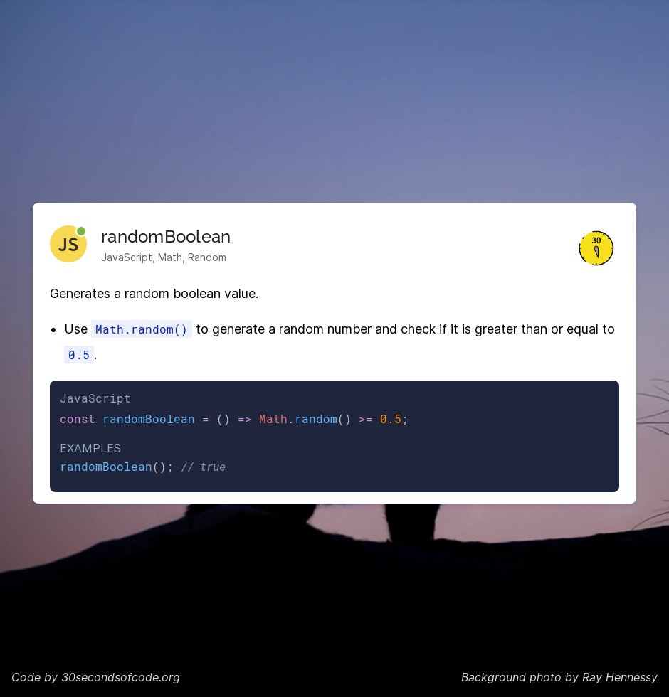
97. 快餐文分享:   
    Interview with Ryan Dahl, Creator of Node.js   
    [https://evrone.com/ryan-dahl-interview](https://evrone.com/ryan-dahl-interview)

    一篇访谈 Ry\(nodejs deno creator\)的文章。  
    文章很长，涉及的点很多 不只是关于 Deno，有一些关于语言看法，新手程序员学习建议，Node 初期时应该着重的事情等等等.. 并且文章内 Ry 也表达了 Nodejs 不适用于 CPU 密集型场景的观点。

    I don't consider TypeScript a separate language; its beauty is that it's just marked up JavaScript.

    摘抄自文章。

    Website cookie popups are not the best analogy - they're a fairly useless legal byproduct.

    很赞同这句话。可惜在国内还没有对 cookie 等用户信息 建立全面的法律机制。

98. A:那个monorepo是怎么管理代码的啊？对src进行自动拆分吗，还是什么？   
    B: 解决了吗？我也不是很懂具体原理，只知道解决了 依赖复用。   
    有两个比较常见的 monorepo : leran 与 yarn workspace   
    不是对 src 进行自动拆分，是为了多项目的场景 才去用 monorepo 的。 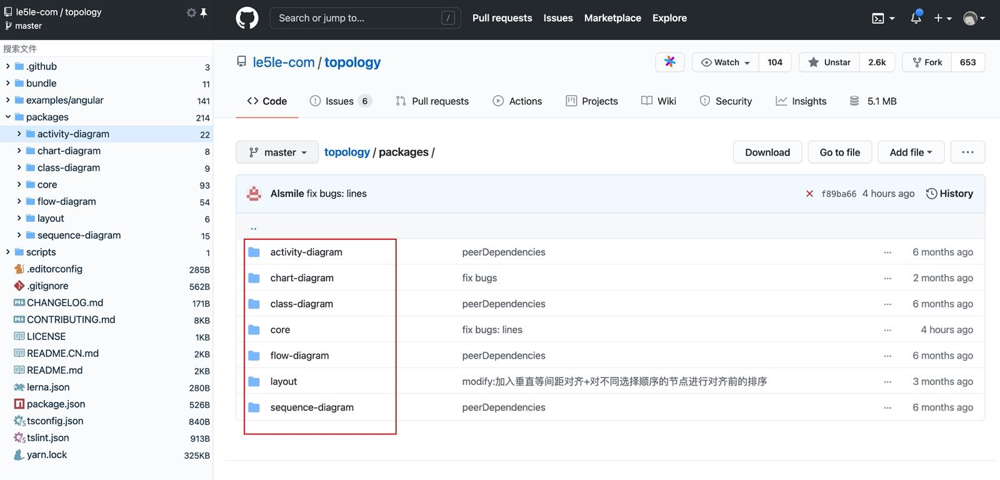  
    可以看下上图的项目结构，packages 中的每一个包 都可以独立维护、发布，而这些包共同组成了 一个大的项目。   
    就比如上图中 画图项目 是由 流程图、类图、时序图等这些子项目组成的。

    而 yarn workspace 与 lerna 的工作机制 笼统来讲 就是用于同一项目下多个 repo 依赖管理、发布，可以减少开发时 多项目依赖的复杂度，构建成本等。

99. 每日一句分享:  路过我们生命的每个人，都参与了我们，并最终构成了我们本身。
100.   两个有序数组合成一个有序数组，时间复杂度 O\(m+n\)，有更优解吗？  很明显最优解应该是 O\(Max\(m,n\)\)  哈哈，想到一个办法 是可以做到的，把两个数组打到一个 hash 上，再取到两个数组的最大值，常数项遍历一遍取映射值 就可以做到 O\(Max\(m,n\)\)。  所以 大 O 计数法就是个理念上的概念，依据它算出的最优解 从某些 case 上来说 并不会比 O\(m+n\) 快。
101. 分享篇文章：   
     F\*\*k Domainparkers   
     [https://www.indiehackers.com/post/f-k-domainparkers-14f52b7724](https://www.indiehackers.com/post/f-k-domainparkers-14f52b7724)

     作者呼吁人们不要在炒作域名，二次销售域名了...

     hah 域名一项是件有利可图的事情，还记得 麦代劳改名 金拱门，金拱门域名经过几次周转被炒到了 30w...   
     我也遇到过相同的事情，还记得当时看到了 mj.net 这个域名，要价 15w 一年

102. 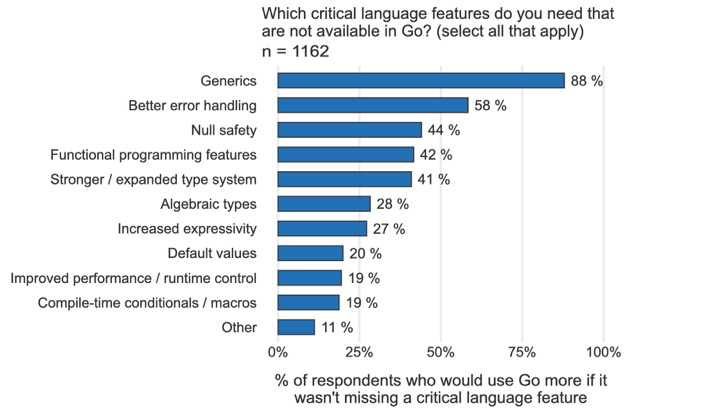   
     上图来自 Go 2020 survey，好家伙 感觉除了 package management 其他的真是一点没变..   
     分享篇文章：  
     Go Developer Survey 2020 Results   
     [https://blog.golang.org/survey2020-results](https://blog.golang.org/survey2020-results)

     可以看出 Golang 现在的发展、主要生态、适用的场景..

     快进到 Go 1.18 吧，毕设要用不上了泛型了..

103.   新特性：Error Cause ，目前 Stage-3
104. 任何设计以及建造同时发生在同一个人身上的心智活动，都是艺术创作。 编程也是属于艺术创作的一种心智活动。

     摘抄自：企划：一本有关程序的词典——《编程语言词典》  
     [https://ray-eldath.me/programming/dictionary-project/](https://ray-eldath.me/programming/dictionary-project/)

105. 好文分享:   
     I bought 300 emoji domain names from Kazakhstan and built an email service   
     [https://tinyprojects.dev/projects/mailoji](https://tinyprojects.dev/projects/mailoji)

     现代社会典型的成功案例。   
     作者从一个简单的idea \(emoji email address service\)，到借助Tiktok，produce hunt 推广，最后获得成功的故事。   
     我 todo list 一直有一项是: 借助获取信息能力，发掘有信息差的产品，再依靠现在的社交平台 推广，获利。

     从文章可以看出，一个成功的产品离不开，对可行性产品的挖掘能力，执行力 快速打造mvp，以及根据现有资源的推广。

     分享下之前了解过一个真实案例，A 在github上发现一个可以借助 ml 还原老旧照片的项目，A 很快根据它打造成一个简单的软件，然后在抖音上进行推广，并留下自己的联系方式，当天就有数百人加他，他的定价是每张照片 5-10 元，可以想象下～

     分享下我自己的故事，我 github 有一个 1.8k star 的项目，这个项目最开始只是源于 我对一款产品使用方式的不满，感觉这款产品受众很广，但使用姿势却很 geek，普通用户有很大的门槛。于是 我花了几天，简单包装成了可视化软件，并在各大社区 人肉推广，慢慢的越来越多的人了解到，下载量过 20w..

     一款产品的成功 靠得并不是发明者而是看到产品潜力的人。

106. 每日一句分享： 人生的意义就是探索人生的意义。
107. Haskell 实现 快排：

     quicksort \[\] = \[\]   
     quicksort \(x:xs\) = \(quicksort \[y \| y&lt;- xs , y &lt; x\] \) ++ \[x\] ++ \(quicksort \[y \|y&lt;- xs, y&gt;=x\]\)

108. 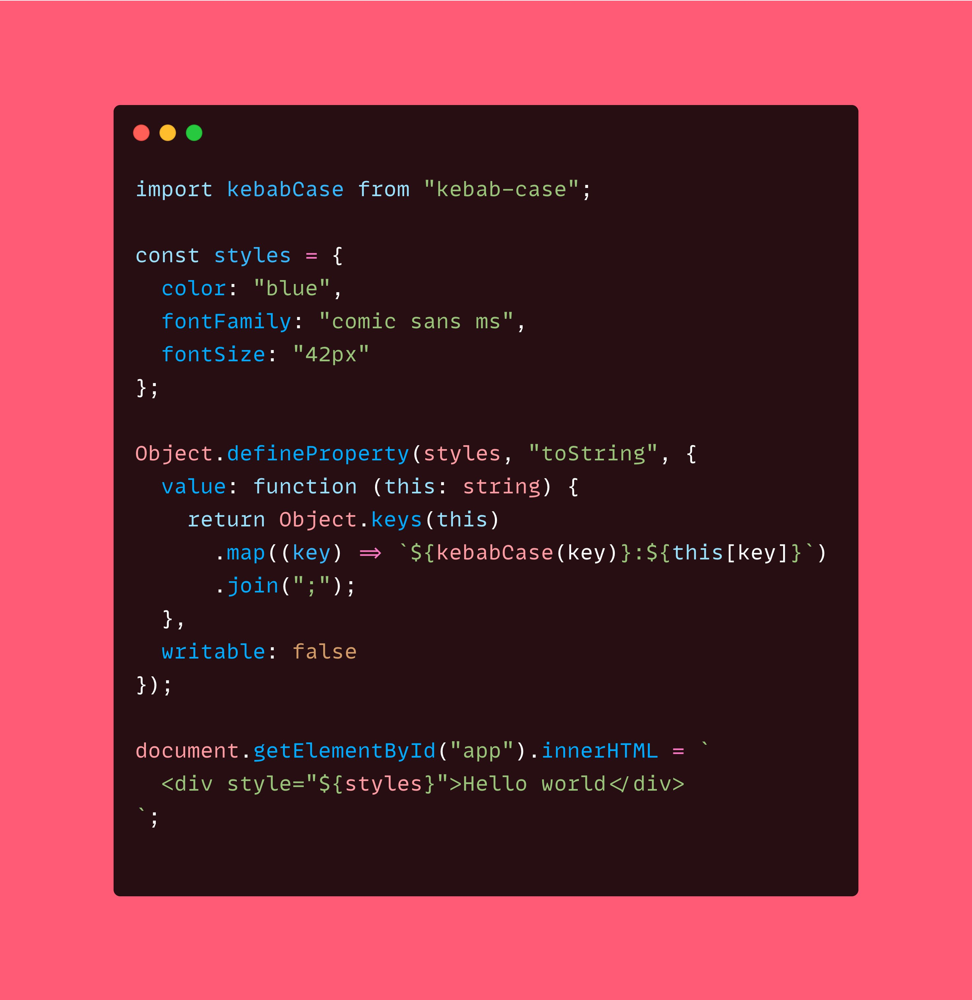
109. 2013 年 React 的官网 [https://web.archive.org/web/20130607112820/http://facebook.github.io/react/](https://web.archive.org/web/20130607112820/http://facebook.github.io/react/) 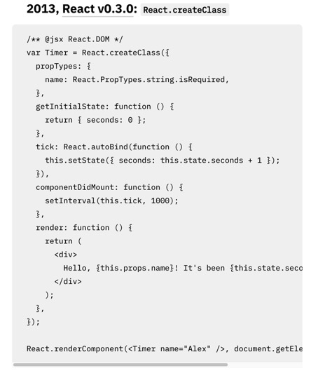
110. 生活是人为了生存和发展而在一定的自然环境和社会条件中进行的各种活动。它是有着内在联系的多层次多方面的整体系统，实质上是人的生存发展需要的不同表现，也是围绕着以需要为基础的利益而进行，并随着需要和利益的变化而变化的。 生活的内容和水平取决于物质生产状况和社会发展水平，同时也与个人的文化状况、能力和社会联系有关。在社会生活中形成的人生观反映了人们在不同生活领域内活动的需要和意义，对生活有着规划、调节和控制的作用。  摘自寻找 生活是什么 时看到的百科解释。  A: 用冷冰冰的解释来定义充满意识情绪的生活，真好
111. 词汇分享:   
     dread

     1. verb to feel extremely worried or frightened about something that is going to happen or that might happen.

     Eg: That night as he dreamed, the warrior was confronted by the enemy he dreaded most.

     1. noun a strong feeling of fear or worry:

     Eg:The prospect of working full-time fills me with dread.

112. 皓叔：中文区的互联网趋向于越来越封闭，能深度讨论的事越来越少，而全网都在创造“10万+”，一切唯流量是首，目的只是为了迎合看热闹的大众，收割流量，而不是输出有价值的东西，仅有的有价值的内容也都在被私有化起来变现……所以，从长远的角度来看，中文圈的信息只会越来越差……

     A: 确实随处可见的广告，流量至上，国内搜索引擎出来的前几条都是广告水文  
     B: 还有为了提升搜索引擎权重建立的各种 收集网站  
     互联网流量不管是pc时代还是移动时代 一直都把握在资本巨头手中。  
      为了商业化、流量不丢失，导致获取信息的过程中出现了一系列魔幻产物。   
     万维网之父 李博士很早就意识到了这一点，所以近些年他一直在推广去中心化的网络模型。   
     由于破坏了资本的根本利益，所以去中心化的网络也只能存在于乌托邦。

113. 每日一句分享:   
     今天，是你生命中最年轻的一天。

     \(也是你爱的人 生命中最年轻的一天\)

114. 每日一句分享:   
     I'm convinced that the only thing that kept me going was that I loved what I did.

     我深信，保持前进的唯一动力，就是我热爱自己所做的事。

115.   filter movies manually by rating.
116. 热力学第二定律告诉我们，物质与能量只能沿着一个方向转换，即从可利用到不可利用，从有效到无效，从有秩序到无秩序。热力学第二定律实质上就是说宇宙万物从一定的价值与结构开始，不可挽回地朝着混乱与荒废发展。

     热力学的两个定律可以用一句简短的句子来表达：宇宙的能量总和是个常数，总的熵是不断增加的。

     摘抄自 《熵：一种新的世界观》

117. cherish - /ˈtʃer.ɪʃ/ verb

     1. to love, protect, and care for someone or something that is important to you.

     Eg: Although I cherish my children, I do allow them their independence.

     1. to keep hopes, memories, or ideas in your mind because they are important to you and bring you pleasure.

     Eg: I cherish the memories of the time we spent together.   
     A: 啥学词 app？   
     B: 不是 app，是剑桥词典网站。   
     [https://dictionary.cambridge.org/dictionary/english/cherish](https://dictionary.cambridge.org/dictionary/english/cherish)   
     C: cherish 貌似很常见 可以翻译成: 把...当成宝贝   
     B: 不常见的是 cherish 后面的名词。

118. 在内存只有 24KB 的电脑上写操作系统，是怎样的体验？   
     [https://mp.weixin.qq.com/s/NMEBNoF-gRpVPZQTNSBEUQ](https://mp.weixin.qq.com/s/NMEBNoF-gRpVPZQTNSBEUQ)

     快餐文分享，介绍了 Unix 的前世今生，Unix的发明其实只是40年前的事情。

119. 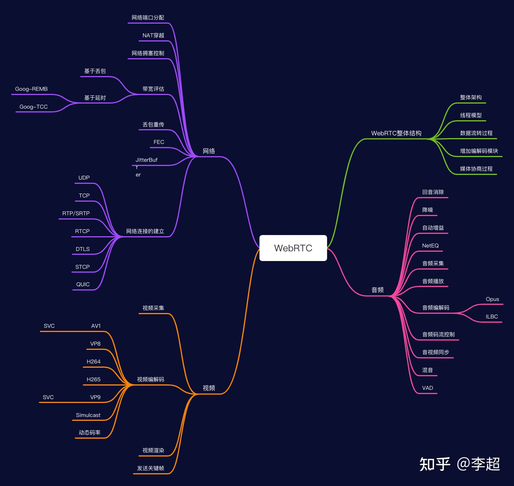  WebRTC 集网络传输、音视频处理的一套 Web 标准。
120. 分享篇文章:   
     Rockstar thanks GTA Online player who fixed poor load times, official update coming   
     [https://www.pcgamer.com/rockstar-thanks-gta-online-player-who-fixed-poor-load-times-official-update-coming/](https://www.pcgamer.com/rockstar-thanks-gta-online-player-who-fixed-poor-load-times-official-update-coming/)

     R\*回应了，与之前文章的作者取得了联系，准备在下一版本更新，并可能奖励1w美金给作者。

121. 好文分享:   
     Performance comparison: counting words in Python, Go, C++, C, AWK, Forth, and Rust   
     [https://benhoyt.com/writings/count-words/](https://benhoyt.com/writings/count-words/)

     作者根据自己常年出的一道面试题\(文本分词后，根据出现频率进行排序\)，给出了多个语言版本的解决方案，并给出不同语言的优化版本。

     文章很长，读完后有一些感想:

     1. Go 的性能测试工具很现代，可视化到一个 web 页面
     2. C++ 还是那么不可读，哪怕是简单版本
     3. 同样 Rust 的多个符号组合让人畏惧
     4. 社区的贡献力量 很庞大
     5. C 与 py 的代码函数 说明了背后隐藏的复杂度
     6. 性能瓶颈不在于 io，而是 hash 操作与分词
     7. wc 永远滴神
     8. 语言越底层，优化的技巧越多

     之前我还用 Go 写过 WC 的4个版本，感兴趣的同学可以看下基本原理。 [https://github.com/Tomotoes/WC](https://github.com/Tomotoes/WC)

122. 每日一句分享:  
     一流的投资者研究投资者情绪，就是股民们的喜怒哀乐等；二流的投资者研究政府政策；三流的投资者研究企业基本面，就是企业的产品、竞争力、利润率之类；四流的投资者研究K线，就是股票价格的走势、股票交易量等。

     摘抄自《金融思维》

123. 腾讯的HR方法论：以用户思维发现需求,用产品思维制定政策,用运营思维推行政策。

     摘抄自 《腾讯人力资源管理》

124. 

     让我想起了之前TS的复数模型。

     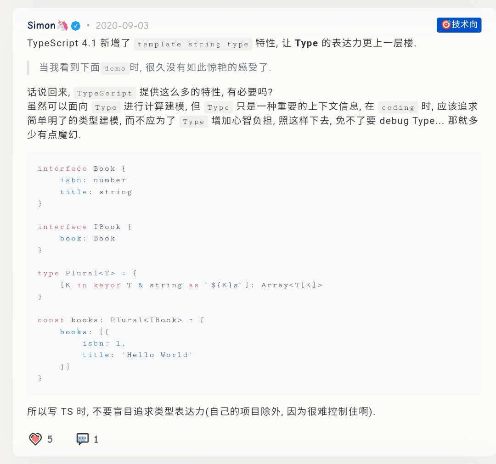

125. 编程语言新宠 Rust 不完全入门指南   
     [https://mp.weixin.qq.com/s/2CkSpOmt0aYuGAEcl1XByw](https://mp.weixin.qq.com/s/2CkSpOmt0aYuGAEcl1XByw)

     快餐文分享，文章比较基础，讲解了 Rust 常见的语法特性，对 Rust 感兴趣的同学可以了解下。 现代的编程语言真像是一个个组装工。

126. Dimmed theme beta for GitHub.com   
     [https://github.blog/changelog/2021-03-16-dimmed-theme-beta-for-github-com/](https://github.blog/changelog/2021-03-16-dimmed-theme-beta-for-github-com/)

     Github 出了新的主题皮肤。

127. 字节跳动最爱考的前端面试题：计算机网络基础 [https://juejin.cn/post/6939691851746279437](https://juejin.cn/post/6939691851746279437)

     分享一些基础面试题，找工作的同学可以查漏补缺下。   
     文章有关建立 https 连接的过程 缺少信息，https 层分为多个版本，每个版本都是有差别的。

     翻了下之前分享的文章，简单来说 TLS 握手分为三个版本: 1.0，1.2，1.3。 1.0 就是最基础的加密过程，就是文中提到的。1.2 去掉了 rsa 的密钥加密算法，换成了更安全的ECDHE 算法，此时需要的加密参数发生了很大变化。1.3 则是完全去掉了 rsa，并且整个建连的过程只需要一次rtt.

128. 善于利用思维时间的人，可以无形中比别人多出很多时间，从而实际意义上能比别人多活很多年。  
     善于利用思维时间的人则能够在重要的事情上时时主动提醒自己，将临时的记忆变成硬编码的行为习惯。

     每个人的手表都走得一样快，但每个人的生命却不是。衡量一个人生活了多少年，应该用思维时间来计算。 因为看书并记住书中的东西只是记忆，并没有涉及推理，只有靠推理才能深入理解一个事物，看到别人看不到的地方，这部分推理的过程就是你的思维时间，也是人一生中占据一个显著比例的“暗时间”，你走路、买菜、洗脸洗手、坐公车、逛街、出游、吃饭、睡觉，所有这些时间都可以成为“暗时间”，你可以充分利用这些时间进行思考，反刍和消化平时看和读的东西，让你的认识能够脱离照本宣科的层面。  
     这段时间看起来微不足道，但日积月累将会产生庞大的效应。   
     能够充分利用暗时间的人将无形中多出一大块生命。  
     以上文字摘抄自 《暗时间》 刘未鹏 想表达是 利用好碎片时间，并且学习时多思考，深入理解当前的知识，这样 你的思维时间将会越来越多。

129. 每日一句分享:  A few lines of reasoning can change the way we see the world.
130. Open JDK 16 发布： [http://openjdk.java.net/projects/jdk/16/](http://openjdk.java.net/projects/jdk/16/)

     在语法上提供了 Recode，Instace Pattern Matching等特性。

131. 快餐文分享:  Why Video Chat is a Hard Technical Problem  [https://dev.to/lazerwalker/why-video-chat-is-a-hard-technical-problem-43gj](https://dev.to/lazerwalker/why-video-chat-is-a-hard-technical-problem-43gj)  作者从4个方面阐述了 WebRTC 实践上的难点:
     1. 音视频设备获取数据在不同浏览器上的兼容性与不一致表现。
     2. WebRTC 需要信令服务器进行转发握手信息。
     3. 如果遇到对称性NAT 或者防火墙 只能自己建设 TURN 服务。
     4. 如果存在某一节点网速变慢，WebRTC 是无法做到端对端调整码率，只能从 p2p 改成 中心化的智能转发数据架构。
132. 快餐文分享:   
     聊一聊Serverless   
     [https://lengyuexin.blog.csdn.net/article/details/113833894](https://lengyuexin.blog.csdn.net/article/details/113833894)

     摘要: 从架构角度理解，Serverless=FaaS+事件驱动+BaaS=无服务器计算\(Serverless computing\) Faas:Function as a Service,函数即服务 事件驱动：通过事件触发的形式去完成函数的调用，处理请求和响应（如定时任务/http请求…） Baas:Backend as a Service 后端即服务

     这篇文章介绍 serverless 虽然偏基础，倒也说清楚了 无服务是什么，适用场景。  
     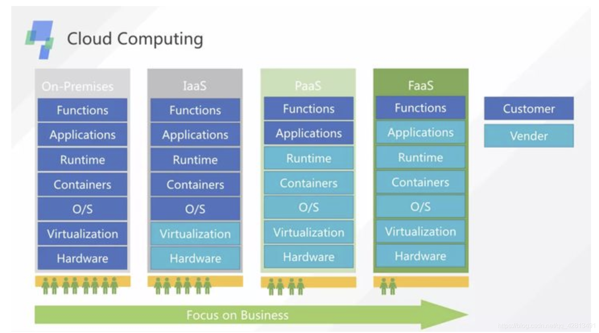

133. 黄峥隐退：「我想去摸一摸 10 年后路上的石头」 [https://mp.weixin.qq.com/s/WC09xWsRp8g8JznfCNc-Ew](https://mp.weixin.qq.com/s/WC09xWsRp8g8JznfCNc-Ew)  正值壮年，接连退任董事长、CEO，丢掉权利巅峰去追寻科学梦想，看起来像是个热爱科研的理想主义者，有点意思。
134. V8 release v9.0  [https://v8.dev/blog/v8-release-90](https://v8.dev/blog/v8-release-90)  提供了 regex 的 indices 属性，其余的都是性能上的优化。
135. 
136. Py 3.10 发布了 Patter matching 语法，看起来还是挺局限的，只能匹配指定的结构。   
     [https://www.python.org/dev/peps/pep-0636/](https://www.python.org/dev/peps/pep-0636/)

     我一直有个疑问，不支持代数类型的模式匹配 除了简短语法，还有什么意义。   
     如果只是简单的值结构匹配，没有类型匹配，那看起来只是 解构的另一种表达。

