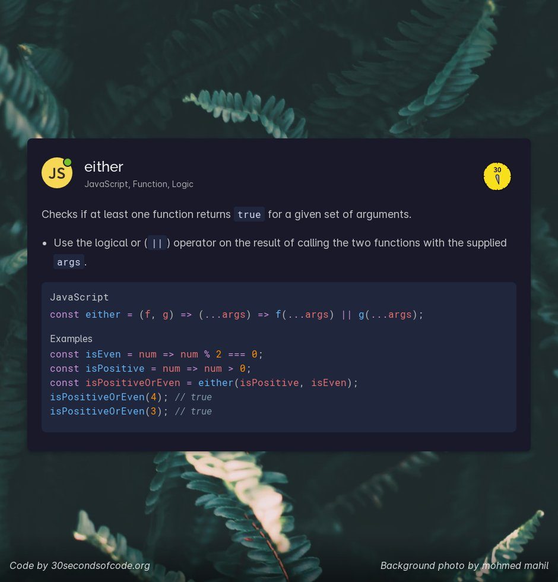
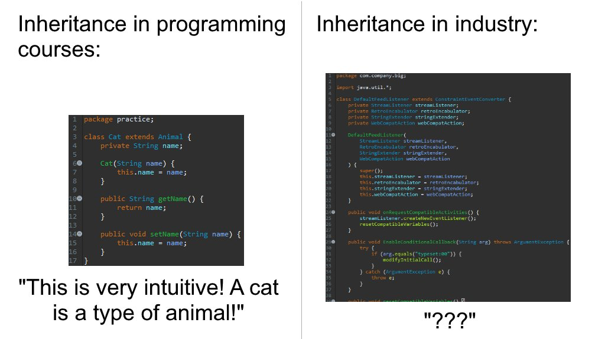
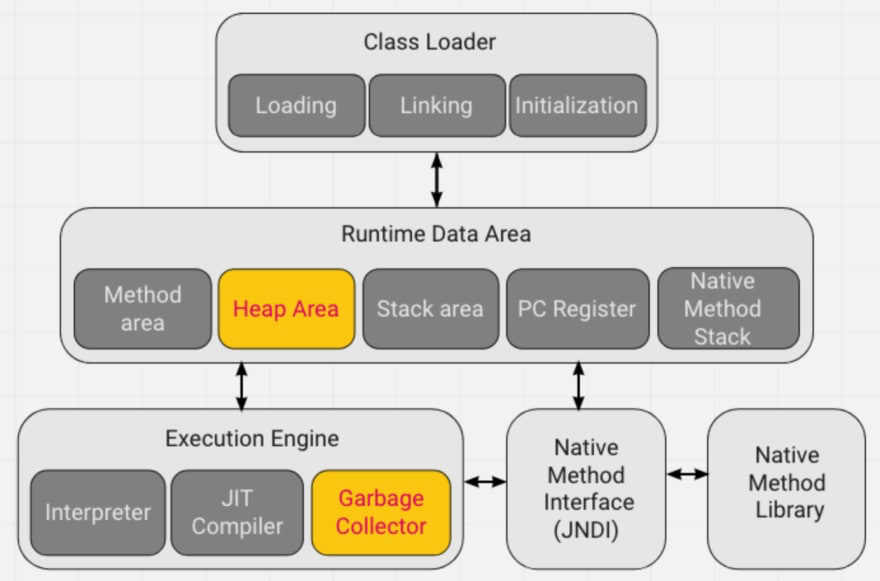
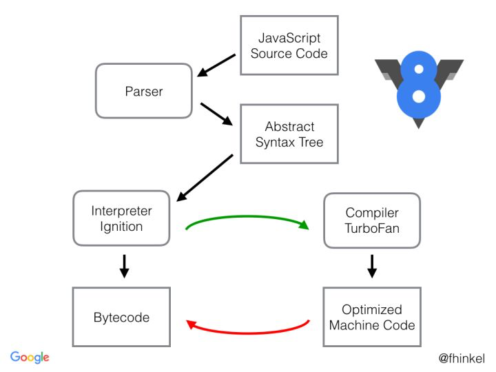
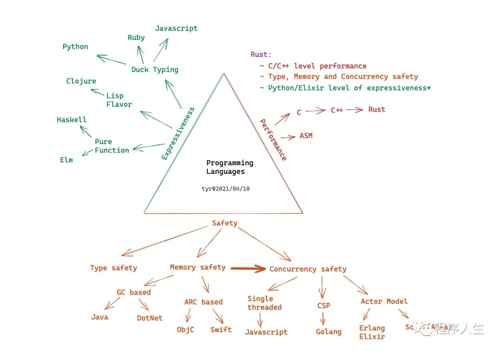
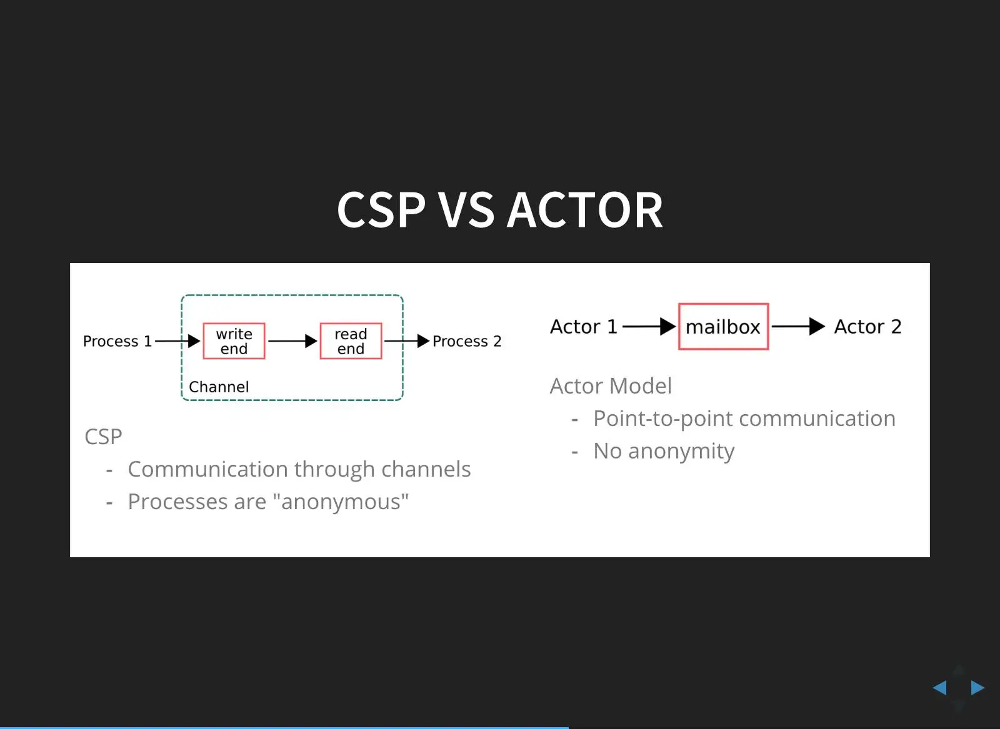
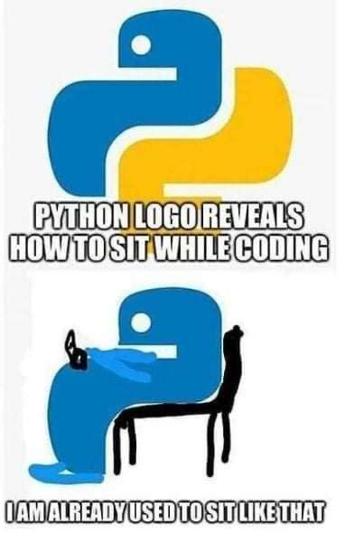
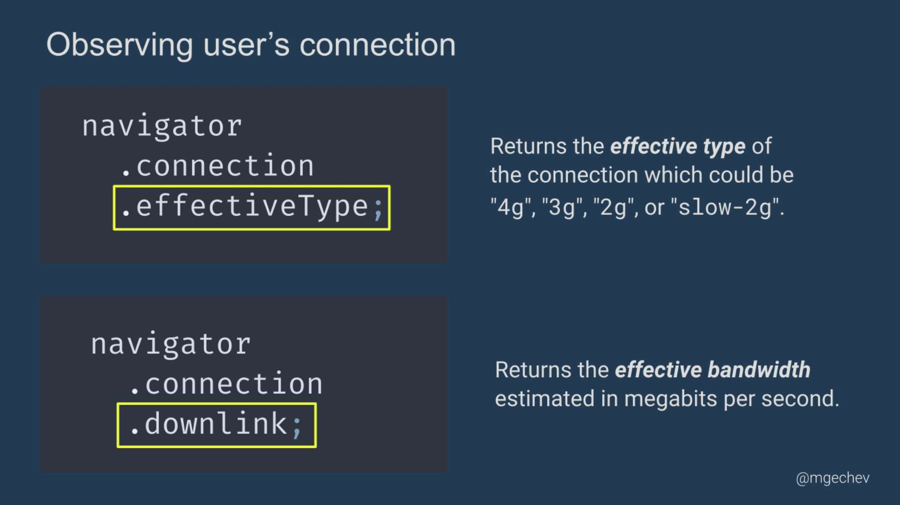

# 1-14

1. 3 月分享汇总：

   1-18：[https://thinking.tomotoes.com/archives/2021/3/1-18](https://thinking.tomotoes.com/archives/2021/3/1-18)

   共分享：136 条，其中 好文 6 条 快餐文 21 条。

   19 - 31：[https://thinking.tomotoes.com/archives/2021/3/19-31](https://thinking.tomotoes.com/archives/2021/3/19-31)

   共分享：93 条，其中 好文 10 条 快餐文 17 条。

2. 每日一句分享:

   什么时候最适合做垃圾回收？当没有人进行观察时。用一颗摄像头对眼球进行追踪，当对象的眼睛离开屏幕时就执行垃圾回收。

   When is the best time to do a GC? When nobody is looking. Using camera to track eye movement when subject looks away do a GC. -- Richard Hudson

3. 

   淳朴的语义表达。

4. 惊讶系列分享:   
   Making Facebook 2x Faster

   [https://m.facebook.com/nt/screen/?params=%7B%22note\_id%22%3A10158791326312200%7D&path=%2Fnotes%2Fnote%2F&refsrc=https%3A%2F%2Fm.facebook.com%2F&\_rdr](https://m.facebook.com/nt/screen/?params=%7B%22note_id%22%3A10158791326312200%7D&path=%2Fnotes%2Fnote%2F&refsrc=https%3A%2F%2Fm.facebook.com%2F&_rdr)

   这是一篇 10 年前，脸书工程师写的文章，介绍了如何从 网络时间，服务响应时间，页面渲染时间 三个阶段优化 站点 TTI 指标。

   其中 优化网络时间 需要发起更少的请求，请求更小的资源。 服务器响应时间 没有展开说，因为这一阶段是完全可控的。 除了传统的优化技巧，脸书工程师 重点优化了 可复用资源的请求 与 查分 过程。 并且开发了 Primer 作为关键JS文件的本地缓存管理库。 另一个杀手锏 就是 bigpipe，将服务器响应时间 与 渲染时间 增量化，从页面单位， 划分成业务组件单位\(这与React Server component 的概念 很相近\)。 从另一个角度思考，是将服务器 与 客户端 并发化，这是一个创新型的技术。

   关于 bigpipe 摘要:   
   We've overlapped a significant portion of the generation time with the render time which will reduce the overall TTI experienced by the user.

   BigPipe is a fundamental redesign of the dynamic web page serving system. The general idea is to decompose web pages into small chunks called pagelets, and pipeline them through several execution stages inside web servers and browsers. This is similar to the pipelining performed by most modern microprocessors: multiple instructions are pipelined through different execution units of the processor to achieve the best performance. Although BigPipe is a fundamental redesign of the existing web serving process, it does not require changing existing web browsers or servers; it is implemented entirely in PHP and JavaScript.

5. 惊讶系列分享:   
   BigPipe: Pipelining web pages for high performance

   [https://m.facebook.com/nt/screen/?params=%7B%22note\_id%22%3A10158791368532200%7D&path=%2Fnotes%2Fnote%2F&refsrc=http%3A%2F%2Fsegmentfault.com%2F&\_rdr](https://m.facebook.com/nt/screen/?params=%7B%22note_id%22%3A10158791368532200%7D&path=%2Fnotes%2Fnote%2F&refsrc=http%3A%2F%2Fsegmentfault.com%2F&_rdr)

   文章介绍了 BigPipe 的技术细节，受 pipelining microprocessors 启发而来。

   BigPipe 在国内有很多实践，国内称这种技术为 页面直出。 更准确的概念是 页面分段渲染。

6. 每日一句分享:

   互联网公司的时间是狗年。狗的一年，据说相当于人的七年。一家开张两年的互联网公司，就像经营了二十年的传统行业公司。

7. 快餐文分享:

   A categorized list of all Java and JVM features since JDK 8 to 16

   [https://advancedweb.hu/a-categorized-list-of-all-java-and-jvm-features-since-jdk-8-to-16/](https://advancedweb.hu/a-categorized-list-of-all-java-and-jvm-features-since-jdk-8-to-16/)   
   文中从多个方面\(语法、API、性能、安全、字节码\)梳理了 jdk8 到 jdk16 的变动更新。

8. 快餐文分享:

   Announcing TypeScript 4.3 Beta

   [https://devblogs.microsoft.com/typescript/announcing-typescript-4-3-beta/](https://devblogs.microsoft.com/typescript/announcing-typescript-4-3-beta/)

   TS 4.3 changelog。

   1. 新增 getter setter 属性支持
   2. 可使用 overwrite 关键字显示声明重写方法
   3. 字符串模板类型更加定制化 \(为字符串限制类型，真是太赞了\)
   4. 支持 \#private 修饰属性 方法\(好丑\)
   5. Check 未 await 的 Promise 将会抛出异常\(不会真有人这么用吧\)
   6. 支持类中静态索引属性
   7. 枚举不可以与任意数字比较 还有一些与语法无关的更新，详细可以看原文。

9. 每日一句分享:

   眼镜蛇效应（Cobra effect）指的是解决某个问题的方案，反而使得该问题恶化。

   它来自于殖民时期的印度，政府颁布法令说每打死一条眼镜蛇都可以领取赏金。结果，民众为了赏金开始养殖眼镜蛇，政府不得不取消赏金，养殖蛇的人就把蛇都放了，放出去的蛇继而繁殖，反而使得眼镜蛇数量大增。

10. 好文分享:

    移动端 JS 引擎哪家强？

    [https://mp.weixin.qq.com/s/2cxe1L9\_vyB8oNg2jr2rkg](https://mp.weixin.qq.com/s/2cxe1L9_vyB8oNg2jr2rkg)

    文章介绍了移动双端中常用的 JS 引擎\(JSC、V8、Hermes、Quickjs\)，并分别讲解了历史背景 与 在 IOS Android 上各自的优缺点，最后给出了目前业界选型的一些案例。

    简单解释下文中涉及到编译的术语: JIT、AOT、增量编译、堆快照。

    1. JIT : 即时编译（英语：just-in-time compilation，缩写为JIT。 在程序运行期间会不断分析正在运行的字节码，根据一定策略，将 hot code 直接编译成机器码，减少字节码 transform 开销，不过因为集成在 runtime 会增加内存占用。
    2. AOT: 在程序执行前期，先将源码编译成字节码，然后程序执行时只需运行已经编译好的字节码，移除源码解释的时间。
    3. 增量编译: 增量是一种思想，用一个典型例子解释: git push 只会 push 修改的部分，不会 push 整个项目。 这就是 增量的思想。而增量编译 顾名思义 只会编译修改的部分，不会编译整个项目，所以 增量编译存在于工程时间，而不是 runtime。
    4. 堆快照: AOT 的一种应用。

       在文中的业界选型中，几乎不约而同的 在 IOS 系统中全都采用 JSC 作为 JS 引擎，还是被阉割 只能解析执行的 engine。 并且据我所知，所有的第三方 IOS 应用如果有编译执行 VM 的存在，都是不允许上架 App Store 的。

       Apple 一向以来都是生态闭环，不管是 to c\(客户\) 还是 to d\(开发者\)。

11. 国内知名 BaaS 厂商 LeanCloud 被 TapTap 收购了... hah 由客户变成了金主爸爸
12. Question: 目前业界内 前后端分离架构，做用户状态保存的最佳实践是什么？

    A: 共享session，独立session服务器   
    B: 独立 session 服务器有单点问题，能不能服务端端不保存状态呢？   
    目前业界常用实践\(前后端分离\)也只能是后端管理 session 了..   
    A: 不保存状态是啥意思啊，独立session服务器也算是无状态服务   
    B: 就是后端彻底是无状态的，根据前端 Token 拿到 uid \(用户ID\)。 我说的状态是用户状态..

    B: Session 的数据结构怎么设计呢？ \[sessionId\] -&gt; uid 这种 hash 结构嘛~   
    B: 先不谈 csrf，感觉 cookie session 给服务端增加很多复杂性..

    B: 还是使用 Token 做用户状态保存吧，服务端彻底无状态。   
    最明显的缺点是，单点登录 还是需要数据层做妥协，禁用 Token 可以维护一个黑名单。 也只能这样减少复杂性了

    B: Token 自动续期的话，可以每次请求重新分发，然后在设置一个较长的过期时间。

    A: 确实，肯定需要数据层，不过问题也不大，在可以接受的范围内。分布式下token会不会有副作用

    B: 预防 CSRF 攻击可以CSRF Token 分发到页面，请求带上，只存在于会话期间。 假如不做单点登录，没有禁用Token 需求，那么不需要数据层保存状态了~

    B: 对于后端，复杂性最低的就是 Token 了。   
    从 登录请求根据用一些不关键信息\(uid\) + 服务端密钥 + 加密算法 生成 Token，下发到客户端。   
    客户端请求带着 Token，提取 uid，再根据 服务端密钥 + 加密算法生成一遍，相同则权限通过。   
    客户端管理 Token 可以根据 httpOnly + cookie 过期时间。   
    最致命的问题是，无法废弃已下发的 Token。 并且 Token 续签只能通过 客户端 cookie 过期功能。

    B: 想了想，废弃下发 Token 可以手动维护一个黑名单，自动续签 也可以在 用户的不关联信息 加上一个时间戳，如果时间戳 未来的一定期限内 继续维持，如果超出则自动更新。

    emm，有实践的可能性。   
    hah，我称之为 statusless 方案，新的术语出现了

13. 快餐文分享:

    How MDN’s site-search works

    [https://hacks.mozilla.org/2021/03/how-mdns-site-search-works/](https://hacks.mozilla.org/2021/03/how-mdns-site-search-works/)

    文章讲解了 MDN 的技术架构，由于站点大部分内容都是 静态文件，只有一个搜索接口可以讲.. 居然是采用 Django 作为 web framework 这让我没想到，搜索引擎是 es，数据同步使用的是 github action.. 这些基本的服务支撑起了 MDN 搜索功能。

    每一次提取搜索内容需要花费 24 小时.. 使用 py 脚本做这件事 真的合理嘛..\(估计是 GIL 的限制\)，可以使用 Numpy 提速..   
    这种 计算密集型 任务，使用 Golang 最合适不过了。 我在想，如果使用 gpu 计算，goruntine 还具有优势吗？   
    看了一些文章，大部分讲的都是 golang 如何调 cuda\(可看做英伟达平台的指令集\)，没有相关讨论。

14. 快餐文分享:

    5 ways to prevent code injection in JavaScript and Node.js

    [https://snyk.io/blog/5-ways-to-prevent-code-injection-in-javascript-and-node-js/](https://snyk.io/blog/5-ways-to-prevent-code-injection-in-javascript-and-node-js/)

    防止代码注入的五种规范:

    1. Avoid eval\(\), setTimeout\(\) and setInterval\(\)
    2. Avoid new Function\(\)
    3. Avoid code serialization in JavaScript 4 Use a Node.js security linter
    4. Use a static code analysis \(SCA\) tool to find and fix code injection issues

15. 每日一句分享:

    舜发于畎亩之中，傅说举于版筑之间，胶鬲举于鱼盐之中，管夷吾举于士，孙叔敖举于海，百里奚举于市。故天将降大任于是人也，必先苦其心志，劳其筋骨，饿其体肤，空乏其身，行拂乱其所为，所以动心忍性，曾益其所不能。

16. Linux 内核 和 Windows 内核有什么区别？ - 小林coding的视频 - 知乎 [https://www.zhihu.com/zvideo/1362020816201367553](https://www.zhihu.com/zvideo/1362020816201367553)

    分享期小林的视频，讲解了内核的能力\(内存管理，进程调度，驱动管理，程序运行环境\)，Linux 内核的设计特点，Windows 与 Linux 内核，可执行文件的差别，以及不同的内核模型。有空的同学可以刷一下，视频很短。

17. 开个老生常谈的话题，如何管理 项目中的复杂性，有哪些手段？

    常见的手段有 分层，模块化，抽象。   
    从抽象维度 小到大来讲的话，就是 抽象，模块化，分层。

    抽像 函数维度， 最典型的提现就是代码中接口与实现的关系，调用者只需要知道接口的能力，如何实现不必感知，能有效减少心智成本。

    模块化 文件维度，是将相同业务或使用场景 的代码组合起来，成为一个模块，就比如 monorepo 中多个不同的 package，微服务架构的项目。

    分层 项目维度，将同一层级的项目横向组合起来，最典型的就是 OSI 网络模型。

    呃，只给个宏观视角，详细展开说的话，太泛泛。

18. ```text
    Y = f => (
        (g => g(g))
            (x => f(a => x(x)(a)))
    )
    fact = Y(f => n => n == 1 ? 1 : n * f(n - 1))
    console.debug(fact(5)) // 120
    ```

    这种 Y combinator 看起来真像是魔法.. 看完发现，只有 我脑子是不动点。

19. 快餐文分享:

    重新发明 Y 组合子 JavaScript\(ES6\) 版

    [http://picasso250.github.io/2015/03/31/reinvent-y.html](http://picasso250.github.io/2015/03/31/reinvent-y.html)

    这篇文章把 Y-combinator 讲得细致入微，从 0 演化成了Y组合子，感兴趣的同学可以读一下。

20. 
21. 
22. 分享则故事:

    The history of UTF-8 as told by Rob Pike

    [http://doc.cat-v.org/bell\_labs/utf-8\_history](http://doc.cat-v.org/bell_labs/utf-8_history)

    现在世界上广泛使用的编码 UTF-8 的发明历史。 由 罗伯派克 与 肯汤姆森 花了两三天的时间完成。 该文章主要从 Rob Pike 的视角，讲解了 当时发生的一些事情。

    丹尼斯里奇 与 肯汤姆森 这两位最初 Bell labs 的 研究员，可以说为 现在计算机界的发展做出了 不亚于 冯老爷子的贡献。

    当然冯老爷子\(冯诺依曼\) 不是人，是神，通天带的那种。

    图灵与之相比就一不懂事的小学生。

23. 快餐文分享:

    Off-heap memory in Java

    [https://dev.to/jeissonk19/off-heap-memory-in-java-4dd1](https://dev.to/jeissonk19/off-heap-memory-in-java-4dd1)

    文章首先介绍了 JVM 中堆的主要作用，并给出了 JVM 规范中的定义。 接下来讨论了 当堆中数据过大时，GC 压力很大，会造成长时间的 suspend，所以给出了 如何在 JVM 堆外保存数据的方案\(可能是软文？\)。

    

24. 每日一句分享:

    我通过删除 WordPress 的 Mailchimp 插件中 20 KB 的 JavaScript 依赖关系，每月估计减少了59,000 公斤的二氧化碳排放量。

    之前分享过的环保观点：

    1. 4G 上网的二氧化碳排放比 WIFI 上网高4～7倍。
    2. cloudflare 公司宣布，新推出的 Bot fight 功能所释放的二氧化碳，将通过种树弥补。根据计算，一个 CPU 内核每年释放8公斤二氧化碳，而一棵树吸收21公斤二氧化碳，因此计算量每新增2.5个 CPU 年，该公司将种植一棵树。
    3. 训练一个大型 AI 模型会排放近30吨二氧化碳，相当于5辆小汽车终身的二氧化碳排放量（包含制造期间的二氧化碳）。

    为了我们子孙后代的生存环境，请不要再写垃圾代码了

    A: 数字挖矿造成的二氧化碳是不是更多?

    B: 数字挖坑一般都会用到定制化的智能硬件，相对于普通GPU的使用情况来讲，肯定更耗费性能，能量守恒定律。

25. 开个话题，编程语言中 类型系统 是否会限制抽象能力，你想到了哪些场景。

    或者说，类型系统是否已经潜移默化地影响了 编程中的思维表达。

    一个具有“完备”\(相对而言\)类型系统的语言 或者 没有类型系统的语言 是否能写出更高级别的抽象代码。

    我一直把类型当做上下文标注信息来理解，而大部分场景下 它已经成为了一种约束，像是一种工程化的妥协。

    类型系统 是为了编译器更好提取上下文，更好地优化程序；为了工程“更高质量” 定义的一套法则。 也是预先定义的一套编程思想定式。

    在不同视角上来看，有合理的意义，也有不合理的意义。 突然觉得这种话题 没有 01 定论，就算深入探讨 遇到的只是各种 解释 归因。

    想起了 暗时间 中的一段话: 由于事实上，任何行为都有合理性因素在里面，所以总是有机会争辩的。

26. 快餐文分享:

    Object oriented vs. functional programming

    [https://www.johndcook.com/blog/2010/11/03/object-oriented-vs-functional-programming/](https://www.johndcook.com/blog/2010/11/03/object-oriented-vs-functional-programming/)

    摘要: OO makes code understandable by encapsulating moving parts. FP makes code understandable by minimizing moving parts.

    文章很短，简单探讨了 fp 与 oo 对 state 的不同处理，以及在混合编程中很难达到 不同编程范式最大的优点。

    有一则评论很赞同:   
    My experience so far has been:   
    1\) Inheritance is over-rated, composition is far more useful.   
    2\) State is unavoidable, but good programming is about getting away with as little state as possible.   
    3\) Thinking of a problem assuming you are going to write the program in a purely functional language usually results in a better design \(even if you come back and write classes and maintain state in them\)

27. 

    V8 运行 JS 的过程

    1. 源代码\(source code\) 通过解析器\(parser\) 解析后 生成抽象语法树\(AST\)
    2. 抽象语法树 通过 解释器\(interpreter-Ignition\) 生成了字节码\(bytecode\), 此字节码作为基准执行模型, 字节码等同于 25%-50% 机器码大小. 并且 此时抽象语法树被彻底清除掉了, 释放其内存空间.
    3. 生成后的字节码 直接被 解释器执行 \(解释执行\),
    4. 在代码不断的运行过程中, 解释器收集到了很多可以优化代码的信息, 比如变量的类型, 哪些函数执行的频率较高.
    5. V8引擎的编译器\(compiler-TruboFan\) 会根据这些信息和字节码 来编译出经过优化的机器代码

    一些常见的优化规则:

    * 函数只是声明未被调用, 那么该函数不会生成到 AST
    * 函数如果只被调用一次, 字节码则直接被解释执行了
    * 如果函数被调用多次, 可能会被标记为热点函数, 会被编译成机器代码

    1. 随着不断执行, 会有越来越多的代码被标记为热点代码, 然后被编译成机器码.

    所以 JS 运行的过程 正是一个从解释执行到编译执行的过程.

28. 每日一句分享:

    一个人如果将他自己描述得很好的话，他十有八九是在撒谎，因为任何生命从内部审视都只不过是一系列的失败。 如果能意识到问题 就好了，可描述的人 往往只愿沉浸在自己以为的成功。 如果能遇到帮助审视自己的朋友，一定要珍惜。

29. 快餐文分享:

    λ表达式与邱奇数，JAVA与JS的lamda表达式实现

    [https://www.cnblogs.com/niuyourou/p/12245960.html](https://www.cnblogs.com/niuyourou/p/12245960.html)

    一直对邱奇数很感兴趣，用函数定义熟数字。 今天刷到了这篇文章，文章前面主要介绍了关于 lambda 演算的历史背景，后面给出了 js java 邱奇数的实现。

    补充下摘要: 现代形式科学的所有的故事都来自于莱布尼茨的两大梦想：第一、建立一套严格精密的人工语言，这种语言没有人类语言的歧义多结构，可以精确地描述任何哲学、逻辑和数学问题；第二、找到一种方法，利用这套“普遍语言”，解决任何科学、哲学和数学的问题。　　

    莱布尼茨的梦想，在20世纪先后成真：集合论和符号逻辑、计算科学。而这一切的一切都源自19世纪末20世纪初发生的第三次数学危机。这场危机的结果使得数学、逻辑学和哲学发生了脱胎换骨的变化，数学的公理化、逻辑学的数学化、哲学的逻辑化是这个伟大变革中最显著的特点。

30. 想到了之前摘录的一句话:

    图像的表达力和精准度有限，信息冗余和歧义多，特别是无法\(或很难\)表达抽象。

    相对的，我看好公式公理化数学化高阶逻辑化编程.

31. 阿里需要一次触及灵魂的反思

    [https://mp.weixin.qq.com/s/-lDKXVTPLNt72jC5LyuyXA](https://mp.weixin.qq.com/s/-lDKXVTPLNt72jC5LyuyXA)

    分享篇今天读到的一篇文章，文章给出的观点很主观 有作者的思考，整体不像其他文章 没有阴谋论的调调。

32. A: http2的多路复用值怎么保证数据的顺序的   
    B: 有序号值，不过当一个帧丢失时，复用该链路的所有请求都会阻塞，这是 http2 最大的槽点。

    A: 每一个数据帧都会有一个序号吗   
    B: 是的，这个序号决定该帧属于哪个流。   
    快进到物理界出现新突破吧，不然再计算机业界再怎么出新东西 都打破不了天花板。

33. 快餐文分享:

    Python 3.10 : What's the new ?

    [https://dev.to/thrpy/python-3-10-what-s-the-new-4a61](https://dev.to/thrpy/python-3-10-what-s-the-new-4a61)

    Py 3.10 的一些新特性，增加了 类型标记中增加了组合，别名。语法中增加了 结构模式匹配\(无聊\)。

    A: JS给点作用啊JS 感觉这两年没啥nb的特性   
    B: ?? ?. js 已经让我变成了问号党

34. 好文分享:

    CPU 和 GPU - 异构计算的演进与发展

    [https://draveness.me//heterogeneous-computing](https://draveness.me//heterogeneous-computing)

    文章整体介绍了 CPU GPU 的演进历程，为了达到更快更强的性能，工程师做出的努力。

    文章梳理得很棒，受益匪浅，以下信息皆来自该文章，建议阅读。

    

    每一条汇编指令都是原子操作，而原子操作意味着该操作要么处于未执行的状态，要么处于已执行的状态，而数据库事务、日志以及并发控制都建立在原子操作上。不过如果再次放大指令的执行过程，我们会发现指令执行的过程并不是原子的。   
    有针对指令级并行的处理器-超标量处理器。   
    原来 intel cpu 之间的通信 也采用的是 网格\(mesh\)架构，这和微服务各个节点的服务代理通信机制 异曲同工。

    经常分享这位老师的文章，很早之前学 go 时就被他吸引，记得剖析 go 源码文章，大多数人 都是研究 lib或汇编，他直接从词法分析搞起..

35. 突然想到一个有趣的点，现在大部分产品 通信都是C-S架构，如果是S-S架构会怎样？

    浏览器加载网页时不仅请求html，还会请求cgi，然后 run 在 sandbox 中，这样是不是天然支持全双工？是不是可以最低成本实现p2p？   
    现实条件 背景先不管，如果真能实现这种架构，那一定能极大扩展现在传统的通信机制。   
    A: 这算是一种退步吗？未来的趋势不是把更多的逻辑处理放到云端，client尽量的轻便。

    呃，这只是设想，因为现在的计算机 还不支持或者说能力不够。   
    现在也是这种趋势，未来可能终端能承载更多东西，如果5g落地的话。   
    但是现在这种趋势真的好吗？或许好吧。   
    我看到的只是被商业包裹下的互联网。 希望有生之年能看到去中心化网络在国内出现。

36. 透过 Rust 探索系统的本原：编程语言

    [https://mp.weixin.qq.com/s/ZA-\_BARVAWe0Q4eM0lYgwg](https://mp.weixin.qq.com/s/ZA-_BARVAWe0Q4eM0lYgwg)

    好文分享，介绍了编程语言中世界观对设计的影响，并以 rust 为例讲解了 编程语言设计时的衡量取舍。  
    

37. 每日一句分享:

    编程语言有三派：哲学派、数学派、物理派。Erlang和Elixir属于物理派，面向对象属于哲学派，函数式属于数学派 - 张汉东

38. 一图说清 CSP 与 Actor 并发机制的区别。   
    

    摘抄自之前我发的一则微博: CSP 模型 和 Actor 模型, 具有相同的设计理念:

    通过通信来实现共享内存，而不是用共享内存来实现通信。

    然而它们的侧重点不同，Actor 关心通信的实体（对 OOP 更加友好），CSP关心通信的工具。

    如果要选其一的话，我更加欣赏 CSP模型。

    假设通信的数据，可以自我实现状态管理，这样一来就不会被通信双方所约束，消息传递的过程 就可以增加更多的抽象。

    目前，业界的 CSP 代表 Golang 结合 Context 包已经实现了这一点。

39. 沅有芷兮：类型系统的数学之美

    [https://mp.weixin.qq.com/s/ieEewizkN7H-11z-PexkGw](https://mp.weixin.qq.com/s/ieEewizkN7H-11z-PexkGw)

    好文分享，从数学视角介绍类型系统的严谨性，文章开头介绍了原始类型与复合类型的概念，复合类型本质上是笛卡尔乘积的概念让我耳目一新，后面介绍了 类型系统如何处理异常，sum type 为什么是最佳选择，泛型可枚举类型的集合证明。 非常推荐阅读。

40. A: 怎么删除响应头的某个项啊？服务端配置  B: 最好服务端配置。或者加个bff/转发请求层，forward request 的时候 过滤，这样搞复杂性高一点。
41. 分享一段 今天从陈天老师文章上看到的观点，感觉很受益。

    我们生活在一个既幸运又不幸的年代。上古时代，没那么多语言，更没那么些子分工。程序员是包打天下的黑客，匠人。如今，软件开发的领域细分到一个令人发指的地步，前后端分家，跟南北朝似的，然后前端又分裂出东西魏。前些日子 interview 时有个哥们超级自豪地自我介绍，说自己是在做 backend of backends。详问之，不禁哑然。那哥们不过是拿 node 做了些 service 的事情，就觉着自己升级成了刹帝利，急着把自己和做 API 的吠舍们撇清关系了。

    精细分工的后果是程序员从黑客和艺术家蜕化成了螺丝钉 —— 端到端的包打天下越来越罕见，不再有人觉得自己了不起，觉得自己是 King of the world：写代码从一件很 cool 的，很好玩的事情变成了混饭吃的行当。后端的练好肌肉，前端的用好脂粉，便可以了，倘若后端开始修眉，前端怼人鱼线马甲线，那就乱了，是僭越。

42. 分享个项目：

    Awesome Landing Page

    [https://github.com/nordicgiant2/awesome-landing-page](https://github.com/nordicgiant2/awesome-landing-page)

    还在为项目、毕设的首页发愁吗？可以看看这个项目，收集了很多优秀开源的 landing 页，居然包括了 我的主页项目

    我还好奇 最近 一个坏掉的番茄 pv 怎么这么高..

43. A: 有怎么封装dialog的文章吗？ B: 没看过这种文章，可以讨论下。想找 demo 的话，可以去 github 上搜一下，一定有很多的。 建议使用组件库里自带的 dialog，或者 某个 dialog 开源库，是想自己实现吗？ 如果自己实现的话，可以先设计出 props 规范\(标题，内容，弹出动画，点击确认的回调，是否有蒙板等等\)，剩下的就是根据规范 画界面的工作了。  A: api和属性怎么设计啊？  B: 有使用场景吗？建议最初根据使用场景设计，不要过度设计，先做个 mvp 再根据未来的需求迭代。
44. A: 有人熟悉sticky属性吗  B: 其他窗口视图fixed + 当前窗口视图 relative
45. 竞争与垄断：几段概念史

    [https://mp.weixin.qq.com/s/0dsoNUDDTtIZwE5d2TsAcA](https://mp.weixin.qq.com/s/0dsoNUDDTtIZwE5d2TsAcA)

    好文分享，文章梳理了 竞争与垄断理论在经济学上的演变，并给出了 不同阶段下 代表人提出的理论。

46. 

    悲伤的故事  
    爱情就像是个非确定状态有限自动机.. 交流个一两句，情绪系统就能爆出多个异常。

47. 我一个有个疑问，对于现在的互联网feed流产品，到底是用户是客户，还是广告主是客户？   
    A: 我感觉是广告呢   
    Feed流产品 利用各种功能手段 尽可能地争取用户时间，而广告主 花钱在产品上采购用户时间。

    或许 feed 流产品天生就决定了 用户数据，使用时长 这些关键指标是商业模式的驱动力..   
    之前摘录过一段话: 硅谷的 IT 精英圈有一种共识：我们正在建造一个超级大脑，接入网络的所有的用户都只是可以交互的神经元，你就像一个小的编程单元，算法通过你的行为去操作，去编码，来服务于这个巨型大脑！你根本无足轻重，系统不会给你钱，也不会告诉你真相，你完全没有自主权。

    还有之前分享过一句话:

    如果你没有为商品付钱，那么你就是商品本身。——纪录片《监视资本主义：智能陷阱》

    个人认为，这种生态 对用户来讲也不算坏事，毕竟产品需要商业模式，而用户也是能从产品中获取信息。

    如果想摆脱这种产品，不想被它为你亲身打造的信息茧房所束缚，可以试试 rss。

48. 很早之前答应过大家，写一篇信息流获取文章，鸽了好几个月了，其实我获取信息的关键不是靠 rss，而是靠广撒网，遇到关键信息摘要，深入理解。

    最关键的信息流 全是 newsletter，我会订阅很多有趣的博客，社区。 其余的有 rss, 微信号， 收藏的博客，微信读书，twitter, github, 知乎, quora, reddit, 各种社区..\(实在太多了\)

49. 快餐文分享:

    THERE'S ALWAYS MORE HISTORY

    [https://www.hillelwayne.com/post/always-more-history/](https://www.hillelwayne.com/post/always-more-history/)

    深入探索了 Vim 为什么采用 hjkl 做方向键\(当时开发者用的键盘\)，JS 的 month 为什么 从 0 开始的背景故事\(为了更好的内存优化算法\)。

50. 
51. 每日一句分享: 每个时代，自由和常识都面临着四大挑战：强人对权力集中的渴望；穷人对财富不平均的怨恨；无知者对乌托邦的向往；无信仰者将自由和放纵混为一谈。——剑桥大学历史系教授阿克顿勋爵
52. 

    可以通过H5这些网络条件属性，来更好地优化页面性能。 比如，在弱网环境下加载不同的资源

53. Deno 1.9发布

    [https://deno.com/blog/v1.9](https://deno.com/blog/v1.9)

    最大的更新是 http 层默认采用了 http2 了

54. 分享篇文章:

    My startup failed. Then I found out I was unemployable.

    [https://davesullivan.is/my\_startup\_failed\_then\_i\_found\_out\_i\_was\_unemployable.html](https://davesullivan.is/my_startup_failed_then_i_found_out_i_was_unemployable.html)

    HN今日热文，文章以作者的第一人称视角，描述了经历两次创业失败后，发现很难找到一份合适的工作\(出现了~ 白板反转二叉树\)，最后不得以去一家待遇一般的公司遭受压榨，最后吐槽了 虚假的公司文化传统，以及初创企业的不设边界风格。

    摘要: In the larger picture, I would comment that startups and tech companies claim to have a new kind of company culture, but they are \(mostly\) just the new factory with tech workers as the new factory workers. Rather than work at a startup, I much prefer being good at what I do and doing it on a temporary contract basis with clear boundaries and compensation. A job at a typical startup has no boundaries and feels like a cult. So I guess being unemployable works out fine for now, and maybe someday I'll get around to making something again

    感觉这能说明一个问题，聪明人/精英/有思想的人，从一些场景来看，并不会对社会发展产生正向收益.. 他实在太懂自己想要什么了。

55. 刚刚看到了个项目 [https://github.com/piscinajs/piscina](https://github.com/piscinajs/piscina)  - Nodejs线程池库

    我在想，Nodejs 主要靠底层 libuv 任务队列循环模型 去执行。 在应用层提出个 线程池，有什么使用场景。   
    libuv底层实现已经做了池化，在应用层做资源复用，有什么意义... 使用场景是 PM2 这种特例嘛..

    感觉用 nodejs 做这种多线程，cpu密集型计算 都是用错了锤子

56. 目前的计算机底层架构，最理想的高并发模型应该是 轻量级协程 + 池化\(可以看下 golang 的 ants库\) + 命中临界区时的特殊处理\(不要优先使用互斥锁\)+ \(智能硬件/与英伟达的 cuda 紧密结合\)。

    IO 密集，CPU 密集 都可以适用。

    我理想 适用高并发的智能硬件，是在一条原子指令执行时，可以更细化到原子指令的每一步，就比如 加载指令，解码指令，执行，写回。

    对每个核上运行的程序做更细粒化地调度。

57. A: 请问学什么才能看懂你发的东西   
    B: 呃.. 就是学计算机科学.. 就好了.. 不要设边界，随着自己性子来~ 找到乐趣~

    除了时间精力，爱好。 还有一点很重要，学习方法。 学习要多思考，在我这里可以体现为两点∶

    1. 做翻译，把文章主旨，关键思想 翻译成我的语言，这个过程虽然无聊，但很容易触发其他知识点的关联，并且更利于吹牛。
    2. 思考层次，不要局限于知识表面细节，这是最大的误区，要提取 技术点的本质，融会贯通，最简单的办法就是学习时 思考到操作系统层为止。

    当你只满足于知识的表面细节时，下次遇到问题 或者 学到其他知识，会无形中阻塞你。

