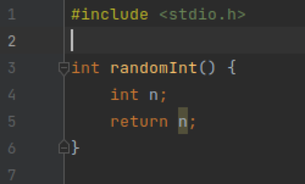
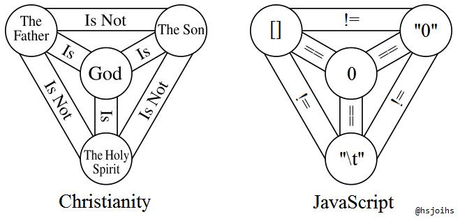
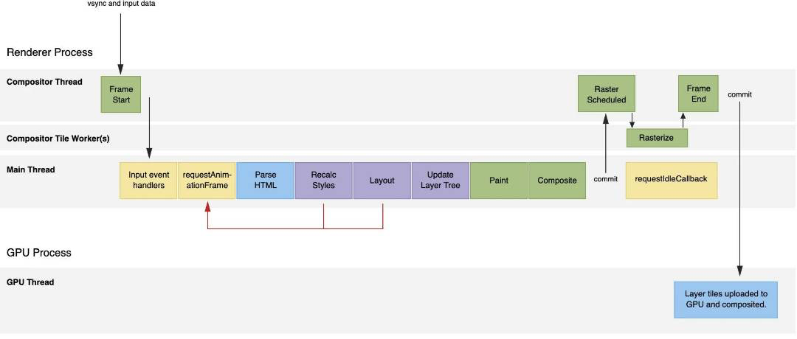
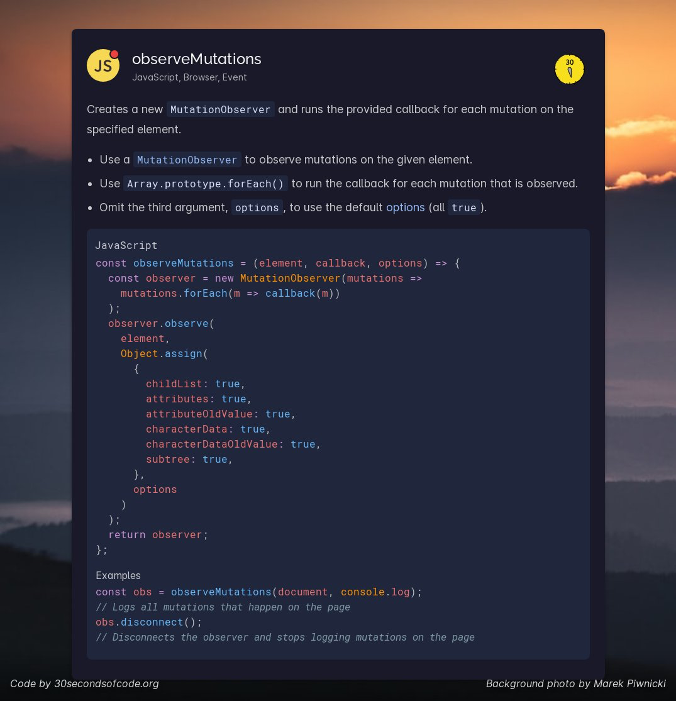

# 5

1.  每日一句分享：&#x20;

    哥德尔命题G：G无法被证明。
2.  分享个工具：&#x20;

    dbcli/mycli - [https://github.com/dbcli/mycli](https://github.com/dbcli/mycli)

    一款自动补全，语法高亮，可恢复历史命令的 MySQL 终端客户端。
3.  分享个小知识：&#x20;

    假设用户 正在访问的是 www.example.com，如果需要其他子域名也能够访问到正在设置的Cookie值的话，需要它设置为 example.com 。

    场景：当服务端下发 cookie 时，比如 api.tomotoes.com(服务端) -> italking.tomotoes(客户端)，下发的 Cookie domain 需要设置成 .tomotoes.com这样客户端才能成功保存。

    当客户端访问服务端时，客户端 ajax 库需要开启 withCredentials，并且 服务端跨域配置也要设置 AllowCredentials，这样服务端才能接收。
4.  A: 之前讨论过的 服务端无状态 会话管理方案，刚刚在读 gorilla/sessions 源码时，发现已经通过 ScureCookie 机制 实现了...

    哎，为什么每次自己做出了一些具有复杂度的东西，到头来发现 都是前人早已发明的东西... 一到实践，几乎没有我自己的创造，只不过是将 早已知道的方法重新组合起来而已..

    B: 有点妄自菲薄的感觉，其实站在巨人的肩膀上看事物；不一定要成为巨人，多少有点感同身受；这种感觉就好像自己花了很多时间和精力做的曲子；发现前人早就做过了，还比你做的好；

    A: 哎 是啊，算是复读机的自我修养了。

    学得越多，越能意识到 我掌握的东西几乎没有我创造的。&#x20;

    学到新知识是件幸福的事，但不能因此而满足。&#x20;

    就像 Aurora 曾说过： 只有深刻地认识到自己的复读机本质，才真正有想要发出一些新声音的冲动。 因为，世界的意义在世界之外啊。

    B: 我想这是学习的魅力吧 我不太知道程序员对于计算机或是代码有没有自己情感&#x20;

    赋予某种意义相对来说比成为某种意义可能来的自由一点

    A: 当然有了，Coding 就是 创造的过程，而创造就是艺术\~&#x20;

    艺术就值得欣赏，欣赏就会不自觉地附带上主观情感\~

    B: 这句话果然很程序员，那我简单一点讲就是，别在意自己成就感，表达只是表达

    A: 之前经常通过编程 解各种题：算法题、编程模式、小编译器什么的，喜欢把自己的想法通过 Coding 优美地表达出来，如果选择了合适的语言 这一过程就像写诗一样\~

    现在面对的 是领域相关的问题，相比之下 编程中的各种细枝末节 就会显得不那么重要，重要的是对领域的理解。

    B: 我在做音乐的过程中时常会碰到瓶颈；每当我做曲子不顺的时候，我做这是为什么，给别人听，给自己听，装X，还是等等；但最后自己都会得到一个同样的答案；就只是表达而已。

    所以你是被卷了嘛？

    A: 不算被卷，这算是趋势吧，视角从小变大\~
5.  每日一句分享：&#x20;

    读书是很辛苦的。

    因为读数学书的过程就像是在大脑里跑一个解释器，自底向上地从基本概念和公理出发，逐渐组装成一棵枝繁叶茂的树。这个过程需要的时空开销是不小的，所以读数学书，需要反复读、需要举一反三，有的书甚至有大量的练习，称得上是时间黑洞。

    而，读文学类书籍是流式的过程，就像遍历一张线性表。空间开销是常数的，时间开销是线性的。但想象力仍然是重要的，因为大家都知道，从线性表里恢复出非线性的数据结构，似乎需要更多的知识、精力和智慧呢。

    数学之美在于体系之美，文艺之美在于言外之美。
6.  快餐文分享：&#x20;

    Hosting SQLite databases on Github Pages&#x20;

    [https://phiresky.github.io/blog/2021/hosting-sqlite-databases-on-github-pages/](https://phiresky.github.io/blog/2021/hosting-sqlite-databases-on-github-pages/)

    文章介绍了作者将 sqlite 编译成 wasm 加载到前端，然后基于 sql.js 实现了一套 HTTP 协议的数据库虚拟环境，而这一切都不需要服务端。
7. .png>)
8.  &#x20;每日一句分享：&#x20;

    有些固有的复杂度是不能被eliminated的。&#x20;

    比如引入前端框架的前端代码，只是从一团乱麻变成了另一团乱麻而已。&#x20;

    比如PC的走线，该乱糟糟还是乱糟糟，只不过是把乱糟糟的部分放在看不见的地方罢了。&#x20;

    解决乱麻的方法大致有两种：一种是解决问题，请身经百战的专家来重新设计架构，药到病除。

    另一种是消灭问题，古代有个皇帝看到前人留下的一个几百年都无人破解的死结，他抽出宝剑，一剑斩断了这个死结，于是问题在被消灭的时候就被解决了。&#x20;

    **我们面临的很多问题，很大程度上是“不应该被解决的”，也就是原本就不应存在的问题。深层次的原因还是康威定律。那么，我们只能期待话事人一声令下，说这个事儿不用干了。**

    来自 Aurora 的一则灵感。
9.  每日一句分享：&#x20;

    有三句很好的格言可以指导我们的生活：不要行不道德之事；如果已经行了，不要忏悔；又如果，你已经忏悔了，也绝不要承认。
10. 快餐文分享：&#x20;

    What the heck is time-series data (and why do I need a time-series database)? [https://blog.timescale.com/blog/what-the-heck-is-time-series-data-and-why-do-i-need-a-time-series-database-dcf3b1b18563/](https://blog.timescale.com/blog/what-the-heck-is-time-series-data-and-why-do-i-need-a-time-series-database-dcf3b1b18563/)

    文章先是介绍了数据分析的重要性，简述了时序数据库是什么，如何通过时序数据更好地分析数据，是如何工作的。

    文中提了一个有趣的问题，是不是所有数据都具有时序性？显然计算机输入的数据是这样的。
11. 好文分享：&#x20;

    The Humble Element And Core Web Vitals&#x20;

    [https://www.smashingmagazine.com/2021/04/humble-img-element-core-web-vitals/](https://www.smashingmagazine.com/2021/04/humble-img-element-core-web-vitals/)

    文章讲述了 图片标签的很多相关内容，我简单总结下。

    1. 图片标签是如何影响 Web 核心指标的(LCP, CLS, FID)。
    2. 以及通过使用 LightHouse 分析图片从加载到渲染过程中的各个指数。
    3. 借助现代 Web 标准如何实现 响应式图片。
    4. 为了兼容图片格式的最佳实践。
    5. 图片懒加载属性。
    6. 图片预加载方式。
    7. 设置图片异步解码的属性，这真是头一次见，decoding="async" suggests it’s OK for image decoding to be deferred, meaning the browser can rasterize and display content without images while scheduling an asynchronous decode that is off the critical path.
    8. 实现占位图的方式。
    9. 通过 设置 content-visibility 实现懒渲染
    10. Next.js Image 组件介绍。
12. .png>)
13. 快餐文分享：&#x20;

    Facebook 新一代 React 状态管理库 Recoil [https://mp.weixin.qq.com/s/OwYW9v4FooE2IK2AJQePpA](https://mp.weixin.qq.com/s/OwYW9v4FooE2IK2AJQePpA)

    文章介绍了 Recoil 的特性，基础使用。 是 Facebook 官方推出的状态管理库，可以简单做个了解\~
14. 发现了个有趣的项目：&#x20;

    hyperscript - [https://hyperscript.org/comparison/](https://hyperscript.org/comparison/)

    使用近自然语言的 DSL 去完成页面交互。
15. 每日一句分享：&#x20;

    上个世纪60年代到80年代，你写好程序，需要提交给大型机运行，然后等待它返回结果。

    现在2020年代，大型机又回来了！它们只是被改称为“云”。
16. 每日一句分享：&#x20;

    我一向认为“提出问题比解决问题更有价值”。

    此书描绘了80年代美国方方面面的细节，据此提出了许多开放问题，没有给出答案。

    用作者的话说就是“提供思维的机会”。这种书就像一串钥匙链，每当你找到一把新的钥匙，就可以把它挂在合适的位置上。

    当你自己找到了足够多的钥匙，你就会发现，你所得到的绝不是打开一扇扇门那么简单，你打开的可能是一片全新的世界。
17. 
18. 分享个网站：&#x20;

    Go Proverbs - [https://go-proverbs.github.io/](https://go-proverbs.github.io/)

    Go 作者 Rob Pike 曾提过的编程思想。 经典语录摘抄：

    1. The bigger the interface, the weaker the abstraction.
    2. A little copying is better than a little dependency.
    3. Don't communicate by sharing memory, share memory by communicating.
19. 每日一句分享：&#x20;

    我们既要承认矛盾的存在、尊重人的个性、维护社会的多样性，更要努力建立共同的价值观、寻找众人利益的最大公约数。&#x20;

    在团结活泼的氛围中，每个人都有自由发展的权利，而不是将社会竖切成互相敌对的若干小圈子。
20. 分享个项目：&#x20;

    google/zx - [https://github.com/google/zx](https://github.com/google/zx)&#x20;

    A tool for writing better scripts

    设计得有创意，使用 $`command` 作为入口函数，看起来很直观。

    例子： await $`cat package.json | grep name`
21. 快餐文分享：&#x20;

    Note on worker pools in Go&#x20;

    [https://adtac.in/2021/04/23/note-on-worker-pools-in-go.html](https://adtac.in/2021/04/23/note-on-worker-pools-in-go.html)

    文章前半部分介绍了 Goruntine 过多时会触发 Go 底层的 double stack 分配，这将潜意识造成性能问题(比如 GC 压力太大)。 文中后半部分给出来一个简单的 worker pool 实现。

    池化 是 资源复用的重要方式之一，对 worker pool 感兴趣的同学，推荐了解下 ants ，一个高性能的 go runtine pool library.
22. 快餐文分享：&#x20;

    漫画 | 三千年的密码战争，人类天才的巅峰对决&#x20;

    [https://mp.weixin.qq.com/s/0xYb6N45ZIuyfIGL07EPZw](https://mp.weixin.qq.com/s/0xYb6N45ZIuyfIGL07EPZw)

    关于加密技术发展的一些历史。
23. 快餐文分享：&#x20;

    HTML Tips&#x20;

    [https://markodenic.com/html-tips/](https://markodenic.com/html-tips/)

    文章介绍了一些不常见的 HTML 功能。
24. 
25. 分享一个 simulating macOS's GUI 的个人站点，很炫：

    [https://portfolio.zxh.io/](https://portfolio.zxh.io/)
26. 每日一句分享：&#x20;

    你个人的项目，应该有四分之一会失败，否则就说明你的冒险精神不够。
27. 每日一句分享:&#x20;

    时刻不忘未知量。（即时刻别忘记你到底想要求什么，问题是什么）莱布尼兹曾经将人的解题思考过程比喻成晃筛子，把脑袋里面的东西都给抖落出来，然后正在搜索的注意力会抓住一切细微的、与问题有关的东西。

    事实上，要做到能够令注意力抓住这些有关的东西，就必须时刻将问题放在注意力层面，否则即使关键的东西抖落出来了也可能没注意到。
28. 快餐文分享:&#x20;

    Next Gen CSS: @container&#x20;

    [https://css-tricks.com/next-gen-css-container/](https://css-tricks.com/next-gen-css-container/)

    文章介绍了 目前处于 stage-3 的 CSS 新特性 @container，可以根据父元素的尺寸 来动态调整。 用法类似于媒体查询器。

    可以与媒体查询器结合，实现布局上的宏观调整以及微观调整。
29. 快餐文分享：

    Go modules cheat sheet&#x20;

    [https://encore.dev/guide/go.mod](https://encore.dev/guide/go.mod)

    文章介绍了 如何通过命令管理 go module(看起来不是很直观)，go.mod 文件介绍，go module 版本管理机制(文中介绍的存疑，如果是自动使用最新版本，而不锁版本，那不同版本之间存在 breaking change 的话，岂不是会有问题)
30. 每日一句分享:

    未来是不确定的。

    人类天生有一种寻求确定性的需要，以及控制周遭的小世界的需求。 我们总是希望听到“你只要这样这样，以后就一定能够那样那样”这类令人窝心的话。&#x20;

    然而与我们的控制错觉相反，这个世界有太多因素是不确定的，除了自身的因素比较可控之外，外界的机遇因素几乎完全不是能够控制或预测的。&#x20;

    我们最多只能做好头脑准备，尽量不错失机遇。 也正因此，你几乎永远也听不到足够有说服力的证据来告诉你“你只要……，就一定能够……”，因为成功并不是仅取决于个人因素的。&#x20;

    个人因素往往只是成功的一个既非充分又非必要的条件，所谓谋事在人，成事在天；但无需悲观，因为毫无疑问，改善个人因素的确能够大大增加成功的几率。
31. 分享个有趣的项目:&#x20;

    长链接生成器&#x20;

    [https://aaa.aaaaaaaaaaaaaaaaaaaaaaaaaaaaaaaaaaaaaaaaaaaaaaaaaaaaaaaa.com/](https://aaa.aaaaaaaaaaaaaaaaaaaaaaaaaaaaaaaaaaaaaaaaaaaaaaaaaaaaaaaa.com/)&#x20;

    我试了下，生成的链接的确够长...
32. 分享个 CSS Level 5的新特性:&#x20;

    自定义媒体查询器

    @custom-media --narrow-window (max-width: 30em);

    @media (--narrow-window) { /\* narrow window styles \*/ }

    自定义CSS变量，自定义元素(WebComponent)，自定义事件(new Event)，自定义媒体查询器
33. 每日一句分享:

    在不同的情境下我们所谓「真实的自己」是完全不同的形象。

    这些不同的「真我」都不是真实的，它们是由情绪、习惯和自己的直觉惯性驱使，在控制和失控同时作用之下显现出的某种人格。

    每个「真我」本质上都是表演，我们只是在扮演「真实的自己」—— 剧本有时来自外界公序良俗和威逼利诱，有时来自个人生活经历和阅读经历，或它们的综合结果。
34. 快餐文分享:&#x20;

    Modern Javascript: Everything you missed over the last 10 years&#x20;

    [https://turriate.com/articles/modern-javascript-everything-you-missed-over-10-years](https://turriate.com/articles/modern-javascript-everything-you-missed-over-10-years)

    文章简单梳理了下 JS 的一些现代特性、语法。
35. 每日一句分享:&#x20;

    任何设计以及建造同时发生在同一个人身上的心智活动，都是艺术创作。
36. .png>)
37. 快餐文分享:&#x20;

    TEXT EDITING HATES YOU TOO&#x20;

    [https://lord.io/text-editing-hates-you-too/](https://lord.io/text-editing-hates-you-too/)

    文章从多个方面介绍了 文本编辑领域 开发时的复杂度。 在光标移动，文本选中，输入多种语言 这些符合直觉的场景下，蕴含着 many horror stories..&#x20;

    Windows 系统为文本输入的不同场景 提供了 128 个接口.. 足以见得开发成本是巨大的..
38. 快餐文分享:&#x20;

    Programming and Writing&#x20;

    [http://antirez.com/news/135](http://antirez.com/news/135)

    Redis 作者 9年前的一篇文章，主题如题 探讨了 编程与写作的异同。

    简单总结下: 编程与写作 都是创作的过程，从宏观角度 整个作品需要结构联系合理，从微观角度，都需要由良好的语句构成。 不同点在于产品的部署(小说需要联系出版社..)与开发时的阻塞。
39. Github Readme 终于支持播放视频，只要将视频上传CDN即可。

    一颗栗子: [https://github.com/a327ex/SNKRX/blob/master/README.md](https://github.com/a327ex/SNKRX/blob/master/README.md)
40. 分享个很 geek 的项目:&#x20;

    generate rss feeds with grep(1), sed(1), and awk(1)&#x20;

    [https://www.romanzolotarev.com/rssg.html](https://www.romanzolotarev.com/rssg.html)

    通过 148 行 shell 解析HTML Docs，生成 Rss Feed，使用前提是 HTML 需要符合规范，比如 不能出现两个 H1😷
41. 
42. 浏览器渲染文档的流程。&#x20;

    其中 渲染进程 每个 TAB 一个，GPU 进程 所有 TAB 共享。

    渲染进程 包括三个线程。

    1. 合成线程，负责与 GPU 通信，将位图信息发送到 GPU 线程。
    2. 光栅化 Worker，处理光栅化工作。
    3.  主线程，开发时密切接触的线程，负责解析文档 样式计算，重排重绘等。 而常见的性能优化 也是从主线程切入的。

        更具体应该称之为 浏览器渲染一帧的流程。

        渲染的顺序很重要，样式更新时 应尽可能地减少无意义的步骤，比如常见的 使用 transform 代替 left top 位置更新等。

        并且可以见得 requestIdleCallback 是整个渲染流程的最后一步。

        而 React 早期的 Schedule 机制就是借助该 API，而后续因为经常分不到 timing ，提换成了现在的 MessageChannel。
43. 每日一句分享:&#x20;

    事物的本身是不变的，变得只是人的感觉。
44. 好文分享：

    精读《前端职业规划 - 2021 年》&#x20;

    [https://mp.weixin.qq.com/s/FmJon\_hINllggxrVpjRzoQ](https://mp.weixin.qq.com/s/FmJon\_hINllggxrVpjRzoQ)

    本文作者是来自阿里的前端工程师 黄子毅老师。 文章从三个大的方面: 知识分类，领域深耕，经济视角分析工程师未来的职业发展。 文章很有价值，没有泛泛而谈。

    我简单从我的视角总结下:&#x20;

    知识分类，文中把工程师额的知识体系分为了 通用知识与领域知识。&#x20;

    通用知识代表的就是计算机基础知识，是工程师的内功，因为更新周期缓慢，体系大而全，其重要性不言而喻。 我们在学习时，除了多总结还应把应用知识理解到通用知识的层面。 就像最近 Google docs 更换 canvas 渲染，为什么会这样设计？canvas 代表了什么底层的基础设施。

    领域知识，一般都会受职业所限制，没有机会 很难接触到。文章中所提的富文本编辑就是一个很好的例子。

    领域深耕，作者把其分成两个方向。 Y 轴 业务方向；X 轴 技术广度方向。 不管是哪个方向，都要求不设边界地发展学习。

    经济视角，文中的一句话 说得很本质: 于打工人视角，公司抹平了产品的成本。 开发不是让我们追求个人的软件成就，而应是实实在在的产出。

    总体而言，为了自身更好地发展，应该不设边界 多学多思考，打磨自己的产出。
45. 快餐文分享:&#x20;

    Half a million lines of Go&#x20;

    [https://blog.khanacademy.org/half-a-million-lines-of-go/](https://blog.khanacademy.org/half-a-million-lines-of-go/)&#x20;

    来自 Khan 官方 blog 的一篇水文，全文只阐述了一个主题: Go 真好用 真先进 我超喜欢..
46. 快餐文分享:&#x20;

    WebAssembly cut Figma's load time by 3x&#x20;

    [https://www.figma.com/blog/webassembly-cut-figmas-load-time-by-3x/](https://www.figma.com/blog/webassembly-cut-figmas-load-time-by-3x/)

    文章介绍了 Figma 借助 Webassembly 将产品速度优化了 3 倍的结果，简单阐述了 Webassembly 的概念、发展 与 asm.js 的差异。
47. 
48. 快餐文分享:&#x20;

    What every developer should know about TCP&#x20;

    [https://robertovitillo.com/what-every-developer-should-know-about-tcp/](https://robertovitillo.com/what-every-developer-should-know-about-tcp/)

    文章简单介绍了 TCP 的一些概念: 三次握手的流程，两点之间的数据控制机制，拥塞控制算法(有空可以探讨一下传统拥塞窗口与 BBR 算法的改进)。
49. Rust 无 GC 机制的设计理念(控制更多 context):

    Since memory safety in C++ is a major practical issue, it would be great if we can check them statically in a similar manner that static typing does.

    Yes, this was one of the main motivations behind the creation of Rust. Just like C++ compiler tracks type information for each variable, Rust compiler tracks ownership, lifetime, and aliasing for each variable in addition.&#x20;

    相应地 开发者要添加更多标识 并且限制了其他自由地写法，以帮助 compiler 更好地推断 内存异常。
50. 每日一句分享:&#x20;

    现在的开发者需要具备的，不仅仅是技能树，而是技能森林。
51. 快餐文分享：&#x20;

    Soul自己的“soul”是什么？

    [https://mp.weixin.qq.com/s/sfGkkWFTuQAGZbadz44zZw](https://mp.weixin.qq.com/s/sfGkkWFTuQAGZbadz44zZw)&#x20;

    如果 soul 成功上市，将成为国内陌生人社交第一股。 文中描写 soul 社交元宇宙玩法挺新颖的，为陌生人社交披上了新的概念。
52. .png>)
53. Servers as they should be&#x20;

    [https://oxide.computer/](https://oxide.computer/)

    2022 年的服务器基础设施应该是什么样子。
54. Imagine you've been tasked with the problem of designing the API for a new web service.

    Where would you start?

    At a high level, you'll want to consider which general style of API (REST, RPC, graph, etc) will be the best-fit for your application's business domain. You'll want to settle on a transport protocol (which will probably be HTTP but you might consider WebSocket, or both). And you'll need to choose between a medley of generic serialisation standards (JSON and XML lead the field here), or you might opt for a specialist messaging protocol with plain text (SOAP, OData, GraphQL) or binary message encoding (Thrift, Avro, Protocol Buffers).

    RESTful 已经成为了 CS 模型 最广泛、最直观的 API Style..

    摘录自文章: Should we rebrand REST?&#x20;

    [https://kieranpotts.com/rebranding-rest/](https://kieranpotts.com/rebranding-rest/)&#x20;

    文章中详细介绍了 RESTful 的概念，适用场景。 RESTful 已经被误解，文章指出 使用 HTTP 方法 去操作资源，只是最淳朴的 HTTP API 而已。
55. 宏 可以不可以理解为是 语言内部的一种 DSL..

    如果实现得很完美，没有任何 bug，可以看作是个 隐藏复杂性的好工具。

    比如 知名 Phoenix 框架，定义路由的方式:

    scope "/", HelloWeb do&#x20;

    &#x20; pipe\_through :browser&#x20;

    &#x20; get "/", PageController, :index&#x20;

    end
56. 快餐文分享:&#x20;

    Announcing TypeScript 4.3&#x20;

    [https://devblogs.microsoft.com/typescript/announcing-typescript-4-3/](https://devblogs.microsoft.com/typescript/announcing-typescript-4-3/)

    TS 4.3 发布，增加了 getter setter 类型支持，override 关键字，模板字符串提升，约束泛型提升等功能。
57. 每日一句分享:&#x20;

    计算机科学与计算机无关，就像天文学与望远镜无关。
58. Question: 如何在 Web 中实现端口扫描程序(得知用户电脑 端口使用情况)。

    (静态页面，不借助服务端任何能力)&#x20;

    Answer: 通过 WebSocket 对象
59. SK-II著名的神仙水在中国零售价格为560元，而其制造成本仅为人民币6.5元。就算研发成本都加进去，每单只成本也不超过人民币10元。

    如果10块钱的产品，定价500元，那么多出来的490元用在哪里呢？回答就是用在推广上面，重金投入，千方百计说服消费者愿意出500元购买这个成本10元的产品。所以，美妆类自媒体才可能得到那么多厂商的资源，可以不断做活动。

    摘抄自阮一峰老师的技术周刊。
60. 快餐文分享:&#x20;

    An experiment in helping users and web publishers create deeper connections on Chrome&#x20;

    [https://blog.chromium.org/2021/05/an-experiment-in-helping-users-and-web.html?m=1](https://blog.chromium.org/2021/05/an-experiment-in-helping-users-and-web.html?m=1)

    Chrome 新增了 follow 机制，用户可以 follow 喜欢的网站，当网站出现新内容时，用户会收到推送。 整套机制建立在 RSS 协议上。

    Google 做的好哇。 很久之前 Google 关掉了自家的 rss 软件，如果把 rss 内嵌到 浏览器中的话，一定会大受欢迎。 而 Chrome 也成为了 另一种形式的流量分发平台。
61. 快餐文分享:&#x20;

    Naming Your Lifetimes&#x20;

    [https://www.possiblerust.com/pattern/naming-your-lifetimes](https://www.possiblerust.com/pattern/naming-your-lifetimes)

    良好的命名习惯 会无形中为代码注入更多的 context。 这也算是 UI 的一种形式，只不过 U 是 Developer，I 是文本描述方式。

    传递 Context 很重要，不仅是在 coding 中有所体现，更多是交流中。 多给对方一些信息，不仅能提效，还能培养自己的 credit。
62. 快餐文分享:&#x20;

    Functional programming in Go with generics&#x20;

    [https://ani.dev/2021/05/25/functional-programming-in-go-with-generics/](https://ani.dev/2021/05/25/functional-programming-in-go-with-generics/)

    文章介绍了函数式编程的基本概念，以及在未出泛型时 Go 的两种使用方向，后面给出了一个简单的 Demo。&#x20;

    文章比较浅，后面给出的一些 fp repo 倒是可以有空刷一下。 其中有一些 之前看过，整体来说， 在 Go 中学编程范式 不如去看一些应用型的库..
63. 
64. 为什么 esbuild 打包这么快? 我简单总结下:

    1. 编译型语言，不需要解释过程 、JIT，更适合 bundler 这种 run once 场景。
    2. 线程间共享内存，而NodeJS 应用是独立的..
    3. 尽可能地使用在并行。在解析、链接、代码生成 三个环节中，除了链接 其余环节都是全部并行化的，而 go runtine 的合理调度机制 GMP 可保证完全打满 CPU。
    4. 代码全部从零实现，不依赖第三方库，把核心流程都把握在自己手中。微软的 TS parser 既然不把 解析 performance 放在首位，那么我们就自己实现一个。
    5. 内存高效利用。仅需要处理三次 AST 即可，并且整个流程一直处于内存“热区”，同时压缩存储更节省内存。

    最后，摘录官方结尾: Each one of these factors is only a somewhat significant speedup, but together they can result in a bundler that is multiple orders of magnitude faster than other bundlers commonly in use today.
65. 快餐文分享:&#x20;

    QUIC is now RFC 9000&#x20;

    https://www.fastly.com/blog/quic-is-now-rfc-9000&#x20;

    QUIC 经过多年发展，已进入了 RFC 阶段，是个利好的消息。但整体 over udp 应该需要基础设施一些妥协。
66. Podcast 分享:&#x20;

    https://avocadotoast.live/episodes/70/&#x20;

    🎙#70.-和Vue.js的创造者尤雨溪聊开源软件
67. 快餐文分享:&#x20;

    I quit my job to focus on SerenityOS full time&#x20;

    https://awesomekling.github.io/I-quit-my-job-to-focus-on-SerenityOS-full-time/

    SerenityOS 作者的自述，可以见得 热爱是最大的驱动力。 像个造物主一样发明着各种基础设施。

\

