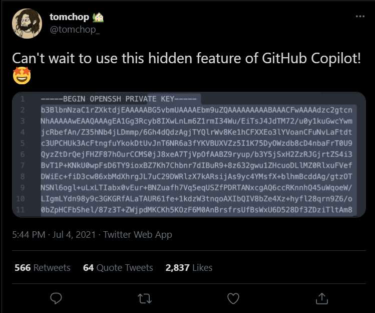
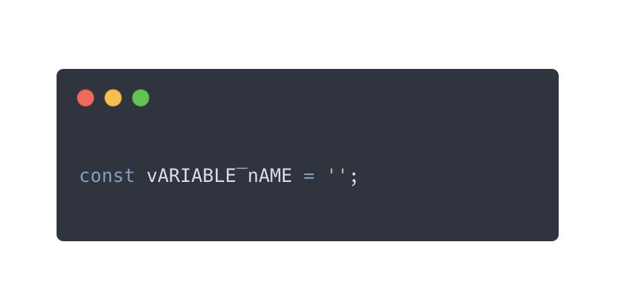
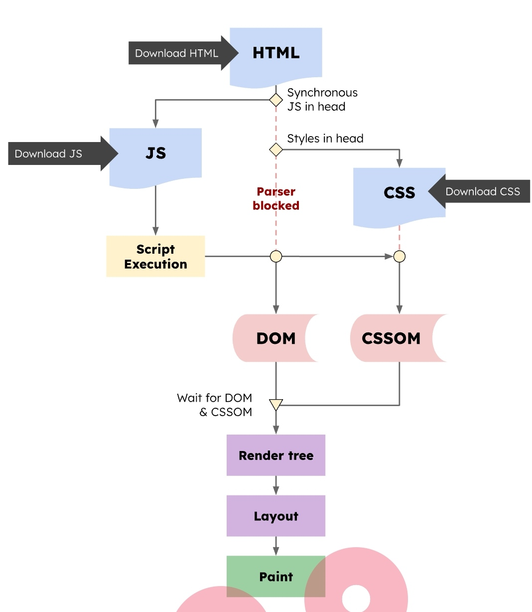
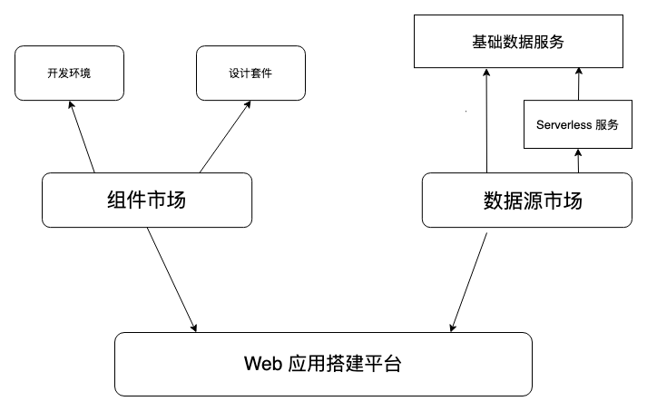
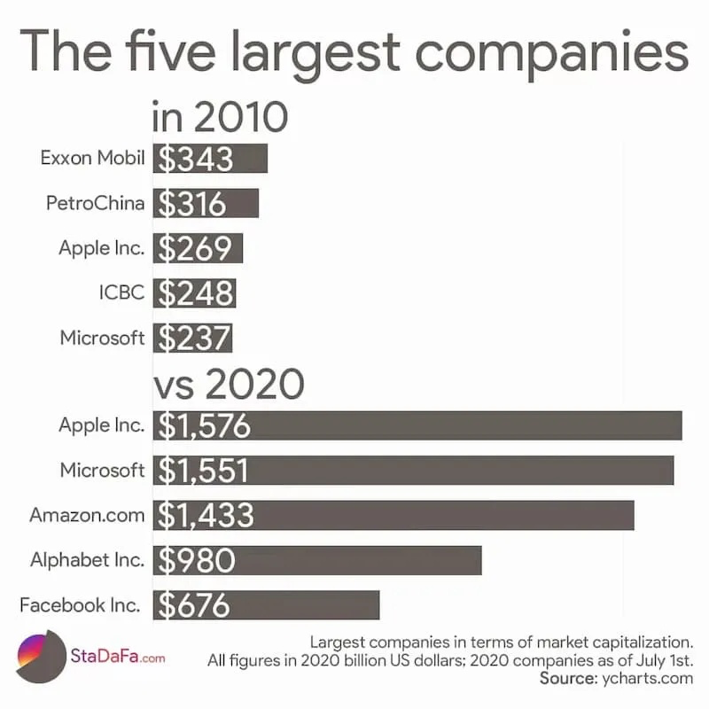

# 7

1.  每日一句分享:

    100年前的中国，四千个人里面才有一个中学生，其他都是文盲。
2.  快餐文分享:

    张一鸣为什么总有远超他人的认知？

    [https://m.huxiu.com/article/438900.html](https://m.huxiu.com/article/438900.html)

    如果文章后半部分能辩证地去描绘就好了...
3. 
4.  产品运营的三大目的：

    1. 拉新：拉取新的用户
    2. 留存：活动用户转化实际用户
    3. 促活：老用户激活

    看起来，产品运营做的事情 都是由指标衡量的。
5.  每日一句分享:

    Jevons悖论：业界对节约煤炭研究不会降低煤炭需求，反而会因为提升了煤炭使用效率而加大对煤炭的需求。

    这句话 让我联想到 大牛们发明各种压缩算法，让数据更紧凑..
6.  快餐文分享：

    RenderingNG

    [https://developer.chrome.com/blog/renderingng/](https://developer.chrome.com/blog/renderingng/)

    Chrome 下一代渲染引擎 RenderingNG 介绍。
7.  每日一句分享：

    人脑可看做一个CPU，整块时间的效率最高，多线程并行会带来上下文切换的不良成本。
8.  每日一句分享:

    苦读十多年，进入顶尖名校，熟悉前沿技术，进入互联网大厂，拿着 996 的高薪，最重要的工作是：骗人多点一下「继续抽奖」。
9.  快餐文分享：

    计算机体系架构——一文读懂Cache（一）

    [https://zhuanlan.zhihu.com/p/386919471](https://zhuanlan.zhihu.com/p/386919471)

    关于计算机体系中负责 IO 的缓存，文章脉络很清晰，虽然包含很多方向，但大多只讲个概念。
10. 每日一句分享：

    无论是从 mysql 到 mongodb 到 cassandra 到 time series db，或者从memcached 到 redis，从 lucene 到 solr 到 elasticsearch，从离线批处理到hadoop 到 storm 到 spark 到 flink，技术不是突然出现的，总是站在前人的肩膀上不断演变的。 而要能在浩如烟海的现代互联网技术栈中选择合适的来组装自己的方案，则需要对技术的来源和历史有一定的了解。否则就会出现一些新人张口ELK，闭口tensorflow，然后一个简单的异步消息处理就会让他们张口结舌的现象。
11. 快餐文分享:

    精读《React 18》[https://github.com/ascoders/weekly/blob/master/%E5%89%8D%E6%B2%BF%E6%8A%80%E6%9C%AF/202.%E7%B2%BE%E8%AF%BB%E3%80%8AReact%2018%E3%80%8B.md](https://github.com/ascoders/weekly/blob/master/%E5%89%8D%E6%B2%BF%E6%8A%80%E6%9C%AF/202.%E7%B2%BE%E8%AF%BB%E3%80%8AReact%2018%E3%80%8B.md)

    文章具体分析了 Automatic batching，Concurrent APIS，SSR for Suspense 三大特性的背景概念。
12. 快餐文分享:

    3 Programmers Got Fired (Including Me) Due to a Single App Crash

    [https://betterprogramming.pub/3-programmers-got-fired-including-me-due-to-a-single-app-crash-35d4c94555da](https://betterprogramming.pub/3-programmers-got-fired-including-me-due-to-a-single-app-crash-35d4c94555da)

    一位年轻开发者在初创公司的悲剧，文中处处透漏各种不合理性，失去投资也是情由所原。
13. 每日一句分享:

    产品形态是最上层的抽象，决定了技术架构 底层设计的所有层层面面。
14. 快餐文分享:

    好看视频与B站走向同一战场

    [https://mp.weixin.qq.com/s/UV\_rq7k8Fgmh9wq\_spHU\_w](https://mp.weixin.qq.com/s/UV\_rq7k8Fgmh9wq\_spHU\_w)

    用户需要糖衣，但是长期来看，他也需要药。
15. 分享个小知识:

    在Android7.0及以上的系统中，每个应用可以定义自己的可信CA集。 默认情况下，应用只会信任系统预装的CA证书，而不会信任用户安装的CA证书。 通过代理工具,比如 Charles 安装的证书恰恰正属于用户安装的CA证书，因此会被视作不安全的证书。 如果想在高版本 Android 机上安装 CA 证书, 只能先 Root ...

    如何解决呢?

    1. 换 IOS 手机
    2. 先 Root, 再使用 open-ssl 计算出证书 hash, 重命名为 hash.任意数字 移动到 Android 的系统分区的证书文件夹 即可.
16. 

    全新的命名规范:

    Reverse-pascal-reverse-snake case
17. 快餐文分享:

    数据上报痛点解决方案

    [https://mp.weixin.qq.com/s/VlgW6r\_u6\_ZzG6IgiP\_PAQ](https://mp.weixin.qq.com/s/VlgW6r\_u6\_ZzG6IgiP\_PAQ)

    埋点上报如何更好地与业务结合。
18. 每日一句分享:

    年轻人总想发现自己的诗人，并从中发现自己。
19. 分享篇文章：

    30s 源码刨析系列之函数篇

    [https://tomotoes.com/blog/30s-javascript-function/](https://tomotoes.com/blog/30s-javascript-function/)

    本系列是对名库 30SecondsOfCode 的深入刨析。 本篇是其中的函数篇，可以在极短的时间内培养你的函数式思维。
20. 分享篇掘金的文章，总结了一些常见的命令行工具。

    像闪电划破雨夜，这些开源项目瞬间点亮了漆黑的命令行

    [https://www.toutiao.com/w/a6963938962931073573?only\_rec=1\&share\_token=9b5b751b-0fa8-407e-a2a4-ca0f10b11875\&wid=1634977342902](https://www.toutiao.com/w/a6963938962931073573?only\_rec=1\&share\_token=9b5b751b-0fa8-407e-a2a4-ca0f10b11875\&wid=1634977342902)
21. 10 Papers Every Developer Should Read

    [https://michaelfeathers.silvrback.com/10-papers-every-developer-should-read-at-least-twice](https://michaelfeathers.silvrback.com/10-papers-every-developer-should-read-at-least-twice)

    一篇09年的文章，作者总结了10篇他认为值得一读的计算论文。
22. 

    JS 语言的内存区概览。
23. 脊髓是人体的中枢神经传递信号的通路，它的带宽有多大？一个神经科人士估算，可以达到每秒16.625 GB的数据，比 5G 通信的最快速度，还要快几十倍。
24. 快餐文分享:

    Rust and the JVM

    [https://blog.frankel.ch/start-rust/7/](https://blog.frankel.ch/start-rust/7/)

    文章介绍了 JVM 对于 使用 Rust 时，可以免去 GC 静态标记的痛点，并给出了几种 JVM-Rust 集成方案。
25. 快餐文分享:

    Useful Kotlin Idioms You Should Know

    [https://blog.jetbrains.com/kotlin/2021/07/useful-kotlin-idioms-you-should-know/](https://blog.jetbrains.com/kotlin/2021/07/useful-kotlin-idioms-you-should-know/)

    Kotlin 官方出品的文章，梳理了 Kotlin 的常见特性、风格。入门 Kotlin 之选。

    问题来了，苹果借助 pingfang 字体可以无缝切换，那其他终端该如何实现呢？ 可以看下我两年前写的文章，使用 35 行 JS 代码即可完成。

    网站必备之简繁切换

    [https://tomotoes.com/blog/simplified-chinese-and-traditional-chinese-switching/](https://tomotoes.com/blog/simplified-chinese-and-traditional-chinese-switching/)
26. 发现了一个产品：

    可以根据输入的 WiFi 名称与密码自动生成二维码，用户可以扫码直接连上 WiFi。

    [https://wificard.io/](https://wificard.io)

    目前代码已开源，只有一个 web 端，感觉有一些商业价值可待挖掘。
27. The State of Developer Ecosystem 2021

    [https://www.jetbrains.com/lp/devecosystem-2021/](https://www.jetbrains.com/lp/devecosystem-2021/)

    本报告展示了 JetBrains 进行的第五次年度开发者生态系统调查的综合结果。 JavaScript 依旧是最受欢迎的语言。

    JS 前端专属篇&#x20;

    [https://www.jetbrains.com/lp/devecosystem-2021/javascript/](https://www.jetbrains.com/lp/devecosystem-2021/javascript/)&#x20;

    一些有趣的结果: 49% 的受访者使用 React，43% 的受访者使用 Vue.js。
28. 分享期播客:

    [https://moon.fm/share/episode/8303/](https://moon.fm/share/episode/8303/)

    🎙EP-29.-架构设计与-12fallacy（上）

    播客前部分主要围绕 ThoughtWorks 讨论其影响，与业界互联网公司的 diff。中间大佬们分享了很多面试经历以及如何招人。最后讨论了架构设计上的规范流程。

    可能有同学不太了解 ThoughtWorks ，我简单介绍下，ThoughtWorks 不是常见互联网公司，是 ToB 的咨询公司，在业界非常知名，很多著名的概念，比如 微前端，敏捷开发都是其提出的。 并且ThoughtWorks 的洞见与技术雷达系列文章都非常有质量。
29. 好文分享:

    The Ultimate Guide to Browser-Side Storage

    [https://blog.openreplay.com/the-ultimate-guide-to-browser-side-storage](https://blog.openreplay.com/the-ultimate-guide-to-browser-side-storage)

    文章梳理了 前端存储数据的各种方式，分成三部分介绍:过去已废弃的方式，现代主流方式，未来实验方式。 并在介绍时梳理了其优点缺点，使用方式，兼容性等。

    IE 模拟 localStorage 用 window.name 来存储数据真是让我没想到。
30. 每日一句分享:

    如果懒惰意味着缺乏自律，那就是缺点。自律是高生产力所必须具备的条件。但是，如果懒惰意味着不必要的事情一件也不用做，那就是优点。 生产力不等于工作。
31. 快餐文分享:

    利用机器学习通过网页预提取技术加快网站加载速度

    [https://mp.weixin.qq.com/s/S1Yg6wiYkK2lN-5aTp2dqQ](https://mp.weixin.qq.com/s/S1Yg6wiYkK2lN-5aTp2dqQ)

    文章介绍了如何以机器学习 + SW(Service worker) 作为抓手，去提高网站的性能指标。

    具体原理是通过网站的分析数据(一些站长工具，GA)训练模型，预测用户在网站中可能访问的资源，然后放到 SW 中预加载，来减少网络请求。

    文中整套解决方案的使用场景偏向大型网站(页面数量多，路由复杂)的场景。 像一些中小网站则完全可以枚举出资源，放到 Workerbox(Google推荐的 SW 框架)预加载即可。

    我站点现在的缓存方案就是这样，并且还增加了 用户点击意图捕获，如果用户 hover 一个入口链接超过一定时间(300ms) 则会通过 preload prefetch 这些 meta 标签去预加载资源，且不阻塞主渲染线程。
32. 快餐文分享：

    微信小程序基础架构浅析

    [https://mp.weixin.qq.com/s/h562ECyLiQWkD3JpWXZg-g](https://mp.weixin.qq.com/s/h562ECyLiQWkD3JpWXZg-g)

    文章介绍了微信小程序的背景由来，如何通过双线程的架构设计来达成监管与优化体验，后续讲解了与 RN 原生跨端的差异，开发小程序时的规范。

    同样适用于小程序的渲染场景，使用 vdom 将通信成本批量化。

    而小程序除了像 RN 的通信瓶颈，还有 webview 的渲染瓶颈，这就是为什么很多小程序框架(比如 taro)都做了类似于 Svelte 的事情，将 runtime 的时间成本放在编译时。
33. 快餐文分享：

    How to Eliminate Render-Blocking Resources: a Deep Dive

    [https://sia.codes/posts/render-blocking-resources/](https://sia.codes/posts/render-blocking-resources/)

    该篇文章属于页面性能方向，一开始介绍了 页面的关键渲染路径是什么，其重要性(用户体验，页面性能，SEO)。 然后通过梳理渲染路径，找出可能阻塞渲染中的资源(CSS，JS-Maybe)并给出造成阻塞的原因，文章后半部分主要围绕着借助 Lighthouse 发现问题，并解决问题(篇幅很小，建议不全面)来进行。

    
34. 快餐文分享：

    现代 Web 开发困境与破局

    [https://zhuanlan.zhihu.com/p/389935233](https://zhuanlan.zhihu.com/p/389935233)

    字节基建(Web 开发引擎)同学的一篇文章，梳理了现代前端开发时不同场景下的各种痛点，针对这些不同的痛点提出了不同的平台化解决方案。

    
35. 

\
