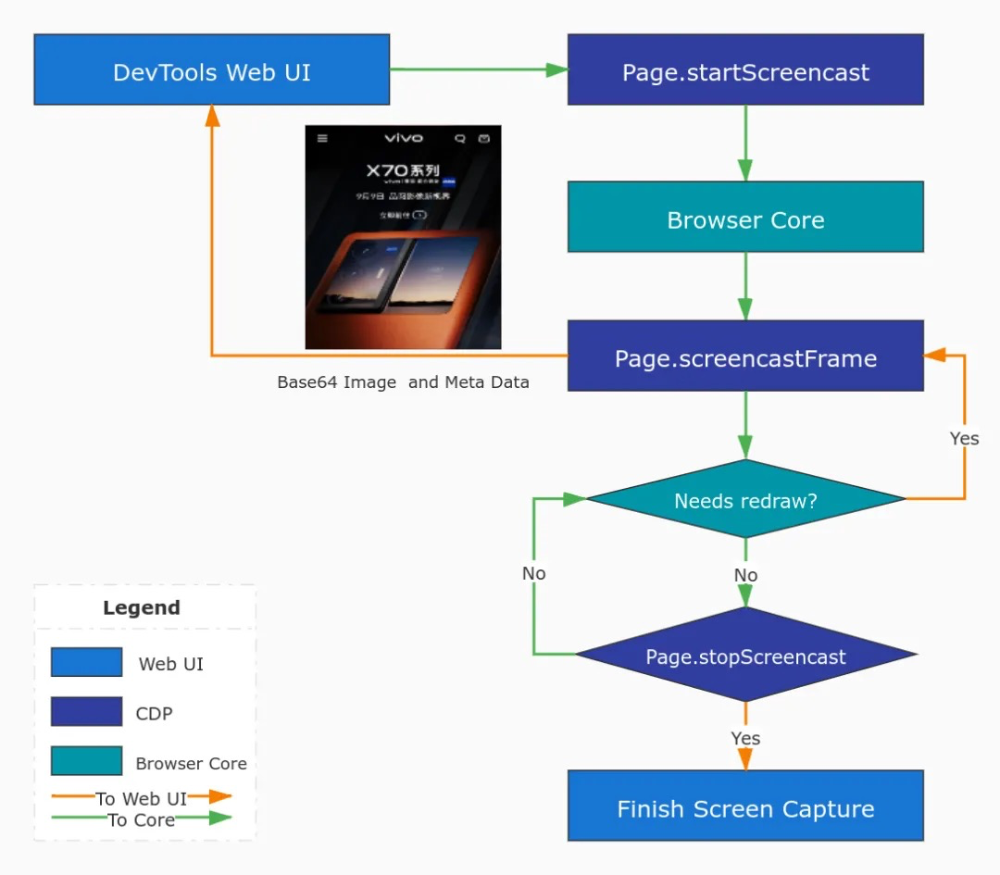
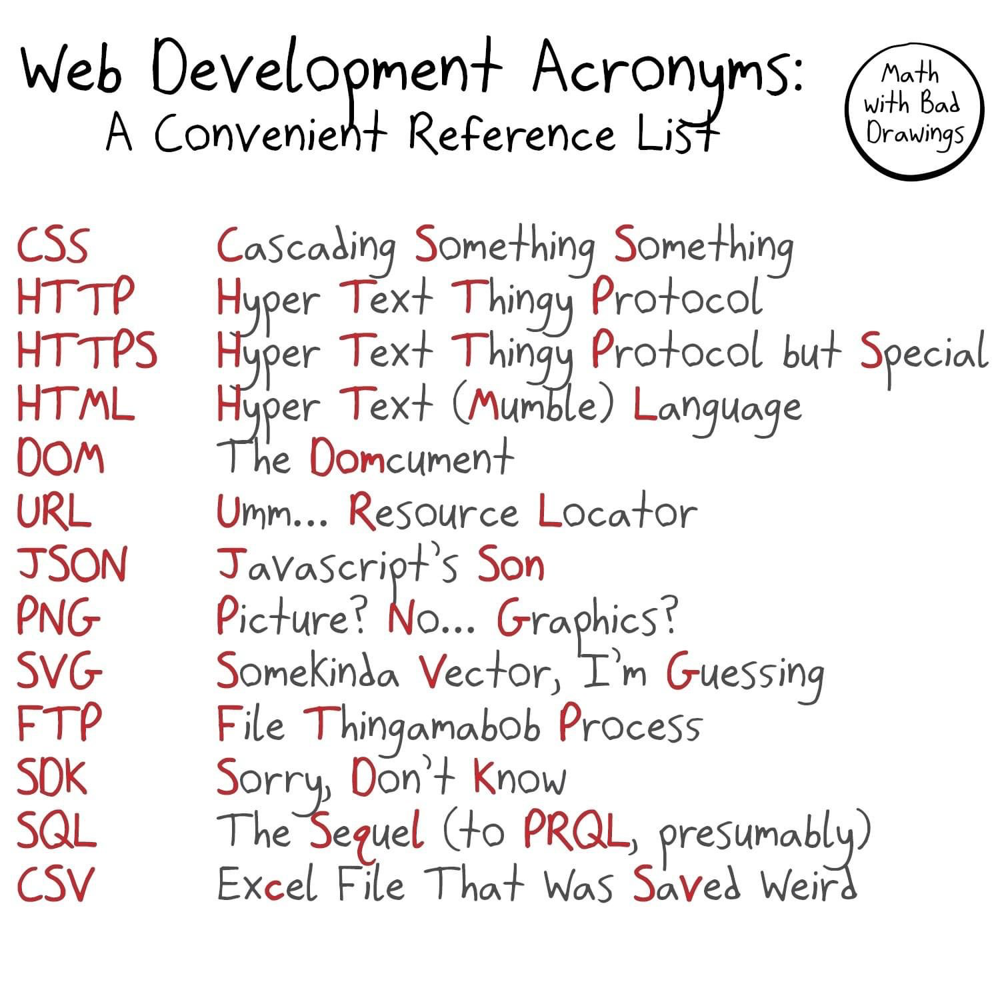
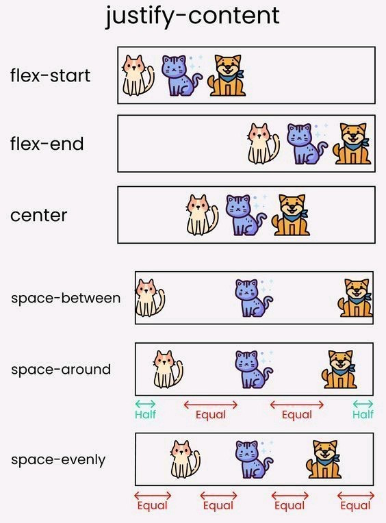
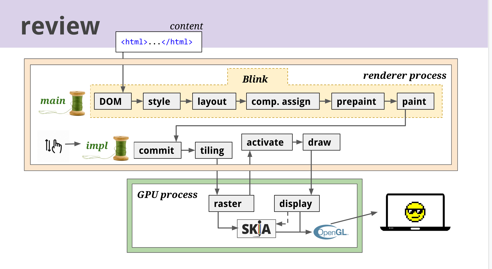
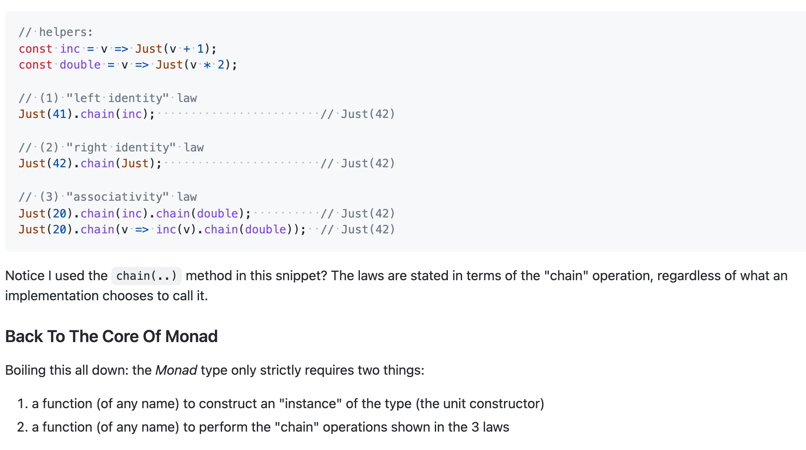

# 1

1.  快餐文分享：

    DevTools 实现原理与性能分析实战

    [https://mp.weixin.qq.com/s/H8iahg5WUOHXeRzvf0R01w](https://mp.weixin.qq.com/s/H8iahg5WUOHXeRzvf0R01w)

    一篇介绍 DevTools 调试工具的综述文。

    文章先是简述了 DevTools 的发展历史，分为三个阶段：WebKit Inspector 的先行阶段；Firebug 神器的风靡时代；DevTools 集百家之长后的快速发展 直到垄断阶段； 然后作者具体介绍了 DevTools 的架构设计，基础原理。也正是因为一开始优秀的解耦设计，让 DevTools 在跨端调试、Nodejs 调试 以及社区的生态中占据了重要的一环。可以理解为将 DevTools 中的关键动作 封装成了 DSL，只需要传递指令 即可响应。

    

    延伸阅读：

    1.  10 Years of Web Inspector

        [https://webkit.org/blog/5718/10-years-of-web-inspector/](https://webkit.org/blog/5718/10-years-of-web-inspector/)
    2.  liriliri/chobitsu

        [https://github.com/liriliri/chobitsu](https://github.com/liriliri/chobitsu)

        Chrome devtools protocol JavaScript implementation

    如果你想实现一个类 DevTools 的跨端调试工具，完全可参考 CDP 协议做到。
2.  每日一句分享：

    web3 = decentralisation + blockchain + NFTs + metaverse

    web0 = web3 - blockchain - NFTs - metaverse

    web0 = decentralisation
3.  快餐文分享：

    Go Fuzzing

    [https://tip.golang.org/doc/fuzz/](https://tip.golang.org/doc/fuzz/)

    Go1.8 除了在语法带来了泛型，其他重要的一点是 官方 Test 库支持了模糊测试。 模糊测试可理解为是编程时的“混沌工程，通过简单的 API 去测试 程序的各种边界情况。

    文中给出了模糊测试的编写规则与其草案。
4.  每日一句分享 - 结果思维：

    结果大于过程；

    有交付价值的结果大于无交付价值的结果；

    能复制的结果大于不能复制的结果。
5.  分享一个利用搜索引擎&关键词 快速找到替代品的技巧：

    {keyword} vs

    
6.  快餐文分享：

    揭秘 vivo 如何打造千万级 DAU 活动中台

    [https://mp.weixin.qq.com/s/rN9AujBNIztrvonJBaKmUg](https://mp.weixin.qq.com/s/rN9AujBNIztrvonJBaKmUg)

    文章介绍了 vivo 内部的头部 no code 搭建平台 悟空，逐个盘点了 平台所处的业务背景、应用层（组件、活动）的市场模型、画布渲染动态组件的核心思路、数据源的编排能力等，整体算是深入浅出了。
7.  快餐文分享：

    Using Neovim for Three Years

    [https://jdhao.github.io/2021/12/31/using\_nvim\_after\_three\_years/](https://jdhao.github.io/2021/12/31/using\_nvim\_after\_three\_years/)

    文章分享了 作者使用学习 Vim 的经历，从初学者慢慢到使用者的演变，用作者的话来说：自己的需求 自己撸插件实现，完全掌握一个工具的感觉很爽。 文章中也分享了作者的 dotfile 与 使用插件，感兴趣的同学可刷一下。
8.  快餐文分享：

    Gem: exploding string alternatives

    [https://nedbatchelder.com/blog/202112/gem\_exploding\_string\_alternatives.html](https://nedbatchelder.com/blog/202112/gem\_exploding\_string\_alternatives.html)

    文章分享了使用 python 去模拟实现 shell 列表字符串的方案。 核心逻辑在于 排列组合可以复用官方库。

    评论区 也有使用 ruby 的复刻，以及使用 迭代生成器的精简版。
9.  每日一句分享：

    我理解的用户体验，是让用户付出最小成本满足需求。

    用户体验无法用一个通用方法整体衡量，只能在理解产品全貌的前提下评测分解属性。

    摘抄自：什么是用户体验？如何评价用户体验的好坏？ - 俞军的回答

    [https://www.zhihu.com/question/19682869/answer/32552025](https://www.zhihu.com/question/19682869/answer/32552025)
10. Github 最近新增了个 为自己添加继承者的功能。

    [https://docs.github.com/en/account-and-profile/setting-up-and-managing-your-github-user-account/managing-access-to-your-personal-repositories/maintaining-ownership-continuity-of-your-user-accounts-repositories](https://docs.github.com/en/account-and-profile/setting-up-and-managing-your-github-user-account/managing-access-to-your-personal-repositories/maintaining-ownership-continuity-of-your-user-accounts-repositories)

    数字遗产一直没有个规范化的处理方案，Github 算是开放先河了。
11. 分享个项目：

    Darling - [https://www.darlinghq.org](https://www.darlinghq.org)

    一款可以在 linux 上运行 mac 程序的翻译层软件，与 Wine（在 linux 运行 windows 程序）的产品形态很相似。
12. 快餐文分享：

    Why might you run your own DNS server?

    [https://jvns.ca/blog/2022/01/05/why-might-you-run-your-own-dns-server-/](https://jvns.ca/blog/2022/01/05/why-might-you-run-your-own-dns-server-/)

    一篇 关于 DNS 种草文。 作者先是介绍了 DNS 去中心化的特征，解释了 DNS 查询时的影响因子（几乎链路上的每个环节）。后面花大篇幅盘点 自建域名托管服务与自建域名解析服务的好处。于平时生活中，最显然的好处就是 block ad 了。 当然 于国情来说，自建 DNS 是违法的。

    这里延伸话题可以说些 GFW 的原理，它的核心思路就是在 DNS 时做 404 的…

    （DNS 污染也是我见过最牛逼的 DDOS 攻击 （没有之一
13. 每日一句分享：

    国家新能源车辆标准 GB32960 规定，车载系统需 每十秒上传一次实时数据，包括经纬度、车辆发动机状态 、电池状态等。
14. 微软 终于出了 Execl JS API，JS 的生态更完善了。

    [https://docs.microsoft.com/en-us/office/dev/add-ins/reference/overview/excel-add-ins-reference-overview](https://docs.microsoft.com/en-us/office/dev/add-ins/reference/overview/excel-add-ins-reference-overview)
15. 快餐文分享：

    Visualizing Concurrency in Go

    [https://divan.dev/posts/go\_concurrency\_visualize/](https://divan.dev/posts/go\_concurrency\_visualize/)

    作者使用 WebGL 对 Go 程序中运行的 Goruntine 及 channel 通信做了可视化。 文中使用可视化的方式，总结了 Go 比较常见经典的多个并发模型，看起来非常直观。 结尾作者介绍了技术原理：使用 gotracker + three.js 实现。
16. 快餐文分享：

    Introducing Metho: Safely adding superpowers to JS

    [https://dev.to/jonrandy/introducing-metho-safely-adding-superpowers-to-js-1lj](https://dev.to/jonrandy/introducing-metho-safely-adding-superpowers-to-js-1lj)

    由一个有趣的想法诞生的库，如何通过语言特性扩展基类的能力？文中给出了实践。 文章所属的系列一共四篇，详细地介绍了原理。

    10\[times(()=>alert('Hello'))]

    据我观察，可扩展基类的语言 比如 js、kotlin、ruby，都是解释型语言。
17. 视觉优先级。

    
18. 一些技术名词的缩写

    
19. 快餐文分享：

    Memory leaks: the forgotten side of web performance

    [https://nolanlawson.com/2022/01/05/memory-leaks-the-forgotten-side-of-web-performance/](https://nolanlawson.com/2022/01/05/memory-leaks-the-forgotten-side-of-web-performance/)

    一篇谈 Web 内存泄漏的文章，作者先是梳理了 内存泄漏的性能特征：影响程度低，很难诊断等，然后站在用户角度，浏览器角度，开发者角度去分析问题影响，其中 有一句话很让我感触：Third, it’s a tragedy-of-the-commons situation, and people tend to blame the browser. 的确 很多情况下 用户分析是这样的，只到软件层级。

    最后作者分享了他的内存泄漏检查工具，并表达了对产品的预期表现：不要因为性能问题，让用户对产品失去信心。
20. 快餐文分享：

    Hashing is not encryption

    [https://eric.mann.blog/hashing-is-not-encryption/](https://eric.mann.blog/hashing-is-not-encryption/)

    文章总结了 encryption, encoding, and hashing 各自的定义与使用场景。

    不过文中对 encryption 定义过于简单了，只是用传统 对称加密的方式去描述。
21. 惊讶系列分享：

    Minecraft as a k8s admin tool

    [https://eric-jadi.medium.com/minecraft-as-a-k8s-admin-tool-cf16f890de42](https://eric-jadi.medium.com/minecraft-as-a-k8s-admin-tool-cf16f890de42)

    minecraft 是一款风靡全球的沙盒游戏。

    作者脑洞大开地使用游戏作为用户界面，圈养的动物作为 k8s cluster，来实现 pod 管理... 实在是太秀了。
22. 排列 小猫咪

    
23. 快餐文分享：

    The Optional Chaining Operator, “Modern” Browsers, and My Mom

    [https://blog.jim-nielsen.com/2022/a-web-for-all/](https://blog.jim-nielsen.com/2022/a-web-for-all/)

    文中讲述了作者帮忙家人解决网页问题的经历，原因仅是 网页中出现了不兼容的低端机的语法，但是却对个人影响很大……

    摘录自 W3C 设计准则：

    The internet is for end users: any change made to the web platform has the potential to affect vast numbers of people, and may have a profound impact on any person’s life.

    （现代前端开发已经离不开 babel 了。
24. 快餐文分享：

    Why I Like D

    [https://aradaelli.com/blog/why-i-like-d/](https://aradaelli.com/blog/why-i-like-d/)

    一篇小众语言种草文。

    作者先从自己寻找 better c 语言的经历讲起，为什么 D 能优于 Go 与 Rust（非常主观）。

    然后列举了 D 的语言特性，标准库，元编程，脚手架等。

    其中 有个特性（集合类型 运算符重载）很有趣，让我想起了 Python ， half\[] += 1;
25. 好文分享：

    走进 Web3

    [https://www.bmpi.dev/dev/glimpse-of-web3/](https://www.bmpi.dev/dev/glimpse-of-web3/)

    一篇介绍 Web3 的好文。

    文章先介绍了 Web 的发展历史，延伸抛出了 当前 Web2 我们与信息之间的关系，这里说的很透彻：

    互联网公司的产品大多是免费的，这个秘诀就在于用户也是其产品的一部分。

    而 Web3 的引子 来源于 中本聪提出比特币应用的底层技术 - 区块链，可理解为是一种特殊的数据结构：节点之间存在验证关系的链表，并且节点与节点之间是去中心化的，既然是数据结构那么最大的作用就是存储数据，从这点看来 使用的场景是有限的。

    这里就不得不说 币圈另一位知名的大佬 V 神，V 神基于区块链开发了 以太坊，一个支持智能合约的区块链平台，之前区块链的可编程能力非常有限，而以太坊的 EVM（虚拟机）是图灵完备的，具体细节就不展开了。

    那么 Web3 与 区块链的核心关系是什么？

    我的理解是 区块链的去中心化 让 Web 信息流动的过程 发生了变化，听起来是不是很像 Web3 变成 区块链上层的炒作概念？其实不是的，去中心化 技术一直在发展，蒂姆·伯纳斯·李 以及很多组织一直在倡导，今年来的一些技术：BT、ipfp、webrtc、solid 也是在以这个方向演讲，但是由于 去中心化后的利益问题（于巨头公司、国家监控），在现实中是很难大范围普及的。

    关于去中心化，文章也说了一些：

    去中心化想要落地 必须让价值从少数寡头公司中所属变为从属为网络中每个参与者。要形成共识就需要让一部分人先有币。

    文章之后又谈论了，Web3 上创建去中心化产品的路径，一些必需依赖的生态等。其中创建产品路径的例子可以说稍显荒诞，产品的价值共识形成 可以不完全依赖产品本身，可以依赖一些名人的背书，这点很像币群的乱象，没有完备的白皮书也可以诞生一个市值很高的币。

    A: [https://mp.weixin.qq.com/s/7sOOCrNU2FcypaHN2phMYA](https://mp.weixin.qq.com/s/7sOOCrNU2FcypaHN2phMYA)

    这篇讲了 区块链 NFT 的一些简单介绍 也不错
26. 惊讶系列分享：

    Folders - [https://esolangs.org/wiki/Folders](https://esolangs.org/wiki/Folders)

    一个脑洞大开的编程语言，通过文件夹之间的结构特征 去代表出数据，运算逻辑。可只通过创建文件夹，来实现图灵完备的程序，解释器也有多个语言版本。

    更多奇怪的编程语言：[https://esolangs.org/wiki/Language\_list](https://esolangs.org/wiki/Language\_list)
27. 快餐文分享：

    Effective Error Handling in Golang

    [https://earthly.dev/blog/golang-errors/](https://earthly.dev/blog/golang-errors/)

    一篇介绍 Go 错误处理的文章。 文章整体的脉络很清晰，基本上就围绕着两方面，错误类型的定义与包裹使用。 文中提到 定义预期的错误类型行为，是很值得提倡的，即可为上下文增加更多的语义化信息也会明确程序中存在不可避免的错误。

    一直有很多声音很讨厌 Go 中教条式地异常处理，觉得很繁琐，不智能。但归根结底 在于错误处理没有银弹可言，不管是 Go 的多返回值，还是函数式语言中使用 sumtype ，或者传统 oop 中函数签名的 mark exception，都不是一个很优雅的方式。Go 只不过让开发者直面了 任何运行时存在的异常。
28. 好文分享：

    Life of a Pixel

    [https://bit.ly/lifeofapixel](https://bit.ly/lifeofapixel)

    一个像素的一生，本文来自 18 年 Chromium 团队的一次分享。 文章主要讲述了 在浏览器视角下 从获取网页后 到渲染在屏幕上的整体流程( turn HTML / CSS / JavaScript into the right OpenGL calls to display the pixels)，并对一些重点的流程做了较直观的技术梳理。

    我简单整理后，像素的生命周期 大体梳理如下：

    * 最顶层的页面内容、最底层的像素。
    * 解析 DOM/Style、排版、文档树/Style Map 生成。
    * 合成布局树(包括下一代布局 NG 布局算法)(这里有一点很有趣：不管上层是怎么样的 DOM 元素，映射到 Layout 元素上 只是可枚举的几种)。
    * 分图层。
    * 构建属性树 以及 绘制、图层合成。
    * 布局树转换成绘制操作列表。
    * 绘制操作列表经过栅格化转换成位图(包括 GPU、重绘、动画)。
    * 激活绘制，合成线程有两份图层树的引用，一根用于下层消费 即 光栅化线程池消费，一根用于工作时消费，生成下一次提交到光栅化线程的图层树，这里很类似于 React Fiber 架构，也是双树的架构设计。
    * 栅格化分块。
    * 通过 Skia、OpenGL等生成 GPU 指令库 绘制图像。
    * GPU 显示。 除此之后还包括了 很多相关的领域知识。

    文章囊括的底层范围很广泛，有助于我们开阔技术视野，非常建议前端同学阅读。

    
29. B: 分享我这几天写的一篇文章，我是花了周末两天时间好好写了下 GitHub 和 GitLab 的历史，介绍下这两家如何从零起步的创业公司做到百亿美元市值。

    从零到百亿美金之路 - [https://mp.weixin.qq.com/s/4MoyzFfpgIeHgSivkWiM-A](https://mp.weixin.qq.com/s/4MoyzFfpgIeHgSivkWiM-A)

    A: 微软真是捡了个大便宜，这话一点没错，Gitlab 的市值 上市就过百亿了……

    融资节奏对公司发展太重要了……

    B: 确实，不过微软收购对GitHub也是好事，原CEO走后GitHub感觉就没有那股创业劲头了。倒是微软收购后变化又大了起来

    A: 嗯，是这样子，微软接手后，确实做了很多对开发者利好的事情，记得微软收购后，社区内有很多声音要拒绝 github 微软化，迁移 gitlab 的潮流

    B: 不得不说微软的战略远见很高明，也不差钱，而是加大对GitHub的投入来牢牢抓住开发者
30. 快餐文分享：

    React Native Web vs. Flutter web

    [https://blog.logrocket.com/react-native-web-vs-flutter-web/](https://blog.logrocket.com/react-native-web-vs-flutter-web/)

    一篇介绍 rn 与 flutter 差异的综述文。 文中从多个方面比较两个跨端方案的有异同，优缺点分析等。

    在 Native 上，由于 Flutter 的架构设计(compile to native code) 其性能更优。在 Web 上，Flutter 支持两种架构，the HTML renderer and the CanvasKit renderer，前者 体积小 性能差，后者体积大 性能好，但基于 Skia 会导致渲染差异问题。

    复用性上 RN 在 Web 上更好，只需要在编译时将 View Text 编译成等价的 DOM 元素即可。
31. 快餐文分享： \
    Do Svidaniya, Igor, and Thank You for NGINX \
    [https://www.nginx.com/blog/do-svidaniya-igor-thank-you-for-nginx/](https://www.nginx.com/blog/do-svidaniya-igor-thank-you-for-nginx/)

    今日 HN 热文，Nginx 组织对其创始人 Igor 退休时的祝福，以及 Nginx 历史回顾。 目前 Nginx 已经成为了 web 上使用量最广的服务器软件，服务端的必不可少的底层设施。 可能有同学不清楚，Nginx 并不是完全开源的，有一些关键特性需要商业版协议的，相比之下 Apache 服务器是完全开源的。
32. 快餐文分享：

    CSS Fingerprinting

    [https://csstracking.dev](https://csstracking.dev)

    文章介绍了一种使用 CSS 为用户设备生成指纹的方案。
33. 快餐文分享：

    structuredClone(): deeply copying objects in JavaScript

    [https://2ality.com/2022/01/structured-clone.html](https://2ality.com/2022/01/structured-clone.html)

    近期浏览器厂商们提出了一个新的 用于深拷贝的 API：structuredClone，文章介绍了 深拷贝对象的现状以及该 API 的详细用法，特性解释，需要注意的是该方法只支持拷贝原始类型。至于为什么没有 TC39 的提案，我猜测是 WHATWG 组织先行的结果。
34. 快餐文分享：

    TypeScript Features to Avoid

    [https://www.executeprogram.com/blog/typescript-features-to-avoid](https://www.executeprogram.com/blog/typescript-features-to-avoid)

    文章梳理了一些在 JS 中不兼容的 TS 独有特性，作者的观点很正确，TS 应该只作为 JS + Type 的辅助存在，而不是赋能特性的存在，不然会出现不兼容的情况。
35. 快餐文分享：

    Tutorial: Getting started with generics

    [https://go.dev/doc/tutorial/generics](https://go.dev/doc/tutorial/generics)

    Golang 官方介绍泛型文章来咯。文中使用一个简单 Demo 介绍了泛型的基本用法。
36. 

    迄今为止看到关于 Monad 最直白的解释定义..

    编程中常见的场景是 通过特定场景下的逻辑操作数据。

    虽然被操作数据有各种各样的类型，但数据类型中 有一些通用的操作表达 可以被提取出来，比如 使用 SumType 来做数据空指针兜底，使用 Just + Fold 来实现 数据单向操作流、PointFree 免定义等。 而这些通用操作表达 的载体可理解为 一个被构造出的类型实例，该表达之间的规则也符合 使用组合子时 的规律。以上就是 Monad。

    上图来自 monio 一个小众函数库的介绍。

    [https://github.com/getify/monio/blob/master/MONADS.md](https://github.com/getify/monio/blob/master/MONADS.md)
37. 分享篇文章：

    我们应聘过骑手，打过卧底电话，看了1907份判决，最后拼出了这部外卖平台进化史

    [https://mp.weixin.qq.com/s/KNLWPjHf6YzTMUNWUkZrUg](https://mp.weixin.qq.com/s/KNLWPjHf6YzTMUNWUkZrUg)

    摘要： 外卖系统里不仅仅有算法，还藏匿了许许多多的公司，而这些公司错综复杂交汇而成的法律关系网络，正把骑手死死地捆住。当骑手跌入前方这个大坑的时候，其中任何一家公司，都不足以构成他的用人单位。

    人们常说算法是一个黑箱，我们只需要享受最后的结果，不需要知道中间的运行过程。可是如果这个人不是你和我，而是受伤的骑手呢？
38. 快餐文分享：

    I’m porting tsc to Go

    [https://kdy1.dev/posts/2022/1/tsc-go](https://kdy1.dev/posts/2022/1/tsc-go)

    目前越来越多的前端工程基础设施正在用底层语言重写，阿比如 webpack、babel、eslint 等，这些重写后的工具都取得了明显性能收益，具体可以看之前的分享。

    文章作者 也是 swc 的作者正在重写 tsc，rust 重写后性能提高了 62 倍，但是因为语言特性的问题最后还是选择了 go，文中介绍了心路历程。
39. 好文分享：

    How React server components work: an in-depth guide

    [https://blog.plasmic.app/posts/how-react-server-components-work/](https://blog.plasmic.app/posts/how-react-server-components-work/)

    一篇介绍 RSC 的综述文。 \
    作者先是说明了 RSC 的背景，优势，与 SSR 的差异（可理解为 另一种对前端生态更友好的 SSR 架构）。

    优势摘要：

    In short, React Server Components makes it possible for the server and the browser to do what they do best. Server components can focus on fetching data and rendering content, and client components can focus on stateful interactivity, resulting in faster page loads, smaller javascript bundle sizes, and a better user experience.

    文中作者花了很多笔墨介绍 RSC 的工作原理，具体的渲染流程可简单理解为 另一种形态的 bigpipe。

    首先服务端序列化组件树，其中包括 前端组件的 placeholder，浏览器解析时 遇到 placeholder 引用到相应的前端组件。

    可以看出，该流程是重编译的， 重 runtime 的。社区对这些基础设施也有对应的解决方案。

    最后，总结了 RSC 的发展现状，虽然还在实验，但也有一些大公司开始吃螃蟹了。
40. 快餐文分享：

    IDE中的魔法 - 编译原理通识

    [https://zhuanlan.zhihu.com/p/453329147](https://zhuanlan.zhihu.com/p/453329147)

    文章介绍了编译原理常见的概念，一图胜千言。 \
    作者从 IDE 的视角，简单介绍了其 在 词法分析、语法分析、语义分析阶段的 不同的能力范围 以及 抛出了一些引子。

    感兴趣的同学可以看下该系列文章，整体系统性较弱，但很偏实践。 [https://www.zhihu.com/column/c\_1463537113430441984](https://www.zhihu.com/column/c\_1463537113430441984)

    用今天垠神的一条微博来说：

    这个时代，拥有真正知识的人已经不多了。有真的知识，还愿意分享给其他人的就更少。愿意分享给其他人，还能把它讲清楚的，就寥寥无几了。
41. 分享一个调节 mac 风扇 转速的利器：

    Macs Fan Control

    [https://crystalidea.com/macs-fan-control](https://crystalidea.com/macs-fan-control)

    设备提供了多项 调速策略，如：固定转速、基于硬件设备的维度，且非付费版本也可以满足基本使用。

    亲身经历，使用之后 电脑风扇 终于不再发生噪音了。

    虽然没有噪音了，但是电脑卡顿更严重了，逃不出能量守恒定律
42. 快餐文分享：

    Exploiting JavaScript quirks for fun and profit

    [https://kittygiraudel.com/2022/01/21/exploiting-javascript-quirks-for-fun-and-profit/](https://kittygiraudel.com/2022/01/21/exploiting-javascript-quirks-for-fun-and-profit/)

    文中介绍了作者使用一些奇技淫巧解决问题的过程，最后解决方案 很简洁明了。如果是我的话 我可能会使用 new Function 了。
43. 好文分享：

    A pipe operator for JavaScript: introduction and use cases

    [https://2ality.com/2022/01/pipe-operator.html](https://2ality.com/2022/01/pipe-operator.html)

    一篇介绍 pipe operator 特性的文章。

    pipe operator 并不是一个新特性，提案时间已经有很多年了。

    pipe operator 提案最初是来源于两个语言中的特性 F# 与 Hack，一个是ML 体系 微软研发的语言，一个是 赵海平 参与建设 Fackbook 研发的 PHP 超集语言。文中详细介绍了 这两种语言中关于 Pipe 特性的优缺点，可以看出 Hack 的适用范围更广，这也成为 TC39 选择的原因。

    文中用诸多例子介绍了 Pipe 对 JS 带来的好处，一言蔽之 可以极大程度使用 Pointfree 风格。

    并且梳理了 F# 与 Hack 结合后的特性形态，也是最后 JS 会演变的形态。

    最后 2ality 给出了 一些内部 DSL 方案，但看起来都有一些槽点，不如使用某些 可 Boxable 的函数库。
44. 

\
