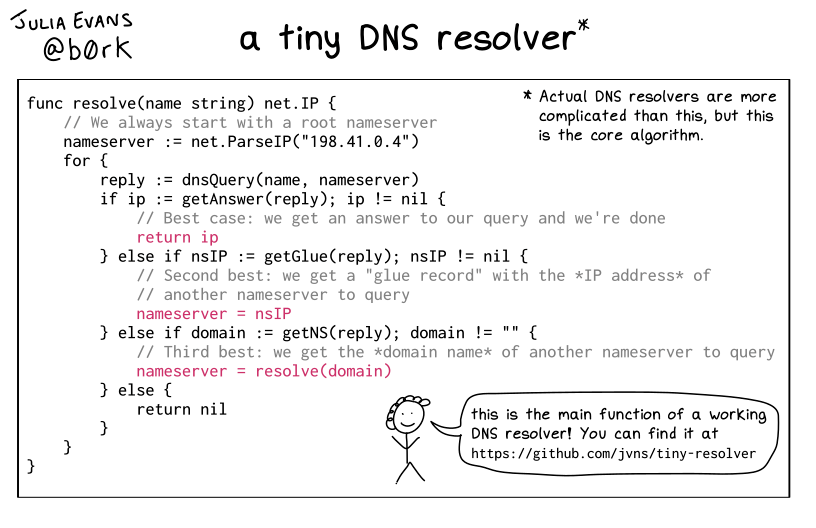
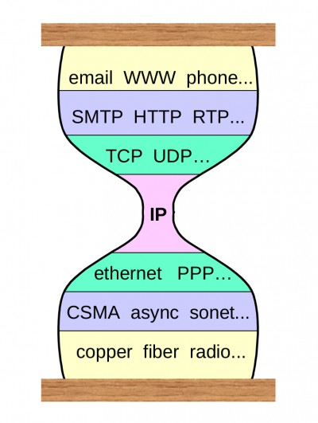

# 2

1.  

    图片来源：

    A toy DNS resolver

    [https://jvns.ca/blog/2022/02/01/a-dns-resolver-in-80-lines-of-go/](https://jvns.ca/blog/2022/02/01/a-dns-resolver-in-80-lines-of-go/)
2.  惊讶系列分享：

    Yes, I can connect to a DB in CSS

    [https://www.leemeichin.com/posts/yes-i-can-connect-to-a-db-in-css.html](https://www.leemeichin.com/posts/yes-i-can-connect-to-a-db-in-css.html)

    文章介绍了作者使用 CSS 与数据库交互的经历。

    主要是通过 Houdini 自定义了 CSS 能力，数据库使用 过时的 ASM.js 嵌入 sqlite ，绘画文本借助 opentype 解析数据得到文字路径，（其中作者提到了 JSPM，一个自动为库 生成 es6 module 的 saas，不可否认存在一定应用场景），最后作者给出了一些 自定义数据源，查询数据的例子。

    虽然 使用场景很有限，但可以看出 现在 Web 能力已经发展到了一定水平。
3.  快餐文分享：

    A look back at 2021

    [https://vercel.com/blog/how-the-web-evolves](https://vercel.com/blog/how-the-web-evolves)

    Vercel 2021 年的 review 报告。

    可能有的同学 对 Vercel 公司不太熟悉，我简单介绍一下，Vercel 的前身是 Zeit，属于开源社区内 比较知名的组织，其公司下有众多开源产品：比如 Next.js, SWR, Turborepo, hyper 等等，并且 Vercel 内的大佬众多，包括 Svelte 作者、Webpack 作者、React 灵魂人物，SWC、Turborepo 作者等等。

    Vercel 的商业模式 很简单，主要是做部署服务，Next.js 开源产品 为其助力，给我影响最深的地方在于 产品的设计，简约风 黑白分明。

    文中值得一提的是，梳理了几项未来 Web 的发展趋势：

    1. Web 的部署形态将趋于 边缘服务。 这也是 Remix 优于 Next.js 的地方，Remix 更适合 faas。
    2. 开发基建 将越来越快，底层语言重写的趋势还在延续。
    3. 实时数据 会提高用户体验。
    4. Web 开发的 Low Code、No Code 会持续演讲。
4.  快餐文分享：

    Understanding LSM Trees: What Powers Write-Heavy Databases

    [https://yetanotherdevblog.com/lsm/](https://yetanotherdevblog.com/lsm/)

    文章介绍了数据库背后的核心存储数据服务 - LSM ，整体很宏观，LSM 常见应用在 BigTable，RocksDB 中。

    LSM 的持久化存储机制是 SSTable，一个按 k 排序的 kv 表。当写入数据时，LSM 会先写到内存中的红黑树中（用于排序），到达一定体积时会 刷到持久化存储介质上。 当查找数据时，会根据 key 做二分，找到对应的子区间做扫描，如果未找到则使用 bloom filter，通过多维交叉认证查找。 当存在新旧数据时，LSM 有后台进程，异步地合并数据，维护数据顺序，删除空标记数据。删除数据时，做空标记数据处理。
5.  好文分享：

    Dependency Confusion: How I Hacked Into Apple, Microsoft and Dozens of Other Companies

    [https://medium.com/@alex.birsan/dependency-confusion-4a5d60fec610](https://medium.com/@alex.birsan/dependency-confusion-4a5d60fec610)

    一篇介绍依赖攻击的好文，作者用自己的亲身经历讲述了使用混淆开发依赖的方式，成功 hack 进众多互联网公司服务器的故事。

    文中的列举中行为很让我震撼，公共的 js 资源中 引用的依赖 大多数都可检索到，而这些依赖安装时，完全信任中心服务器，没有任何检查机制，也没有任何前置的 scope，这就导致只要存在同名的“恶意”依赖，那么大概率就会被安装到服务器上并执行。 这些某些服务可以是 npm、PyPi、gems 等官方服务。

    可以见得，这些官方服务设计的自由开放性是罪归祸首之一。除此之外，文中提到 大公司关于漏洞的奖励 都非常丰厚。
6.  快餐文分享：

    Move over JavaScript: Back-end languages are coming to the front-end

    [https://github.com/readme/featured/server-side-languages-for-front-end](https://github.com/readme/featured/server-side-languages-for-front-end)

    一篇讨论 前后端协作形态的文章。

    随着应用需求的复杂，从最开始的后端主导 慢慢演变为后端前后端分离，在此过程中诞生了很多后端渲染页面的库与框架，作者详细介绍了它们设计时的 trade off，但前后端分离并不是终点，近些年已经有越来越多的 hybrid render 方案的出现。

    摘抄文章结尾的一句话：

    Perhaps what we're seeing is not so much a pendulum swing, but a state of equilibrium where computing happens on both client and server in equal measure depending on the needs of the user.
7.  每日一句分享：

    The programmer(s) who came before you cared about the person who would come along later, maybe because they realised that the programmer who came along later might be them.
8.  快餐文分享：

    Deep dive into React Native’s New Architecture

    [https://medium.com/coox-tech/deep-dive-into-react-natives-new-architecture-fb67ae615ccd](https://medium.com/coox-tech/deep-dive-into-react-natives-new-architecture-fb67ae615ccd)

    文章介绍了 RN 的新架构，包括 JSI，Fabric，Turbo Modules 与 CodeGen。

    这些新的特性颠覆了之前传统 bridge 通信的方式，JSI 的出现隐藏了 前端与客户端通信的流程，JSI 的设计形态非常像 Chrome 之前推出的开源库 ComLink，更 enjoyable 的上层使用。Fabric 解决了之前 RN 渲染时 双引用，异步渲染的问题，底层也是基于 JSI 那一套，但本质没变 还是重 JS 计算，只不过通信变高效了。而剩下两个特性比较一般， Turbo Modules 实现了 对 NativeModules 按需使用，CodeGen 是 使用 JSI 时新一代的 type checker。
9.  快餐文分享：

    TypeScript/Implement Rust-style Result

    [https://www.huy.rocks/everyday/02-14-2022-typescript-implement-rust-style-result](https://www.huy.rocks/everyday/02-14-2022-typescript-implement-rust-style-result)

    用 7 行代码模拟实现 Rust 的 Result 类型。
10. 快餐文分享：

    Monorepos Explained

    [https://monorepo.tools](https://monorepo.tools)

    一篇分析 monorepo 工具的好文。

    文中先是介绍了 monorepo 项目的形态，然后说明了 monorepo 工具的应用场景，再从多个角度重点分析了业界现存工具的优缺点。

    延伸阅读：

    Misconceptions about Monorepos: Monorepo != Monolith

    [https://blog.nrwl.io/misconceptions-about-monorepos-monorepo-monolith-df1250d4b03c](https://blog.nrwl.io/misconceptions-about-monorepos-monorepo-monolith-df1250d4b03c)
11. 惊讶系列分享：

    The Simula One: Linux VR Computer (VRC)

    [https://shop.simulavr.com](https://shop.simulavr.com)

    个人电脑带到 VR 会发生什么？链接展示了该产品形态。
12. 快餐文分享：

    Retrofitting Async/Await in Go 1.18

    [https://csgrinding.xyz/go-async/](https://csgrinding.xyz/go-async/)

    文中介绍了在 Go 中想要取到异步结果的复杂性，远没有 async await 语法方便，作者在后面介绍了 github 上一个模拟实现的库，只有数行代码。
13. 一本介绍 rust 的电子书，整体介绍的很详细，偏理论。

    [https://github.com/vinodotdev/node-to-rust](https://github.com/vinodotdev/node-to-rust)
14. 快餐文分享：

    When I'm Sad My Computer Sends Me Cats

    [https://healeycodes.com/when-im-sad-my-computer-sends-me-a-cat](https://healeycodes.com/when-im-sad-my-computer-sends-me-a-cat)

    一个有趣的想法，当作者在电脑面前伤心时，就会收到一张小猫咪🐈图片。

    文中介绍了实现途径，通过各种 saas 服务结合，如 检测人脸通过 face.js，推送消息，猫猫照片通过其他服务等。

    这展示了不同服务连接的 power，多年以前就有很多连接服务的产品出现了，如平时各种的 cicd 服务，与生活比较近的 ifttt 等，ifttt 在我看来于产品形态上是比较完备的，通过可视化的方式提供了用户很大的想象空间。唯一遗憾的是，国内的国民应用都较为封闭，很少提供开放能力。
15. 有个问题，健康的商业模式，是不是都存在闭环呢？
16. 好文分享：

    The Internet Was Designed With a Narrow Waist

    [https://www.oilshell.org/blog/2022/02/diagrams.html](https://www.oilshell.org/blog/2022/02/diagrams.html)

    文章介绍了架构设计时的沙漏思想，一种设计收口的中间层机制。

    作者使用了两个案例来解释 沙漏思想的好处，一是避免双端的互操作复杂度，二是避免代码爆炸。这两个案例非常经典，OSI 模型 与 OS 数据类型，可见下图。 其实在平时的应用，沙漏思想随处可见，比如 V8 字节码，上层是 JS 的广泛生态，下层是编译后在不同平台的指令集。又比如 JSX，上层是各种物料生态，下层是 DOM、Native、Terminal。又比如 JVM，上层是 Java，Scala，Kotlin，下层是 VM 编译的机器指令等。虽然文章的脉络比较乱，文章的主题仍能引发思考。

    
17. 快餐文分享：

    为什么比特币可以防篡改

    [https://draveness.me/whys-the-design-bitcoin-database/](https://draveness.me/whys-the-design-bitcoin-database/)

    文章介绍了比特币保障用户交易安全性与公正过去交易合法性的技术原理。 分为两部分，一是非对称加密，二是共识机制。非对称加密老生常谈了，共识机制核心依赖共识算法，比特币的共识算法是 POW - 工作量证明，这是一种需要大量算力 且 对自然生态会造成影响的算法，详细可见：[https://en.wikipedia.org/wiki/Proof\_of\_work](https://en.wikipedia.org/wiki/Proof\_of\_work)。
18. 每日一句分享：

    代码应该尽可能简单，因为下一个维护你的代码的人不会像你那么聪明。
