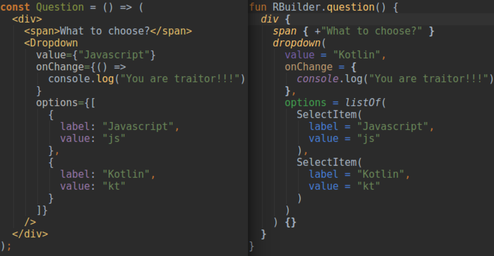

# 4

1.  分享个有趣的服务：

    Bionic Reading

    [https://bionic-reading.com/](https://bionic-reading.com/)

    有个常见的结论：人脑的信息处理速度远大于人眼解析信息的速度，换句话说 不管脑子转 多快，处理信息总是需要先看到的，所以毫无疑问 处理信息的速度受限于人眼。 这好比于 人眼是外部 IO ，人脑是 CPU，对于 IO 密集型场景(如读书)，想要以最快时间 阅读完整本书，是存在一个基础值的。

    而该服务就是根据该结论，通过自动标记单词前缀的方式，让用户可以快速获取到重点信息，这也很像 脑图与列表 之间的关系，让信息呈现更具结构化，从而提效信息处理速度。

    很明显该服务与信息所用的语言高度依赖的，英语可以通过列举单词重点前缀的方式，来吐出重点，简单来看这是可以枚举的。而如果是中文，因为中文是由汉字组成的，所以想要自动标记重点是需要深入理解信息上下文语义的，这是需要 NLP 辅助的。
2.  项目分享：

    react-worker-components

    React Worker Components simplify using Web Workers

    [https://github.com/dai-shi/react-worker-components](https://github.com/dai-shi/react-worker-components)

    该项目提供 WebWorker 中渲染 React 组件的能力，思路类似于之前分享 partytown。

    关键的思路在于 如何在其他 Worker 中渲染组件、传递 Props，查阅源码发现 实际组件渲染的步骤还是在主线程中执行的，Worker 充当了组件序列化的角色，Worker 与 Master 之间遵守相同的通信规范，感兴趣的同学可以看下源码，整体短小精悍。

    项目中有一处较为亮眼的设计，组件序列化时会占据内存，作者使用 WeakRef 作为数据结构，还补充了 主动的简易 GC 机制。
3. \
   Kotlin 函数的语法形式 可以轻易表达出其他域的语义。
4.  快餐文分享：

    Strongly Typed JSON in TypeScript

    [https://dev.to/nickytonline/strongly-typed-json-in-typescript-5gb2](https://dev.to/nickytonline/strongly-typed-json-in-typescript-5gb2)

    文章介绍了一种小技巧，通过 配置 tsconfig.json 来实现 编程时的 json 对象的类型定义。

    现在的开发方式，我认为从前往后 可大致分为三个阶段：

    1. Coding Runtime，编辑器会使用 Tree-sitter、其他 parser 解析开发中的代码，给开发者提供一些代码智能提示、语义分析等能力。
    2. Compile Runtime，大多数的语言会有源码编译的环节，该环节中强类型的语言会涉及到语法检验、性能优化等步骤，最后生产目标指令。
    3. Client Runtime，即 终端 Runtime 距离用户最近的环节，该环节中的语言行为会直接关联应用逻辑、用户体验等。

    其中前两个环节在业务场景中权重不高，多为建立规范、资源收口行为。

    文中提到的技巧就是在 Coding Runtime 中增强开发时的类型感知，但如果 JSON 过大的话，无疑会造成编辑器的性能开销 从而带来机器卡顿，所以针对大的数据 还是建议使用某些 Type Generator 去生成类型。
5.  每日一句分享：

    汽车是一种快速折旧的昂贵资产，生命周期的绝大部分时间都无所事事地停在车库。大都市地区必须拿出大量土地，当作停车场，才能放置所有的闲置车辆。 我们越早实现无人驾驶和大规模的按需运输，就能越早摆脱这种巨大的浪费。

    来自阮一峰老师的 201 期科技周刊。

    [https://www.ruanyifeng.com/blog/2022/04/weekly-issue-201.html](https://www.ruanyifeng.com/blog/2022/04/weekly-issue-201.html)
6.  惊讶系列分享：

    I built a receipt printer for GitHub issues

    [https://aschmelyun.com/blog/i-built-a-receipt-printer-for-github-issues/](https://aschmelyun.com/blog/i-built-a-receipt-printer-for-github-issues/)

    一个很有脑洞、很可爱的项目，作者为 Github 项目的 issue 创建了一个打印服务，每当有新的 issue 时，打印机都会自动打印出一张表单，非常有仪式感。

    文章具体介绍了该打印服务中的技术细节，简单总结是 issue 发布时，github 的 webhook 调用反向代理的 树莓派服务，树莓派服务连接打印硬件端口，并使用其提供的 Library 进行数据打印。

    如果把信息源从 项目 issue 换成 报警消息、邮件通知，也很适用，交互方式的创新往往能带给人们很多的想象空间。
7.  惊讶系列分享：

    Google Maps Hacks

    [https://www.simonweckert.com/googlemapshacks.html](https://www.simonweckert.com/googlemapshacks.html)

    如何使用 99 部手机 hack Google Maps 的交通状态，很粗暴，同时也很有效。
8.  快餐文分享：

    Writing a document database from scratch in Go: Lucene-like filters and indexes

    [https://notes.eatonphil.com/documentdb.html](https://notes.eatonphil.com/documentdb.html)

    一篇很有学习价值的文章。

    作者以 Lucene 语法为例，通过 500 行左右代码介绍了 文本搜索引擎的核心工作原理。

    文章主要介绍了两点：1. 搜索语法的 parser 实现（基本的词法分析）；2. 数据存储服务的优化（索引优化，增加其他维度获取数据的方式，以空间换时间），感兴趣的同学建议刷下。

    Lucene 作为搜索引擎的老大哥，Elasticsearch、Solr 都是基于此作为核心服务开发的。

    文中梳理的 Lucene 的简易查找能力很类似于 GraphQL，不过 GraphQL 只重于通讯规范，后端实现不关心。
9.  每日一句分享：

    'So much complexity in software comes from trying to make one thing do two things.' -- Ryan Singer
10. 快餐文分享：

    From Static to Interactive: Why Resumability is the Best Alternative to Hydration

    [https://builder.io/blog/from-static-to-interactive-why-resumability-is-the-best-alternative-to-hydration](https://builder.io/blog/from-static-to-interactive-why-resumability-is-the-best-alternative-to-hydration)

    一篇介绍 Web Hydration 渲染现状的文章（忽视尾部推广）。

    作者先是讲解了 Hydration 对页面性能产生的正向收益，通俗来讲，页面提前在其他 Runtime 上进行渲染，当页面真正展现时 取其他 Runtime 渲染的中间态 并加以恢复交互的逻辑（如事件绑定），以达到页面支出的效果。

    但这种渲染方式虽然提高了 FCP，但页面的交互 TTI 并没有提高，原因在于交互的逻辑很难做到序列化，需要从 0 执行，延伸来说 不同 Runtime 之间的差异是无法抹平的，这也是为什么大多数高性能框架 需要同构的原因。
11. 快餐文分享：

    Those HTML Attributes You Never Use

    [https://www.smashingmagazine.com/2022/03/html-attributes-you-never-use](https://www.smashingmagazine.com/2022/03/html-attributes-you-never-use)

    一篇关于一些鲜为人知 HTML 特性的介绍文章。

    总结自认为有用的特性：

    1. input 的 enterkeyhint 属性，可更改 enter 键提示文本
    2. img 的 decode 属性，可更改图片解码的执行方式
    3. iframe 的 loading 属性，类型与 img 的用法 可懒加载资源
    4. preload 当前窗口 所适用图片的属性
12. 快餐文分享：

    Pre-allocated lists in Python

    [https://rednafi.github.io/reflections/pre-allocated-lists-in-python.html](https://rednafi.github.io/reflections/pre-allocated-lists-in-python.html)

    一篇关于编程时提效技巧的文章。

    文章介绍了一个简单的事实，以 Python 为例 预分配内存的计算比正常的计算会快出近 1us(微秒)。

    其实这种编程技巧一直都存在，提效的原理也很明显，固定长度且申请一次内存的速度 要优于 长度不定且申请多次内存的速度。 前者的优势在于 申请的都是连续的内存区域，可以获得最佳的高速缓存一致性，但缺点也很明显 需要依赖 程序的数据特性，并有可能会造成内存浪费。 我见过业界中常见的技巧是 申请较小的固定连续内存，然后反复使用，可见之前的分享。

    终于找到了，记错了 之前只是学习过 但没有分享过。

    Dissecting the Disruptor: Why it's so fast (part two) - Magic cache line padding

    [https://trishagee.com/2011/07/22/dissecting\_the\_disruptor\_why\_its\_so\_fast\_part\_two\_\_magic\_cache\_line\_padding/](https://trishagee.com/2011/07/22/dissecting\_the\_disruptor\_why\_its\_so\_fast\_part\_two\_\_magic\_cache\_line\_padding/)

    中文翻译：[https://www.cnblogs.com/geason/p/5774048.html](https://www.cnblogs.com/geason/p/5774048.html)

    具体信息可见文中提到的 缓存行填充 与 伪共享情况。
13. 惊讶系列分享：

    Expanding Single Page Apps into multiple Browser Windows

    [https://medium.com/swlh/expanding-single-page-apps-into-multiple-browser-windows-e6d9bd155d59](https://medium.com/swlh/expanding-single-page-apps-into-multiple-browser-windows-e6d9bd155d59)

    一篇关于 Web 页面渲染方式变革的文章。

    作者介绍了充分使用多核 Worker 去渲染 Web 页面的案例，各个 Worker 根据场景职责各司其职，Master 尽可能闲置 以满足交互体验，在我看来 这或许是下一代 复杂场景下的 Web 渲染框架。

    首先明确场景，这种 Worker 渲染框架很适用于复杂的 Web 场景（重特效、重计算），如前不久 阿 B 发生的用户体验事情，在用户终端执行视频解码。简单场景其实是用不到的，单线程足够了..

    其次分析难点，抛开浏览器兼容性问题不谈，多 worker 的开发场景重于 数据同步、线程开销。数据同步解决成本与数据本身正向相关，如果是简单数据，序列化一把梭即可，如果是复杂数据如 React.FC，就需要仔细设计了。线程开销问题 很多前端框架已经解决了，可引入 vdom 将多次通信 批量化。

    最后简单聊下看法，主观感觉多 Worker 框架前期还是会解决一些解耦比较明确的场景，如 文章的 Data Worker。如果框架侵入性很强（不只是数据通信还有组件生产）想象空间会很大，实现多 Worker 渲染的场景也不是没有可能。

    补充一下项目地址： [https://github.com/neomjs/neo](https://github.com/neomjs/neo)
14. 项目分享：

    [https://github.com/Aslemammad/venode](https://github.com/Aslemammad/venode)

    The missing child of Node.js and Deno.

    一个有趣的项目，如何最小成本实现 deno 中无 package.json 特性。 项目整体比较简单，具体来说是使用 vite 来做到 node 环境中包下载，感兴趣的同学可以看下。
15. 快餐文分享：

    The Next Google

    [https://dkb.io/post/the-next-google](https://dkb.io/post/the-next-google)

    一篇探索搜索引擎产品形态的文章。

    文中梳理了多种搜索引擎，并分别介绍了各自主打的特性。

    下面我介绍两个 比较 cool 的产品：

    1. Kagi([https://kagi.com/](https://kagi.com/)) - 一款完全定制化的搜索引擎，可以自定义搜索结果、UI 交互、网站过滤等。 该产品的 Slogan 是打造不一致的搜索结果，乍一看与今日头条分用户推荐很相似，但问题在于它并不会根据用户行为去做分析，而是完全依赖用户对搜索结果的配置，这无疑存在问题的，需要用户有很强的信息管理能力，导致用户成本过高。 而其他定制化的地方，一两个油猴脚本就能搞定。
    2. Neeva([https://neeva.com/](https://neeva.com/)) - 一款能搜索多种信息的搜索引擎，可以搜索 其他应用内的信息。 毫不疑问，该搜索引擎的愿景虽然很美丽，但几乎无法实现，需要不同产品的密切配合。于国内 现在 Web 2.0 已经发展为信息孤岛的形式，各个互联网产品之间建立了很强的护城河，禁止信息流通 自建生态、为用户构建信息茧房。这种产品没有相关部门的强大背书是做不到的。 而其他特性 Chrome 上都有相应插件可做到。

    搜索引擎的本质是获取信息，现代很多人已经习惯了被信息推荐... 丧失了主动权..

    我觉得下一个 Google 是很难出现了，不过垂类场景的发展空间 毫无疑问是存在的。
16. 每日一句分享：

    Browsers should ship with the top 1GB of npm built-in, with the option to download the rest on-demand.
17. 好文分享：

    教育对人的改变有多大？

    [https://xiaohanyu.me/posts/2017-02-13-about-education/](https://xiaohanyu.me/posts/2017-02-13-about-education/)

    文章摘要：

    一个人所能达到的高度是由四个方面决定的：家境、 天赋、机遇和个人努力，四者缺一不可 。家境是个人发展的起步，是出发点，是个人成就的下限；个人努力是发动机；天赋代表着发动机的好坏，是加速度；机遇不同就是高速路、 柏油路、山路和山中小路的区别。

    文章主题虽然是教育，但主人公的成功其实是在于他自身的努力 以及 对未来的勇气。
18. 好文分享：

    开发者体验总览

    [https://dx.phodal.com/](https://dx.phodal.com/)

    在产品设计、需求研发中，开发者体验经常是被忽视的一环，很多基建、平台不重视。究其原因，大部分面向开发者的工具 产品设计薄弱、腐烂速度快，并且相关的优化措施也很难量化收益。

    最近了解到 黄峰达老师在出一本关于开发者体验的书，主题覆盖了开发者体验、技术产品运营等主题，感兴趣的同学建议了解下。
19. Hi 各位晚上好，最近群里一直没有分享信息，因为我潜移默化中换了一种处理信息方式。

    之前每次接受信息都会及时输出，虽然会加强思考，但如此一来 输入的密度会随花费时间降低。 并且随着这种习惯不断的重复加深，导致我获取信息的方式也出现了问题，做明显的是 我会不知不觉 倾向阅读自己擅长领域的文章，只是为了更方便的输出。

    所以最近 我做了个试验，不输出只输入。 在此期间 给我最大感受是，阅读量比之前增加了好多倍，待消费文章个数 直线上升。 是的，没有输出了，也无需深入思考，大部分情况下只是获取信息的快感与贪婪。

    这种方式好吗？不好。 输入的信息并没有融入自己的知识库，过两三天就会遗忘，所以最近准备采取 定期分享的方式，具体来说如下。

    1. 输入还是单纯的输入，正向的信息会加入到待消费列表，该过程如上，无需深入思考，输入效率是最高优化级。
    2. 定期输出，如每双休，会重新消费之前阅读的文章，深入思考，尽可能 输出一套相关的知识体系。

    另：不会看重输出的数量，这不是目的。

    ps：getpocket 作为链接管理服务，还挺好用的。
