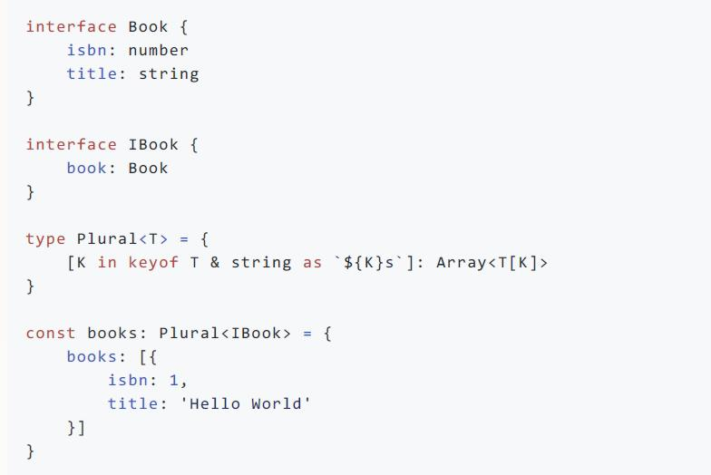

# 2020.11.18

1. 快餐文分享:

   为什么阿里巴巴这一次能扛得起 11 亿的流量？没有发生崩溃！
   https://mp.weixin.qq.com/s?__biz=MjM5NTg2NTU0Ng%3D%3D&mid=2656616259&idx=1&sn=d981ce87c2898bc333e5476310bc060d&chksm=bd5de9e68a2a60f0d48baf17e4aca89ca6cbfbcd78b11dc0289972c679261265b7d23d8b0369&scene=0&xtrack=1#rd

   这篇文章是去年淘宝架构演进文章的升级版, 可当成饭后甜点阅读..

2. 深入理解 Typescript 高级用法
   https://github.com/hannq/ppt-share/blob/master/courseware/ts-advance-usage/README.md

   摘要: 有人说 Typescript = Type + Javascript，那么抛开 Javascript 不谈，这里的 Type 是一门完备的编程语言吗？

   文章用多个案例, 展示了 TS 面向 Type 编程的特性..
   目前 TypeScript 不只是 带有 Type 的 JS 了.. 其类型系统 已经演化得十分强大... 所有编程语言都远不及..

   但是这样这么强大的类型系统, 真的有必要吗? 
   Type 只是一种重要的上下文信息, 在 coding 时, 应该追求简单明了的类型建模, 而不应为了 Type 增加心智负担, 照这样下去, 免不了要 debug Type... 那就多少有点魔幻了..

   现在 TS 的发展已经趋向于是两种语言的融合: 一种是 JavaScript, 另一种是 <加粗>Type<加粗>Script...  

   

3. 好文分享:

   clean-code-typescript
   https://github.com/labs42io/clean-code-typescript

   教你如何写干净的代码, 文章中的思想,技巧 总结得还是很全面的.
   另: 学习不要被编程语言限制, 要有个做科学家的心.

4. 故事分享:
   空气币操盘者口述：租豪宅、坑学妹，我割韭菜狂赚2000万元
   https://www.36kr.com/p/973051916872963

   摘要: 
   现在的社会，不是你赚别人，就是别人赚你，年轻人没必要和钱过不去。
   人的一生有无数个成为混蛋的机会，我只是紧抓了其中一个。

   来自 36Kr 的一篇故事, 写的还不错, 赌博之前请搞清风险. 

5. 

   上图来自 2020.8.5日 Telegram 创始人 Durov 谈 美国 ban TikTok.

   其中有句话让我印象很深刻:
   If you want to access the markets of other countries, you should also open your market to them – that would be fair.

6. 

7. 

8. 

   我写了一段伪代码 关于用户的登录逻辑, 其中有一片段是判断 密码是否一致, 如果一致 则成功登录, 如果不一致则拒绝登录.

   此判断密码一致的代码片段 存在很大的安全问题, 有人知道吗?

   ok, 如果没人想回应, 那我继续说了, 在后端开发中, 这样判断密码一致的逻辑是很容易被黑客攻击的.

   这种攻击叫做 记时攻击, 我举些例子 让大家理解.

   1. 长度不一致
      数据库 用户原密码: 123456789
      hacker 输入的密码: 123456

   当运行到 判断密码一致 的逻辑时, 因为两个密码长度不一致, 直接返回 登录失败响应.

   1. 长度一致
      数据库 用户原密码: 123456789
      hacker 输入的密码: 12abc456

   当运行到 判断密码一致 的逻辑时, 因为两个密码长度相同, 会进入到 for 循环逐个字符 判断, 当遍历到 3 与 a 时 应该相应位置的字符不一样, 返回 登录失败响应.

   这两个例子 被攻击的关键原因 是因为 它们都提前返回了.

   可不要小看 这个 提前返回, 当hacker 使用大量输入 去测试登录接口时, 是完全可以分析到 正确的密码长度, 当然这个过程需要去掉很多网络噪音.

   陈皓叔 有篇文章 很好地讲解了 分时攻击的细节.
   https://coolshell.cn/articles/21003.html

9. 据报道称“浏览器内核有上千万行代码”，浏览器内核真的很复杂吗？ - 龙泉寺扫地僧的回答 - 知乎 https://www.zhihu.com/question/290767285/answer/1200063036
