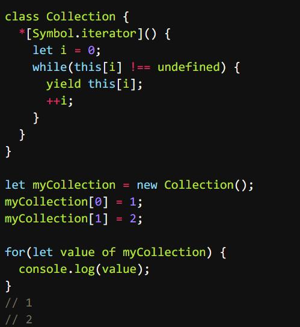
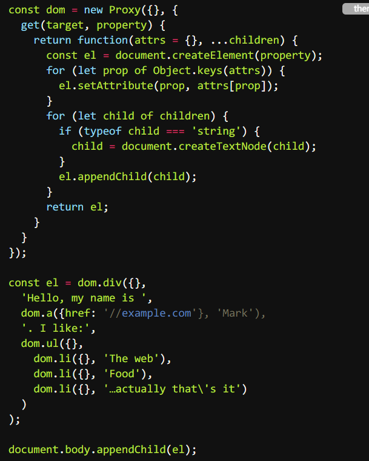

# 2020.11.28

1. 快餐文分享：

   An ex-Googler's guide to dev tools
   https://about.sourcegraph.com/blog/ex-googler-guide-dev-tools/

   摘要：In many ways, the dev tools inside Google are the most advanced in the world. Google has been a pioneer not only in scaling their own software systems but in figuring out how to build software effectively at scale.

   文章讲述了 作者（sourcegraph 创始人）离开 Google 后的感受：因为无法带走Google的基建，只能去找替代品，但 Google 之外的世界还远不够...

2. 面试题分享:

   reactjs-interview-questions

   https://github.com/sudheerj/reactjs-interview-questions

   摘要: List of top 500 ReactJS Interview Questions & Answers....Coding exercise questions are coming soon!!

   前端同学可以有空刷一下, 此项目 star 近 9k 是我没想到的..

3. 

4. Objective-C 语法上有什么优点吗？ - doodlewind的回答 - 知乎 https://www.zhihu.com/question/24115153/answer/1597551264

5. 

   图片分享: Ruins-14-abandoned-Abandoned-house
   https://www.behance.net/gallery/107115063/Ruins-14-abandoned-Abandoned-house
   阳光依旧，但已人去楼空。

6. 快餐文分享：

   抱歉，“大数据杀熟”无药可救

   https://www.huxiu.com/article/396137.html
   摘要：假如我平时浏览服装和宠物用品时间比较多，那么某宝在给我推荐这类产品时，需要推荐相似但性价比高的产品，因为花费了较多时间，会产生“价格敏感”——因为常用，我会对这些商品价格区间更为熟稔。反之，当我突然开始浏览平时不怎么看的产品，比如机械键盘，男生球鞋，且浏览时间不长，那么算法就会倾向于推荐价格较高的产品。

   资本永远是逐利的，学会了算法，丢掉了信任。

7. 快餐文分享：

   张一鸣背后重要的五个人

   https://www.36kr.com/p/985827657521801
   今日头条早期的融资故事，可以见得 在国内无论多么牛x的产品也需要投资人带路。

   如果没有资本注入，很可能在早期就死掉。

8. 每日一句分享:

   孙正义时间机器理论: 所有美国兴起的东西，在未来几年后都会在日本兴起，从发达国家到相对不那么发达的国家。

9. 无意间刷到了篇垃圾文章, 真是被恶心到了..

   

   如此妖魔化的产物 说成 中国在世界上的科技创新...

   正是因为这些巨头, 这些傻X产物,  让国内的互联网不再互联.

   现在国内的互联网就是一个个孤岛..只知道增强壁垒, 吸引流量, 他们应有的责任义务 早抛掷脑后了..

10. 一图看清 Linux 权限说明

    

    在 Linux 中第一个字符代表这个文件是目录、文件或链接文件等等。

    - 当为 **d** 则是目录
    - 当为 **-** 则是文件；
    - 若是 **l** 则表示为链接文档(link file)；
    - 若是 **b** 则表示为装置文件里面的可供储存的接口设备(可随机存取装置)；
    - 若是 **c** 则表示为装置文件里面的串行端口设备，例如键盘、鼠标(一次性读取装置)。

    接下来的字符中，以三个为一组，且均为 **rwx** 的三个参数的组合。其中， **r** 代表可读(read)、 **w** 代表可写(write)、 **x** 代表可执行(execute)。 要注意的是，这三个权限的位置不会改变，如果没有权限，就会出现减号 **-** 而已。

11. 知识分享：

    chmod: 改变文件权限

    文件权限有两种设置方法，一种是数字权限，一种是符号权限。

    Linux 文件的基本权限就有九个，分别是 **user/group/others(拥有者/组/其他)** 三种身份各有自己的 **read/write/execute** 权限。

    1. 符号权限方式：

       `chmod [-R] [u,g,o] [+,-,=] [文件或目录]`

       `-R`: 目录下的所有文件都会变更

       user/group/others(拥有者/组/其他) 分别对应的缩写为 u,g,o

       `+` 代表增加权限，`-` 代表删除权限，`=`代表设置权限

       例：`chmod u=rwx,g=rx,o=r 文件名`

    2. 数字改变权限方式

       各权限的分数对照表

       - r:4
       - w:2
       - x:1

       rwx = 4 + 2 + 1 = 7

       wx = 2 + 1 = 3
       rx = 4 + 1 = 5

       rw = 4 + 2 = 6

       `chmod [-R] xyz 文件或目录`

       `-R`: 目录下的所有文件都会变更

       xyz : 就是刚刚提到的数字类型的权限属性，为 rwx 属性数值的相加。

       例：`chmod 777 .bashrc` => -rwxrwxrwx

12. 好文分享:

    收割者：腾讯阿里的20万亿生态圈

    https://www.huxiu.com/article/392908.html

    摘要：十年时间，阿里、腾讯已各自铸就10万亿市值生态圈。**一个腾讯或阿里，就相当于一座一线城市的资本能量。**而构建如此庞然大物的投资组合，**主要目的是布局产业生态。**

    **在中国的创业人群中，流传着一句话，创业离不开三种结局，生，死和BAT。**遇上A和T，金钱与流量，是对创业者最好的投喂。阿里和腾讯，则可以强化自身的流量入口地位。中国成为全球互联网应用最发达的国家之一，与二者的示范、扶持不无关系。然而，如此之高的富人占比，不由让人思考，这一互生互促链条，是否带来了创富机遇的内卷？

    通常意义上，竞争，比垄断，带来更多的创新。而创新，才能最本质地创造消费者福利。财富，则是对创新的一种激励机制。如果巨头剑指之处，创富机遇也呈集中之势，创新生态也可能变形甚至扭曲。

    深度好文，捋清了国内互联网企业局势以及巨头的战略布局，值得阅读。
    前不久市监局发布了《关于平台经济领域的反垄断指南（征求意见稿）》，下一次市场变革拭目以待。

13. 招聘分享：
    字节跳动客户增长北京前端研发： 校招/社招/实习， 有意向的小伙伴把简历发过来呦，可以发简历到我的邮箱：3137252538@qq.com, 或者公司邮箱地址： wangshicheng@bytedance.com, 建议投递到我的私人邮箱，可以及时回复，希望大家可以找到满意的job

14. 快餐文分享:

    TypeScript 高级技巧

    https://juejin.cn/post/6844903863791648782

    文中的 demo 都挺有趣的。

15. 代码片段分享:
    JS 利用 Symbol.iterator 实现遍历器

    

    为什么 ES6 要给 JS 添加诸如 Python 那样的魔法函数呢..

    魔法函数: 
    JS  obj[Symbol.属性]
    Python `__func__`

    C++ 运算符重载
    Kotlin 后缀中缀函数表达式

    诸如此类 可以改变默认行为的特性.. 

    C++ 和 Kotlin 我倒是可以想象到使用场景, 当实现内部 dsl 时很有用

    但 ES6 中的各种Symbol属性 提供的自定义函数, 真是多此一举了..
    我找了很多资料, 就没发现一个有意义的demo... 都是为了用而用..

    反正 JS 莫名其妙的设计挺多的, 也不缺这一个..

    

    

    JS 完全可以借助 Proxy 实现内部DSL! 太酷了~

    

