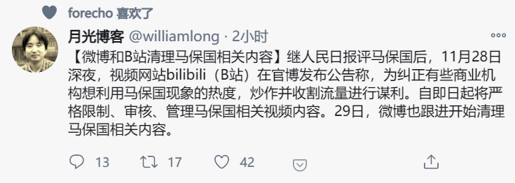
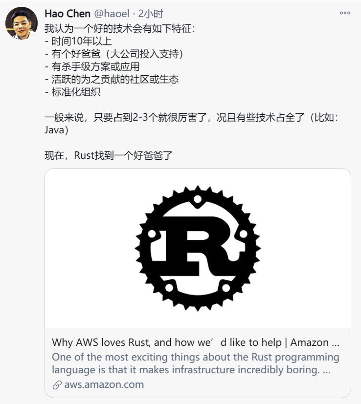

1. 每日一句分享: 不乱于心，不困于情。不畏将来，不念过往。如此，安好。——丰子恺

2. 

   A: 马老师发生瑟么事了

   B: 我大意了 没有闪

3. 

   Rust 之父 近日加入了 亚马逊..

4. 快餐文分享:

   现代化 Web 开发实践之 PWA

   https://www.infoq.cn/article/jS2oC7UgFjdJdgJLdaRs

   摘要: PWA 具有快速、可靠、粘性的特点。快速即快速响应，通过独立的线程进行资源缓存，提高页面的加载时间；可靠指在不稳当的网络环境下， App 也能瞬间加载并展现内容，在离线环境下也提供用户有效反馈；粘性则是通过沉浸式的用户界面、桌面图标、消息推送等手段来增强用户的粘度。

   字体跳动团队的一篇软文，前言介绍的不错，后面实践部分有点浅了。

   

    