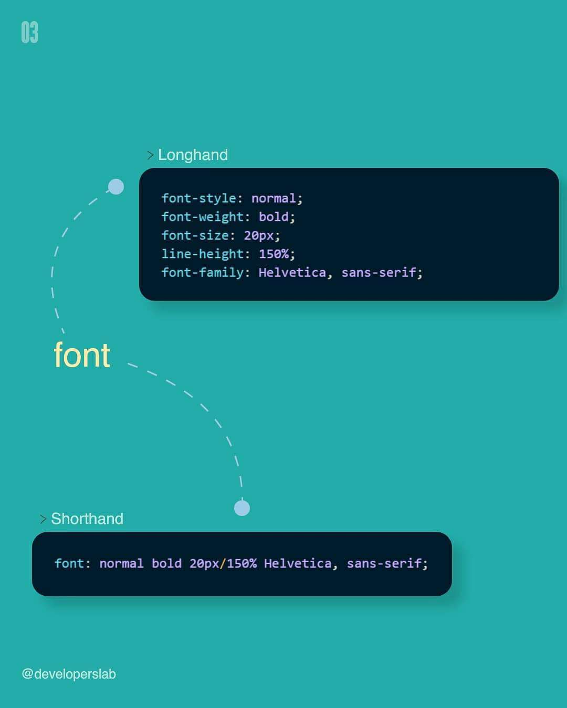

1. 快餐文分享:

   漫画 | 从量子力学到抖音

   https://mp.weixin.qq.com/s?__biz=MzAxOTc0NzExNg==&mid=2665523232&idx=1&sn=4dc7613bb5be208452677485d7e8e7c2

   量子力学 -> 晶体管 -> 逻辑电路 -> 指令集 -> 汇编语言 -> 高级语言 -> 应用程序

2. 每日一句分享:

   学习编程很酷的一点是，你会同时获得两个专长。一个专长是计算机科学和编程，另一个是需要你来编程的那个专门领域。

3. 分享一个练习 CSS-Flex 语法的游戏

   https://flexboxfroggy.com/

   一共24关, 通过写 Flex, 让小青蛙移动到合适的位置 即可过关.

4. 快餐文分享:

   科技反垄断简史：当曾经的勇者成为恶龙

   https://www.huxiu.com/article/398778.html

   摘要: 公司的首要职责是为股东创造价值，这并不一定需要创新，更不一定与社会或国家利益一致。如果没有竞争，垄断巨头可以自行决定创新的节奏，以最大化自己的利益。

5. 电子书分享:

   《微服务：从设计到部署》

    https://github.com/DocsHome/microservices

   本书是 Chris Richardson 和 Floyd Smith 联合编写的微服务电子书 **[Designing and Deploying Microservices](https://www.nginx.com/resources/library/designing-deploying-microservices/)** 的中文译本，其从不同角度全面介绍了微服务：微服务的优点与缺点、API 网关、进程间通信（IPC）、服务发现、事件驱动数据管理、微服务部署策略、重构单体。

   微服务是一种相对于复杂应用的规范，也是近两年来一直被炒的概念。

   本书从头到尾一直讲微服务的各种细节概念，对微服务好奇的同学 可以读下。
   
6. A: 我想用 数组的 length 生成一个 union type，比如 length = 4 -> type N = 0 | 1 | 2 | 3，这样有可能吗？

   B: 我有一个绝妙的想法 吃完饭验证一下

   A: 哈哈哈好！

   C: 我看看..

   D: **我也想看哈哈**

   B:

   ```ts
   type Rua<Arr> = Exclude<keyof Arr, keyof (typeof [])>
   
   type A = Rua<[1,2,3]>
   ```

   能生成 字符串的union

   A: `type ArrIndex<Arr> = Exclude<keyof Arr, keyof any[]>;`

   C: 受教了~ 这个思路 牛批~

7. 

   A: 分享下 Java8 Functional Interface 的设计

   B: 这就是java8的特性吗

   A: Java 8 最牛批的设计 就是 Functional Interface 了.. 借助它这个概念, 实现 lambda 语法, stream, 函数引用 .. 并且还没有违背 Java 的 OOP 设计原则...

   C: 本质还是个interface嘛  像kotlin那样有函数类型就好了

   A: Java8 内置了 多种 函数接口类型, 平常用 足够了  可惜 Java 只有类是第一成员... 

      如果没有 这种设计 , 也不会有设计模式, 依赖注入各种营销术语..

   C: 哈哈哈 确实

8. 

9. 

10. 发现了个有趣的项目
    https://github.com/itorr/e/blob/master/index.html

    A: hah 中文编程又前进了一大步

    B: 哈哈哈 我在公司代码还看到了用中文做变量名的 简直惊了

    A: 没有 review 与 规范嘛... 这我不能接受..

    A: 果然 中文编程是未来趋势

    C: 易语言申请出战

    A: 易语言 永远滴神~

    A: 文言文編程語言
    https://github.com/wenyan-lang/wenyan

    

    B: woc 好牛逼hhh

    A: 东北方言编程语言
    https://github.com/zhanyong-wan/dongbei

    issue区笑死我了 完犊子了 == throw error

    B: 哈哈哈 不过我觉得这个和我们母语有关，毕竟不是出生就看英文的，还是习惯用中文翻译一遍hhh

11. 

12. 

    13. Things you can do with a browser in 2020
        https://github.com/luruke/browser-2020

    14. 分享一个推: https://twitter.com/xiqingongzi/status/1336353507167780864?s=20

        开发者搞项目的一个迷思：关注技术。但除了极少数项目，绝大多数项目都不是靠技术赚钱的。更应该关注的是，产品设计、运营策略、流量来源、转化效率，技术是所有环节中最不起眼的那个。

    15. 