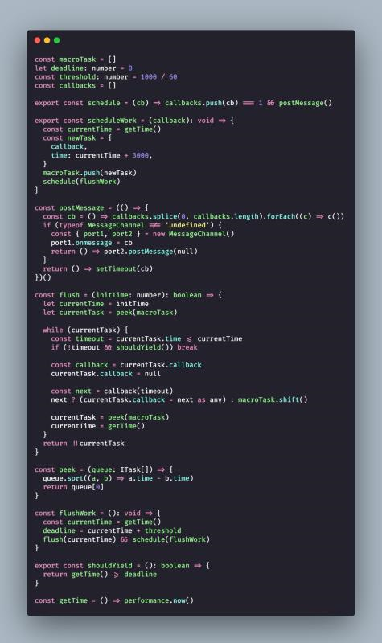

1. 发现了个有趣的 Mac native 命令，在 terminal 下执行 `say "Hello World`, 会有小姐姐出现。

   

2. 每日一句分享:

   最近读到了一段话，引起了我的思考。
   "工作对于人生至关重要。它提供了收入，身份和意义，失业的创伤仅次于亲人的死亡。"

   我完全同意这段话。因为我父母的人生就是这样，上了一辈子的班，如果把工作的部分去掉，就没有其他值得一说的东西了。
   对于许多人来说，人生就是围绕着工作。上学是为了找工作，毕业是为了上班，等到退休不上班，就已经是晚年了。万一失业，生活顿时就崩溃了，就像上面的引言说的，收入、身份、意义瞬间都没了。

   我今天想说的是，这种"工作型人生"已经过时了。要是现在你还把上班当作人生的主轴，是一件很危险的事情，因为失业的风险越来越大。 时代变了，稳定的工作越来越少，失业会是家常便饭，人生已经没法依附在某一份具体的工作上了。

   由于经济全球化和技术进步，行业的兴衰正变得越来越快。往往几年时间，新事物就彻底取代了旧事物，比如网络淘汰了报纸杂志，电动车淘汰汽油车，自动驾驶以后会淘汰司机。新行业瞬间崛起，又瞬间衰落，共享单车、P2P 网贷、长租公寓等等都是如此。
   这些变化都是预想不到的，根本没法提前准备。上学的时候，我们学习内燃机，怎么可能想到有生之年这个东西会过时，汽车会不用汽油。在技术浪潮的面前，很多行业一转眼都没了，从业人员都得下岗再就业，当代社会的失业可能性比以前大得多。

   所以，已经没法围绕工作而规划人生了，因为工作靠不住了，人生不能押宝在某一份具体的工作上面，风险太大。现在是互联网 + 智能手机 + 云计算 + 5G，未来会变成什么样，没人知道。
   我的意思是，我们对人生的预设应该是，一生中会多次改变工作，服务过多家公司，干过各种事情，中间很可能有失业期。 不能像以前那种，以某一份具体的工作或职业作为预设来规划人生。

   人生是一次旅行，不同的工作或公司只是我们沿途投宿过的村庄。它们不是人生的主轴，你不要误以为那是可以定居的地方，大多数人没有这种幸运。 不要再关注能不能找一个好工作/好公司（让你定居），人生的主轴应该是关注能不能实现下面三个目标。

   目的：你的人生想做到什么。
   成长：怎么保证自己的技能不断在成长。
   人脉关系：你能联系和动员的社会网络有多大。

   链接: http://www.ruanyifeng.com/blog/2020/12/weekly-issue-138.html

3. 对 vanilla js 一致很迷惑。。直到 https://stackoverflow.com/questions/20435653/what-is-vanillajs

   http://vanilla-js.com/ 居然还有个官网，还能下载 可以试试 忽悠 boss 专用

4. 

   I tried to do a fizzbuzz using modern web platform apis and im terrified that it actually works https://t.co/SUaYVZAu8j

   看到这个创意 惊呆了.. 太秀了..

5. 互联网大厂的后端技术栈 - 文西的文章 - 知乎 https://zhuanlan.zhihu.com/p/103798636

   文章不错，涉及了大部分概念。

6. [分享8个非常实用的Vue自定义指令](https://juejin.cn/post/6906028995133833230)

7. https://www.golangprograms.com/go-language/concurrency.html

   快餐文分享，操作系统中经典案例的Golang实现，Demo 值得阅读。

8. [Node.js底层知识 - 理解Buffer](https://mp.weixin.qq.com/s/8e2xA4PxckzKpZZnyMbAuA)

9. [如何只使用CSS提升页面渲染速度](https://mp.weixin.qq.com/s/aPguK-dZr7JMA-s2OOFyjg)

10. 好文分享: [2020年大前端技术趋势解读](https://juejin.cn/post/6908713513271689224)

11. 快餐文分享: [使用 hooks 的开发模式](https://github.com/dt-fe/weekly/blob/v2/080.%E7%B2%BE%E8%AF%BB%E3%80%8A%E6%80%8E%E4%B9%88%E7%94%A8%20React%20Hooks%20%E9%80%A0%E8%BD%AE%E5%AD%90%E3%80%8B.md)

12. 快餐文分享：

    终于明白了，一文彻底理解I/O多路复用
    https://mp.weixin.qq.com/s?__biz=MzI0MjEwMDMzNQ==&mid=2652517896&idx=1&sn=0ccd0ddf7e0b75094a6843039948692f

    文章较简单，没有介绍抽象概念，没了解过 I/O 机制的同学可以读一下。

    A: 昨天还看 bio nio aio 感觉好多文章都无法理解

    B: 是的，Java 的 IO 机制 实质上就是 底层 IO 机制 的封装。

    不过现在 IO 机制的思想，已经很难改变了。

    不管是 windows 的 select ，还是 linux 的 epoll ，还是 mac 的 kqueue 实质上都是一种思想 的不同实现。

13. 分享一本朋友最近在看的书：
    《如何征服英俊少男》
    https://lady.163.com/photoview/513O0026/47050.html#p=93H0ISUD513O0026

    摘要：《如何征服英俊少男》是河北人民出版社曾经出版过的一本奇书。这些先辈们智慧的结晶，今天还在指引着求知若渴的青少年朋友。如果能早看到这本书，人生得少走多少弯路啊！

    A: 看了第一章，写的很有道理。有时候 别把性别看太重

    B: 大城市这么开放的嘛

    C: 开放多元

    A: hah 多元兼容 这就是字节范儿

14. 分享一个项目：
    https://github.com/type-challenges/type-challenges
    Collection of TypeScript type challenges with online judge

    可做 TS 体操

15. [音乐的语言是很糟糕的](http://www.yinwang.org/blog-cn/2020/12/19/music)

    垠神终于发新文章了，这篇文章 乍一读 有很大戾气，但是 我能感受到垠神对语言的思考方式。从一开始 他讨论编程语言，DSL，机器语气，数学以及人类语言的小语种，到现在的音乐语言。他一直是以客观的角度 去看待这些事物，在他心中 没有谁是大牛，没有谁是创始人，这种思维方式 我很喜欢，很受教。

16. Question: React fiber 为了在浏览器环境 做到时间分，片机制 增量渲染，底层借助的 API 是什么？

    Answer: 不是 requestAnimationFrame, 也不是 setTimeout, 是 MessageChannel + postMessage 

    

    可以看下 上面这张图, 这个相当于简化版本的 react 调度机制实现.

    如果浏览器兼容 MessageChannel(宏任务) 就使用它 来做异步, 否则粗暴点 使用 setTimeout(宏任务)

    之所以使用 MessageChannel + postMessage , 而不是 requestAnimationFrame, requestIdleCallback, setTimeout..

    我还需要在找找具体原因...

    我想起来了, 之前看过一篇文章
    1. requestAnimationFrame 如果一帧之内没有剩余时间, 则留到下一帧调用
    2. requestIdleCallback 使用在浏览器空闲时才 调用, 这样会造成 渲染单元一直得不到调用
    3. setTimeout 懂得都懂..

    找到了一个合适的回答,之所有使用 MessageChannel 做异步机制, 除了上面 API 的缺点外, 它本身的优点在于:
    onmessage的回调函数的调用时机是在一帧的paint完成之后。react scheduler内部正是利用了这一点来在一帧渲染结束后的剩余时间来执行任务的

    

    好像 Vue 中的 nextTick 底层使用的异步机制 也是 MessageChannel

    我刚刚查了一下
    nextTick 先检测是否原生支持Promise，不⽀持的话再去检测是否支持MutationObserver，如果都不行就只能尝试宏任务实现，首先是setImmediate，这是⼀个⾼版本 IE 和 Edge 才支持的特性，如果都不支持的话最后就会降级为 setTimeout。

    这个问题就挺有趣的.. React 的异步是 MessageChannel 宏任务 , Vue 的nextTick 使用的 微任务 , 为什么呢...

17. 

    ​	A: 这条推笑死了, 未来的 React 编程方式.

    ​	B: hahah 未来 react 的全栈吗

    ​	A: 我看到这图的第一想法是, 这敢上线 数据库不分分钟被打穿.

    ​		Dan 发的, 我觉得有可能 hah

18. [React RFC Server Components是什么，有啥用](https://mp.weixin.qq.com/s/7AT5iNaJyRdAKaE3Rr321w)

    A: 这前后端 合久必分，分久必合..

    B: 快进到react全栈

    A: 做个BFF层还是不错的

19. A: 我到字节 最好奇的就是 有很多很多同事 的开发环境 就是使用 mac + 触控板.. 我坚持了一周, 各种效率软件 魔改快捷方式软件 都试过了.. 撑不下去了.. 

    B: 哈哈哈我也觉得很顺手啊 是时候分享一波你的魔法操作了

    A: 好吧.. 可能 我在 Windows 上的环境 太高效了.. 这点我到没有夸张..

    我除了 各种新知识, 最喜欢探索的 就是 和电脑的交互方式了..

    我平时使用最多的是 WGesture + Chrome 下的 Vimium, crx Mouse Gesture + Seer + uTools + QTTabber + 罗技鼠标宏 + 自己写的 AHK 模拟鼠标脚本..

    对了 主要离不开 wsl2

    C: 推荐用quicker 感觉比utool好用点

    A: 那个 一直被各路推, 我也试了很多次, 找不到解决痛点所在...

    C: 我看到测评m1芯片的出来了，性能好像很强悍，自家os优化贼好，很想换，又舍不得在win辛辛苦苦优化的工作流程

    A: no no no, arm 架构 现在生态还没站住脚呢..

    C: 那估计刚出 恰饭的比较多

20. 之前在图书馆看过一本 7天7数据库的书，里面介绍了多种主流的数据库类型:
    按照存储类型分类

    1. 关系型数据库
    2. 非关系型数据库
         基于文档
         基于键值对
    3. 新关系型数据库
    4. 列存储型数据库
    5. 图存储型数据库
    6. 时间序列数据库

    业界代表:
    1. 关系型数据库: Oracle MySQL PostgreSQL MariaDB SQLServer
    2. 文档数据库: MongoDB
    3. 键值对数据库: Redis,  Memcache
    4. 新关系型数据库 主要用于分布式: TiDB OceanBase  Ectd
    5. 列存储型数据库: HBase 
    6. 图存储型数据库: Neo4j
    7. 时序数据库: InfluxDB

    其他的区别:
    1. 开源/商用
    2. 存储模型
    3. 单机/分布式
    4. 数据库引擎
    5. 底层数据结构
    6. 搜索引擎
    7. 索引的支持
    8. 事务的支持
    9. ACID 的实现性
    10. 是否云产品
     11. ....

21. 好文分享:
    深度解析 Raft 分布式一致性协议
    https://juejin.cn/post/6907151199141625870

    摘要: 在分布式系统中，为了消除单点提高系统可用性，通常会使用副本来进行容错，但这会带来另一个问题，即如何保证多个副本之间的一致性？

    文章写得很有深度, 目前 Raft 算法是 CAP 理论中 C 一致性 在业界内的最佳实现, 有兴趣的同学可以读一下 前两章与最后一章, 中间实现细节 可以泛读.

22. 每日一句分享：

    代码注释是一种道歉，为未选择更清晰的名称或更合理的参数而道歉，为代码无法维护而道歉，为不使用知名算法而道歉，为编写"聪明"代码而道歉，为没有良好的版本控制系统而道歉，为未完成代码编写工作而道歉，为留下漏洞或代码中的缺陷而道歉。

    -- [Uncle Bob](https://critter.blog/2020/09/15/dont-comment-your-code-refactor-it/)

    A: “code tells you how, comments tell you why” 这句也挺好

23. 

    hah Server Side Rendering

24. 

    Kotlin 1.4 新推出了一个关键字 tailrec , 可以使用它 去主动编译优化 尾调用的函数. 
    https://twitter.com/kotlin/status/1341749661175066624?s=20

    先不提尾调用是什么, 就说说 都 2020 年了, 现代的编译器还做不到 主动优化尾调用嘛.. (V8 做到了,但因为一些问题 不敢主动开启)

    这个关键字很破环我对 Kotlin 的印象..

    它就和 C++ 中的 inline, volatile 代表的性质一样... 这些关键字的出现 是为了弥补 底层设计的缺陷... 之所以 C++ 的定位是偏底层语言, 就因为 它的语法特性 就离不开操作系统那些概念..

    而一个优秀 现代的编程语言 是不应该为用户增加此心智负担的.

    A: kotlin也有inline 还有refied这种类型擦除后再生 给Java擦屁股

25. [【招聘】字节跳动番茄小说招前端工程师/Leader（社招/校招/实习）](https://mp.weixin.qq.com/s/V0Qduc-Gouv3qrTWmEY_tQ)

27. [漫画 | 程序员必须要小心的7个潜规则](https://mp.weixin.qq.com/s/ubzCmQTL7wt9GEoSqueicw)

28. 分享一个最近学到的术语：AB测试

    AB测试是为Web或App界面或流程制作两个（A/B）或多个（A/B/n）版本，在同一时间维度，分别让组成成分相同（相似）的访客群组（目标人群）随机的访问这些版本，收集各群组的用户体验数据和业务数据，最后分析、评估出最好版本，正式采用。

    可以看出 AB 测试 与 埋点系统，数据设计 数据清洗 数据分析统计，CDN 分发（灰度测试）关系很近

