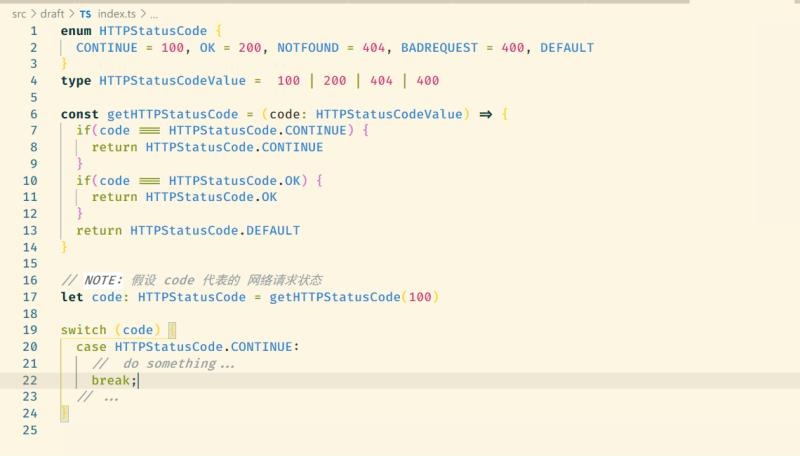

1. 招聘分享:

   https://mp.weixin.qq.com/s?__biz=MzIzMTIzMTUwOQ==&mid=2650041308&idx=3&sn=3ea75db29bab752362706a6d931a3808

2. 快餐文分享:

   漫画 | Java小子和C老头儿的硬盘夜话

   https://mp.weixin.qq.com/s?__biz=MzAxOTc0NzExNg==&mid=2665523198&idx=1&sn=206c2ed4035207aaae049aeab8dd83a0

   A: 多线程学了三套 Windows的方法到Linux下，还得自己研究怎么实现

   B: mingw

3. A: ts枚举可以约束值的选项吗？

   B: type Number = 1 | 2 | 3 | 4 ...

   A: 

   可选的不是1，2，3 为啥赋值为5还可以啊?

   B: 你对枚举理解错了 你需要 literal type 去约束值 枚举并不是去约束取值的

   A: 那他是干嘛的呀？ 

   B: 枚举主要代表的是 状态的集合

   ```ts
   enum Week {
     Monday 
     Tuesday 
     Wednesday 
     ...
   }
   ```

   就像是这样 我知道你现在的迷惑 我想想怎么解释哈...

   A: 好 

   B: 你现在不明白的是 状态 与 值 之间的关系...

   A: 不明白上面那个代码为啥不报错

   B: 呃... 是这样的 我在本地复现了, ts 确实没有检测出来, 之所以没有检测 也情有可原, 枚举没有这么使用的...

   一般都是 变量 = Enum.member 而不是等于一个值常量...

   A: 嗷嗷，这样啊

   B: 因为枚举代表的是 状态的集合, 而每个状态 只要有一个 unique 值就好了...

   就好比 给你一个 HTTPStatusCode 算了 给你写下伪代码吧, 这就是枚举平时的用法

   