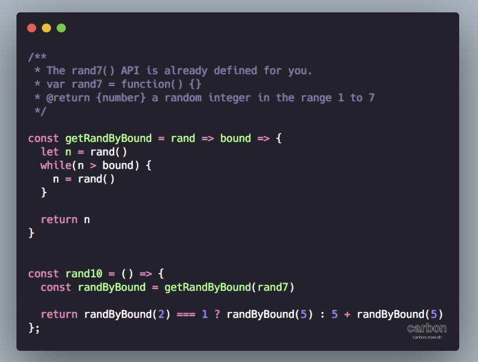

1. Q: 好像很多编程语言都有hooks hooks是干啥的啊

   A: 呃，react 的hooks 和你常见的hook 并不是一种概念. 

   一个是 事件监听的钩子，就好比 观察者模式；
   一个是 生命周期的钩子，就好比 Servlet 中的 destroy 方法。

   钩子这种概念不仅存在于 应用层，像底层的 epoll io机制，事件循环 都有相似的概念。

   说白了 hook 就是暴漏给你的signal

   顾名思义，钩子嘛..

   Q: 他是做什么的呢

   A: 它暴漏给你一些入口， 你把逻辑注入进去， 等到合适时机 执行你的逻辑。时机啊，入口啊 这些设计可是很讲究 抽象能力的。
   
2. Q: 我看lamda表达式可读性也挺差 是不是不习惯的原因

   A: 其实 lambda 表达式 是最贴近数学函数的表达形式...

   java 中的 lambda 设计的很有趣, 后端的原理 是使用 函数接口 加匿名类, 而前端的改成了 (parameters) -> expression..

   颇有 函数第一成员的感觉 但是 实际用起来 还是挺多限制的.. 

   不过还好了, java 能做出这种转变 已经很不错了..

   我最讨厌的lambda设计 就是python..
   
3. 刚刚A了一道题, 挺有意思的

   已有方法 rand7 可生成 1 到 7 范围内的均匀随机整数，试写一个方法 rand10 生成 1 到 10 范围内的均匀随机整数。不要使用系统的 Math.random() 方法。

   https://leetcode-cn.com/problems/implement-rand10-using-rand7/

   我的思路是 实现 rand5 与 rand2..

   rand2 代表的是一种对立布尔状态, rand5 则是 1-5 随机数
   如果 rand2 === 1 那么就 返回 rand5, 否则就 5 + rand5

   

4. A:Kotlin 她真的太美了。

   B:[翻白眼]kotlin 也能在jvm上跑是不是

   A:当然

   B:java凉了 jvm都凉不了

   A:Kotlin scala groovy都是以jvm为后端的语言

   Jvm 是一个编程语言的后端～

   除了jvm 还有 llvm 都是很强大的工具。

   现在设计一门语言，只需要搞定前端就可以，也就是编程语言的语法特性。后端有太多的选择。

   B:都是用c++写的吗

   A:刚开始都是c系列

   现在jvm应该自举了吧

   我不清楚

   我查下哈

   Java 平台中的 JVM 和 .Net 平台下的 CLR 分别是用什么语言写的？ - RednaxelaFX的回答 - 知乎 https://www.zhihu.com/question/20163831/answer/18629722

   Hotspot 是c系列

   其他jvm就不用看了

   我喜欢kotlin与go，看到她们的代码，打心底里兴奋。

   JS ruby c# 也有jvm的版本，哈哈
   
5. 无意间刷到了篇垃圾文章, 真是被恶心到了..

   

   如此妖魔化的产物 说成 中国在世界上的科技创新...

   正是因为这些巨头, 这些傻X产物,  让国内的互联网不再互联.

   现在国内的互联网就是一个个孤岛..只知道增强壁垒, 吸引流量, 他们应有的责任义务 早抛掷脑后了..
   
6. 代码片段分享:
   JS 利用 Symbol.iterator 实现遍历器

   

   为什么 ES6 要给 JS 添加诸如 Python 那样的魔法函数呢..

   魔法函数: 
   JS  obj[Symbol.属性]
   Python `__func__`

   C++ 运算符重载
   Kotlin 后缀中缀函数表达式

   诸如此类 可以改变默认行为的特性.. 

   C++ 和 Kotlin 我倒是可以想象到使用场景, 当实现内部 dsl 时很有用

   但 ES6 中的各种Symbol属性 提供的自定义函数, 真是多此一举了..
   我找了很多资料, 就没发现一个有意义的demo... 都是为了用而用..

   反正 JS 莫名其妙的设计挺多的, 也不缺这一个..

   

   

   JS 完全可以借助 Proxy 实现内部DSL! 太酷了~

   
   
7. A: 大佬们都是用什么来写博客的，readme？

   B: 

   更新下，现在所以的子项目都是用 react 了。

   我不看重 网站访问速度，日活，SEO权重，所以不一定符合你需求。

   