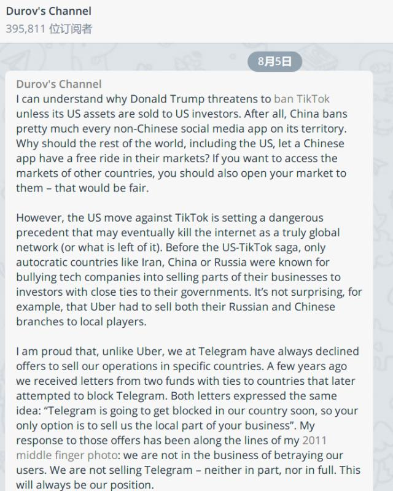

1. 分享一篇在虎嗅看到的好文: 中国互联网反垄断简史
   https://www.huxiu.com/article/393669.html

   有句话让我印象深刻: 
   投资人问他，“美团拼多多阿里都在做这事，你拿什么跟它们打？”他答不上来。仔细琢磨之后，他放弃独立发展，打算找某个巨头融一笔钱，借助巨头的资源，抓住时间窗口迅速把项目做大，然后卖给巨头套现。
   
2. 好文分享: 

   连字节跳动都“扶不起”的那些产品，长什么样？
   https://www.huxiu.com/article/393849.html

   摘要: 目前字节跳动已经被验证成功的产品，被外界归结为“图文内容/短视频—AI推送—广告变现”的商业模式，算法、流量、组织能力、高效率商业化，是其被反复验证的四大优势，也是它攻城略地的杀手锏。

   文章列举了 字节失败过的产品, 并阐述了 字节的布局战略, 产品变现方式.
   
3. 

   上图来自 2020.8.5日 Telegram 创始人 Durov 谈 美国 ban TikTok.

   其中有句话让我印象很深刻:
   If you want to access the markets of other countries, you should also open your market to them – that would be fair.
   
4. 今天看到一则文章 <「编程猫」再获13亿元D轮融资，成为国内少儿编程领域最大的一轮融资>
   让我想到了 之前的少儿编程领域的国际巨头 Scratch.
   Scratch 在中国的发展 就像之前外企在国内的命运一样.
   被人投毒, 被人举报, 然后国内copy同样的产品 迅速占领国内市场..

   相关链接:
   https://www.36kr.com/p/975848397078276
   https://zhuanlan.zhihu.com/p/225556864
   
5. 文章分享： 
   浑水做空YY全文：一个由机器人构成的虚拟王国
   https://www.huxiu.com/article/394887.html

   摘要：
   我们想对百度说：“当你用接近7%市值相等的现金，收购一个完全虚假的业务时，你的尽职调查哪里去了？尽调怎么可能没有发现如此大规模的欺诈行为？如果百度认为自己尊重市场道德与法律，那就让我们看看。”

   浑水继上次成功做空瑞幸咖啡，这次把目标转移到了最近刚被百度收购的YY上。哈哈，直播风口已经过去，泡沫是时候该破灭了。
   
6. 快餐文分享：

   消失的日本大亨

   https://www.huxiu.com/article/395165.html

   摘要：弄潮儿再风光，终究要服从海水的意志。

   文章讲述了 日本富豪武富士 通过放贷迅速成长为国内巨头的故事，最后因国家经济政策 短短几年内退市破产，成为了过去。

   这篇文章颇有含沙射影的味道，蚂蚁金服上市现在已困难重重。
   
7. 百度和 Google 的搜索技术是一个量级吗？ - Kenny Chao的回答 - 知乎 https://www.zhihu.com/question/22447908/answer/21435705