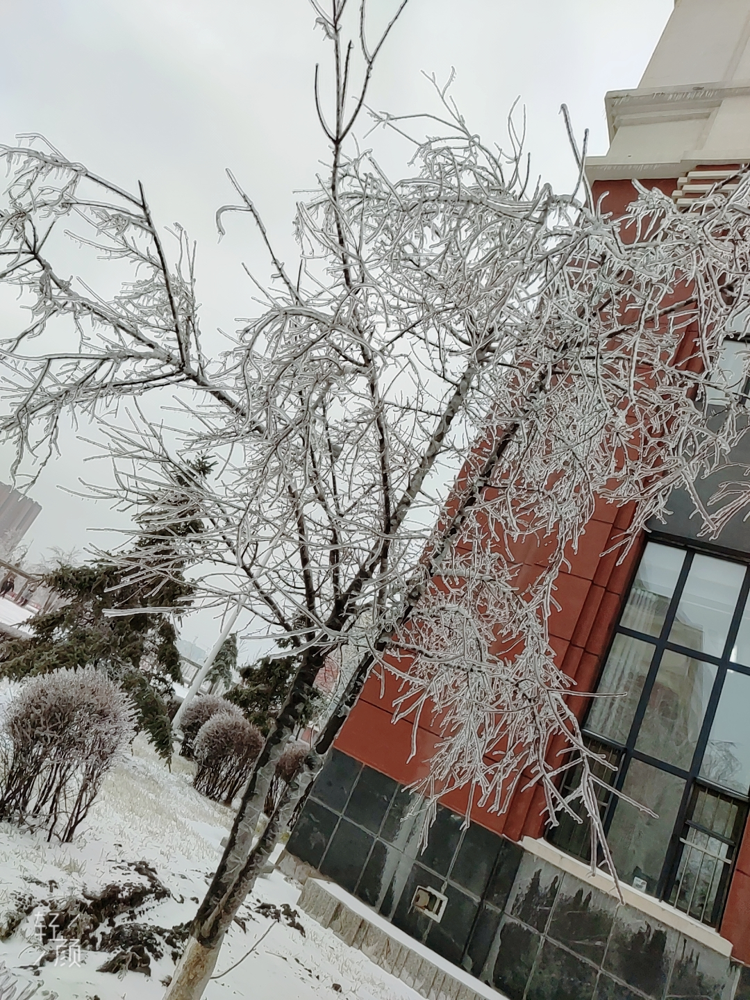

1. 

2. 好文分享:

   吃麻辣烫选这几样菜，既不压称又美味，聪明人的选择

   https://k.sina.cn/article_6891658179_19ac65bc300100kab2.html?from=food

   

   摘要：比较压秤的蔬菜有包菜和西兰花等，在选择的时候，可以不考虑，生菜和油菜这些事可以选择的，重量是很轻的，前提是去掉表面的水分。

   

   生存秘笈，建议熟读并背诵全文。

   PS: 二楼麻辣香锅尽量少吃, 今晚被坑惨了. 