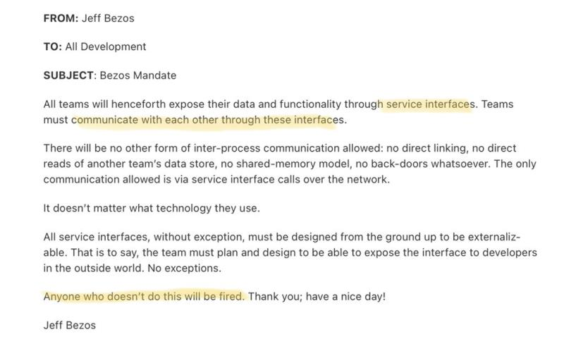

# Architecture

1. 快餐文分享:

   为什么阿里巴巴这一次能扛得起 11 亿的流量？没有发生崩溃！ [https://mp.weixin.qq.com/s?\_\_biz=MjM5NTg2NTU0Ng%3D%3D&mid=2656616259&idx=1&sn=d981ce87c2898bc333e5476310bc060d&chksm=bd5de9e68a2a60f0d48baf17e4aca89ca6cbfbcd78b11dc0289972c679261265b7d23d8b0369&scene=0&xtrack=1\#rd](https://mp.weixin.qq.com/s?__biz=MjM5NTg2NTU0Ng%3D%3D&mid=2656616259&idx=1&sn=d981ce87c2898bc333e5476310bc060d&chksm=bd5de9e68a2a60f0d48baf17e4aca89ca6cbfbcd78b11dc0289972c679261265b7d23d8b0369&scene=0&xtrack=1#rd)

   这篇文章是去年淘宝架构演进文章的升级版, 可当成饭后甜点阅读..

2. 快餐分享： The Illustrated Children’s Guide to Kubernetes [https://www.cncf.io/the-childrens-illustrated-guide-to-kubernetes/](https://www.cncf.io/the-childrens-illustrated-guide-to-kubernetes/) 用儿童动画的视角，讲述了 服务、Docker容器、K8S、Pod等相关云服务概念。
3. 快餐文分享：

   The Tech Stack of a One-Man SaaS

   [https://panelbear.com/blog/tech-stack/](https://panelbear.com/blog/tech-stack/)

   文章列举了作者搭建私有分析服务项目时所用到的技术栈，很全面并都有相应介绍。

4. 快餐文分享：

   An ex-Googler's guide to dev tools [https://about.sourcegraph.com/blog/ex-googler-guide-dev-tools/](https://about.sourcegraph.com/blog/ex-googler-guide-dev-tools/)

   摘要：In many ways, the dev tools inside Google are the most advanced in the world. Google has been a pioneer not only in scaling their own software systems but in figuring out how to build software effectively at scale.

   文章讲述了 作者（sourcegraph 创始人）离开 Google 后的感受：因为无法带走Google的基建，只能去找替代品，但 Google 之外的世界还远不够...

5. 【第 21 期】一个架构师的缓存修炼之路

   [https://mp.weixin.qq.com/s?\_\_biz=MzI5NjcxNDM3Mg==&mid=2247485523&idx=1&sn=fd4c678071da504d474523bc90f4bc2c](https://mp.weixin.qq.com/s?__biz=MzI5NjcxNDM3Mg==&mid=2247485523&idx=1&sn=fd4c678071da504d474523bc90f4bc2c)

6. 电子书分享:

   《微服务：从设计到部署》

   [https://github.com/DocsHome/microservices](https://github.com/DocsHome/microservices)

   本书是 Chris Richardson 和 Floyd Smith 联合编写的微服务电子书 [**Designing and Deploying Microservices**](https://www.nginx.com/resources/library/designing-deploying-microservices/) 的中文译本，其从不同角度全面介绍了微服务：微服务的优点与缺点、API 网关、进程间通信（IPC）、服务发现、事件驱动数据管理、微服务部署策略、重构单体。

   微服务是一种相对于复杂应用的规范，也是近两年来一直被炒的概念。

   本书从头到尾一直讲微服务的各种细节概念，对微服务好奇的同学 可以读下。

7. 互联网大厂的后端技术栈 - 文西的文章 - 知乎 [https://zhuanlan.zhihu.com/p/103798636](https://zhuanlan.zhihu.com/p/103798636)

   文章不错，涉及了大部分概念。

8. 【第 50 期】浅谈大型分布式 Web 系统的架构演进 [https://mp.weixin.qq.com/s/DAIv\_\_Qr1yt49ZXhm9Yy2g](https://mp.weixin.qq.com/s/DAIv__Qr1yt49ZXhm9Yy2g)
9. 淘宝技术这十年 [https://weread.qq.com/web/appreader/016324b05a617e01617778fk636320102206364d3f0ffdc?wtheme=white&wfrom=app&wvid=244154583&scene=bottomSheetShare](https://weread.qq.com/web/appreader/016324b05a617e01617778fk636320102206364d3f0ffdc?wtheme=white&wfrom=app&wvid=244154583&scene=bottomSheetShare)

   分享本书，讲得是淘宝从开始到10年之间的重要技术架构迭代，遇到的技术问题，以及一些产品方案上的实践。最后花了大篇幅讲了淘宝的各种大佬。

   上面的长文字摘要 就来自这本书，花了50分钟读完了。 建议前面50%仔细读一下，后面的章节略读就好。

10. 分享一本今晚看完的书, 这书写得非常棒, 值得反复阅读的.

    《大型网站技术架构》微信读书

11. 快餐文分享: 什么是Service Mesh [https://zhuanlan.zhihu.com/p/61901608](https://zhuanlan.zhihu.com/p/61901608)

    摘要: Service Mesh是微服务时代的TCP协议。

    整篇文章 没有几处是作者产出, 皆是 Pattern: Service Mesh 文章的内容以及翻译后的润色.

    之前在 twiiter 刷到一句话: 有的人翻译文章，就像哈希函数。经过他的翻译，就认不出原文了。

    并且有一点, 国内的开发者很少有意识.. 当你翻译篇文章并发表时, 一定要征得原作者的同意, 不然这是侵权的行为..

12. 每日一句分享: 微服务架构 = 80%的SOA服务架构思想 + 100%的组件化架构思想 + 80%的领域建模思想

    之前看过一本书, 程序员的呐喊, 里面有一个作者在亚马逊的经历.. 12年的时候, 贝佐斯 就前瞻性地提出, 所有服务都采用 SOA 架构重新实现..

    搞错了, 不是12年, 是 02 年...

    

13. 微服务架构（Microservices Architecture, MSA）的出现并非偶然，与这个时代的软件思想、技术工具的发展有着密切的联系。比如，将业务功能服务化，是SOA的延续；RESTful等架构的兴起，让我们可以考虑更多轻量化的通信机制；领域驱动设计指导我们如何分析并模型化复杂的业务；敏捷方法论帮助我们拥抱变化，快速反馈；持续集成和持续交付（CI/CD）促使我们构建更快、更可靠、更频繁的软件部署和交付能力；虚拟化和容器技术的发展，使我们简化了部署环境的创建和安装；DevOps文化的流行及全栈自治团队的出现，使得小团队更加全功能化。这些都是推动微服务架构诞生和发展的重要因素。

    摘抄自 分布式系统常用技术及案例分析 第二版

    A: 前段也有微服务了

    B: 是呀~ 应用复杂性不可避免，所以 系统级的模块化 也是趋势所向。

    如果一股趋势不加以控制，混乱度会越来越高。 “微”服务就是抑制熵增的很好例子~

14. 之前我分享过一个观点： 每一个开发者应该深入掌握两种领域：一个是技术领域，另一个就是技术服务的产品领悟。

    刚刚了解到，原来在业界 早就有领域驱动设计\(DDD\)的概念了。

    架构设计到底是面向技术还是面向业务？诚然在很多技术人员眼中，架构设计几乎等同于技术架构设计，对架构师的理解也主要关注于对各种技术体系和框架的掌握程度。然而，很多团队并不缺少出色的技术人员，但是产品开发最终还是会以失败而告终。究其原因，在于技术人员往往只关注于技术架构，而对系统设计的其他方面，尤其是对业务的理解缺少足够的重视。 当然，针对不同性质的系统开发，架构设计的工作重点显然也会有所区别。在对“架构设计到底是面向技术还是面向业务”这个问题作出判断之前，我们首先需要明确两点。第一点是我们是不是在做业务？除了专门从事中间件或底层框架开发的少数场景之外，绝大多数的软件开发工作实际上都是围绕着现实中的业务问题而展开。如果面对的是业务导向的开发场景，那么我们就要考虑第二点，即面对复杂的业务逻辑架构师应该怎么办？采用主流的架构设计理念和先进的技术实现体系，对业务的充分理解，并且能够对业务与技术进行整合的能力同样是成为一名合格架构师的必要条件。

    摘抄自 系统架构设计 一书

