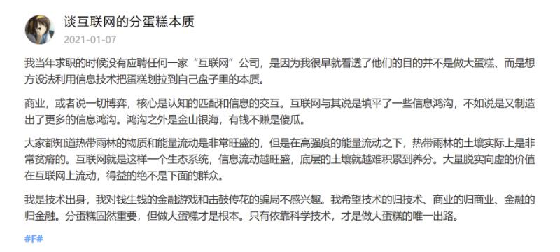

# Business

1.  分享一篇在虎嗅看到的好文: \
    中国互联网反垄断简史 \
    [https://www.huxiu.com/article/393669.html](https://www.huxiu.com/article/393669.html)

    有句话让我印象深刻: 投资人问他，“美团拼多多阿里都在做这事，你拿什么跟它们打？”他答不上来。仔细琢磨之后，他放弃独立发展，打算找某个巨头融一笔钱，借助巨头的资源，抓住时间窗口迅速把项目做大，然后卖给巨头套现。
2.  好文分享:

    连字节跳动都“扶不起”的那些产品，长什么样？ [https://www.huxiu.com/article/393849.html](https://www.huxiu.com/article/393849.html)

    摘要: 目前字节跳动已经被验证成功的产品，被外界归结为“图文内容/短视频—AI推送—广告变现”的商业模式，算法、流量、组织能力、高效率商业化，是其被反复验证的四大优势，也是它攻城略地的杀手锏。

    文章列举了 字节失败过的产品, 并阐述了 字节的布局战略, 产品变现方式.
3.  .png>)

    上图来自 2020.8.5日 Telegram 创始人 Durov 谈 美国 ban TikTok.

    其中有句话让我印象很深刻: If you want to access the markets of other countries, you should also open your market to them – that would be fair.
4.  今天看到一则文章 <「编程猫」再获13亿元D轮融资，成为国内少儿编程领域最大的一轮融资> 让我想到了 之前的少儿编程领域的国际巨头 Scratch. Scratch 在中国的发展 就像之前外企在国内的命运一样. 被人投毒, 被人举报, 然后国内copy同样的产品 迅速占领国内市场..

    相关链接: [https://www.36kr.com/p/975848397078276](https://www.36kr.com/p/975848397078276) [https://zhuanlan.zhihu.com/p/225556864](https://zhuanlan.zhihu.com/p/225556864)
5.  文章分享： 浑水做空YY全文：一个由机器人构成的虚拟王国 [https://www.huxiu.com/article/394887.html](https://www.huxiu.com/article/394887.html)

    摘要： 我们想对百度说：“当你用接近7%市值相等的现金，收购一个完全虚假的业务时，你的尽职调查哪里去了？尽调怎么可能没有发现如此大规模的欺诈行为？如果百度认为自己尊重市场道德与法律，那就让我们看看。”

    浑水继上次成功做空瑞幸咖啡，这次把目标转移到了最近刚被百度收购的YY上。哈哈，直播风口已经过去，泡沫是时候该破灭了。
6.  快餐文分享：

    消失的日本大亨

    [https://www.huxiu.com/article/395165.html](https://www.huxiu.com/article/395165.html)

    摘要：弄潮儿再风光，终究要服从海水的意志。

    文章讲述了 日本富豪武富士 通过放贷迅速成长为国内巨头的故事，最后因国家经济政策 短短几年内退市破产，成为了过去。

    这篇文章颇有含沙射影的味道，蚂蚁金服上市现在已困难重重。
7. 百度和 Google 的搜索技术是一个量级吗？ - Kenny Chao的回答 - 知乎 [https://www.zhihu.com/question/22447908/answer/21435705](https://www.zhihu.com/question/22447908/answer/21435705)
8. 短信息分享: 财联社11月24日讯，根据彭博亿万富翁指数显示，马斯克的净资产升至1280亿美元，超越比尔·盖茨，跃升成为全球第二大富豪，仅次于亚马逊创始人贝索斯。
9.  万字长文：谷歌进入到退出中国市场的前因后果

    [https://coffee.pmcaff.com/article/AOQv8yeYkR](https://coffee.pmcaff.com/article/AOQv8yeYkR)

    摘要：李开复后来在《AI·未来》中表达了他在谷歌中国时的困境。“我们发展每一项新功能，都要与总部打一场硬仗，这让我们动作迟缓，也让我们精疲力竭。许多谷歌中国的员工厌倦了和总公司的斗争，沮丧地离开了。”

    无论多么牛逼的外企 在大陆都很难有容身之地。哪怕是Google，微软这种巨头。
10. 故事分享: 空气币操盘者口述：租豪宅、坑学妹，我割韭菜狂赚2000万元 [https://www.36kr.com/p/973051916872963](https://www.36kr.com/p/973051916872963)

    摘要: 现在的社会，不是你赚别人，就是别人赚你，年轻人没必要和钱过不去。 人的一生有无数个成为混蛋的机会，我只是紧抓了其中一个。

    来自 36Kr 的一篇故事, 写的还不错, 赌博之前请搞清风险.
11. 快餐文分享：

    抱歉，“大数据杀熟”无药可救

    [https://www.huxiu.com/article/396137.html](https://www.huxiu.com/article/396137.html) 摘要：假如我平时浏览服装和宠物用品时间比较多，那么某宝在给我推荐这类产品时，需要推荐相似但性价比高的产品，因为花费了较多时间，会产生“价格敏感”——因为常用，我会对这些商品价格区间更为熟稔。反之，当我突然开始浏览平时不怎么看的产品，比如机械键盘，男生球鞋，且浏览时间不长，那么算法就会倾向于推荐价格较高的产品。

    资本永远是逐利的，学会了算法，丢掉了信任。
12. 快餐文分享：

    张一鸣背后重要的五个人

    [https://www.36kr.com/p/985827657521801](https://www.36kr.com/p/985827657521801) 今日头条早期的融资故事，可以见得 在国内无论多么牛x的产品也需要投资人带路。

    如果没有资本注入，很可能在早期就死掉。
13. 好文分享:

    收割者：腾讯阿里的20万亿生态圈

    [https://www.huxiu.com/article/392908.html](https://www.huxiu.com/article/392908.html)

    摘要：十年时间，阿里、腾讯已各自铸就10万亿市值生态圈。**一个腾讯或阿里，就相当于一座一线城市的资本能量。**而构建如此庞然大物的投资组合，**主要目的是布局产业生态。**

    **在中国的创业人群中，流传着一句话，创业离不开三种结局，生，死和BAT。**遇上A和T，金钱与流量，是对创业者最好的投喂。阿里和腾讯，则可以强化自身的流量入口地位。中国成为全球互联网应用最发达的国家之一，与二者的示范、扶持不无关系。然而，如此之高的富人占比，不由让人思考，这一互生互促链条，是否带来了创富机遇的内卷？

    通常意义上，竞争，比垄断，带来更多的创新。而创新，才能最本质地创造消费者福利。财富，则是对创新的一种激励机制。如果巨头剑指之处，创富机遇也呈集中之势，创新生态也可能变形甚至扭曲。

    深度好文，捋清了国内互联网企业局势以及巨头的战略布局，值得阅读。 前不久市监局发布了《关于平台经济领域的反垄断指南（征求意见稿）》，下一次市场变革拭目以待。
14. 热文分享:

    互联网巨头正在夺走卖菜商贩的生计

    [https://www.huxiu.com/article/396749.html](https://www.huxiu.com/article/396749.html)

    摘要: 一个社会，应该鱼龙混杂，大要有大的活法，小也应该有小的活路，就像海洋，鲸鱼能活，小鱼小虾甚至海藻单细胞生物也能活，这才叫良好生态，不能只让鲸鱼活下去，而把小生物都淘汰掉。**一个社会，大资本大企业应该干什么？难道是要倾尽它们的力量与小民争利吗？大企业用他们无可匹敌的狼性和富可敌国的资本把升斗小民赖以为生的小生意都抢走，就叫发展吗？社会的进步和发展难道就是钱都被大资本赚走，让无助的个体深陷失业和穷困的泥沼而找不到希望吗？**

    文章点出了 科技发展与社会发展的冲突，就像之前的电商时代，我家附近大多数卖衣服的小店因此倒闭了。 我个人觉得 作者杞人忧天了，社会的进步都是通过淘汰劣质资源产生的，这是无法避免的。
15. Slack 被收购，创新值 277 亿

    [https://mp.weixin.qq.com/s?\_\_biz=MjM5ODQ2MDIyMA==\&mid=2650718268\&idx=1\&sn=cebb9737a17ab7dfb35441dab6ef9b1c](https://mp.weixin.qq.com/s?\_\_biz=MjM5ODQ2MDIyMA==\&mid=2650718268\&idx=1\&sn=cebb9737a17ab7dfb35441dab6ef9b1c)
16. 快餐文分享:

    科技反垄断简史：当曾经的勇者成为恶龙

    [https://www.huxiu.com/article/398778.html](https://www.huxiu.com/article/398778.html)

    摘要: 公司的首要职责是为股东创造价值，这并不一定需要创新，更不一定与社会或国家利益一致。如果没有竞争，垄断巨头可以自行决定创新的节奏，以最大化自己的利益。
17. 今日虎嗅热文分享:

    拼多多突袭支付宝

    [https://www.huxiu.com/article/399413.html](https://www.huxiu.com/article/399413.html)

    摘要: 拼多多自成立就以渗透供应链见长，不论农产品的供应链环节，还是其上游新农人、农业合作社模式，都少不了稳定的金融支持。进入2020年，拼多多开始快速推动金融布局。**支付于拼多多而言不是单纯的通道，更多是协调整体资源，解决上下游环节资金问题、缓解自身增长脚步放缓的必要环节之一。**

    虎嗅最近质量明显下降了.. 好久没分享过虎嗅好文了.
18. 分享一个很有趣的视频

    中国地产第一疑案，武斗抢公章，合同不盖章，兄弟不认账，融创躺中枪

    [https://www.youtube.com/watch?v=es9zFXWc4OM\&ab\_channel=%E5%86%B2%E6%B5%AA%E6%99%AE%E6%8B%89%E6%96%AF](https://www.youtube.com/watch?v=es9zFXWc4OM\&ab\_channel=%E5%86%B2%E6%B5%AA%E6%99%AE%E6%8B%89%E6%96%AF)

    这作者 我也是一路关注过来的, 他的视频都很有质量(起码很用心),很符合我胃口.

    算是除了巫师后, 我最喜欢的一位博主了.

    这个视频内容也很有趣, 时长一小时, 可以吃饭的时候刷, 里面讲的故事是 融绿股权之争, 一场充满“人情味”中国式并购案。
19. 好文分享: \
    字节跳动“全力跳动”：底层商业逻辑和第二增长曲线分析 \
    [https://www.36kr.com/p/1021582816920324](https://www.36kr.com/p/1021582816920324)\
    摘要:天下武功，唯快不破。字节第一增长曲线的实践也是这一表达的最好证明。然而，物竞天择，适者生存，每个行业有其自身的行业发展规律和最适合的竞争策略。当字节引以为傲的算法、流量和快速商业化的“快模式”无法在有关行业形成降维打击时，遵循行业基本规律的打法可能是更合适的。\
    文章写得很有深度，让我更看清了字节的发展上的一些问题，值得反复阅读。
20. Apple 收益预警 的两封公开信:

    1. "苹果公司预计第二季度的收入将达到约14亿美元～14.5亿美元，低于此前约16亿美元的预期。收入低于预期主要是由于消费者和创意市场（如广告和出版）的需求疲软。从地理位置来看，欧洲和日本的收入变得特别薄弱。由于成本降低，毛利率高于预期，预计收入不足将被大幅抵消。因此，公司已将盈利预测修订为每股0.08美元至0.10美元，而之前的指引为0.11美元或略高。"
    2. "与我们行业的其他人一样，本季度我们的销售额正在放缓。因此，我们将低于收入预测约10％，导致利润略微下降，"苹果首席执行官史蒂夫乔布斯说。"我们有一些令人惊叹的新产品正在开发中，所以我们对未来一年感到兴奋。作为目前在PC业务中获利的少数几家公司之一，我们对苹果长期增长的前景仍持乐观态度。"

    第一封信的作者是史蒂夫·乔布斯，第二封信的作者是蒂姆·库克。 第二封信一发出来，苹果股价就跌了10%。
21. 

    说一句, 字节之所以这么快的发展起来, 就是商业模式确定的早, 依靠广告系统迅速实现了盈利.
22. 苹果公司的市值等于丹麦（世界第28大经济体）的净资产，用户数量等于中国人口。所以，如果把苹果公司看成一个国家，它将是一个超级大国，对世界人民的生活、政治和文化产生了深远的影响。
23. 新一年20天内, 字节宣布放弃两个业务:
    1. 悟空问答
    2. 好好学习
24. 抖音支付：帝国的缝合线

    [https://mp.weixin.qq.com/s/Bl3jqK27YzCNtcFwF0WoSw](https://mp.weixin.qq.com/s/Bl3jqK27YzCNtcFwF0WoSw)
25. 垂直社区也许是个伪命题 \
    [https://m.tmtpost.com/4968506.html](https://m.tmtpost.com/4968506.html)

    垂直社区，固然在转化率上更高，但也注定了甲方来源会非常集中。短期看没感觉，但时间一旦拉长，这可能会是一个问题。新用户增长一旦停滞，老用户都买过你的产品了，那转化率依然会下跌。

    简单来说，垂直社区的初期商业化好做，但天花板很快就会出现。

    大平台上的垂类博主靠着高人气高流量快速商业化后进一步加强内容深耕，最后压过你垂直社区。

    A: 说的很有道理

    B: 赞一个，泛化大众化直到平台庞大，流量至上，虽然有些不一定质量高，但是流量够了也好商业化了
26. 
27. 分享期视频: \
    炒房、卖房、租房，潘石屹的中国房地产行业掘金史【中国商业史21】第1集 \
    [https://www.youtube.com/watch?v=ISlfUzVUcSA\&ab\_channel=%E5%86%B2%E6%B5%AA%E6%99%AE%E6%8B%89%E6%96%AF](https://www.youtube.com/watch?v=ISlfUzVUcSA\&ab\_channel=%E5%86%B2%E6%B5%AA%E6%99%AE%E6%8B%89%E6%96%AF)

    这系列只讲经济不讲政治.. 多少有失偏颇.. 不过无聊的时候看一看还是挺有趣的..
28. 文章分享：

    「字节跳动」投资2020：全面开花、深入布局 \
    [https://36kr.com/p/1090378619357956](https://36kr.com/p/1090378619357956)

    字节的战略布局越来越广了..
29. 分享篇文章：

    互联网不需要皇帝 \
    [https://greatdk.com/1696.html](https://greatdk.com/1696.html)

    摘要：互联网世界的许多东西都已经或正在消亡：RSS 在消亡，电子邮件在消亡，BBS 在消亡，超链接协议在消亡，浏览器也在消亡，剩下的只有 App，他们是互联网世界里，新立起来的一座座孤岛。 在 App 的世界中，自由举步维艰：内容审查，智障能推荐，跳转拦截，接口封闭，你的选择的权利，拒绝的权利，保存的权利，沟通的权利，都在逐渐丧失。

    哎，典型的囚徒困境 ，如果没有不可抗力 是无法破的。
30. 分享篇文章：

    平台与创新的悖论：Facebook头顶紧箍咒 \
    [https://www.huxiu.com/article/409688.html](https://www.huxiu.com/article/409688.html)
31. 盘点春节红包大战：流量和多巴胺\
    [https://mp.weixin.qq.com/s/0DoZxo8QgqgTQoeUtJkncw](https://mp.weixin.qq.com/s/0DoZxo8QgqgTQoeUtJkncw)
