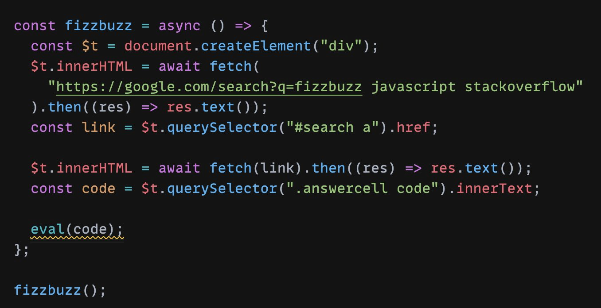
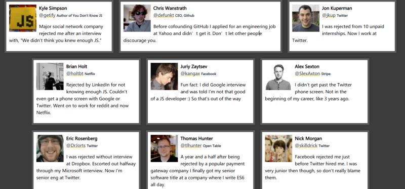

# Idea

1.  网站分享:

    Toddler Password

    [https://www.toddlerpassword.com/](https://www.toddlerpassword.com)

    摘要: Max is 1.5 years old and really enjoys hitting the keyboard randomly on his parents' laptop! He also loves placing his finger tips on the screen and pointing fiercely on things!

    Almost every day Max joins his father in the home office, typing randomly and wild on the keyboard. After a couple of weeks a big random accumulation of characters was created which is expanded every day. This is the basis for this toddler password generator.

    Let him generate a secure password for you in a way no password before has been generated!

    一个随机生成密码的网站, 生成的方式是 通过家里小孩胡乱摁键盘...

    这个创意太可爱了\~
2.  

    I tried to do a fizzbuzz using modern web platform apis and im terrified that it actually works [https://t.co/SUaYVZAu8j](https://t.co/SUaYVZAu8j)

    看到这个创意 惊呆了.. 太秀了..
3.  分享：[用 github-page 做短链服务](https://github.com/nelsontky/gh-pages-url-shortener)，包括[这篇](https://zhuanlan.zhihu.com/p/339832422)国人作者搬运的，利用 github 仓库做 db，github-page 的 `404.html` 来做查 db 和重定向，想法不错哈哈

    B: 这个想法可以的 404 拦截所有请求, 然后在提取请求中的参数, 通过参数 访问 github api 找到对应的长链接, 再重定向..
4.  分享一个有趣的网站: \
    We've all faced rejection. \
    [https://rejected.us/](https://rejected.us)

    里面是各种大佬求职时 被拒绝的故事... 看的我有点羡慕...

    
5. 介绍两个另类API的实现:
   1. 验证码识别服务 2Captcha 2Captcha 最大的特色是，不管字体多么扭曲的验证码，都可以正确识别，因为他们采用真人识别！任何人都可以去平台接活，按照工作量获取报酬。开发者只需要把验证码图片发到他们的服务器，就会有真人识别这些图片。每次验证码识别需要12秒～14秒，开发者使用前一次请求返回的 ID 轮询服务器，拿到识别结果。
   2. 检测水质服务, 根据扇贝的生理行为, 具体信息忘了.. 只记得一年会消耗7-8个大扇贝
6.  分享读到的一个有趣观点，来自阮一峰老师。

    最近，我有一个猜想。

    我们知道，人眼有“视觉暂留”现象：影像消失后，人眼仍能保留影像100毫秒～400毫秒。这就是电影的原理，每秒播放24张图片，影像就动起来了。

    图片

    我就想问，那么有没有“听觉暂留”呢？我们听到的声音是连贯的，有没有可能其实也是一个个分离的片断？

    查了一下，还真有听觉暂留，叫做“哈斯效应”。如果两个声音相隔5毫秒～35毫秒之间，人耳会认为这是一个声音。

    相比“视觉暂留”的至少100毫秒，“听觉暂留”要短得多，最短只有5毫秒，足足相差了20倍。

    我猜想，这会不会跟信息的传输速度有关。视频的信息量比较大，音频的信息量比较小，如果人体神经系统的信号传播速度是恒定的，那么传输视频就会多耗时。为了把所有视频信息传输完，视觉就暂留久一点。

    一个有趣的经验是，4分钟的 MP3 文件（44.1kHz 抽样）体积大概是 4MB 左右，而4分钟的 1080P 视频（H.264编码）体积是 80MB 左右，相差也约是20倍。
7.  Unix 的发明是50年前，1969年。 这50年 人类社会的发展超乎想象。

    30年前，还没有网页，浏览器，搜索引擎。

    中国封建社会可得2000年之久，所以社会进步的根本动力是技术。
8.  不要害怕失败。 人生的最终结果是一个极大值函数（由所有尝试中最成功的一次决定），而不是一个平均值函数。 失败完全可以理解成积极进取的结果，只有生命力充沛的人，才可能会有一次又一次的失败。一味地恐惧失败，只会让自己畏首畏尾，丧失进取心。

    摘抄自 阮一峰老师的散文。 被拒绝，也是一种肯定
9.  最令你吃惊的事实是什么？ 人生只有900个月。

    C: 900个月还少吗

    B: 900个月还少吗
10. [https://vole.wtf/coder-serial-killer-quiz/](https://vole.wtf/coder-serial-killer-quiz/) \
    编程语言创始人 还是 连环杀手，你能选对几个？

    我刚刚玩了一把，不明所以.. 为什么要把 这两种不同的人物画像放在一起…
11. [https://nohello.net/](https://nohello.net) \
    发现了个有趣的网站，传播的主题 和我们平时反感“在吗(却不说事）” 是一样的。
12. 分享个网站: \
    Akiyoshi's illusion pages \
    [http://www.ritsumei.ac.jp/\~akitaoka/index-e.html](http://www.ritsumei.ac.jp/\~akitaoka/index-e.html)

    站点收集了各种错觉图片..

    
13. 分享个网站: \
    荷兰的国家博物馆 \
    [https://www.rijksmuseum.nl/en/rijksstudio](https://www.rijksmuseum.nl/en/rijksstudio)
