# JavaScript

1.  好文分享:

    市面上各大JS引擎 内存系统的设计 [https://mathiasbynens.be/notes/shapes-ics](https://mathiasbynens.be/notes/shapes-ics)

    阅读完之后发现, 虽然 JS 可以从语法层面直接定义一个对象, 但是底层的存储设计 还是根据对象的结构 ,去设计出对应的template 来存储数据的.
2.  V8 运行 JS 的过程

    1. 源代码(source code) 通过解析器(parser) 解析后 生成抽象语法树(AST)
    2. 抽象语法树 通过 解释器(interpreter-Ignition) 生成了字节码(bytecode), 此字节码作为基准执行模型, 字节码等同于 25%-50% 机器码大小. 并且 此时抽象语法树被彻底清除掉了, 释放其内存空间.
    3. 生成后的字节码 直接被 解释器执行 (解释执行),
    4. 在代码不断的运行过程中, 解释器收集到了很多可以优化代码的信息, 比如变量的类型, 哪些函数执行的频率较高.
    5. V8引擎的编译器(compiler-TruboFan) 会根据这些信息和字节码 来编译出经过优化的机器代码

    一些常见的优化规则:

    * 函数只是声明未被调用, 那么该函数不会生成到 AST
    * 函数如果只被调用一次, 字节码则直接被解释执行了
    * 如果函数被调用多次, 可能会被标记为热点函数, 会被编译成机器代码
    * 随着不断执行, 会有越来越多的代码被标记为热点代码, 然后被编译成机器码.

    所以 JS 运行的过程 正是一个从解释执行到编译执行的过程.

    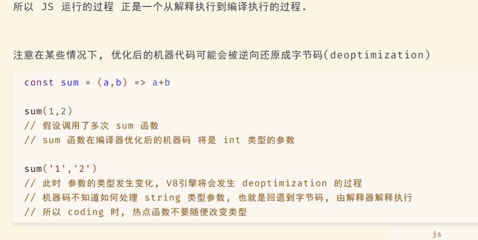
3.  

    上图的 JS 代码, 包含tc39 目前所有提案 中的特性.
4.  代码片段分享: JS 利用 Symbol.iterator 实现遍历器

    

    为什么 ES6 要给 JS 添加诸如 Python 那样的魔法函数呢..

    魔法函数: JS obj\[Symbol.属性] Python `__func__`

    C++ 运算符重载 Kotlin 后缀中缀函数表达式

    诸如此类 可以改变默认行为的特性..

    C++ 和 Kotlin 我倒是可以想象到使用场景, 当实现内部 dsl 时很有用

    但 ES6 中的各种Symbol属性 提供的自定义函数, 真是多此一举了.. 我找了很多资料, 就没发现一个有意义的demo... 都是为了用而用..

    反正 JS 莫名其妙的设计挺多的, 也不缺这一个..

    

    

    JS 完全可以借助 Proxy 实现内部 DSL! 太酷了\~

     (1).png>)
5.  快餐文分享：

    ECMAScript 双月报告：TC39 11月会议提案进度汇总

    [https://mp.weixin.qq.com/s?\_\_biz=MzI5NjM5NDQxMg==\&mid=2247488302\&idx=1\&sn=6dd21d69db461379c0be9a50929b5b63](https://mp.weixin.qq.com/s?\_\_biz=MzI5NjM5NDQxMg==\&mid=2247488302\&idx=1\&sn=6dd21d69db461379c0be9a50929b5b63)

    摘要：这次 TC39 会议是 2020 年度最后一次全员会议。这次会议中没有任何提案争取到从 Stage 2 进入 Stage 3 的共识，也没有提案从 Stage 3 进入 Stage 4。

    我喜欢 proposal-extensions 这个提案，现在的语言早就应该支持 Pointfree 特性了，就像管道似的\~
6.  [https://www.instagram.com/p/CFeevK7g6ES/?igshid=1vfezo09h0sir](https://www.instagram.com/p/CFeevK7g6ES/?igshid=1vfezo09h0sir)

    

    A: copywithin？

    B: [https://es6.ruanyifeng.com/#docs/array#%E6%95%B0%E7%BB%84%E5%AE%9E%E4%BE%8B%E7%9A%84-copyWithin](https://es6.ruanyifeng.com/#docs/array#%E6%95%B0%E7%BB%84%E5%AE%9E%E4%BE%8B%E7%9A%84-copyWithin)

    

    这个API 表示从未用过..

    C: 惊了

    B: 又是一个具有副作用的API...

    A: 好家伙

    B: 每次看到这种API 就头疼，pop,push,shift,unshift,splice,sort,copyWithin..

    我可能被函数式熏陶傻了

    C: 那用immutable.js继续嗨

    B: 哈哈，可以，全都是纯操作\[让我看看]
7.  

    A: \[让我看看]答案是 2

    B: 我和C都觉得是1, 我们答错了

    A: 这道题，确实有点问题

    B: 理解下来感觉像是 形参 被放到 arguments 对象，然后 a 指向 arguments\[0]

    A: 我回去查查资料，我越想越想不明白。

    B: 我也是瞎猜的哈哈哈

    D: 形参不是会和arguments形成映射吗

    A: 可是形参是基本类型啊，不存在引用啊。

    B: 你要是查到资料也告诉我们

    A: 就好比 const arr = \[1] const a = arr\[0] arr\[0] = 2 a === 1 => true

    B: 

    

    C: 哇 果然 但是并没有解释到底是如何互相影响的

    A: 嗯，我在查

    D: 严格模式参数不会与arguments形成映射，使用es6默认参数自动使用严格模式

    A: [https://stackoverflow.com/questions/54323086/changing-javascript-functions-parameter-value-using-arguments-array-not-working](https://stackoverflow.com/questions/54323086/changing-javascript-functions-parameter-value-using-arguments-array-not-working)

    D: 非严格模式下arguments虽然和参数是两个独立的，但是会形成映射，一个还另一个会跟着改, 对不对，A？

    A: 

    对，不过有点瑕疵。

    es6 默认参数 是一个语法特性。

    E: 我啪的一声就站起来了奥 马老师发生社么事了

    A: 你说的映射其实可以衍生出两个概念。

    第一个是 arguments 本身代表的是函数内置参数，它是一个对象，类数组。

    第二个是 不严格模式下，里面的每一个数组元素都定义了 getter setter，而这些实现都是 native code，这就是映射的底层。

    所以造成的现象是，在不严格模式时，每次读取arguments，都会代表最新\[修改后]的参数。因为 setter 会同步修改函数栈里的参数。

    而严格模式，只有 getter ，也就是最初传递进来的参数。

    A: 我在找找具体的协议规范。

    A: 学 JS 这一点 一直让我不爽，想找 native code，只能去翻 V8 源码。

    A: 

    [http://es5.github.io/#x10.6](http://es5.github.io/#x10.6)

    “映射”后面的规范标准。

    

    D: 哎呀，这大英文

    A: 跟我上面中总结的雷同，只不过我用了 getter,setter 抽象了 share 这个概念。

    A: 没事，如果真遇到 这种面试题，你说映射 以及在严格模式的差异 就行。

    A: 并且要加一句，自己的观点。

    D: 好滴，感谢A的分享

    A: 就比如，修改参数会模糊数据的流向。

    D: 模糊数据的流向是啥意思？

    A: 这个就可以说说了，有些新手没有这个意识。

    假如你解释清楚，面试就十拿九稳。

    大部分的情况下 模糊数据流的情况 就是副作用函数 和 引用类型了。

    说白了，就是 修改了一个引用数据，这就会模糊数据流。

    我觉得，面试的时候是说白话挺减分的。

    最好从更高的抽象去回答问题，让面试官 对你印象深刻。

    C: 面试能回答出这个 可能你就是ssp了

    A: 面试嘛，就是个博弈的过程，要懂得表现的机会，要懂得如何通过小动作装出来，最关键是该懂的必须懂。 面试大忌就是 直接回答问题。 一定要说清楚 问题的背景，其代表的意义，业界的探索，最后再说答案，然后加一两句个人观点。

    A: 总之就是通过表演把答案回答得更丰满，更立体。

    A: 呃，我是菜鸡，这只是我的方法，意义不大。

    C: 感觉还是看硬实力
8. 
9.  解构的妙用

    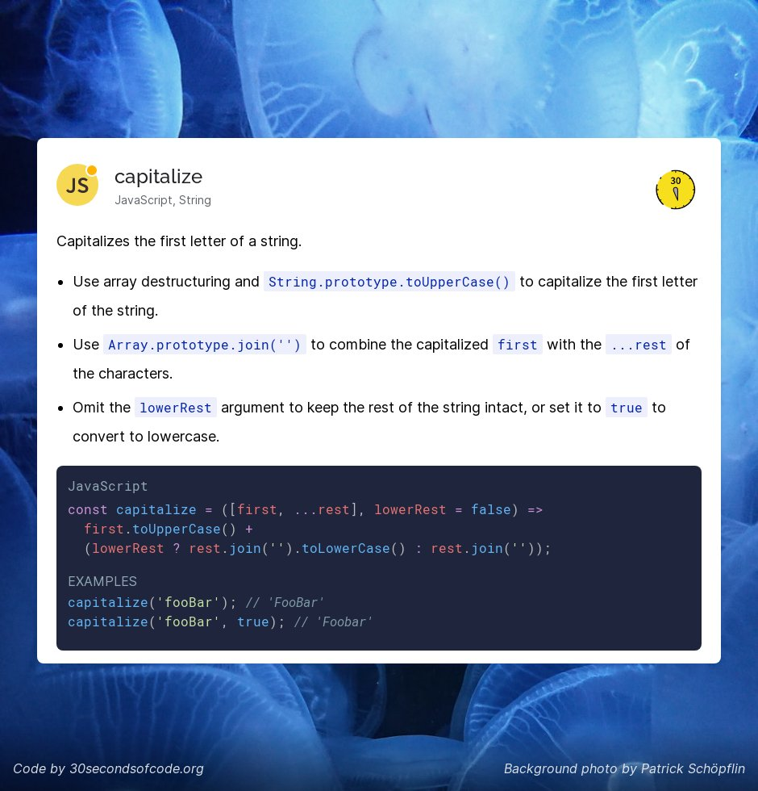
10. List of languages that compile to JS: \
    [https://github.com/jashkenas/coffeescript/wiki/List-of-languages-that-compile-to-JS](https://github.com/jashkenas/coffeescript/wiki/List-of-languages-that-compile-to-JS)

    JS 简直就是新时代的 跨平台 指令集. PS: wasm 的出现, 让编译成 JS 没有了太大意义..
11. Sorts an array of numbers, using the bucket sort algorithm. [https://www.30secondsofcode.org/js/s/bucket-sort](https://www.30secondsofcode.org/js/s/bucket-sort)

    桶排序的 JS 实现
12. 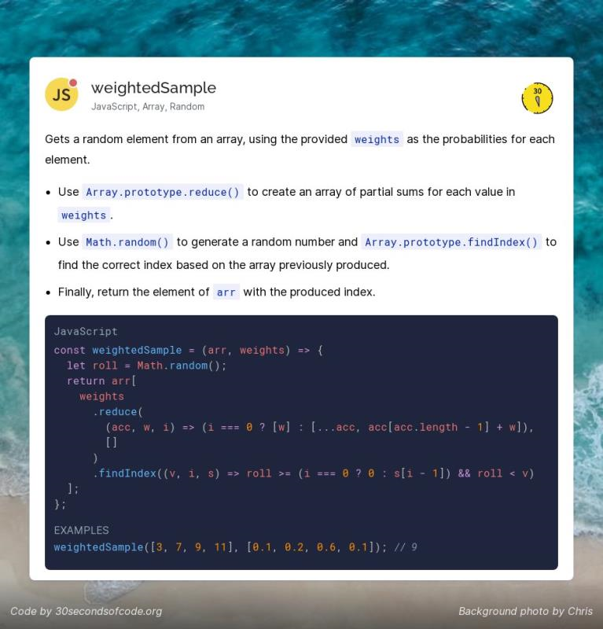

    这个 snippet 太精彩了.. 只需短短几行代码 实现加权随机样本..
13. 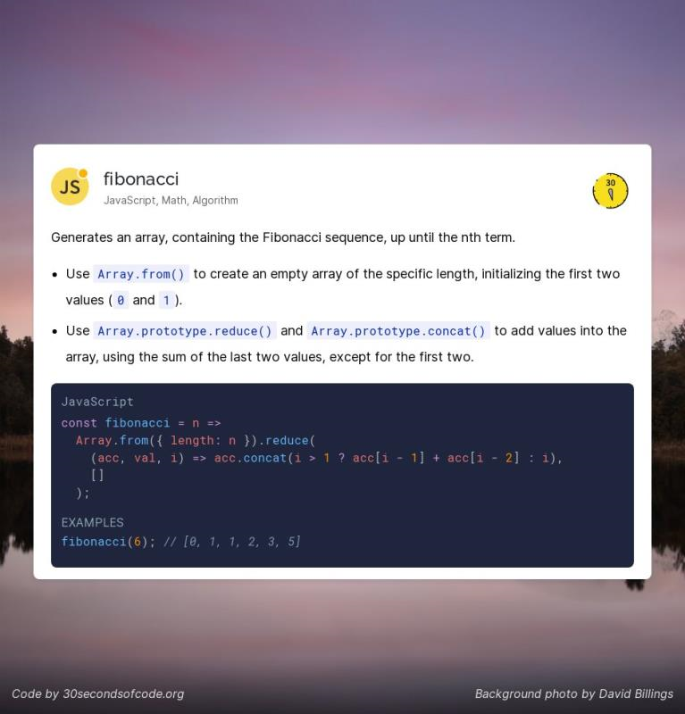
14. 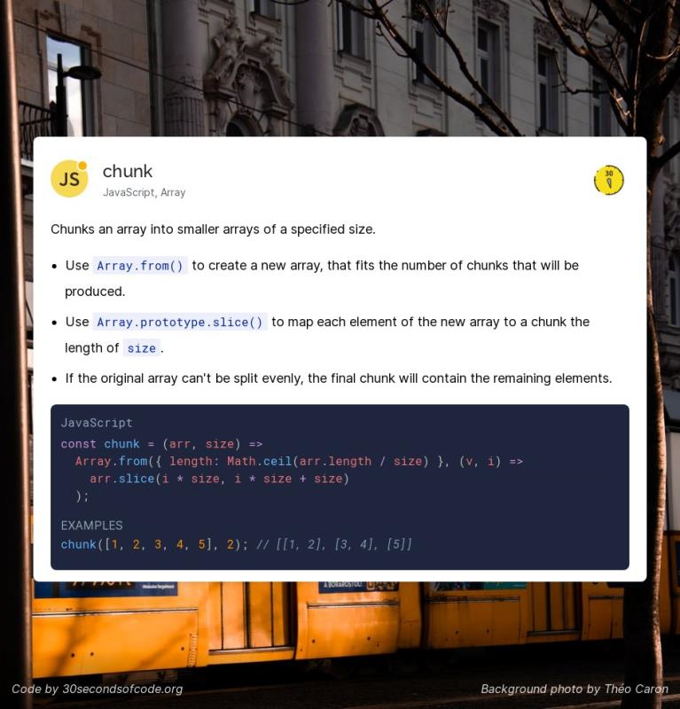
15. A: 最开始学 es6 那些新特性的时候, 我一直有个问题..

    就是 Promise.all 里面的 promise task 到底是 并发 还是并行 或者说 还是顺序执行..

    举个场景 await Promise.all(\[request1, request2, ...])

    B: 好问题 我已经停止思考了

    A: hah 和 event loop 有关

    A: 我觉得 并行是存在的 并发也是存在的 顺序执行也是存在的

    C: 我一直当并发理解的

    A: 主要看 每个 promise 在不同场景下的运行.. 需要多个维度思考..

    C: JS怎么并行啊，单线程，就跑在一个核吧

    A: 假如 promise 执行的是 一个 IO 请求, 底层会并行执行的

    并发执行 这个是 promise 的特性了 顺序执行 这个是 promise.all 的 check 机制

    A: 之前做项目 每次写 await Promise.all 我都心里不踏实,感觉跟个黑盒似的..

    现在没有.. 现在是写 css 有这种感觉.. 每次写定位 布局时, 都头大..

    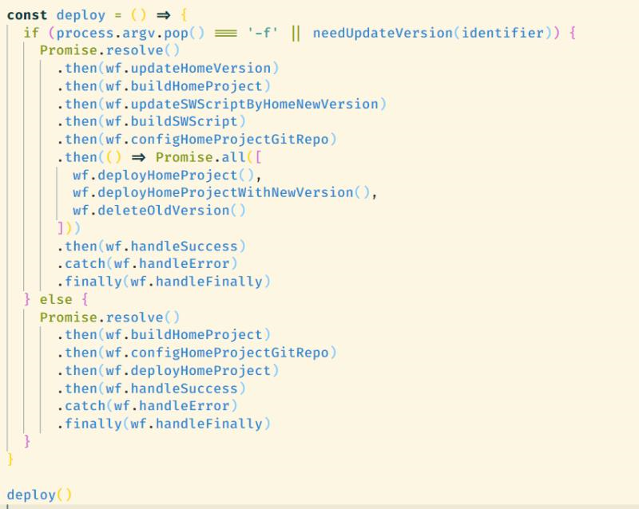

    我之前写的打包脚本, 感觉是 promise 的正确应用场景
16. 分享一个JS清单: [https://github.com/DrkSephy/es6-cheatsheet](https://github.com/DrkSephy/es6-cheatsheet)
17. 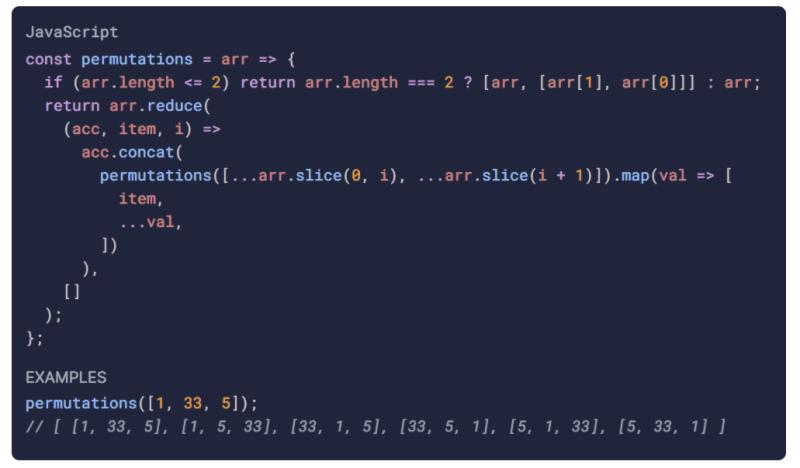

    两行代码实现全排列..
18. 快餐文分享: \
    🦸‍♂️ 11 JavaScript Tips and Tricks to Code Like A Superhero (Vol.2) [https://dev.to/orkhanjafarovr/11-javascript-tips-and-tricks-to-code-like-a-superhero-vol-2-mp6](https://dev.to/orkhanjafarovr/11-javascript-tips-and-tricks-to-code-like-a-superhero-vol-2-mp6)

    我喜欢这个片段
19. 分享个项目: \
    In-JavaScript-we-trust \
    [https://github.com/yeungon/In-JavaScript-we-trust](https://github.com/yeungon/In-JavaScript-we-trust)

    In JS we trust - The best way to learn is by building/coding and teaching. I create the challenges to help my friends learn JavaScript and in return it helps me embrace the language in much deeper level. Feel free to clone, fork and pull.

    刷了两道就不想看了, js 奇怪的特性太多了
20. 分享篇文章： \
    You-Dont-Need-Lodash-Underscore \
    [https://github.com/you-dont-need/You-Dont-Need-Lodash-Underscore](https://github.com/you-dont-need/You-Dont-Need-Lodash-Underscore)

    文章介绍了常见的 工具函数的JS实现，有兴趣的同学可以刷一下。
21. 分享个项目: \
    gpu.js \
    [https://github.com/gpujs/gpu.js](https://github.com/gpujs/gpu.js)

    GPU.js is a JavaScript Acceleration library for GPGPU (General purpose computing on GPUs) in JavaScript for Web and Node. GPU.js automatically transpiles simple JavaScript functions into shader language and compiles them so they run on your GPU.

    底层是使用的 webgl 调 gpu

    智能硬件，gpu 并行计算，这些领域都有待挖掘..
22. 好文分享:

    Future JavaScript: what is still missing? \
    [https://2ality.com/2019/01/future-js.html](https://2ality.com/2019/01/future-js.html)

    摘要: In recent years, JavaScript has grown considerably in size. This blog post explores what’s still missing. Notes: I’m only listing the missing features that I find most important. Many others are useful, but there is also a risk of adding too much. My choices are subjective. Almost everything mentioned in this blog post is on TC39’s radar. That is, it also serves as a preview of a possible future JavaScript.

    面向未来的 JavaScript 应该是什么样.

    不得不说 JS 的历史包袱太重了.
23. 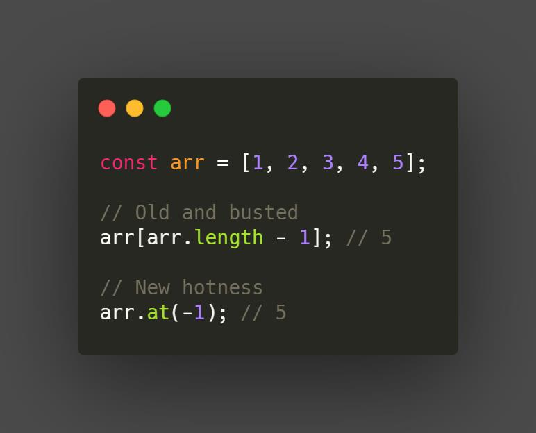

    stage 3
24. 梳理下 Promise API:
    1. Promise.allSettled (ES2020) 返回每个 promise 结果, 不管是 fulfilled 还是 rejected
    2. Promise.all (ES2015) 如果有一个 promise rejected, 则立刻返回 reject; 否则等待所有 promise fulfilled
    3. Promise.race (ES2015) 如果有一个 promise fulfilled or reject 则立刻返回, 可以用于 网络超时 你想到了嘛?
    4. Promise.any (ES2021) 如果有一个 promise fulfilled 则立刻返回
25. 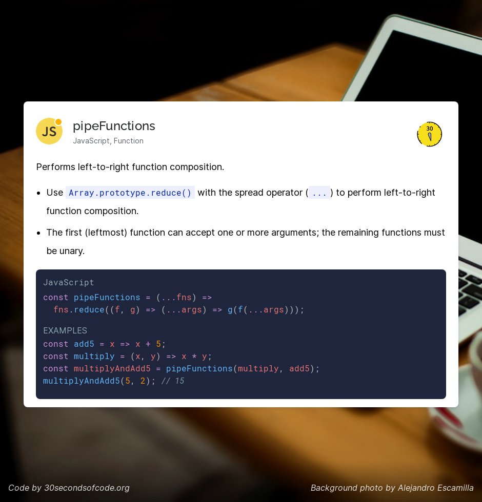
26. 你不知道的 Proxy

    [https://mp.weixin.qq.com/s/SN8HqiGA30-IJ7OZ3WMr3g](https://mp.weixin.qq.com/s/SN8HqiGA30-IJ7OZ3WMr3g)
27. 假如重新设计 JavaScript 它会是什么样的？ - 贺师俊的回答 - 知乎 [https://www.zhihu.com/question/442622908/answer/1715676739](https://www.zhihu.com/question/442622908/answer/1715676739)
28. 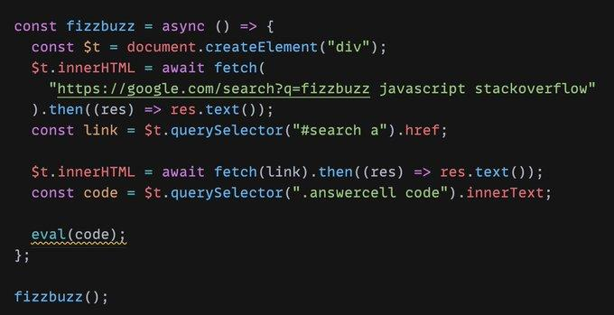

    A: 刚刚又突然想到了 惊讶系列分享中的一张图(已经分享过, 重温下思想)

    让我吃惊的是, 完全可以通过 fetch 指定 url 的内容 并设置到 innerHTML, 实现爬虫.. 在浏览器就可以跑, 什么库也不需要..

    最后 eval(code) 真的很惊艳..

    B: 恭喜你发现了 qiankun 的秘密

    A: 不过建议使用 new Function, Function 比 eval 安全性要高, 并且执行时性能也高

    B: new Function 主要不会污染全局

    A: 还有一点, new Function 仅需要处理传入的字符串一次，后面重复执行都是同一个函数，而eval需要每次都处理，性能更高

    A: 哈哈, qiankun 那个源码使用 new Proxy 代理 假window, new Function 执行代码的

    A: 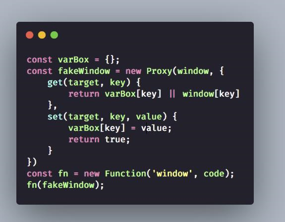

    qiankun 沙箱的核心思想... 可能有误, 烦请指正..

    B: 大体上是这样，有很多细节要小心处理 比如 fakewindow 上 freeze 的变量什么的
29. ES6 提出 class 关键字是希望解决什么问题？它是不是鸡肋？ - 大宽宽的回答 - 知乎 [https://www.zhihu.com/question/432832293/answer/1719931291](https://www.zhihu.com/question/432832293/answer/1719931291) \
    宽老师居然来飞书做架构师了..
30. 分享篇文章：

    Writing JavaScript tools in other languages – a new trend\
    [https://2ality.com/2020/10/js-plus-other-languages.html](https://2ality.com/2020/10/js-plus-other-languages.html)

    摘要：Recently, we have seen an uptick of JavaScript tools being written in languages other than JavaScript. This blog post lists a few examples and explains the appeal of not using JavaScript.
31. [https://weibo.com/1787076481/K15Zi8Xk2?type=repost](https://weibo.com/1787076481/K15Zi8Xk2?type=repost)

    JavaScript 2020 年度普查 (2) · 技术章 | 程序员黄玄 - 2020 年最受关注的技术 —— 横跨 JS 方言、前端/后端/测试框架、数据层、构建工具、桌面端移动端 App 开发方案。

    视频做的很棒，建议观感\~
32. 好文分享：

    深入理解JSCore \
    [https://tech.meituan.com/2018/08/23/deep-understanding-of-jscore.html](https://tech.meituan.com/2018/08/23/deep-understanding-of-jscore.html)
33. 快餐文分享：

    聊聊 JavaScript 的并发、异步和事件循环 \
    [https://musicfe.dev/eventloop/](https://musicfe.dev/eventloop/)

    文章涉及了一些基本的概念，可以简单看下。
34. 好文分享：

    JavaScript Promises: 9 Questions \
    [https://danlevy.net/javascript-promises-quiz/](https://danlevy.net/javascript-promises-quiz/)

    My goal is to try a new ‘quiz tool’ I built for my blog, and get feedback on how well you learned from the excercise.

    除了第一个比较特例，剩下的都正确了，文章是以题目+讲解的形式 去学习 Promise 。
35. 好文分享：

    随机数的故事 - 李银城的文章 - 知乎 \
    [https://zhuanlan.zhihu.com/p/205359984](https://zhuanlan.zhihu.com/p/205359984)

    文中涉及了一些知识，概况一下：

    1. v8 Math.random 是借助系统上的随机数能力实现的
    2. 系统上随机数 是不安全的，在大的数据量下会有特征
    3. 可以借助window.crypto.getRandomValue实现更安全的随机
    4. 真随机的实现有多重多样，文中说的 根据系统运行时的噪音生成、大气噪音、量子随机等等

​
