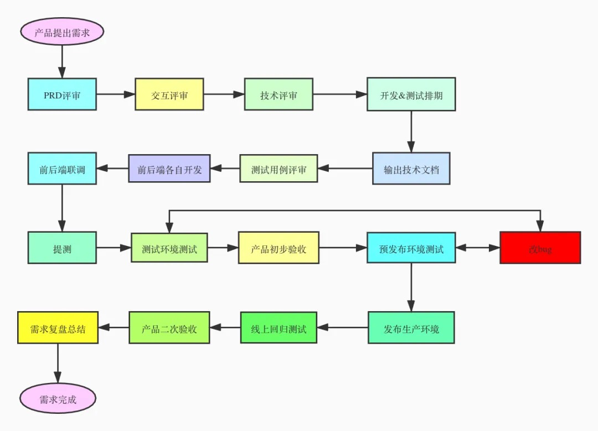
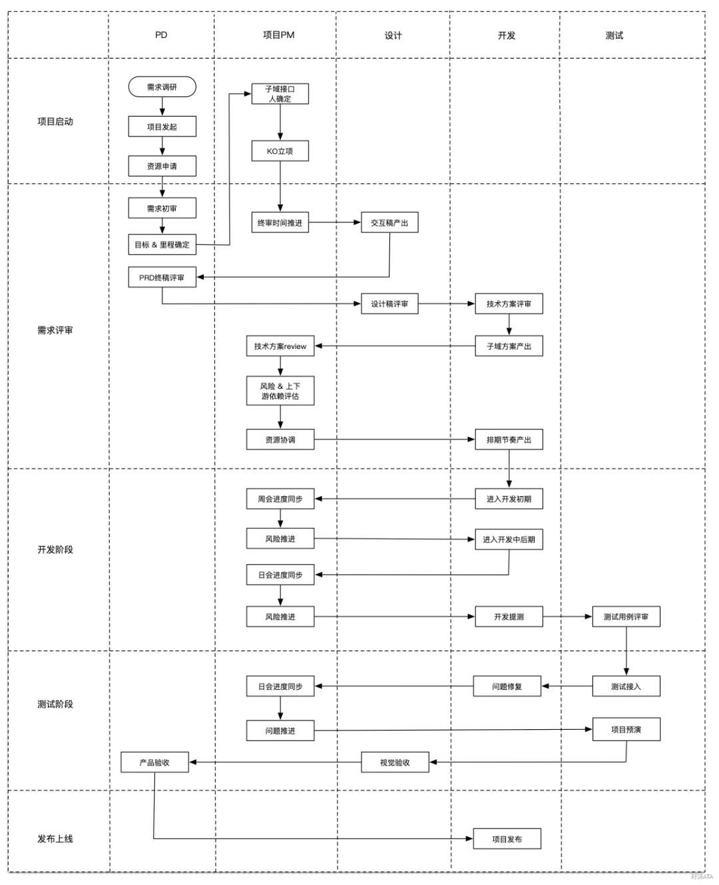

# Product

1. 分享一个推:   
   [https://twitter.com/xiqingongzi/status/1336353507167780864?s=20](https://twitter.com/xiqingongzi/status/1336353507167780864?s=20)

   开发者搞项目的一个迷思：关注技术。但除了极少数项目，绝大多数项目都不是靠技术赚钱的。更应该关注的是，产品设计、运营策略、流量来源、转化效率，技术是所有环节中最不起眼的那个。

2. 快餐文分享: 一个产品需求的研发流程是怎样的？   
   [https://mp.weixin.qq.com/s/ujfZBl9HR\_0\_FCr1Zz-SVQ](https://mp.weixin.qq.com/s/ujfZBl9HR_0_FCr1Zz-SVQ)

   

3. 分享篇文章:   
   My Bootstrapped Micro-Startup got acquired for $22k   
   [https://mohddanish.me/my-bootstrapped-micro-startup-got-acquired-for-usd22k-10](https://mohddanish.me/my-bootstrapped-micro-startup-got-acquired-for-usd22k-10)

   一个独立开发者, 在辞职后 打算开发一款 简历生成器 项目, 在此过程中 遇到了 Github 上的 PublicAPI 库 \(我之前看到这个库时, 就想利用它做点什么..\), 然后他为这个库搭建了一个可视化使用界面, 在长达 8 个月后, 他把这个产品卖了 20k 美金.. 这 8 个月中, 他又基于 twitter 上 有人发布招聘信息的场景, 开发了一款收集招聘信息的应用..

   看完这篇文章, 我又想起我之前的一个观点.. 一个产品往往都是 能看到它潜力的人 才会驱动起来, 并不一定不是发明者.

   并且很多时候信息差真的很重要, 在我 TODO 清单中一直有个条目没有实施: 利用信息差 发现可以挖掘的产品 然后借助现在营销的手段 搞点东西出来

   目前国内的最短糙快的营销平台就是 抖音了.. 我之前看过一个身边的产品落地, 就是利用网上修复老照片的服务, 然后找各种自媒体推广, 最后 将流量引导到微信中 快速盈利..

4. 分享篇文章:

   [https://medium.com/@jaf\_designer/why-product-thinking-is-the-next-big-thing-in-ux-design-ee7de959f3fe](https://medium.com/@jaf_designer/why-product-thinking-is-the-next-big-thing-in-ux-design-ee7de959f3fe)

   设计产品时，最应该关注的是 用户最基本的体验，而不是各种特性。这才是一个产品的成功之本。

5. 分享篇文章:   
   张小龙把微信8.0做成了丑八怪   
   [https://www.inneed.club/articles/detail/k3v0qw90xw](https://www.inneed.club/articles/detail/k3v0qw90xw)

   暴躁老哥从个人角度的吐槽, 说的很挺有道理的..

6. 

