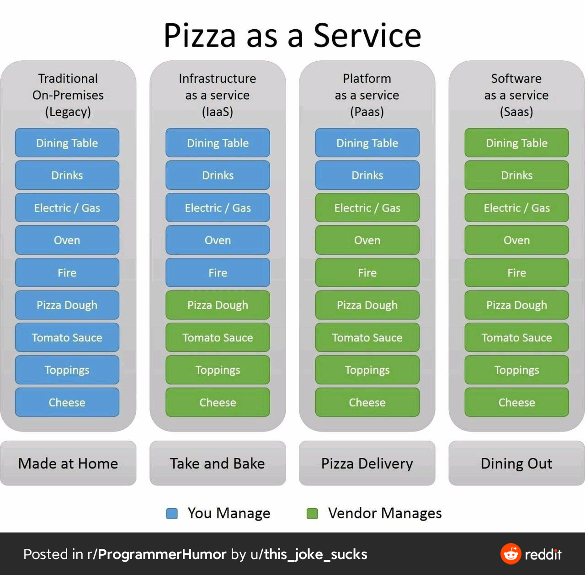

# Service

1. 漫画 \| 都是搬砖的打工人，差距怎么这么大呢？ [https://mp.weixin.qq.com/s/bUNnZxUKrktF0Wu3WGzfmw](https://mp.weixin.qq.com/s/bUNnZxUKrktF0Wu3WGzfmw)
2. 
3. MOST POPULAR BACKEND FRAMEWORKS – 2012/2020

   [https://www.statisticsanddata.org/most-popular-backend-frameworks/](https://www.statisticsanddata.org/most-popular-backend-frameworks/)

   相比于国内 Java php，国外的服务端 选择多得多

4. 常见的负载均衡实现场景:

   1. DNS 层面
   2. 服务层面 负载均衡服务器, 比如 Nginx
   3. 硬件层面 , 比如 F5

   Load Balancers have different strategies for distributing the load across a set of backends.

   1. Round Robin Distribute load equally, assumes all backends have the same processing power.
   2. Weighted Round Robin Additional weights can be given considering the backend’s processing power.
   3. Least Connections Load is distributed to the servers with least active connections.

