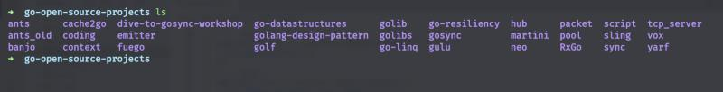
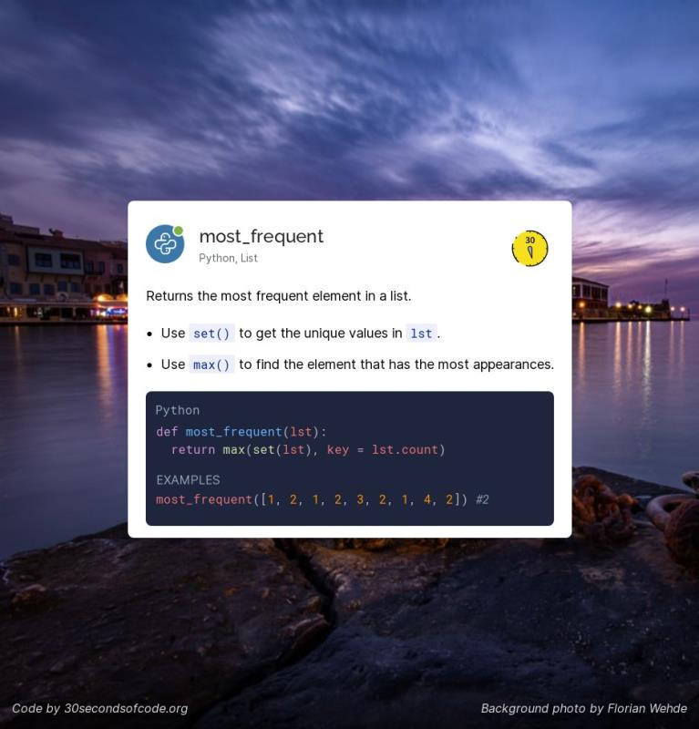
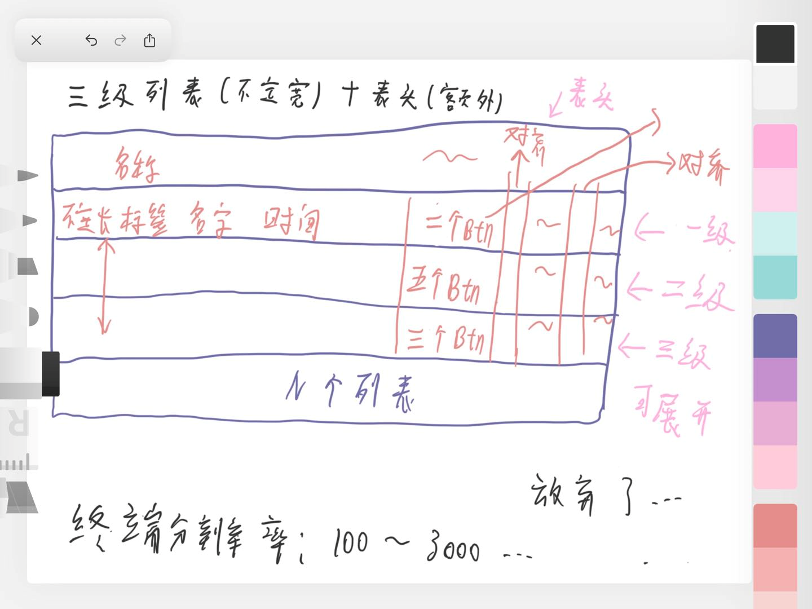
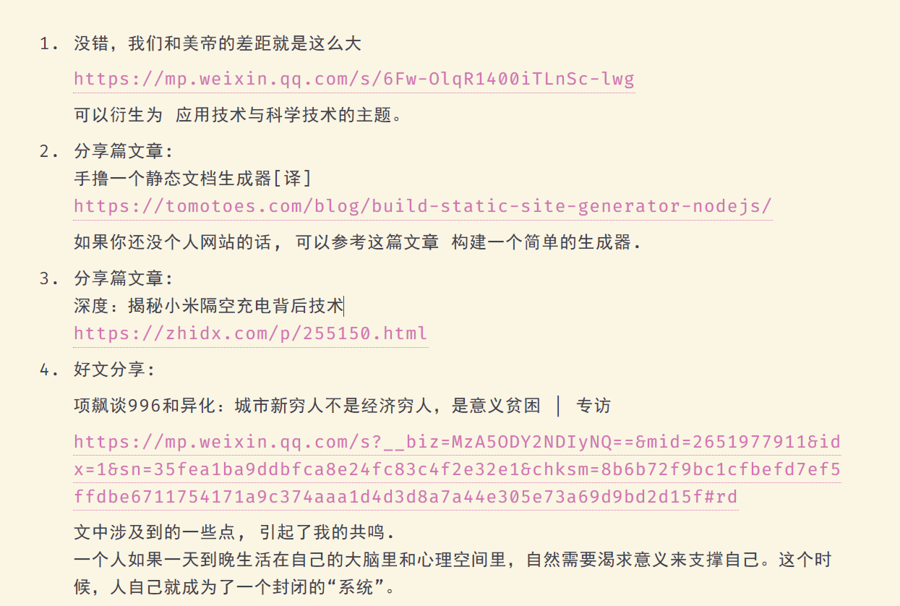

# Talk

1. Q: 好像很多编程语言都有hooks hooks是干啥的啊

   A: 呃，react 的hooks 和你常见的hook 并不是一种概念.

   一个是 事件监听的钩子，就好比 观察者模式； 一个是 生命周期的钩子，就好比 Servlet 中的 destroy 方法。

   钩子这种概念不仅存在于 应用层，像底层的 epoll io机制，事件循环 都有相似的概念。

   说白了 hook 就是暴漏给你的signal

   顾名思义，钩子嘛..

   Q: 他是做什么的呢

   A: 它暴漏给你一些入口， 你把逻辑注入进去， 等到合适时机 执行你的逻辑。时机啊，入口啊 这些设计可是很讲究 抽象能力的。

2. Q: 我看lamda表达式可读性也挺差 是不是不习惯的原因

   A: 其实 lambda 表达式 是最贴近数学函数的表达形式...

   java 中的 lambda 设计的很有趣, 后端的原理 是使用 函数接口 加匿名类, 而前端的改成了 \(parameters\) -&gt; expression..

   颇有 函数第一成员的感觉 但是 实际用起来 还是挺多限制的..

   不过还好了, java 能做出这种转变 已经很不错了..

   我最讨厌的lambda设计 就是python..

3. 刚刚A了一道题, 挺有意思的

   已有方法 rand7 可生成 1 到 7 范围内的均匀随机整数，试写一个方法 rand10 生成 1 到 10 范围内的均匀随机整数。不要使用系统的 Math.random\(\) 方法。

   [https://leetcode-cn.com/problems/implement-rand10-using-rand7/](https://leetcode-cn.com/problems/implement-rand10-using-rand7/)

   我的思路是 实现 rand5 与 rand2..

   rand2 代表的是一种对立布尔状态, rand5 则是 1-5 随机数 如果 rand2 === 1 那么就 返回 rand5, 否则就 5 + rand5

   

4. A:Kotlin 她真的太美了。

   B:\[翻白眼\]kotlin 也能在jvm上跑是不是

   A:当然

   B:java凉了 jvm都凉不了

   A:Kotlin scala groovy都是以jvm为后端的语言

   Jvm 是一个编程语言的后端～

   除了jvm 还有 llvm 都是很强大的工具。

   现在设计一门语言，只需要搞定前端就可以，也就是编程语言的语法特性。后端有太多的选择。

   B:都是用c++写的吗

   A:刚开始都是c系列

   现在jvm应该自举了吧

   我不清楚

   我查下哈

   Java 平台中的 JVM 和 .Net 平台下的 CLR 分别是用什么语言写的？ - RednaxelaFX的回答 - 知乎 [https://www.zhihu.com/question/20163831/answer/18629722](https://www.zhihu.com/question/20163831/answer/18629722)

   Hotspot 是c系列

   其他jvm就不用看了

   我喜欢kotlin与go，看到她们的代码，打心底里兴奋。

   JS ruby c\# 也有jvm的版本，哈哈

5. 无意间刷到了篇垃圾文章, 真是被恶心到了..

   

   如此妖魔化的产物 说成 中国在世界上的科技创新...

   正是因为这些巨头, 这些傻X产物, 让国内的互联网不再互联.

   现在国内的互联网就是一个个孤岛..只知道增强壁垒, 吸引流量, 他们应有的责任义务 早抛掷脑后了..

6. 代码片段分享: JS 利用 Symbol.iterator 实现遍历器

   

   为什么 ES6 要给 JS 添加诸如 Python 那样的魔法函数呢..

   魔法函数: JS obj\[Symbol.属性\] Python `__func__`

   C++ 运算符重载 Kotlin 后缀中缀函数表达式

   诸如此类 可以改变默认行为的特性..

   C++ 和 Kotlin 我倒是可以想象到使用场景, 当实现内部 dsl 时很有用

   但 ES6 中的各种Symbol属性 提供的自定义函数, 真是多此一举了.. 我找了很多资料, 就没发现一个有意义的demo... 都是为了用而用..

   反正 JS 莫名其妙的设计挺多的, 也不缺这一个..

   

   

   JS 完全可以借助 Proxy 实现内部DSL! 太酷了~

   

7. A: 大佬们都是用什么来写博客的，readme？

   B: 

   更新下，现在所以的子项目都是用 react 了。

   我不看重 网站访问速度，日活，SEO权重，所以不一定符合你需求。

8. A: 大佬有在学 haskell 吗？

   C: 哈哈，之前有学过一点

   B: 我发现大佬发的好多梗 知乎上都看过（ 不会关注的都是同一批人吧

   C: 我知乎玩了很多年了，现在关注了近700名前辈\[让我看看\] [https://www.zhihu.com/people/simonma-87](https://www.zhihu.com/people/simonma-87) 这是我的知乎，只吸收 从不输出.. 之前每次想输出时，都会很在意每一个答案 每一个评论，慢慢得变成一种心智负担，索性 不输出了..

   A: 哈哈 关注了！

   A: 我之前也在学，然后去实习就停了。。看的这个教程 [http://learnyouahaskell.com/](http://learnyouahaskell.com/)

   C: 巧了，一样 我看的是纸质的趣学指南~

9. A: ts枚举可以约束值的选项吗？

   B: type Number = 1 \| 2 \| 3 \| 4 ...

   A: 

   可选的不是1，2，3 为啥赋值为5还可以啊?

   B: 你对枚举理解错了 你需要 literal type 去约束值 枚举并不是去约束取值的

   A: 那他是干嘛的呀？

   B: 枚举主要代表的是 状态的集合

   ```typescript
   enum Week {
     Monday 
     Tuesday 
     Wednesday 
     ...
   }
   ```

   就像是这样 我知道你现在的迷惑 我想想怎么解释哈...

   A: 好

   B: 你现在不明白的是 状态 与 值 之间的关系...

   A: 不明白上面那个代码为啥不报错

   B: 呃... 是这样的 我在本地复现了, ts 确实没有检测出来, 之所以没有检测 也情有可原, 枚举没有这么使用的...

   一般都是 变量 = Enum.member 而不是等于一个值常量...

   A: 嗷嗷，这样啊

   B: 因为枚举代表的是 状态的集合, 而每个状态 只要有一个 unique 值就好了...

   就好比 给你一个 HTTPStatusCode 算了 给你写下伪代码吧, 这就是枚举平时的用法

   

10. A: 我想用 数组的 length 生成一个 union type，比如 length = 4 -&gt; type N = 0 \| 1 \| 2 \| 3，这样有可能吗？

    B: 我有一个绝妙的想法 吃完饭验证一下

    A: 哈哈哈好！

    C: 我看看..

    D: **我也想看哈哈**

    B:

    ```typescript
    type Rua<Arr> = Exclude<keyof Arr, keyof (typeof [])>

    type A = Rua<[1,2,3]>
    ```

    能生成 字符串的union

    A: `type ArrIndex<Arr> = Exclude<keyof Arr, keyof any[]>;`

    C: 受教了~ 这个思路 牛批~

11. 发现了个有趣的项目 [https://github.com/itorr/e/blob/master/index.html](https://github.com/itorr/e/blob/master/index.html)

    A: hah 中文编程又前进了一大步

    B: 哈哈哈 我在公司代码还看到了用中文做变量名的 简直惊了

    A: 没有 review 与 规范嘛... 这我不能接受..

    A: 果然 中文编程是未来趋势

    C: 易语言申请出战

    A: 易语言 永远滴神~

    A: 文言文編程語言 [https://github.com/wenyan-lang/wenyan](https://github.com/wenyan-lang/wenyan)

    

    B: woc 好牛逼hhh

    A: 东北方言编程语言 [https://github.com/zhanyong-wan/dongbei](https://github.com/zhanyong-wan/dongbei)

    issue区笑死我了 完犊子了 == throw error

    B: 哈哈哈 不过我觉得这个和我们母语有关，毕竟不是出生就看英文的，还是习惯用中文翻译一遍hhh

12. Question: React fiber 为了在浏览器环境 做到时间分，片机制 增量渲染，底层借助的 API 是什么？

    Answer: 不是 requestAnimationFrame, 也不是 setTimeout, 是 MessageChannel + postMessage

    

    可以看下 上面这张图, 这个相当于简化版本的 react 调度机制实现.

    如果浏览器兼容 MessageChannel\(宏任务\) 就使用它 来做异步, 否则粗暴点 使用 setTimeout\(宏任务\)

    之所以使用 MessageChannel + postMessage , 而不是 requestAnimationFrame, requestIdleCallback, setTimeout..

    我还需要在找找具体原因...

    我想起来了, 之前看过一篇文章

    1. requestAnimationFrame 如果一帧之内没有剩余时间, 则留到下一帧调用
    2. requestIdleCallback 使用在浏览器空闲时才 调用, 这样会造成 渲染单元一直得不到调用
    3. setTimeout 懂得都懂..

    找到了一个合适的回答,之所有使用 MessageChannel 做异步机制, 除了上面 API 的缺点外, 它本身的优点在于: onmessage的回调函数的调用时机是在一帧的paint完成之后。react scheduler内部正是利用了这一点来在一帧渲染结束后的剩余时间来执行任务的  
    好像 Vue 中的 nextTick 底层使用的异步机制 也是 MessageChannel

    我刚刚查了一下 nextTick 先检测是否原生支持Promise，不⽀持的话再去检测是否支持MutationObserver，如果都不行就只能尝试宏任务实现，首先是setImmediate，这是⼀个⾼版本 IE 和 Edge 才支持的特性，如果都不支持的话最后就会降级为 setTimeout。

    ~~这个问题就挺有趣的.. React 的异步是 MessageChannel 宏任务 , Vue 的nextTick 使用的 微任务 , 为什么呢...~~  
    Vue 的渲染机制 是通过 Proxy 来实现 细粒度更新的... 它并不需要 微任务.. 只是 Vue nextTick 这个场景下需要..

13. A: 我到字节 最好奇的就是 有很多很多同事 的开发环境 就是使用 mac + 触控板.. 我坚持了一周, 各种效率软件 魔改快捷方式软件 都试过了.. 撑不下去了..

    B: 哈哈哈我也觉得很顺手啊 是时候分享一波你的魔法操作了

    A: 好吧.. 可能 我在 Windows 上的环境 太高效了.. 这点我到没有夸张..

    我除了 各种新知识, 最喜欢探索的 就是 和电脑的交互方式了..

    我平时使用最多的是 WGesture + Chrome 下的 Vimium, crx Mouse Gesture + Seer + uTools + QTTabber + 罗技鼠标宏 + 自己写的 AHK 模拟鼠标脚本..

    对了 主要离不开 wsl2

    C: 推荐用quicker 感觉比utool好用点

    A: 那个 一直被各路推, 我也试了很多次, 找不到解决痛点所在...

    C: 我看到测评m1芯片的出来了，性能好像很强悍，自家os优化贼好，很想换，又舍不得在win辛辛苦苦优化的工作流程

    A: no no no, arm 架构 现在生态还没站住脚呢..

    C: 那估计刚出 恰饭的比较多

14. 

    Kotlin 1.4 新推出了一个关键字 tailrec , 可以使用它 去主动编译优化 尾调用的函数. [https://twitter.com/kotlin/status/1341749661175066624?s=20](https://twitter.com/kotlin/status/1341749661175066624?s=20)

    先不提尾调用是什么, 就说说 都 2020 年了, 现代的编译器还做不到 主动优化尾调用嘛.. \(V8 做到了,但因为一些问题 不敢主动开启\)

    这个关键字很破环我对 Kotlin 的印象..

    它就和 C++ 中的 inline, volatile 代表的性质一样... 这些关键字的出现 是为了弥补 底层设计的缺陷... 之所以 C++ 的定位是偏底层语言, 就因为 它的语法特性 就离不开操作系统那些概念..

    而一个优秀 现代的编程语言 是不应该为用户增加此心智负担的.

    A: kotlin也有inline 还有refied这种类型擦除后再生 给Java擦屁股

15. Question: 如何在浏览器环境 实现 sleep 函数, 可以给出 异步函数, 同步函数 两种实现方案吗?

    

    Question: 当我执行 同步 sleep 函数,比如 sleepBySync\(9e9\), 这个时候浏览器 tab 会怎样?

    A: 9e9有点大了。。

    B: hahah 随意啦 也可以 9\_000\_000\_000

    A: 页面啥交互的操作都无效吧

    B: 是的. tab 直接假死..

    A: 异步的这个使用场景是啥呀

    B: 最简单的就是 mock 网络请求过程..

    B: 那假设是在 react支持 concurrent 版本中, 一个事件 里面调用 sleepBySync\(9e9\), 那页面还会卡死吗

    其实 promise 最有趣的 resolve, reject 这两个函数了, 我一直把他们理解为 异步环境下的 "PV"原语

    可以 把resolve, reject 传到其他异步场景中, 再调用..

    就好比 手动 join 下其他线程, 或者 发出个信号 这样

    C: 好理解

    B: 我根据刚刚的讨论 以及我对 promise 的理解, 写了个限制网络请求数量的demo

    C: 我面字节就考的这个 没答出来

    B: 

    超过限制的request, 会将 resolve 传到了 全局, 等到 resolve 被消费 才会执行\(await\), 已经完成的 网络请求 会按照顺序消耗 resolve 信号.

    典型的 "PV"原语...

    D: 咦，这个我能听懂

    B: 现在 并发方案 业界, 学术界有挺多不同的模式了..

    就比如 上午我说 ruby3 引进的 actor-model, 还有 golang 的 csp, 以及函数式宗教信奉的通过编程范式 去天然引进并发..

    B: 以下来自我之前的一条微博:

    CSP 模型 和 Actor 模型, 具有相同的设计理念: 通过通信来实现共享内存，而不是用共享内存来实现通信。

    然而它们的侧重点不同，Actor 关心通信的实体（对 OOP 更加友好），CSP关心通信的工具。 如果要选其一的话，我更加欣赏 CSP模型。

    假设通信的数据，可以自我实现状态管理，这样一来就不会被通信双方所约束，消息传递的过程 就可以增加更多的抽象。 目前，业界的 CSP 代表 Golang 结合 Context 包已经实现了这一点。

    C: 但是像JS这样的单线程语言，感觉玩不出多少花样来

    B: 对啊.. 撑死就是借用下 异步 api, 去模拟下 fiber 了...

    谁叫 js 天生单线程呢..

16. A: 我说我的网站怎么日活超5k了..

    原来是被人扫描了..

    

    hah 对方一看就是个 新手

    B: 这啥后台啊

    A: Google Analytics 我只接入了 Google tag manager

    如果接 国内的服务, 可以明确查看到 ip 信息的

    就比如百度站长 完全可以.. 但是国内服务 我很排斥..

    除了 我的微博点赞 使用的是 leancloud 国际版, 其他的服务就没有国内的了

    B: 我今天给你微博点赞了 看得到不？

    A: hah 当然

    B: 能看到点赞人的信息吗？

    A: 你觉得呢...

    

    B: 对的我还看了这个请求。。。没看懂

    A: 点赞信息 只是一个简单的kv store, 存储的地方是 leancloud

    k 就是每一条微博的 ID, v 就是微博点赞的数量 hh

    B: 了解了hhh

    A: 我是一直想开源的, 但我觉得 有这需求的人 好像都没几个..

17. 前端Question: 如何判断一个函数 是箭头函数 还是 function 定义的函数.

    答案是 箭头函数是没有原型链的, 也就是 prototype 属性为空

    还有一种方式，箭头函数无法实例化，可以 在try catch 中 new func\(\) 捕获异常，有异常就是箭头函数

18. A: 我在reddit看大部分程序员都觉得 pm 码不会打几个 还事多 B: 哈哈，思想不一样吧。他们可能只是把工作当做了工作。程序员除了技术，最重要的能力就是业务能力，产品能力了。 B: 我的思想转变, 除了自己的工作外 离不开一系列文章, 其中最典型的, 对我启发最大的 就是 于江水前辈 写的 我在淘宝做前端的这三年 的三篇了.[https://zhuanlan.zhihu.com/p/55272391](https://zhuanlan.zhihu.com/p/55272391)  其中有句话一直影响着我. 业务能力应该是程序员除了技术之外，最具价值的能力，也是最必要的。 因为技术本身很难赚钱，业务落地才能赚钱。 当程序员具备了业务和产品能力，才可能选取业务和技术的折中点，又快又好的支撑业务，带来价值和效益。 懂产品和业务（甚至交互设计）的技术，更容易跟其他工种进行沟通，用通俗易懂的方式介绍技术实现和难度，可以提升在企业中的自身地位和价值。 此外，对于架构师，理解业务也是必备能力。 A: 嗯...业务能力可能是每个合格打工人的一个必备条件吧 这个时代需要的是跨专业的人才 B: 是的, 需要的是 通才..  其实 我认识很多同学有一个通病.. 就是给自己设边界.. 
19. A: 现在的计算机 应用层 还是有不少潜力的.. 但是底层 沉淀下的基础设施, 很难改变了..  
    就比如 http3, 现在一直没有推广开发..  
    B: 等一波什么量子计算机出现  
    A: 量子计算机 最大的痛点 除了学术上, 还有一点不可忽视, 普通人用不起那东西的.. 只能等 物理 化学届的新突破了.. 之前的计算机划时代的晶体管时代 也是 这样过来的...  
    B: 不是出来个什么 “以氮化镓、碳化硅为代表的第三代半导体”

    A: 现在 web 智能化 是一个新方向啊..  我听说 去年 双 11 淘宝的活动页 有 79% 都是机器生成的..  
    B: 再过十几年AI是不是要侵占地球了hhh  
    A: 现在各个公司都有相应的智能化的产品落地了  
    那想多了 现在 ai 只是 ai, 只是数学拟合  
    如果真正想成为 人工 智能, 那前提条件是 人类把自己研究明白透彻 还可以.. 就比如 人脑科学..  
    之前看马斯克的脑机接口项目, 完全可以与 人体 API 相交互, 太酷了  
    具体的原理是, 大脑中的芯片 解码 神经中的电信号, 然后 在通过 应用层协议 与 外部相交互.. 关键 就在于 识别电信号了..  
    假如说真有 人体 API 就好了... 我会强制让自己跑个 10 公里的, hahah  
    B: 人体api假如真出来 可能是全网最长了hh  
    C: 怕不是到时候出来一堆伦理问题  
    A: 我在想 如果用 linux POSIX API 的设计标准 来设计的话, 那一定很有趣.. 每一次 action 都是一个 进程的 fork , 每次 拉屎 都是 一次 GC..

20. A: Java 中的 Object TypeScript 中的 any C++/C 中的 void \* Go 中的 interface{} Kotlin 中的 Any ...

    好多编程语言, 不管静态类型, 动态类型 都提供了 "Any" 类型..

    B: 这些更像是对应ts中的unknown吧 Java的object变量 o，你可以使用o.a访问a成员吗 好像不行吧

    A: 是的 但是 unknown 变量不能向下转型 any 是可以的

21. A: 写 Java 感觉重载这个概念很棒   
    B: 其实我感觉重载有时候没啥必要

    A: 面向对象的设计好像 离不开重载

    C: 重载是 是设计者的妥协.. 如果一个功能 有多次重载, 多种签名.. 那么这个功能设计的就是有问题..   
    PS: 在绝大数场景下

22. A: 今天听到一种观点: 说做业务的程序员，技术能力的要求 都很低。

    B: “观点”是别人的

    C: 要做好业务也不容易

    A: 嗯，是的。

    C: 说到底技术是用服务于业务的

    A: 其实我很认同这个观点.. 在很多场景下，做业务等于在应用层开发..

    C: 是啊 天天写业务代码 也顶不住啊

    B: 嗯嗯 会麻木的哈哈哈

    A: 我在想，我目前属不属于互联网时代红利.. 只要学一点基本技术，就可以进大厂

     可能有点妄自菲薄吧..

    C: 不会啊

    B: 不会啊 每个人的追求和目标不一样嘛 想法也不一样

    D: 看到拼多多猝死员工新闻时，大家都说是拿命换钱，可是在中国很多人连这个机会都没有，但如果猝死这件事情万一真的发生在自己身上，那些人可能又会觉得命重要一点了吧

    C: 哎 保命要紧

    E: 在资本家的领导下 何谈理想

    F: 当大家习惯了996 那007也快来了吧

23. 

    A: 无言以对.. 国人的 github trending 一个开源的技术项目没有... B: 茅台抢购哈哈哈 C: ...我对面的今儿早上说茅台抢购,说的原来是这玩意儿 A: 这算不算技术作恶 违法是肯定的了 我看了下 源码, 就是简单的爬虫... 连个 IP 池都没提供... 京东风控 怎么搞得... 这不分分钟封掉.. 现在 拼多多的 安全准则就是 宁可误杀 也不让薅羊毛 京东真是好兄弟啊

24. 补充下 我今天提的微内核的概念.. 在微内核设计背后的思想是，为了实现高可靠性，将操作系统划分成小的、良好定义的模块，只有其中一个模块——微内核——运行在内核态上，其余的模块，由于功能相对弱些，则作为普通用户进程运行。特别地，由于把每个设备驱动和文件系统分别作为普通用户进程，这些模块中的错误虽然会使这些模块崩溃，但是不会使得整个系统死机。 这个微是真的没发展起来. 微服务是发展起来了.. 但是我觉得 它只不过是对 多个资源的一种使用规范..
25. C: 分享一个收益良多的 Goruntine Pool 库 [https://github.com/panjf2000/ants/](https://github.com/panjf2000/ants/)

    里面的源码质量很高, 并且能从 协程池的工作流程 学到池化的精髓..

    

    当时学 Go 的时候, 真的看了好多库的源码..

    在这期间, 我学到了 很多底层的知识 以及网络的知识..

    A: 好奇一下 马老师为什么不去搞后端开发呢？

    C: 其中有个库挺让我印象深刻的 [https://github.com/nsheremet/banjo](https://github.com/nsheremet/banjo) 它是一个 web 框架.. 但它的底层实现 是 tcp 监听路由, 然后 解析 成 http message 格式..

    因为在学完 Go 之后, 我又学了 Java Kotlin .. 我当时眼光很局限, 觉得 Go 在国内没有大厂生态..

    然后就开始准备考研了..

    放弃考研后.. 发现前端真的太容易找工作...

    B: 感觉现在的前端很热门呀

    C: 当然了, 前端现在生态混乱.. 还没有陷入平衡 再加上 各种终端, 移动端的发力, 前端的人才需求 太大了.. 其实 我也挺后悔没有 继续坚持走 服务端的..

    主要是因为 自己从来就没有一个规划吧..

    B: 前端也能把后端的事给干了

    C: 还是看产品定位吧..

    之前大二我开发一个 "JS全栈" 项目时, 也觉得 自己成为了一个"全栈工程师"..

    现在想想 挺幼稚的.. Nodejs 也好 Deno 也罢.. 它们只适用于 IO **密集的引用**

    这和它们底层的event listener 脱不了关系

    我最喜欢 前端的一点, 就是它在大部分产品下, 最贴近业务了..

    当然 很多业务是没有意义了...

26. A: 碎片时间应该干嘛好呢.. 我感觉不能很好的利用起来..

    很多时候 我都是在 信息流中 去寻找 对我有价值的东西文章.. 我觉得效率很低..

    B: 对我来说信息太多了，有用的没用的适合的不适合的冗余都在一起了，分辨也需要时间

    A: 是的, 我目前 常常遇到这个场景..

    B: 怎么解啊

    A: 别看在群里经常分享 文章... 其实每一篇文章 都很难得的..

    感觉 得换换方式..

    B: 确实都是好文，虽然有些看不懂

    A: 是我的问题.. 知识无法下沉.. 自从建群以来 就一直存在这个问题..

    B: 没，没觉得有啥 多学学总没有坏处 是我的问题

    A: 并且方向对后端同学也不友好..

    C: 不是马老师的问题 是我们太菜了

    A: 别别别 别这样..

    B: 其实我觉得挺好的 为以后打基础

    C: 马老师发的后端内容也不少吧哈哈哈

    B: 挺多的也

    A: 不是的.. 我发的大部分都是 架构.. 中间件.. 分布式理论..

    我觉得真正应该有利的信息 是 spring 某一中间件的一些配置文章

    但我不感冒

    B: 我觉得挺好的，对我来说

    C: 我也觉得挺好的

    D: 我是挑自己感兴趣的看看hhh

    B: 我是挑我看的懂的去看

    A: 其实还有一事.. 从来没说过..

    B: 啥事呀

    A: 我会把群里的一些讨论 上传到 思考的价值站点 但放心, 从来没透漏过 真实的信息, 从来没有涉及到隐私

    所有的聊天信息 人称 都是 以 字母为代号.. 比如 我一会是 A 一会是 B 这样.. [https://thinking.tomotoes.com/tags/talk](https://thinking.tomotoes.com/tags/talk)

    D: 手动录入吗

    A: 是的.. 所以说 我整理元旦的三天消息 整理了一小时.. 但是 只录入 有价值的..

27. 

    A: Py API 设计的真是糟糕, 这短短两行代码, 做的事情全都隐藏起来了 反而给开发者增加了心智负担

    B: 。。list 原来还有 count？

    A: 不清楚, py 很久没接触了

    B: +1

    C: 惊了

    A: 我最讨厌的两门语言 php py

    B: 哈哈哈哈

    C: 真要说，JS的api不是更糟糕吗

    A: 何以见得呢..

    C: 就比如这个array.from

    A: 怎么了..

    B: array from 挺好用的我觉得哈哈哈

    C: new Array\(n\)才是最符合直觉的 然而。。

    A: 我不能接受这种命令式的声明.. 违背 pointfree 原则..

    py 的 API 设计 我看到头大, 除了 那个生成式的特性, 以及一些语法上的特性 就比 10 &lt;= a &lt;=12, 切片.. 好像也什么我喜欢的了..

    C: py除了lambda只能写一行，我觉得都还行吧（

    B: 可以直接 Array\(n\) 啊

    A: 这样我觉得更不好..

    B: 那你喜欢啥样的

    A: Array.from

    B: ...... 传啥参数呢

    A: Array.from\({length: n}, \(\) =&gt; initialValue\)

    `const range = (start,end) => Array.from({length: end-start}, (_,i) => start + i)`

    A: 关于 range 我最喜欢的就是 go 与 Haskell 可以生成无限自然数的数列了..

    并且还是懒调用 还不会影响 performance

    C: JS用generator也行吧

    A: 可以的.. 支持 迭代器特性 语言应该都可以

28. A: 最开始学 es6 那些新特性的时候, 我一直有个问题..

    就是 Promise.all 里面的 promise task 到底是 并发 还是并行 或者说 还是顺序执行..

    举个场景 await Promise.all\(\[request1, request2, ...\]\)

    B: 好问题 我已经停止思考了

    A: hah 和 event loop 有关

    A: 我觉得 并行是存在的 并发也是存在的 顺序执行也是存在的

    C: 我一直当并发理解的

    A: 主要看 每个 promise 在不同场景下的运行.. 需要多个维度思考..

    C: JS怎么并行啊，单线程，就跑在一个核吧

    A: 假如 promise 执行的是 一个 IO 请求, 底层会并行执行的

    并发执行 这个是 promise 的特性了 顺序执行 这个是 promise.all 的 check 机制

    A: 之前做项目 每次写 await Promise.all 我都心里不踏实,感觉跟个黑盒似的..

    现在没有.. 现在是写 css 有这种感觉.. 每次写定位 布局时, 都头大..

    

    我之前写的打包脚本, 感觉是 promise 的正确应用场景

29. 分享个问题: A: RPC 位于 ISO 第几层？ 与HTTP , TCP是什么关系？

    B: 和tcp在同一层？

    A: No... 它也是个应用层协议..

    C: 我理解也是应用层的 服务之间调用

    B: 基于tcp的应用层协议 这样可以满分吗 马老师

    A: No.. over TCP or UDP

30. A: 发现了个有趣的知识: 熵增定律—热力学第二定律 是唯一区分过去和未来的基本物理定律。其他物理定律在时间上都是可逆的。

    B: 巧了 吃饭的时候正在想熵增这个事

    C: 魔法少女小圆好像就是基于这个定律讲故事

    D: 神作 快去看

    A: 啊哦，这么高能的番剧嘛.. 我一直很好奇，信息熵增的事情。

    B: 怎么？ 也是表示混乱程度嘛

    A: 我不是很理解 熵的概念 在信息上的体现.. 我不是很了解 “熵”

    B: 简单的说 3个 bit 就有 2^3 种可能的组合 可以用一个值去量化这个可能性（混乱度）也就是熵

    香农这个人就搞了一系列定义 。。直观的看3 个 bit 的 熵 entropy=log2\(2^3\) = 3

    A: 也就是说 熵代表的是 信息越多 相互产生的信息就会越多。 熵代表的是这种过程的混乱度？ 而熵增代表的是 这种过程的趋势，并指出不可逆？

    C: 大学信息论学过信息熵

    A: 我感觉 熵指的是是热学中的概念，并且这种概念符合 信息产生..

    B: 可以去了解了解信息论～

    C: 是指的信息除去冗余后的信息量，有个公式 梦回大学课堂

    这些理论通信领域用的多些，计算机领域似乎用的少

    B: b站有个up推荐 YJango 可以看看 机器学习 深度学习 吧

    谁让我tm专业就是这方面的

    A: 感觉计算机越往深学，越离不开物理.. 今天中午一直在看电流的概念.. 我太菜了

    C: 电流。。。我只有在处理手机的功耗问题时，会去看电流数据

    A: 大魔法师无疑了

31. B: A，我是前几天看到你的scrcpy-gui项目，对我帮助很大。你有没有尝试过修改scrcpy的源码进行定制化？

    A: 事实上，我一直没有 scrcpy 场景下的需求。

    C: 哈哈哈

    A: 这么说吧.. GUI 软件只有在开发的时候才会打开.. 目前这个项目，已经很久不维护了。

    定制化的需求，我记得 QTScrcpy 有做。 还有一个 WS-Scrcpy 可以把屏幕投放到 web

    B: 好的，我去看看

    我打算自己改写一下scrcpy server端，再调用几个Android framework里的方法，比如powerManager亮度调节色温调节之类的，还有些隐藏的接口可以反射调用

    A: 可以的，我记得 scrcpy 作者写过一些 scrcpy 原理的文章，可以多看看。

    如果是 Android 的话，想做到自动化，也可以借助其他软件，就比如 Tasker autojs 这样 还有 termux

    要是苹果的话，jsbox 还是勉强能用的

    我之前在 我的用户群，看到过一些基于scrcpy的作品，有一些黑产的软件 打开个终端 可以同时控制十多个手机，并且 支持很多人性化定制化的功能。

    这块是存在的市场的，因为目前 看起来挺混乱的。

32. A: 我有一个小疑问, 你的信息源是如何获取的@C

    B: 啥时候分享一下

    C: 正在做了 因为实在太多了 我准备写篇文章 但是写文章需要大片空白时间..

    可能等到下个双月 我定个 okr 

    

    A: 哈哈哈哈 如何选麻辣烫

    B: 这啥 TODO 软件呀

    C: 微软 TODO 啊.. 看来工作效率介绍 文章是有意义的

33. A: 谷歌的验证是不是利用用户打标签 收集用户数据集 训练ai啊 什么玩意这是

    

    B: hah 很有可能

    A: 选斑马线我就没对过

    B: hah 你可能需要换个梯子

    A: 感觉不是梯子问题 感觉他是想让我多测几组 细思极恐

    B: 其实这个还好, 昨天分享的文章 就有提到一个观点, 只要你使用一些产品, 你就成为了产品本身.

    因为很多产品的埋点系统十分强大 全面..

    换句话讲, 一个用户成为了某一个算法神经网络中的一个神经元

    A: 赞同 就像广告系统 推送广告 其实也是为了提供服务

34. A: 网页上执行粘贴操作，可以把剪切板上的图片显示出来。 Question： 你知道其中的过程吗？最常见的场景就是 github issue 区了

    B: 不走服务端就是 file =&gt; base64，走服务端应该是上传到服务器然后再回显

    A: 是的, 是存在这一过程的~

    我好奇的是 前端如何接受到 图片的数据, 换句话说 剪切板中的图片数据 在前端如何体现.

    C: url 吗

    A: 不是吧..

    C: 哦剪切板。。

    C: 我感觉剪切板是存的图片的路径吧 本地的 或者网页上的url

    粘贴所在的地方（app）做请求资源，渲染，拷贝等操作 我瞎猜的。。

    B: 我猜着是 判断copy事件拿到的值类型 文件类型并且是图片，可以直接转base64 不过图片太大的话base64也有性能问题

    A: 是的, 不过有个口误 应该是 paste 事件 另外, 也不一定需要 上传服务端.. \(当然 不限于场景 假如可以转 base64 的话, 直接显示 就好了~

    好吧.. 我刚刚 google 了下.. 我的好奇点, 其实就在于 event.clipboardData 这个对象中..

    

    看来这个问题 好像没什么意思.. 涉及到的原理, 浏览器 api 都提供了, 把魔法都封装好了..

35. A: 分享一个 我今天思考的点.. 这个点是今天团队技术分享时涉及的.. 关于 前端开发模式, 前端生态 为什么这么 suck..

    关键因素在于 , 至今为止 web 没有任何一个巨头 可以领头, 可以成为行业标准..

    不像 Android IOS 这些终端..

    这些终端应用的开发者 只要跟着爸爸走 就行了..

    B: 原生应用开发者应该也要考虑各种厂商机型的适配

    A: 没错.. android4 , ios9, ie, 微信内置浏览器, 是每一个终端开发者的恶梦 想想就开心

36. A: TIL, macOS 在 /etc/pam.d/sudo 里面增加一行 auth sufficient pam\_tid.so 可以给 sudo 加上 TouchID 验证 [https://t.co/spuN1IswF9](https://t.co/spuN1IswF9)

    B: wow 这个好

    C: wow 这下可以彻底忘记开机密码了呢

    A: hah 推荐一款我用了一年多的密码管理器 bitwarden

    目前除了一些银行卡密码，bitwarden 主密码，其他所有账号的密码 我都不需要记~

    并且 bitwarden 是开源产品，可以自己架服务

    C: 酷

    A: 但是不推荐自己架，应该服务器 存在安全问题

37. 半月聚合分享:

    2021.01.11 ~ 2021.01.17 思考的价值共产出 71 条信息 [https://thinking.tomotoes.com/archives/2021/1/11-15](https://thinking.tomotoes.com/archives/2021/1/11-15) [https://thinking.tomotoes.com/archives/2021/1/16-17](https://thinking.tomotoes.com/archives/2021/1/16-17)

    2021.01.18 ~ 2021.01.23 思考的价值 共产出 51 条信息 [https://thinking.tomotoes.com/archives/2021/1/18-23](https://thinking.tomotoes.com/archives/2021/1/18-23)

    感谢各位.

    以后每隔总结日, 将会发下近两期的产出信息, 纪录一下.

38. A: CSS 真是我的一生之敌 这东西太不讲逻辑了

    B: 我只会照着设计稿 设盒模型

    A: 哇，这么强的嘛... 我现在连居中都不会

    C: 哇，这么强的嘛... 面试八股文啊

    B: 面试背双飞翼布局，圣杯布局，进来发现用不上

    A: 我那个场景太复杂了，一会等我回家 画出来.. 哈哈哈， 真实

    

    我放弃了，太难画了..

    总之，我使用两层 flex\(针对不同对齐）+ N个占位元素 + 绝对定位处理边界元素 + 全局最小宽度 overflow auto 支持滚动 处理不同分辨率 搞定了...

    之前的方案是使用 相对+绝对，结果因为这个方案，每次产品验收 都能找出bug.. 最后不得不改写..

    真怀念在 winform 上开发的日子.. 只要拖拖控件，想在哪就在哪..

    B: 移动端这点好，屏幕小，布局不复杂

    A: 是啊，移动端 rem 一把梭

39. 我准备列个7天沉淀计划，学习点感兴趣的技术，或者做点产品什么的。

    上次元旦三天沉淀计划，产出还是不错的..

    计划形式是，列出 7天之内的 todo list，最好精确到天。 然后每天约定时间，一起对一下，及时调整todo，也复盘下进度。

    想参加的同学可以在群里说，或者私信我。

40. Kujira no namida

    [https://music.163.com/\#/song/1434293074/?userid=70921220&app\_version=8.1.10](https://music.163.com/#/song/1434293074/?userid=70921220&app_version=8.1.10)

    A: 当初做这首曲子用了2个小时，是因为情感问题，心里很，不知道怎么形容，

    B: 听起来感觉 挺舒服的.. 空洞.. 小心翼翼地维护.. 淡然.. 给我的一些感触.. hah 你多了一名fans~

    A: 我想这是我做的夹杂情绪最浓的一首

    B: 我有点怕这种东西.. 会让我陷入回忆, 审视自己...

    A: 我想你们理工科的人也可以尝试一些音乐方面的，更有逻辑更严谨

    A: 我想，自己多少在这首曲子上找到了一点自己接触音乐的价值

41. A: 现在国内Android开发主流语言是kotlin了嘛

    B: 双混合

    A: 这样不太好吧 像是团队之间互不妥协的结果..

    B: 不过kotlin快成主流了，好多都转了

    A: 嗯呐，好事…

    B: 不过感觉kotlin还是需要时间 毕竟android framework是java开发的 处在这个很尴尬的地步

    A: 是不是，kt 除了 语法层面，没什么提升呢？

    B: 我感觉，比java用起来方便简洁，好像别的没感觉哈哈 就凭它基于jvm

    A: 生态兼容吗..

    B: 兼容的一批 %100共通，可以相互调用

    A: 哇，可以的 底层都是class字节码吧

    如果从底层打通，编译时 混在一起，那就剩下语言隔离了

    B: 是啊，最后编译源文件都是.class

    编译时可以混在一起使用啊.

    都编译成class文件嘛，天然的兼容性，就是项目里可以有java类也可以有.kt类

    定义的类都能互相调用

    还不摆脱不了jvm，要是能摆脱jvm 就是android主流语言了哈哈哈

    A: 哇，这么爽

    C: 字节安卓新项目都是kt了 很香 反观iOS

    A: 之前看过 kotlin 通过内部dsl 写gui 那酸爽

    B: Anko？哈哈哈 kt史上最强框架名不虚传

    A: 算得上让我惊讶系列的技术了

    B: 但是我感觉还是习惯了xml铺布局，写代码生成布局还得写代码哈哈哈

42. 分享篇文章:

    GO 编程模式：FUNCTIONAL OPTIONS [https://coolshell.cn/articles/21146.html](https://coolshell.cn/articles/21146.html)

    Go 复合结构 初始化的一些实践

    说到 Go, 它设计中有一点, 让我很喜欢

    它不支持 同时"可读可写"

    什么叫 同时"可读可写" ?

    1. i++ , 把 i 加 1, 该表达式会返回 i 未更正的值.
    2. a = 2, 把 a 赋值为 2, 该表达式会返回 2

    这种设计 现在大部分编程语言都有.. 我真的很想吐槽, 这是什么脑残设计..

    c 语言考试, 还就爱考 i++, ++i 这种问题..

    我之所以说这种设计脑残, 就是因为 从语义上来看, 它本应就是一个 只读或者只写的操作.

    把本来很简单的语义搞得异常复杂..

    A: 有点好奇 马老师为什么能在短短一小时里看了那么多篇文章

    B: 你可以看看我发的文章... 真的挺简单的.. 都是已有的概念..

    B: 就比如这篇文章, 我只是想衍生讨论下..

    每次分享这种文章, 也是为了能"下沉市场"...

    B: 我阅读最大的动力, 就是想找到一个让我惊讶 兴奋的知识..

    可是很难遇到.. 我太菜了 就怪我读不懂 paper

43. 上上周分享条数 71 上周分享条数 51 这周分享条数 29

    哎, 一次比一次懈怠了..

    1. 工作太占据时间
    2. 最近不爱读文章了, 换成了读书
    3. 自身问题影响

    上周分享聚合: [https://thinking.tomotoes.com/archives/2021/1/24-31](https://thinking.tomotoes.com/archives/2021/1/24-31)

44. 我准备举行个7天沉淀计划，学习点感兴趣的技术，或者做点产品什么的。

    上次元旦三天沉淀计划，产出还是不错的..

    计划形式是，列出 7天之内的 todo list，最好精确到天。 然后每天约定时间，一起对一下，及时调整todo，也复盘下进度。

    想参加的同学可以在群里说，或者私信我。

45. 再开个讨论, 时间复杂度的表示 你觉得是否正确

    相信每个计算机同学都有接触过时间复杂度的概念 O\(n\) 大O符号表示法, 是计算理论中 计算复杂性理论 的衡量工具.

    有关它的计算有两个特性, 我想具体讨论下:

    1. 忽视常数项, 常数项视为 O\(1\)
    2. 忽视底次幂, 由最高次幂定

    这真的合理吗?

    我的质疑点有二:

    1. N 没有量化, 常数项没有量化, 为什么 哈希表的存取为 O\(1\), 这就是限制了常数项的缪论.
    2. 理论没有与工程联系起来, 计算机的各种cache,并行,传输开销等, 是理论不涉及的, 它真的实用吗?

    所以说 我在想 时间复杂度 可能只是一种很理论层面上的衡量复杂度的工具.

    我之所以说这么多, 就是我上学的时候 为它花了时间, 现在想想可笑.

    还有一点也随便发泄出来吧, 就是软件工程课程.

    一群不知道哪来的人造出来的概念, 或者根据已有的概念包装下, 竟然成了国内计算机大学的必修课.

    我从来没有从国内教育中获益过.

    到此为止了, 不说这点了.

    因为我眼界有限 并且 接触到的教育资源有限, 我吐槽的教育 只代表我经历过的.

    让我想起了之前看 软件随想录中的一句话:

    不论从什么角度看，这两种文化的差别大致上就是阳春白雪与下里巴 人之间的差别。 事实上，它很精确地反映在全国各个计算机系的课程设置 上。 在常春藤联盟 的院校中，只教授 UNIX 、函数式编程、状态机理论。 当你顺着排名的顺序往下看到那些越来越少人问津的学校，你就会看到 Java 语言开始在课程中出现了。 你再往下看，大概就会看到有一些课程起了这样的名字 ： Microsoft Visual Studio 2005的101 课程，3个学分。 等到你看到2年制学院的部分，会发现有些课程的名字，同 “21天 SQLServer书课程”差不多，简直如同周末有线电视中的广告 一样。 想找好工作吗？现在正是你最好的时机开始学习（另一个声音出来说 ） Java Enterprise Beans !

46. A: 我真的很羡慕基建 可以纯粹搞技术

    B: 能真正纯粹搞技术的岗位很少的，脱离了业务，技术敏锐度也会下降的

47. 

    A: 刚刚又突然想到了 惊讶系列分享中的一张图\(已经分享过, 重温下思想\)

    让我吃惊的是, 完全可以通过 fetch 指定 url 的内容 并设置到 innerHTML, 实现爬虫.. 在浏览器就可以跑, 什么库也不需要..

    最后 eval\(code\) 真的很惊艳..

    B: 恭喜你发现了 qiankun 的秘密

    A: 不过建议使用 new Function, Function 比 eval 安全性要高, 并且执行时性能也高

    B: new Function 主要不会污染全局

    A: 还有一点, new Function 仅需要处理传入的字符串一次，后面重复执行都是同一个函数，而eval需要每次都处理，性能更高

    A: 哈哈, qiankun 那个源码使用 new Proxy 代理 假window, new Function 执行代码的

    A: 

    qiankun 沙箱的核心思想... 可能有误, 烦请指正..

    B: 大体上是这样，有很多细节要小心处理 比如 fakewindow 上 freeze 的变量什么的

48. 被马斯克一夜引爆的Clubhouse，到底是怎么回事？ [https://www.huxiu.com/article/407961.html](https://www.huxiu.com/article/407961.html)

    等一波国内竞品

    A: 打个赌，不出一个月，国内必有一个打着高知社区为主的特色版clubhouse出现。

    Club house 国内的下一个泡沫…

    B: 感觉只是一阵风，不会成为主流社交方式，甚至跟 yy 十几年前的模式有点像

    C: 感觉就是玩的一阵新鲜

    D: 没邀请码到现在都没进去看过啥样

    A: 会被炒一阵的 现象级应用资本不会放过

    A: 出现了 clubhouse 复刻品 [https://github.com/bestony/neshouse](https://github.com/bestony/neshouse) NESHouse.com —— An open source implementation of ClubHouse

49. 我最近fo了一位大佬: [https://mikukonai.com/](https://mikukonai.com/)

    看他的灵感片段 受益良多...

    

    

    

    

    A: 关于上图的灵感主题, 我有些共鸣.. 也是最近困扰我的一件事..

    A: 我发现 我的系统完全做不到理性驱动, 那些我认为非高质量的信息 往往能给我很大的幸福感, 比如 B站的一些好玩视频..

    B: 刷视频真的好快乐哈哈哈

    C: 会有平衡点 我觉得都是需要的

    A: 哎, 但每次花时间在这些信息上面, 都有很大的负罪感..

    C: 怎么会

    A: 我觉得对我没有任何实质的帮助, 浪费了自己的时间, 我是罪人..

    C: 开心放松就完了，放松放松会冲劲更大

    A: 呃.. 好吧..

    A: 目前的做法是, 睡觉半小时之前吃褪黑素, 然后看会b站.. 就不会浪费太多时间.. 因为看着看着就睡着了...

    D: 我玩一天以后可能晚上会有负罪感，然后睡一觉第二天接着玩

    A: 太真实了....

    E: 以前我会有负罪感，现在一点都没有了上班那么累，多玩会儿不行吗

    A: hah 晚上再不学 一天就白过

50. B: 2020美团技术年货-合集：[http://dpurl.cn/uuHl2zr](http://dpurl.cn/uuHl2zr) 2020美团技术年货-前端篇：[http://dpurl.cn/1Ri23Fo](http://dpurl.cn/1Ri23Fo) 2020美团技术年货-后台篇：[http://dpurl.cn/CcyQ7Ai](http://dpurl.cn/CcyQ7Ai) 2020美团技术年货-算法篇：[http://dpurl.cn/AMEswIw](http://dpurl.cn/AMEswIw) 2020美团技术年货-顶会论文精选：[http://dpurl.cn/OLtVREA](http://dpurl.cn/OLtVREA)

    A: 美团博客 网易云音乐博客 腾讯AlloyTeam博客 淘宝前端团队博客

    这几个官方博客,几乎每篇文章都没有水文..

    咦, 字节怎么没有.. 好吧, 字节技术沉淀还是不行.. 照阿里还是有差距的..

    C: 拼多多

    A: 拼多多就算了

    B: 华为：你直接念我名字得了 是不是点我

    A: 华为不是互联网企业嘛, 还能理解.. 不过华为开源产出还是有的

    字节好像没什么开源的产品 字节Github 官方仓库, star 最多的是 一个开源图标库 3k多..

51. 本周分享汇总： [https://thinking.tomotoes.com/archives/2021/2/1-6](https://thinking.tomotoes.com/archives/2021/2/1-6)

    共分享 92 条数，暂时未分类，实在太多了...

    上周分享条数 51 上上周分享条数 29 上上上周分享条数 71

    92 条信息 逐个分类，头疼...

    早知道不学这么多东西了...

    整整花了两个小时 整理完了...

    效率太低了...

52. A: 整理，一定要精简，精简，精简

    阅读的目的不就是为了，取其精华，去其糟粕嘛

    记得我们以前老师这样讲，读书就是为了把一本书理解为一句话，同时也能把一句话写成一本书

    B: 是这样的流程。

    1. 从手机里 把一周的选择消息记录都转发到电脑 （一次只能发99条）
    2. 把消息记录中的内容复制到 Typora （本地的一款编辑器） 如果遇到单纯的链接，还需要打开链接把对应的标题复制过来 如果遇到对话，还需要把每个人前面标志上字母代称 如果遇到图片，还需要调整下格式
    3. 把整理好的内容上传到 gitbook
    4. 由于图片不会自动上传，需要手动的上传遍所有图片
    5. 所有的信息条目本地分类
    6. 分类好的信息再复制到对应的 gitbook 上的分类
    7. 由于图片不会自动上传，需要手动的上传遍所有图片

    A: 这流程也太多了吧，哈哈哈哈

    B: 整理很好时间， 分类也很花时间，因为有的信息很难划分。 就比如下面这4篇

    

    A: 你是喜欢整理，还是真的需要这些

    B: 由于使用微信群的方式，很多时候 有价值的信息都会被时间掩埋，并且当卸载微信或者换手机时，聊天记录也会丢失。 基于这些痛点，我创建了个站点：[https://thinking.tomotoes.com/](https://thinking.tomotoes.com/) 站点里的内容 皆来自于 思考的价值 微信群，它记录了 自从建群以来 每天有价值的信息。

    算是一种记录吧。

    其实几乎没有同学看的。

    但意义不在于此。

    在于我怎么看这件事。

    可以看下我的年终总结 自己的热爱一章 [https://tomotoes.com/blog/2020/](https://tomotoes.com/blog/2020/)

    A: 可以的 我的建议还是精简一些

    B: 没办法精简啊，都是信息流。

    A: 某个问题的具体描述，一些看法，引发的思考，等等；但基本上篇幅过长，引用的东西太多，而且中文表达的意思过于零模两可

    B: 我明白，但你说的这种场景不适合 信息流聚合。

    就比如刚刚的4篇文章图片，你觉得应该精简呢？

    A: 我是说，自己可以根据看完的文章，自己做一个简单的文本记录

    B: 哦，了解了，大部分好文，我会简单提两句，有的文章只是快餐而已。

    A: 那你就是喜欢整理了，哈哈哈哈

    B: 你可能不了解计算机，很多快餐文 没必要做记录的。

    我明白，其实知识内化部分 我有待提高，的确有的知识可以看完再梳理下。

    A: 既然你认为是快餐文，还有需要整理的必要性？

    B: 快餐文也好 好文也好，最重要的初衷是分享给大家。

    A: 了解，明白 但这样会累吧 乐此不疲但也还好

    B: 但是 每个人的爱好 都不一致。就比如我分享一些好文，有很多同学都不一定感兴趣，这也是一个大问题。

    A: 我不太看文章

    B: 是啊，所以 我在群规的第一条是 如果你觉得不舒服或者因为其他原因，可以随时退群。 在我看来 这是双向选择的事情，我完全理解。

    计算机太广了，不可能照顾到每一位同学的。

    A: 哈哈哈哈哈，还是能接触到了一些很有趣的事的

    B: 谢谢，这句话对我很有意义。

53. 我准备下一步获取知识，通过一些 paper 了。

    我目前的困境就在于此，信息获取的质量一直不高，不管是读书还是看文章。

    虽然平时我在群里分享很多文章，但这些文章一是质量一般，很少有好文章，二是找到这些质量一般的文章 也需要花时间。

    这不利于我进步。

54. A: 你的站点是自己建的的嘛？ 用的哪的服务器

    B: 关于 Tomotoes [https://tomotoes.com/blog/tomotoes/](https://tomotoes.com/blog/tomotoes/) 这篇文章有介绍，除了域名 整个网站还没花过钱。

    A: 服务器免费？很好奇，你没有备案，怎么没有被封掉，服务器是国外的，厉害了

    B: 托管服务器： GithubPage

    很简单，无论是技术方面的信息，还是其他方面，我都不会涉及中国大陆法律禁止的条令。 并且，我不会输出负能量。 然后，一个坏掉的番茄永不备案，永不迁入大陆服务器。 平时都很讨厌GFW的存在，但这个时候 我并不觉得有什么大碍。 我的微博，我网站的评论都需要站在墙外才能输入输出。 这样挺好的，避免了熟人发现我的情感弱点，避免了无意义的评论。 至于SEO，我不会主动去做。 我知道，这样做的后果就是网站流量太低。 哎，对于我来说，没什么，一个坏掉的番茄 是为我服务的。 每天就几十日活，很好，我的信息得到了分享，完全够了。

    A: 好的，待会去了解一下


