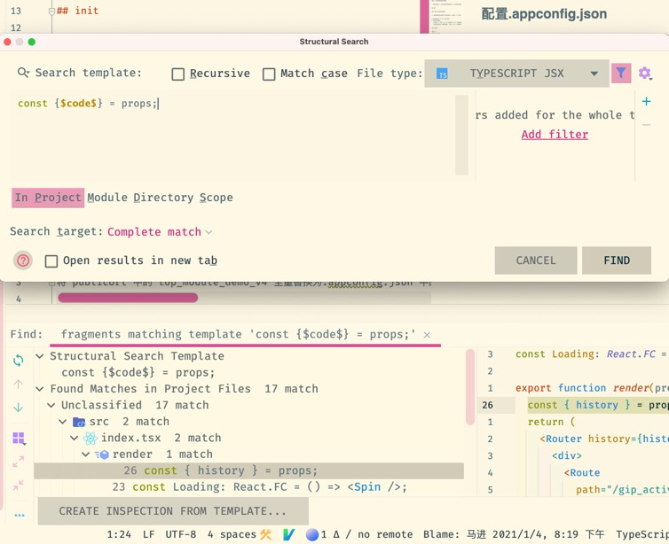

# Tool

1. A: 各位有什么 vscode 主题推荐一下？\[让我看看\]

   B: 

   ​ 我只用这两个.. 一个白天主题 一个夜晚主题~

2. 发现了个有趣的 Mac native 命令，在 terminal 下执行 `say "Hello World`, 会有小姐姐出现。

   

3. A: 我到字节 最好奇的就是 有很多很多同事 的开发环境 就是使用 mac + 触控板.. 我坚持了一周, 各种效率软件 魔改快捷方式软件 都试过了.. 撑不下去了..

   B: 哈哈哈我也觉得很顺手啊 是时候分享一波你的魔法操作了

   A: 好吧.. 可能 我在 Windows 上的环境 太高效了.. 这点我到没有夸张..

   我除了 各种新知识, 最喜欢探索的 就是 和电脑的交互方式了..

   我平时使用最多的是 WGesture + Chrome 下的 Vimium, crx Mouse Gesture + Seer + uTools + QTTabber + 罗技鼠标宏 + 自己写的 AHK 模拟鼠标脚本..

   对了 主要离不开 wsl2

   C: 推荐用quicker 感觉比utool好用点

   A: 那个 一直被各路推, 我也试了很多次, 找不到解决痛点所在...

   C: 我看到测评m1芯片的出来了，性能好像很强悍，自家os优化贼好，很想换，又舍不得在win辛辛苦苦优化的工作流程

   A: no no no, arm 架构 现在生态还没站住脚呢..

   C: 那估计刚出 恰饭的比较多

4. 换了套衣服

   

   主题: Monokai Pro 图标: Material Icon 字体: Cascadia Code

   我发现 还是 vscode 好看哇.. jet brains 的 ide 差距挺大的

   要是 vscode vim 插件再给力点就好了..

5. Ep 23. 个人知识管理体系系列 - 输入篇 [https://pythonhunter.org/episodes/ep23](https://pythonhunter.org/episodes/ep23)
6. 分享下 配置了一下午的 idemvimrc, 带注释的那种, 可以开箱即用~

   [ideavimrc](https://thinking.tomotoes.com/tags/docs/ideavimrc)

   hah 这个 action 配置方面偏前端了, 因为 前端不需要 实现接口, 跳转到类 等等行为

   不过除了 action 篇, 前面都是通用的

7. 分享个刚刚学到的小知识: `git push origin master:remoteBranch`  从本地 master 分支上 新建 远程分支, 并 push 到远程仓库.
8. 刚刚学到 JetBrains IDE 的一个快捷操作.. Search Structurally \(同理 Replace Structurally\)

   可以根据代码结构去进行操作..

   

9. 分享张老图, 温故而知新

   

10. 分享一个非常全面的 vim command sheet.. [https://vim.rtorr.com/lang/en\_us](https://vim.rtorr.com/lang/en_us)
11. 第一次了解到 Vim - K 键的作用.. open man page for word under the cursor
12. VIM 学习资源分享:   
    [https://github.com/wsdjeg/vim-galore-zh\_cn](https://github.com/wsdjeg/vim-galore-zh_cn)   
    [https://www.kancloud.cn/kancloud/learn-vimscript-the-hard-way/49321](https://www.kancloud.cn/kancloud/learn-vimscript-the-hard-way/49321)   
    [https://vimjc.com/page/11/](https://vimjc.com/page/11/)   
    [https://www.jianshu.com/p/42ef98846b11](https://www.jianshu.com/p/42ef98846b11)  
    [https://vim.rtorr.com/lang/zh\_cn/](https://vim.rtorr.com/lang/zh_cn/)  
    [https://vimawesome.com/](https://vimawesome.com/)  
    [https://coolshell.cn/articles/5426.html](https://coolshell.cn/articles/5426.html)  
    [https://juejin.cn/post/6844903470953136142](https://juejin.cn/post/6844903470953136142)  
    [https://juejin.cn/post/6844903444164116493](https://juejin.cn/post/6844903444164116493)   
    [https://juejin.cn/post/6844903469564821511](https://juejin.cn/post/6844903469564821511)  
    [https://tomotoes.com/blog/order-of-vim-cultivation-cheats/](https://tomotoes.com/blog/order-of-vim-cultivation-cheats/)  
    [https://tomotoes.com/blog/grammar-of-vim-cultivation-cheats/](https://tomotoes.com/blog/grammar-of-vim-cultivation-cheats/)  
    还有一本 《 Vim 实战技巧 》--- Drew Neil  
    后面两个文章 是我写的, hah 不建议读, 废话太多

    ```text
    练习的话, 记得设置下 以下命令在 vimrc
     inoremap <down> <nop>
     nnoremap <down> <nop>
     inoremap <left> <nop>
     nnoremap <left> <nop>
     inoremap <right> <nop>
     nnoremap <right> <nop>
    ```

