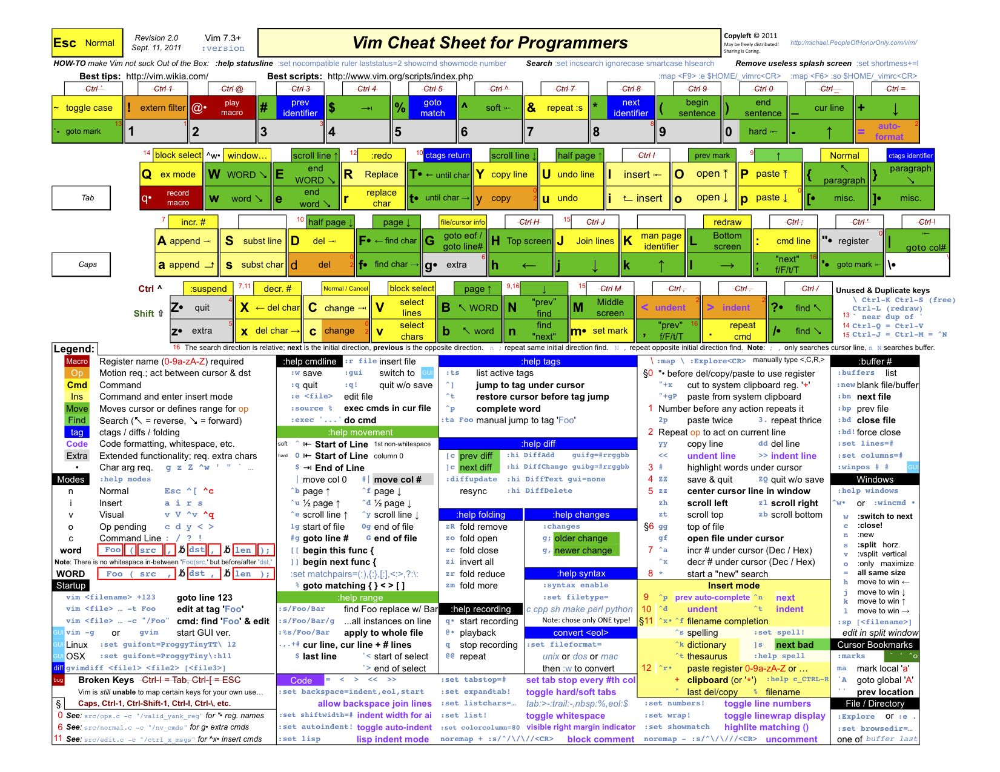
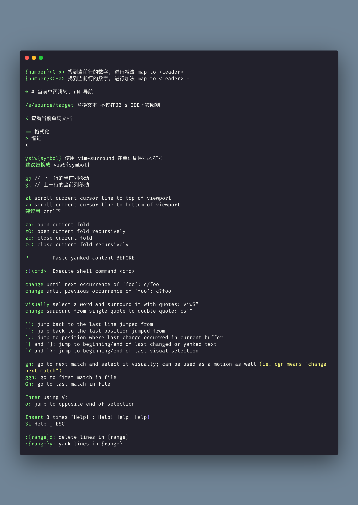
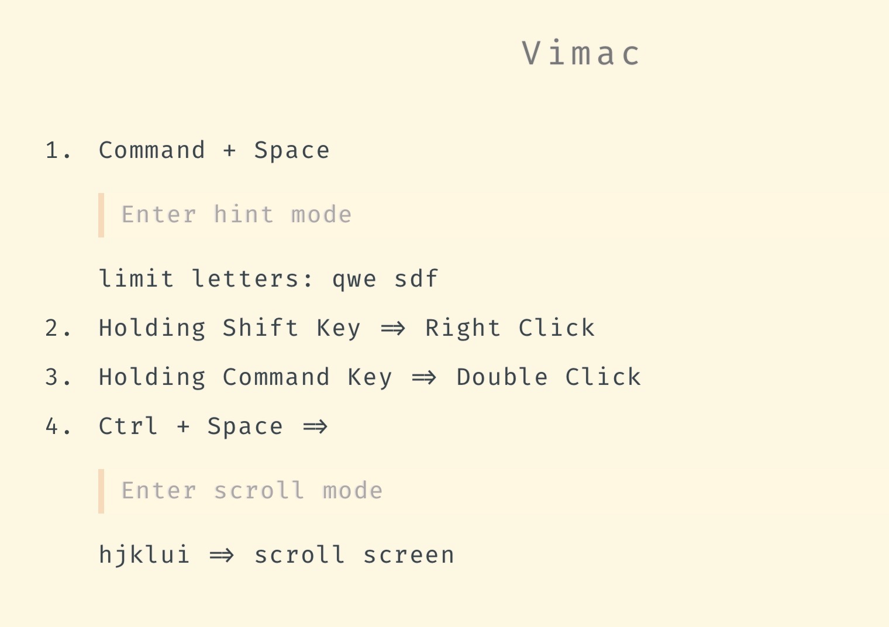

# Vim

1. 分享下 配置了一下午的 idemvimrc, 带注释的那种, 可以开箱即用~

   [ideavimrc](https://thinking.tomotoes.com/tags/docs/ideavimrc)

   hah 这个 action 配置方面偏前端了, 因为 前端不需要 实现接口, 跳转到类 等等行为

   不过除了 action 篇, 前面都是通用的

2. 分享张老图, 温故而知新

   

3. 分享一个非常全面的 vim command sheet.. [https://vim.rtorr.com/lang/en\_us](https://vim.rtorr.com/lang/en_us)
4. 第一次了解到 Vim - K 键的作用.. open man page for word under the cursor
5. 分享两个比较全面 的 Vim CheatSheet

   [https://wincent.com/wiki/Vim\_cheatsheet](https://wincent.com/wiki/Vim_cheatsheet) [https://gist.github.com/awidegreen/3854277](https://gist.github.com/awidegreen/3854277)

   好吧 我发现上面分享链接中的内容 vim quickref 都有涉及..

6. 分享最近刚了解到的 Vim 使用姿势

   

7. 分享款效率工具:

   Vimac - Vimium on MacOS [https://github.com/dexterleng/vimac/](https://github.com/dexterleng/vimac/)

   主要功能点有两个:

   1. 可以把所有 clickable 的地方标记出来, 然后键入对应的字符 模拟鼠标的 Click, Right Click, Double Click
   2. 可进入到滚动模式, hjkl 进行导航

   

   分享下 我的配置

8. 分享一个有趣的项目

   How to exit vim [https://github.com/hakluke/how-to-exit-vim](https://github.com/hakluke/how-to-exit-vim)

   hah :call libcallnr\('kernel32.dll', 'ExitProcess', 0\)

9. VIM 学习资源分享:   
   [https://github.com/wsdjeg/vim-galore-zh\_cn](https://github.com/wsdjeg/vim-galore-zh_cn)   
   [https://www.kancloud.cn/kancloud/learn-vimscript-the-hard-way/49321](https://www.kancloud.cn/kancloud/learn-vimscript-the-hard-way/49321)   
   [https://vimjc.com/page/11/](https://vimjc.com/page/11/)   
   [https://www.jianshu.com/p/42ef98846b11](https://www.jianshu.com/p/42ef98846b11)  
   [https://vim.rtorr.com/lang/zh\_cn/](https://vim.rtorr.com/lang/zh_cn/)  
   [https://vimawesome.com/](https://vimawesome.com/)  
   [https://coolshell.cn/articles/5426.html](https://coolshell.cn/articles/5426.html)  
   [https://juejin.cn/post/6844903470953136142](https://juejin.cn/post/6844903470953136142)  
   [https://juejin.cn/post/6844903444164116493](https://juejin.cn/post/6844903444164116493)   
   [https://juejin.cn/post/6844903469564821511](https://juejin.cn/post/6844903469564821511)  
   [https://tomotoes.com/blog/order-of-vim-cultivation-cheats/](https://tomotoes.com/blog/order-of-vim-cultivation-cheats/)  
   [https://tomotoes.com/blog/grammar-of-vim-cultivation-cheats/](https://tomotoes.com/blog/grammar-of-vim-cultivation-cheats/)  
   还有一本 《 Vim 实战技巧 》--- Drew Neil  
   后面两个文章 是我写的, hah 不建议读, 废话太多

   ```text
   练习的话, 记得设置下 以下命令在 vimrc
    inoremap <down> <nop>
    nnoremap <down> <nop>
    inoremap <left> <nop>
    nnoremap <left> <nop>
    inoremap <right> <nop>
    nnoremap <right> <nop>
   ```

