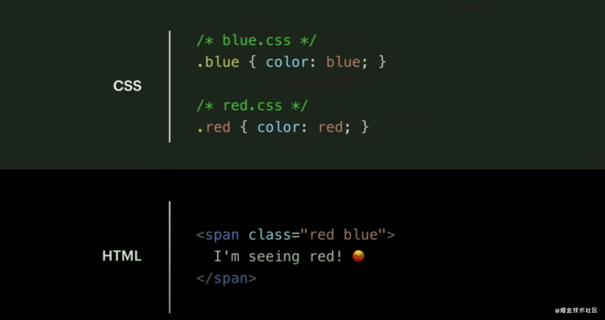
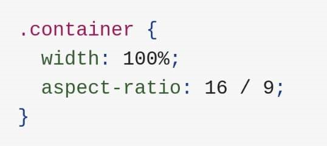

# CSS

1.  框架分享: Tailwind CSS - [https://tailwindcss.com/](https://tailwindcss.com)

    Tailwind CSS 是一个高度可定制的基础层 CSS 框架，与其它 CSS 框架不同的是，Tailwind 并不提供预先设计好的内建组件。相反，Tailwind 提供了更基础的工具类（utility classes），可以让你直接在 HTML 源码上构建一个完全定制化的设计。

    并且 Tailwind 是我见到各种框架官网中 设计得最优雅简洁的, 看一下官网Demo, 就很想去尝试使用它.
2.  快餐文分享：

    Uncommon Use Cases For Pseudo Elements

    [https://ishadeed.com/article/unusual-use-cases-pseudo-elements/](https://ishadeed.com/article/unusual-use-cases-pseudo-elements/)

    摘要：Pseudo-elements are in use for a long time. However, there are some uses cases that I feel they are not entirely known across developers. I wrote down this article to shed light on them so they can be used more.

    作者用多个案例 介绍了 CSS 伪类的使用场景。
3.  分享一个练习 CSS-Flex 语法的游戏

    [https://flexboxfroggy.com/](https://flexboxfroggy.com)

    一共24关, 通过写 Flex, 让小青蛙移动到合适的位置 即可过关.
4. 
5.  2020 CSS 现状报告

    [https://2020.stateofcss.com/](https://2020.stateofcss.com)

    CSS 在 2020 年使用现状统计，涉及到了 CSS 的一些特性、框架、规范。
6. [如何只使用CSS提升页面渲染速度](https://mp.weixin.qq.com/s/aPguK-dZr7JMA-s2OOFyjg)
7.  好文分享:

    CSS Utility Classes and "Separation of Concerns"

    [https://adamwathan.me/css-utility-classes-and-separation-of-concerns/](https://adamwathan.me/css-utility-classes-and-separation-of-concerns/)

    摘要: Over the last several years, the way I write CSS has transitioned from a very "semantic" approach to something much more like what is often called "functional CSS."\
    这篇文章介绍了 HTML-CSS 编写的多种范式 以及 各种范式之间的差异与感触.本文的作者同时也是 TailWind CSS 的作者, 值得一读. 说实话 我几乎没有思考过 CSS HTML 之间的依赖, 一直按照文中的第一种 或者 BEM 规范去写, 原来它们之间一直没有做到 关注点分离, 一直存在依赖. 不过 现在 CSS IN JS, CSS Module 方案已经从编译方面打开了新出路
8. 快餐文分享: \
   来自新时代的 CSS \
   [https://mp.weixin.qq.com/s/pPtzhXbAaXfoTV2q3u0Dww](https://mp.weixin.qq.com/s/pPtzhXbAaXfoTV2q3u0Dww)\
   文中列举很多关于 CSS 现在发展的一些技术 特性. \
   1\. css 命名规范, 遗憾的是 文章只提了 结构与样式分离的规范: BEM, 应该扯扯 构建函数单元的 css 命名规范 \
   2\. 简单介绍预处理器: less sass stylus \
   3\. 发展了很多年也没有声音的 CSS Houdini, 还不如说 css in js \
   4\. postcss, postcss 之于 css 就好比 babel 之于 js \
   5\. css module: 没说清楚.. \
   6\. stylelint 规范工具 \
   7\. postcss-preset-env 的规范: cssdb
9.  3行核心CSS代码的rate评分组件，秀到你怀疑人生

    [https://mp.weixin.qq.com/s/FE3IuNu66VxLDgHCHWIRVA](https://mp.weixin.qq.com/s/FE3IuNu66VxLDgHCHWIRVA)
10. 分享篇文章，讲的挺好的

    Facebook 重构：抛弃 Sass / Less ，迎接原子化 CSS 时代 [https://mp.weixin.qq.com/s/NmHUYZh\_ILG-Phe53NcoEg](https://mp.weixin.qq.com/s/NmHUYZh\_ILG-Phe53NcoEg)
11. 
12. 动漫版 flexbox cheat sheets，图示敲可爱\~

    [https://dev.to/joyshaheb/flexbox-cheat-sheets-in-2021-css-2021-3edl?utm\_source=digest\_mailer\&utm\_medium=email\&utm\_campaign=digest\_email](https://dev.to/joyshaheb/flexbox-cheat-sheets-in-2021-css-2021-3edl)
13. CSS 目前的三种趋势: \
    CSS-in-CSS (e.g. CSS, Preloader, CSS Modules) \
    CSS-in-JS (e.g. Styled Components, Emotion) \
    Utility-First-CSS (e.g. Tailwind CSS)
14. 点击网页的按钮, 如何只利用 CSS 发起网络请求:

    .some-button:active { background-image: url('some\_image.jpg') }

    点击按钮时, 触发 按钮 active 状态, 然后应用到 CSS 规则的 background-image: url(图片地址) 这就相当于对 图片地址 发起了一次网络请求..
15. 分享个网站: cssdb [https://cssdb.org/](https://cssdb.org)

    cssdb is a comprehensive list of CSS features and their positions in the process of becoming implemented web standards.

    未来 CSS 的新feature 都可以在这里找到\~

    @media (480px <= width < 768px) {}

    关于媒体查询器, 新的语法方案, 看起来挺期待的.
16. 快餐文分享:

    CSS Tips you won't see in most tutorials [https://denic.hashnode.dev/css-tips-you-wont-see-in-most-tutorials](https://denic.hashnode.dev/css-tips-you-wont-see-in-most-tutorials)
17. 快餐文分享: CSS Grid 网格布局教程 [http://www.ruanyifeng.com/blog/2019/03/grid-layout-tutorial.html](http://www.ruanyifeng.com/blog/2019/03/grid-layout-tutorial.html)

    摘要: Grid 布局与 Flex 布局有一定的相似性，都可以指定容器内部多个项目的位置。但是，它们也存在重大区别。 Flex 布局是轴线布局，只能指定"项目"针对轴线的位置，可以看作是一维布局。Grid 布局则是将容器划分成"行"和"列"，产生单元格，然后指定"项目所在"的单元格，可以看作是二维布局。Grid 布局远比 Flex 布局强大。
18. 快餐文分享: Scoping CSS using Shadow DOM [https://blog.bitsrc.io/scoping-css-using-shadow-dom-a548985b73af](https://blog.bitsrc.io/scoping-css-using-shadow-dom-a548985b73af)

    使用 Shadow DOM 去隔离 不同应用之间的样式

    应用场景 太适合 微前端了..
19. Chrome 88 支持新的 CSS 属性`aspect-ratio`，可以设置容器的长宽比。

    这么常见的UI构建功能，现在才出现...

    
20. 分享篇好文： \
    Things You Can Do With CSS Today \
    [https://www.smashingmagazine.com/2021/02/things-you-can-do-with-css-today/](https://www.smashingmagazine.com/2021/02/things-you-can-do-with-css-today/)

    总结：

    1. grid 网格布局
    2. is 伪类选择器 .post :is(h1, h2, h3)
    3. where 选择器
    4. min max clamp 函数
    5. ch ex 字体尺寸单位
    6. text decoration 的一些 rule
    7. scroll-margin-top
    8. 之前分享过的 aspect-ratio 尺寸等比划分
    9. content-visibility：google 带头提出的一个特性，刚出的时候让我很惊艳，具体做的是：With content-visibility: auto, you can tell the browser not to worry about rendering the elements in there while they are outside of the viewport, which can have a massive impact on initial loading speeds.
    10. 支持嵌套选择
21. 分享篇文章: \
    CSS奇思妙想 -- 使用 background 创造各种美妙的背景 \
    [https://juejin.cn/post/6925600887947657224](https://juejin.cn/post/6925600887947657224)

    chokcoco 每篇文章都很有艺术气息aaa..
22. 快餐文分享：

    如何把css'content的操作跟价值发挥到最大\
    [https://juejin.cn/post/6844903917348732936](https://juejin.cn/post/6844903917348732936)

    counter 函数 与 content 中的字符拼接 可以关注一下
23. 惊讶系列分享，文中 画板的例子太秀了。 \
    你可能不知道的 transition 技巧与细节 \
    [https://juejin.cn/post/6924114612799406093](https://juejin.cn/post/6924114612799406093)
24. CSS奇思妙想 -- 使用 CSS 创造艺术 \
    [https://juejin.cn/post/6922257014840098830](https://juejin.cn/post/6922257014840098830) \
    我愿称为大艺术家chokcoco\~
25. Tailwind CSS （可能）是名过其实的 \
    [https://juejin.cn/post/6930196913119576077](https://juejin.cn/post/6930196913119576077) \
    分享篇文章，文中的观点很赞同：对于原子类的使用，一直有这样的痛点：当封装的粒度太小时，会显得异常繁琐，反之想自定制化时又经常不合适。
26. 快餐文分享：

    CSS现状和如何学习 \
    [https://mp.weixin.qq.com/s/ztU1tESHy-5kF2iFpZbgfw](https://mp.weixin.qq.com/s/ztU1tESHy-5kF2iFpZbgfw)

    hah 我曾经也写过 CHSS，文章实在太长了...

    摘要：CSS与其编程语言不同，她没有循环、逻辑和其他概念，它只是声明式的语言，因此，CSS很容易上手。也许正是因为如此，它才获得了简单的美誉。在 "不复杂 "的意义上，它是简单的，但这并不意味着它很容易。把 "简单 "误认为是 “容易”，只会让人心痛”。
27. CSS 专业技巧 一个帮你提升 CSS 技巧的收藏集。

    [https://github.com/AllThingsSmitty/css-protips/tree/master/translations/zh-CN](https://github.com/AllThingsSmitty/css-protips/tree/master/translations/zh-CN)

    文章中一些技巧很有实践意义，总结了下:

    1. all: unset; 可以用all简写來指定所有元素的属性。
    2. 安装字体时，使用 local 函数检查是否本地安装
    3. a\[href^="http"]:empty::before { content: attr(href); }
28. 好文分享：

    An Interactive Guide to CSS Transitions \
    [https://www.joshwcomeau.com/animation/css-transitions/](https://www.joshwcomeau.com/animation/css-transitions/)

    摘要：The world of web animations has become a sprawling jungle of tools and technologies. Libraries like GSAP and Framer Motion and React Spring have sprung up to help us add motion to the DOM.

    The most fundamental and critical piece, though, is the humble CSS transition. It's the first animation tool that most front-end devs learn, and it's a workhorse. Even the most grizzled, weathered animation veterans still reach for this tool often.

    文章很有价值，建议阅读。总结下自己从文章受益的点：

    1. 有的规则不能被子像素渲染，比如 margin，所以过渡时无论是 cpu 还是 gpu 渲染都需要 round to the nearest pixel, creating a stepped, janky effect.
    2. 过渡行为中定义的 transition 其实是在过渡行为结束后 才会起作用，这一点可以和之前分享过 chokcoco 你可能不知道的 transition 技巧与细节一文 联系在一起。 （可以在群记录中搜索 画板例子太秀了 关键词）
    3. Doom flicker，触发动画的元素 与 动画运动元素 一定要分清
    4. @media (prefers-reduced-motion: reduce) 可以使用此选择器禁用动画 关于最后一点，确实 动画太多，整个页面看起来较油腻，建议设计时 动画要小而精美。
