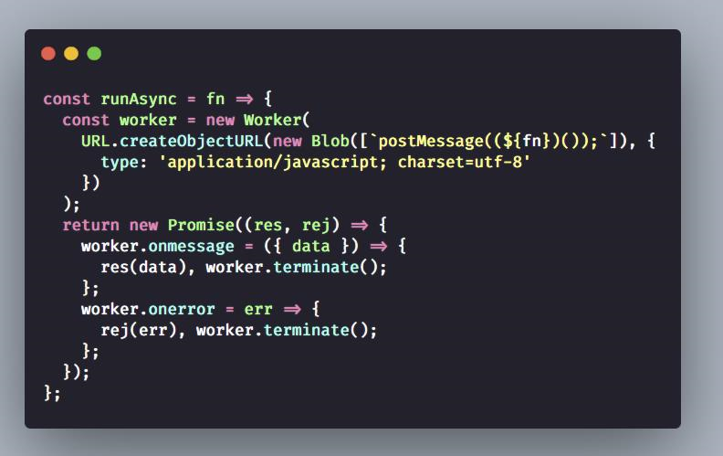

# Index

1. 作为前端，工作中处理过什么复杂的需求，如何解决的? - 孟健的回答 - 知乎 [https://www.zhihu.com/question/362103682/answer/1024196584](https://www.zhihu.com/question/362103682/answer/1024196584)
2. 为什么现在又流行服务端渲染html？ - Damon DanceForMe的回答 - 知乎 [https://www.zhihu.com/question/59578433/answer/332545815](https://www.zhihu.com/question/59578433/answer/332545815)
3.  每日一句分享:

    浏览器起初只是一个简单的远程文档查看器，后来被迫成为一个应用程序平台。由于浏览器一开始没设计为这个用途，后来互联网的诸多问题都是这个事实造成的。
4. 每日一句分享：Web 2.0时代最大的思想革命本质不是前后端分离，而是把网页当作独立的应用程序（app）。前后端分离只是实现这一新架构的必然结果。
5.  漫画 | 前端发展史的江湖恩怨情仇

    [https://mp.weixin.qq.com/s?\_\_biz=MzUyNDYxNDAyMg==\&mid=2247487283\&idx=1\&sn=a8062df3c5cf44e2921fa77919ce5f75](https://mp.weixin.qq.com/s?\_\_biz=MzUyNDYxNDAyMg==\&mid=2247487283\&idx=1\&sn=a8062df3c5cf44e2921fa77919ce5f75)
6.  面试题分享:

    LeetCode-OpenSource

    [https://github.com/LeetCode-OpenSource/hire](https://github.com/LeetCode-OpenSource/hire)

    LeetCode 官方面试题集锦，前端同学有空可以看一下。
7.  .png>)

    【Mannequin.js: An Articulated Mannequin Figure Library】[https://boytchev.github.io/mannequin.js/](https://boytchev.github.io/mannequin.js/)

    Mannequin.js: 关节式人体模型库。
8. 好文分享: [2020年大前端技术趋势解读](https://juejin.cn/post/6908713513271689224)
9. 快餐文分享: \
   Fetch API 教程 \
   [http://www.ruanyifeng.com/blog/2020/12/fetch-tutorial.html](http://www.ruanyifeng.com/blog/2020/12/fetch-tutorial.html)
10. 快餐文分享:\
    [RxJS——给你如丝一般顺滑的编程体验（篇幅较长，建议收藏）](https://juejin.cn/post/6910943445569765384)\
    文章很长，大部分的篇幅都是在讲 rxjs 的一些概念与api，并没有结合实际场景，对rxjs感兴趣的同学可以了解下。
11. 分享个视频: 下一代 Web 应用的超能力：机器学习 \
    [https://www.youtube.com/watch?v=dDIk1Tmnj9A\&ab\_channel=GoogleChromeDevelopers](https://www.youtube.com/watch?v=dDIk1Tmnj9A\&ab\_channel=GoogleChromeDevelopers)

    视频讲解了主流的AI概念, 以及 AI 为前端赋能 的应用场景..
12. 好文分享:

    前端生产方式：过去 10 年回顾和未来 10 年展望 \
    [https://mp.weixin.qq.com/s/c6-9wnxKTq5w3BVqlBFxPQ](https://mp.weixin.qq.com/s/c6-9wnxKTq5w3BVqlBFxPQ)

    摘要: 要看一个行业的未来发展怎样，就看这个行业的人才目前和未来在市场上被密集需要的地方在哪、规则最混浊或混乱的地方在哪。如果说这个行业的规则出奇地清晰、人才的供给又出奇的冷静，那么基本上来说，这个行业在市场的发展已经达到平衡状态，而能打破这种平衡重新建立平衡的也肯定是另外的行业的发展渗入。

    文章前半部分讲了 作者在阿里经历的变化, 后半部分则说明了 no-code 以及智能化 对传统前端带来的利与弊.

    最后，我还是带着大家一起展望一下前端智能化的未来 10 年（以如今的互联网发展节奏看，或许下面的 5 年内就达到也是有可能的）：

    2\~3 年内，前端智能化从业者数量翻倍，AI 在前端领域内或多或少有一些产品形态上的应用，终端开始浮现各种前端机器学习框架，用户产品在智能化体验方面的设计也有对应的倾斜，社区上也开始浮现出各种前端智能化的工程框架、训练框架和 AI 平台；

    3\~5 年内，前端智能化从业者数量继续增长，传统前端已经被淘汰，前端领域内智能化在特定领域内小有成绩，可以解决特定领域内的一些业务或人力生产效率问题，终端智能体验会趋渐成熟，给用户带来的沉浸式体验增强，线上线下无屏化无差异体验趋近相同，社区上开始开源一些前端的智能化产品；

    5\~10 年内，前端智能化从业市场已趋近饱和，端智能体验设计者应该在市场上比较吃香（如沉浸式人机对抗游戏等），nocode 问题应该能彻底解决，但同时带来其他的消费诉求，可能会引入新的领域难题。

    如今危机四伏，未来无限可期，所以大家还是要未雨绸缪，提前做好准备。

    以上摘抄自 文章最后一段, 结合我目前的经历来看 我觉得作者预测得并不是没有道理..
13. 好文分享:

    基于 Web 技术栈的动态化跨平台漫谈 \
    [https://mp.weixin.qq.com/s/0QViGHkt6R5fOZms-EpwAA](https://mp.weixin.qq.com/s/0QViGHkt6R5fOZms-EpwAA)

    摘要: 随着互联网红利的消失，整个移动市场的关注从“流量”转成了“留量”，大部分的移动产品也都告别了初期的抢占市场，进入了 A/B 实验和快速试错的阶段，现有 App 都开始对用户的时间进行激烈的争夺。普通的 App 不断的扩展领域和内容来满足长尾需求、超级 App 们也不断的提高护城河构建自有生态。所以无论是流量分发、精细化运营、还是提升时长，都需要 App 不断的增加平台化的属性，高效的响应调整和变化。 技术趋势一定是顺应行业发展的，在提升效率这样的行业背景下，App 整体的架构和技术选型，也都到了进行服务于效率的架构升级，拥抱工程化敏捷的时候了。

    而 App 中的敏捷工程化 代表的正是 Web 与 Native 结合了. 文中讲了目前的 Web 在移动端的发展 很全面. 背景,意义,业界实践, 都说的很细致.
14. 快餐文分享: 【第1892期】GPU加速在前端的应用 [https://mp.weixin.qq.com/s/T8g8uSn6K\_5gz2DiPBWk9Q](https://mp.weixin.qq.com/s/T8g8uSn6K\_5gz2DiPBWk9Q)

    文章简单介绍了 GPU 做计算的优势, 以及前端如何借助 浏览器渲染机制利用 GPU 渲染. 原理就是 将 layer 提升成一个单独的图层..

    目前 利用 GPU 计算 在业界已经有对应的产品落地了.. 就比如 常见的 webgl 库 three.js pixel.js 也有利用 GPU 做计算的数据库 等..
15. 分享篇短文

    2020 前端技术发展回顾

    [https://mp.weixin.qq.com/s/b0pFJFXgBSyB56Ce86YMUg](https://mp.weixin.qq.com/s/b0pFJFXgBSyB56Ce86YMUg)
16. 分享两个名词:
    1. 动效 == 交互动画 界面动效能加强用户认知且增加活力。
    2. 品质建设 == 优化应用 就如 前端品质建设 主要为了解决白屏渲染, 提高 FCP, FP 指数.
17. 好文分享:

    前端架构发展史 [https://tomotoes.com/blog/history-of-front-end-architecture/](https://tomotoes.com/blog/history-of-front-end-architecture/)

    摘要: 在1990年，Tim Berners-Lee 在他的 NeXT 电脑上部署了第一套“主机-网站-浏览器”构成的Web系统，这标志着前端的开始。 在最初，前端是一片荒芜的，经过浏览器大战，W3C 标准化的过程 前端才慢慢成长了起来。

    这篇文章 读了很多遍, 主要讲了 前端改革 30 年，从一片荒芜到微前端兴起, 很有价值, 并且文笔很好, 推荐阅读.

    本文作者 是我一朋友, 狗头
18. 分享篇文章:

    微前端到底是什么？

    [https://zhuanlan.zhihu.com/p/96464401?utm\_source=wechat\_session\&utm\_medium=social\&utm\_oi=1088870436204318720\&utm\_campaign=shareopn](https://zhuanlan.zhihu.com/p/96464401)
19. 分享篇文章:

    JS Bridge 通信原理

    [https://mp.weixin.qq.com/s/cBsmunLXLBEtR14cFfy1LQ](https://mp.weixin.qq.com/s/cBsmunLXLBEtR14cFfy1LQ)

    可以着重看下概念与前端调用的方式
20. (2020.11.14) 分享一篇我今天看的好文, 值得前端同学读. [https://3perf.com/talks/web-perf-101/](https://3perf.com/talks/web-perf-101/)

    摘要: This is an introduction to the modern web loading performance. Learn why performance is important, what performance optimizations exist and what tools help to understand if your app is doing well.
21. 快餐文分享:

    JavaScript: Conditional JavaScript, only download when it is appropriate to do so

    [https://umaar.com/dev-tips/242-considerate-javascript/](https://umaar.com/dev-tips/242-considerate-javascript/)

    如何根据终端的配置来进一步优化 UX 呢?这篇文章给出了一些例子.
22. 快餐文分享: \
    页面的加载优化方案 \
    [https://blog.serenader.me/ye-mian-de-jia-zai-xing-neng-you-hua-fang-an](https://blog.serenader.me/ye-mian-de-jia-zai-xing-neng-you-hua-fang-an)

    涉及了一些常见的点，可以简单刷下。
23. 哇 我发现了一个宝藏 up 主 , objtube的卢克儿 下面是他的一个视频: 【干货】浏览器是如何运作的？

    [https://www.bilibili.com/video/BV1x54y1B7RE](https://www.bilibili.com/video/BV1x54y1B7RE)

    讲的很不错, 有空可以看看
24.  (1).png>)
25. 好文分享:

    Inside look at modern web browser

    [https://developers.google.com/web/updates/2018/09/inside-browser-part1](https://developers.google.com/web/updates/2018/09/inside-browser-part1)

    该系列由 Google 技术专家编写, 分为 4 个部分: 第一部分讲了 现代浏览器的架构. 第二部分讲了 页面导航时 浏览器内部发生的活动 第三部分讲了 浏览器如何渲染一个页面 第四部分讲了 浏览器处理事件时的动作

    非常建议 前端同学花点时间 阅读下该系列文章的, 是很有帮助的.
26. 据报道称“浏览器内核有上千万行代码”，浏览器内核真的很复杂吗？ - 龙泉寺扫地僧的回答 - 知乎 [https://www.zhihu.com/question/290767285/answer/1200063036](https://www.zhihu.com/question/290767285/answer/1200063036)
27. 1995 - 2019浏览器大战 - 深度学习于NLP的视频 - 知乎 [https://www.zhihu.com/zvideo/1286027542877270016](https://www.zhihu.com/zvideo/1286027542877270016)

    02年 IE 市场占用率高达95%，但到现在已经出局。
28. Things you can do with a browser in 2020 [https://github.com/luruke/browser-2020](https://github.com/luruke/browser-2020)
29. 快餐文分享: \
    Introducing: The Async Cookie Store API \
    [https://medium.com/nmc-techblog/introducing-the-async-cookie-store-api-89cbecf401f](https://medium.com/nmc-techblog/introducing-the-async-cookie-store-api-89cbecf401f)

    摘要: Are you sick and tired of weird ways to get cookies fromdocument.cookie ? Hate it that you don’t know whether the cookie you set was actually saved or not? Introducing: Cookie Store API, available on Chrome version 87!

    有生之年系列.
30. JS 在浏览器环境中 真正的并行执行..

    

    通过 Worker API 去实现

    分享一篇没建群之前看过的好文

    Web Worker 文献综述 [http://www.alloyteam.com/2020/07/14680/](http://www.alloyteam.com/2020/07/14680/)

    是腾讯 AlloyTeam 团队写的, 文章写的有深度, 该介绍的都介绍了.
31. 快餐文分享: \
    浅谈移动端开发技术 \
    [https://mp.weixin.qq.com/s/TXBRUVoOBDxr8P9Iw5FpTQ](https://mp.weixin.qq.com/s/TXBRUVoOBDxr8P9Iw5FpTQ)

    文章花大篇幅讲了 hybrid 在移动端的一些原理

    在移动端 昂贵的不是 触发 render 的次数, 而是通信的次数.

    都说了 还是扩展下吧: web 的性能瓶颈 在于单线程模型, 这就是为什么 react 16 提出了 增量化 fiber 架构 移动端的 hybrid 的性能瓶颈 在于 线程通信, 不过 RN 从一开始就常用的 vdom, 可以将多次修改 增量化
32. 分享篇个人文章:

    前端架构发展史 \
    [https://juejin.cn/post/6923779473053581320](https://juejin.cn/post/6923779473053581320)

    之前分享过一次, 不过那次写的比较糙, 这次重新润色了下, 并添加了微前端架构的使用场景..
33. Question: 怎么将不同技术栈的页面组合在一个页面，且不存在样式冲突，数据冲突。

    具体场景是，一个 vue 搭建的页面，一个 react 搭建的页面，继承进其他页面这样。

    这其实就是一道典型的前端面试题，考你的知识广度与深度。 只不过是我出的。

    Answer:

    1. Iframe
    2. Web components
    3. 构建时，打包多个子应用
    4. 微件化，远程 load js chunk
34. 换一个角度分析，网页性能优化

    [https://mp.weixin.qq.com/s/o8HOvYfUNUKPGydSak1mxA](https://mp.weixin.qq.com/s/o8HOvYfUNUKPGydSak1mxA)
35. 你辛苦学会的 Webpack dll 配置，可能已经过时了 \
    [https://mp.weixin.qq.com/s/jtIbVc9Bl50TIs7YilWbFg](https://mp.weixin.qq.com/s/jtIbVc9Bl50TIs7YilWbFg)

    之前一直没想过前端工程与dll之间的关系..
