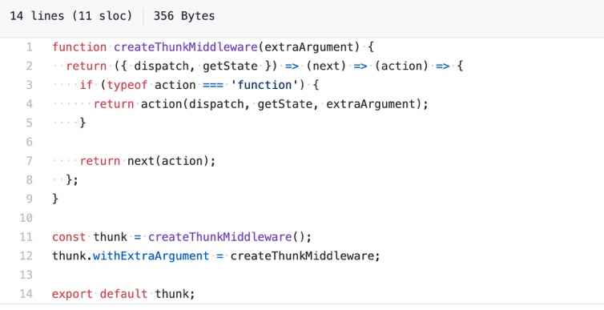
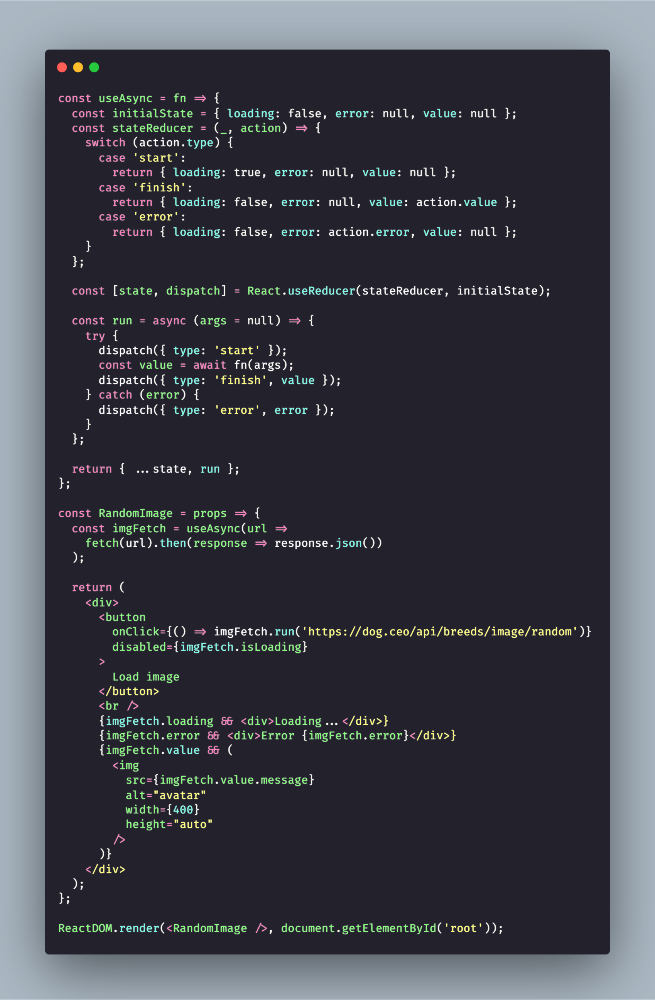

# React

1. 昨天看到了一篇很好的文章, 关于如何更好地写 React。

   今天翻译了下，值得前端同学 一读。

   [https://tomotoes.com/blog/7-code-smells-in-react-components/](https://tomotoes.com/blog/7-code-smells-in-react-components/)

2. 视频分享： Getting Closure on React Hooks by Shawn Wang \| JSConf.Asia 2019 [https://www.youtube.com/watch?v=KJP1E-Y-xyo&ab\_channel=JSConf](https://www.youtube.com/watch?v=KJP1E-Y-xyo&ab_channel=JSConf)

   视频讲解了 如何用40行代码去模拟实现 React Hooks 特性。 对 React Hooks 有兴趣的同学可以了解下，其中的原理是使用到了闭包。

3. 为什么 React 源码不用 TypeScript 来写？ - Cat Chen的回答 - 知乎 [https://www.zhihu.com/question/378470381/answer/1079675543](https://www.zhihu.com/question/378470381/answer/1079675543)
4. `const React = state => view`
5. 面试题分享:

   reactjs-interview-questions

   [https://github.com/sudheerj/reactjs-interview-questions](https://github.com/sudheerj/reactjs-interview-questions)

   摘要: List of top 500 ReactJS Interview Questions & Answers....Coding exercise questions are coming soon!!

   前端同学可以有空刷一下, 此项目 star 近 9k 是我没想到的..

6. 为什么 react 还比 vue 火？ - 阿白的回答 - 知乎 [https://www.zhihu.com/question/51690331/answer/1112468309](https://www.zhihu.com/question/51690331/answer/1112468309)
7. 
8. 快餐文分享: [使用 hooks 的开发模式](https://github.com/dt-fe/weekly/blob/v2/080.%E7%B2%BE%E8%AF%BB%E3%80%8A%E6%80%8E%E4%B9%88%E7%94%A8%20React%20Hooks%20%E9%80%A0%E8%BD%AE%E5%AD%90%E3%80%8B.md)
9. 

   ​ A: 这条推笑死了, 未来的 React 编程方式.

   ​ B: hahah 未来 react 的全栈吗

   ​ A: 我看到这图的第一想法是, 这敢上线 数据库不分分钟被打穿.

   ​ Dan 发的, 我觉得有可能 hah

10. [React RFC Server Components是什么，有啥用](https://mp.weixin.qq.com/s/7AT5iNaJyRdAKaE3Rr321w)

    A: 这前后端 合久必分，分久必合..

    B: 快进到react全栈

    A: 做个BFF层还是不错的

11. 分享一个 111 页的PPT

    Intro to React, Redux, and TypeScript [https://blog.isquaredsoftware.com/presentations/react-redux-ts-intro-2020-12/\#/](https://blog.isquaredsoftware.com/presentations/react-redux-ts-intro-2020-12/#/)

    PPT 中简明扼要地讲了 React, Hooks, Styling, Redux, React-Redux, Redux-Toolkit, TypeScript 的基本概念, 以及使用场景.. 最后的推荐阅读链接 也不错

12. 短信息分享: You may not be familiar with his name but React’s original creator, Jordan Walke, has left Facebook. This comes after ten years with the company where he put an indelible stamp on both React and Reason. In announcing his departure he simply said he is “starting a new company” but also goes to say that he will also be investing in startups in the React/Reason ecosystems which is great.
13. 为什么不使用一个全局变量替代redux？ - 江湖术士的回答 - 知乎 [https://www.zhihu.com/question/428851039/answer/1673506867](https://www.zhihu.com/question/428851039/answer/1673506867)

    暴躁老哥，在线答疑

14. Redux-toolkit The official, opinionated, batteries-included toolset for efficient Redux development   
    [https://github.com/reduxjs/redux-toolkit](https://github.com/reduxjs/redux-toolkit)

    建议了解下 我准备在项目中落地下 这个库, 看起来比原始使用 redux 香很多 自带 reselect, redux-thunk, immer, 还提供了 多种 action creator..

    reselect redex-thunk 都很让我印象深刻.. 之前看源码时.. 就短短一百行.. star 高达上万..

      
    这是 redux-thunk 的源码... 说白了 就是将 dispatch 传进函数中... [https://github.com/reduxjs/reselect/blob/master/src/index.js](https://github.com/reduxjs/reselect/blob/master/src/index.js) 这个是 reselect 源码, 就是做了个 memories 的事情... 这就是 redux 的生态

15. 开发组件时，经常把 UI state 与 data state 混合在一起，看起来乱哄哄，这方面有什么好的实践嘛？ 我发现大部分的时间都是在调ui 调交互..
16. 分享一本刚刚整理的 React - Hooks 小册 - Dig deep into Hooks. 里面包括了一些 推荐阅读的源码库, 以及一些经典的 Hooks 片段. 前端的同学有空可以读一下~ 对掌握 Hooks 会更有帮助的. [Dig deep into Hooks](https://thinking.tomotoes.com/tags/docs/dig-deep-into-hooks) 这个小册没有包括 ahooks 中的一些例子, 因为 ahooks 每个 hook 之间存在耦合, 不容易整理成代码片段.. 其他参考链接中的 hooks , 对我产生价值的 都整理了..
17. 快餐文分享:  5 Recommended Tools for Optimizing Performance in ReactJS  [https://blog.bitsrc.io/5-recommended-tools-for-optimizing-performance-in-reactjs-29eb2a3ec46d](https://blog.bitsrc.io/5-recommended-tools-for-optimizing-performance-in-reactjs-29eb2a3ec46d) 文章列举了检查 react performance 的一些工具:  1. React 提供的 Profiler 组件  2. React Developer tools plugin  3. why-did-you-render  4. Chrome Devtools - Performance timeline
18. 好文分享:  将 React 作为 UI 运行时  [https://overreacted.io/zh-hans/react-as-a-ui-runtime/](https://overreacted.io/zh-hans/react-as-a-ui-runtime/) 摘要:  1. React 程序通常会输出一棵会随时间变化的树。 它有可能是一棵 DOM 树 ，iOS 视图层 ，PDF 原语 ，又或是 JSON 对象 。然而，通常我们希望用它来展示 UI 。我们称它为“宿主树”，因为它往往是 React 之外宿主环境中的一部分 — 就像 DOM 或 iOS 。宿主树通常有它自己的命令式 API 。而 React 就是它上面的那一层。 2. 请记住 React 元素并不是永远存在的 。它们总是在重建和删除之间不断循环着。 3. 我喜欢将 React 元素比作电影中放映的每一帧。它们捕捉 UI 在特定的时间点应该是什么样子。它们永远不会再改变。 4. 令人讽刺地是，React 并没有使用“反应式”的系统来支持细粒度的更新。换句话说，任何在顶层的更新只会触发协调而不是局部更新那些受影响的组件。 这样的设计是有意而为之的。对于 web 应用来说交互时间是一个关键指标，而通过遍历整个模型去设置细粒度的监听器只会浪费宝贵的时间。此外，在很多应用中交互往往会导致或小（按钮悬停）或大（页面转换）的更新，因此细粒度的订阅只会浪费内存资源。  我喜欢将 React 元素比作电影中放映的每一帧, 它们捕捉 UI 在特定的时间点应该是什么样子。 这句话很有价值.. 这就是 React 的 render 原理体现.
19. [https://usehooks.com/useKonamiCode/](https://usehooks.com/useKonamiCode/)  分享一个有趣的 hooks, up up down down left right left right B A 的按键 彩蛋
20. 分享篇有关 React Hook 使用例子的文章:   
    useEncapsulation   
    [https://kyleshevlin.com/use-encapsulation](https://kyleshevlin.com/use-encapsulation)

    指出了 使用 hooks 典型的场景.

21. 分享篇文章:   
    5 React Custom Hooks You Should Start Using \(Explained\)   
    [https://dev.to/alterclass/5-react-custom-hooks-you-should-start-using-explained-5d18?utm\_source=digest\_mailer&utm\_medium=email&utm\_campaign=digest\_email](https://dev.to/alterclass/5-react-custom-hooks-you-should-start-using-explained-5d18?utm_source=digest_mailer&utm_medium=email&utm_campaign=digest_email)

    文章写得挺好的，建议阅读。

22. Question: 以下组件 存在什么问题?

    ```text
    const handleClick = () => {}
    <Button type="primary" onClick={() => handleClick()}> Click me </Button> 
    ```

    A: 每次渲染都会重复构造一遍这个回调函数  
    B: 好家伙，我垃圾代码看多了，这种没放在 usecallback 的函数我已经习以为常了。。。  
    C: 嗯 每次 render 时, onClick 都是一个新的函数, 而函数是引用类型, 所以 每次render 时 都会重新 render Button 组件...





