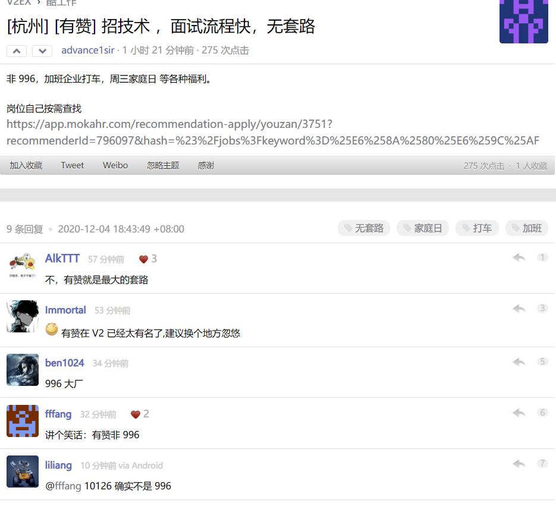

# Work

1. 简历中 技术能力熟练度参考表 了解：见过名字 熟悉：看过文档 掌握：用过 熟练：调试过 精通：准备过面试
2. 分享一篇刚刚在 V社刷到的帖子：

   突然有点迷茫，关于学历的问题

   [https://v2ex.com/t/731679](https://v2ex.com/t/731679)

   我看了下这老哥的 Github，star 有 28k 多，可以说技术水平非常强了，并且有6年的工作经验，最近跳槽大厂时 还是因为 学历被卡了。哎，这也太难了。

3. 招聘分享: \[杭州\] \[有赞\] 招技术 ，面试流程快，无套路

   [https://v2ex.com/t/732196](https://v2ex.com/t/732196)

   

4. [https://www.v2ex.com/t/732806](https://www.v2ex.com/t/732806)

   之前我实习的公司，待遇很棒，有需求的同学可以试试。

5. 招聘分享:

   [https://mp.weixin.qq.com/s?\_\_biz=MzIzMTIzMTUwOQ==&mid=2650041308&idx=3&sn=3ea75db29bab752362706a6d931a3808](https://mp.weixin.qq.com/s?__biz=MzIzMTIzMTUwOQ==&mid=2650041308&idx=3&sn=3ea75db29bab752362706a6d931a3808)

6. [【招聘】字节跳动番茄小说招前端工程师/Leader（社招/校招/实习）](https://mp.weixin.qq.com/s/V0Qduc-Gouv3qrTWmEY_tQ)

